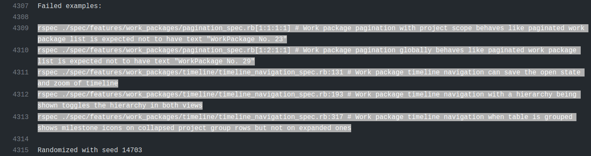

# Continuous testing workflow

As part of the [development flow at OpenProject](../../../development/#branching-model-and-development-flow), proposed changes to the core application will be made through a GitHub pull request and the entire test suite is automatically evaluated on GitHub Actions. You will see the results as a status on your pull request.

You will likely start working with the OpenProject test suite through our continuous testing setup at [GitHub Actions](https://github.com/opf/openproject/actions). All pull requests and commits to the core repository will be tested by GitHub Actions.

Successful test suite runs are one requirement to see your changes merged.

## List failures

A failing status will look like the following on your pull request. You may need to click *Show all checks* to expand all checks to see the details link.


Here you'll see that the *GitHub Actions* check has reported an error, which likely means that your pull request contains errors. It might also result from a [temporary error running the test suite](#tests-failing-on-github-actions-ci-and-passing-locally), or from a test that was broken in the `dev` branch.

The test suite is [run in parallel](../running-tests-locally/#parallel-testing) to save time. The overall run time of the test suite is around *15 minutes* on GitHub.

Click on the Details link to see the individual *jobs* that GitHub executes.

[Here's a link to an exemplary failed test run on GitHub](https://github.com/opf/openproject/pull/9355/checks?check_run_id=2730782867). In this case, one of the feature jobs has reported an error.


Click on each job and each step to show the [log output for this job](https://github.com/opf/openproject/pull/9355/checks?check_run_id=2730782867). It will contain more information about how many tests failed and will also temporarily provide a screenshot of the browser during the occurrence of the test failure (only if a browser was involved in testing).

In our example, multiple tests are reported as failing:

```shell
rspec ./spec/features/work_packages/pagination_spec.rb[1:1:1:1] # Work package pagination with project scope behaves like paginated work package list is expected not to have text "WorkPackage No. 23"
rspec ./spec/features/work_packages/pagination_spec.rb[1:2:1:1] # Work package pagination globally behaves like paginated work package list is expected not to have text "WorkPackage No. 29"
rspec ./spec/features/work_packages/timeline/timeline_navigation_spec.rb:131 # Work package timeline navigation can save the open state and zoom of timeline
rspec ./spec/features/work_packages/timeline/timeline_navigation_spec.rb:193 # Work package timeline navigation with a hierarchy being shown toggles the hierarchy in both views
rspec ./spec/features/work_packages/timeline/timeline_navigation_spec.rb:317 # Work package timeline navigation when table is grouped shows milestone icons on collapsed project group rows but not on expanded ones
```



### Diagnose failures

Once you know which tests are failing, run them locally to try and reproduce the failures. Having reproducible failures locally is the first step to diagnose and fix them.

How to do this depends on the kind of job that failed.

**Errors in the npm group**

An error in the *npm* group means you likely have broken an existing Angular component spec or added an invalid new one. Please see the [Frontend tests](../running-tests-locally/#frontend-tests) section on how to run them.

**Errors in the units group**

An error in the *units* group means there is a failing ruby unit test. Please see the [Unit tests](../running-tests-locally/#unit-tests) section on how to run these.

**Errors in the features group**

You will be able to run failing tests locally in a similar fashion for all errors reported in the `units` and `features` jobs. Please see the [System tests](../running-tests-locally/#system-tests) section for more information.

**Helper to extract all failing tests**

There is a small ruby script that will parse the logs of a GitHub Actions run and output all `rspec` tests that failed for you to run in one command.

```shell
./script/github_pr_errors
```

If you want to run the tests directly to rspec, you can use this command:

```shell
./script/github_pr_errors | xargs bundle exec rspec
```

### Tests failing on GitHub Actions CI and passing locally

Some tests can fail on GitHub actions CI, and pass locally which makes them harder to reproduce, diagnose, and fix.

These are flaky tests and should be fixed as soon as possible as they undermine the trust we have in our test results. [Follow our advice on handling flaky tests](../handling-flaky-tests/) for more information.

### Skip test execution on GitHub Actions CI

Sometimes, you know you're pushing changes to a pull request that you now are work in progress or are known to break existing or new tests.

To avoid additional test executions, you can include `[skip ci]` in your commit message to ensure GitHub Actions are not being triggered and skips your build. Please note that a successful merge of your pull request will require a green CI build.
