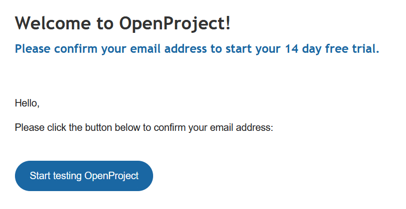
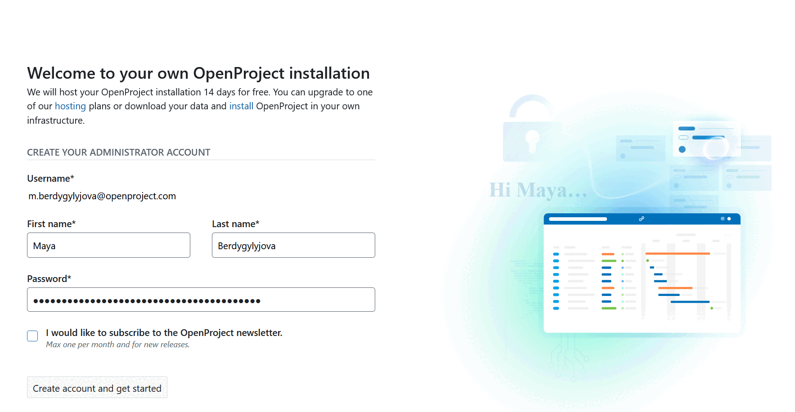
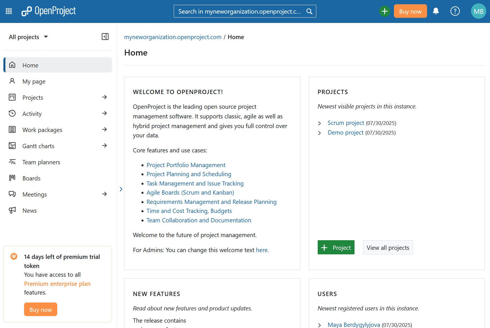

---
sidebar_navigation:
  title: Create trial installation
  priority: 998
description: Create a free OpenProject Enterprise cloud trial installation.
keywords: trial installation
---

# Create an OpenProject trial installation

You can easily set up a **14-day free trial** for the OpenProject Enterprise cloud edition.

Here you can test all OpenProject functionalities thoroughly. After 14 days the trial will expire automatically and will be deleted after a short period of time. No further action is required on your part. This allows you to test OpenProject freely and without any concerns.

## Start a new trial installation

To create a new OpenProject trial, either go to the [OpenProject website](https://www.openproject.org/) or open the [start trial page](https://start.openproject.com).

**Enter your organization domain**. This name will become part of the URL of your OpenProject installation, for example `myneworganization.openproject.com`.

You can include a hyphen "-" in the organization name, e.g. *myneworganization.openproject.com*. 

> [!TIP]
> We also support [custom domains](../enterprise-cloud-faq/#can-i-get-a-custom-domain-name-instead-of-exampleopenprojectcom). 

Next, specify your **Email**, **Team language** and [**Data center**  preferences](https://www.openproject.org/legal/data-processing-agreement/sub-processors/). 

> [!IMPORTANT]
> Keep in mind that the OpenProject [privacy policy](https://www.openproject.org/legal/privacy/) and the [terms of service](https://www.openproject.org/legal/terms-of-service/) apply if you create a trial instance.

Click the **Continue** button to proceed.

You will then wait a few seconds while the instance is created. 

> [!TIP]
> Do not close the browser window or turn off your device while you wait. 

You will then be asked to **Confirm your email** by clicking the link sent to your inbox. If you do not receive an email within a few minutes, check your spam folder or click the **Resend email** button.

Open your inbox and click **Start testing OpenProject** button to proceed.

You will then be asked to [create your OpenProject administrator account for this trial instance](../../../getting-started/sign-in-registration/#create-a-new-account).

Enter your first and last name, and specify your **password**. 

You can subscribe to the OpenProject **newsletter** where you will receive important updates about the product, features, or new releases.

Click the **Create account and get started** button.

Your OpenProject instance will be created and you will be directed to your OpenProject installation. Here you can take a three-minute introductory tour to get familiar with the most important features. 

