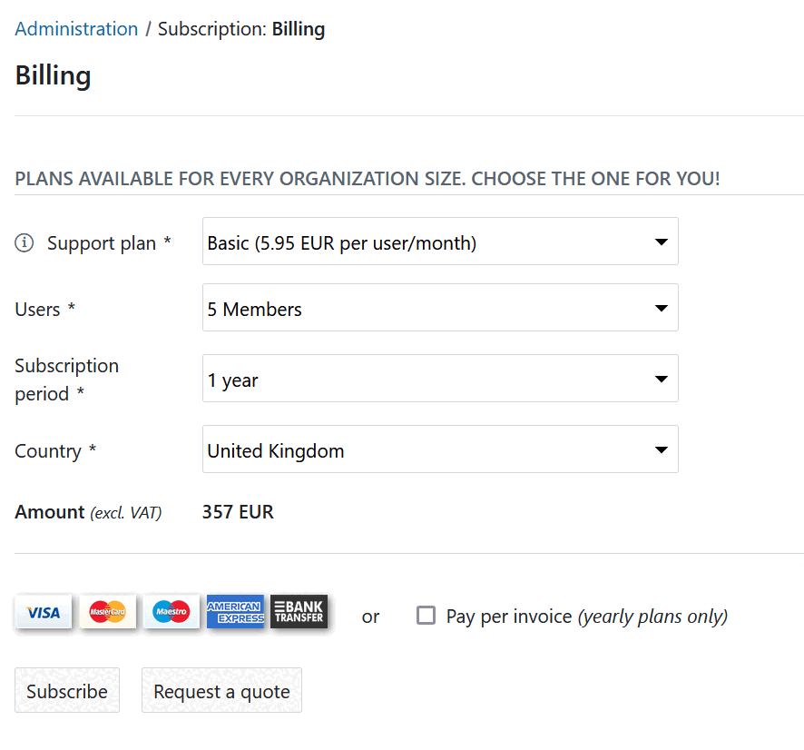

---
sidebar_navigation:
  title: Create quote
  priority: 990
description: Request a quote within your OpenProject Enterprise cloud
keywords: quote, request, offer, tender, bid
---

# Creating a quote in the OpenProject Enterprise cloud

If you would like to request a quote for OpenProject Enterprise cloud you can do so within your trial instance. Alternatively, you can refer to our website for the [Enterprise cloud edition pricing](https://www.openproject.org/pricing/).

To create a quote, click the **Buy now** button in the application header or or in the project menu.

You will be directed to -> *Administration* -> *Subscription*.

1. **Select a support plan** – Choose between the **professional** and **basic** support plans.
2. Choose the **amount of users** - Select the number of users from the drop-down list. Users can only be selected in increments of five, with a minimum of five users.
3. Specify your **subscription period** and select your **country** from the drop-down list.
4. The **total amount** (excluding VAT) will be displayed based on your selections.
5. Click the **Request a quote** button. 

Next, you will be asked to provide your address details. Once you have filled in the required fields, click **Request a quote** button.

You will then receive an **email with the quote**, which includes a link to accept it. Your subscription will be updated once you accept the quote.
