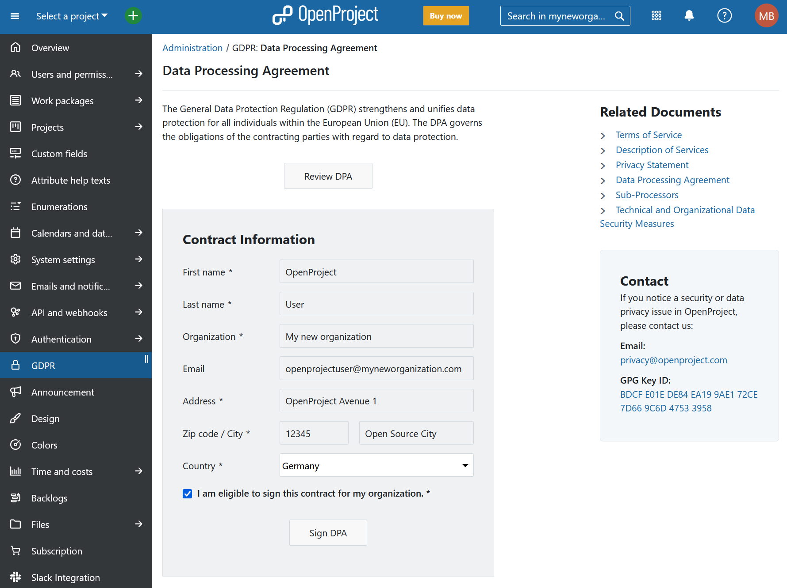

---
sidebar_navigation:
  title: GDPR
  priority: 600
description: GDPR, DPA, AV
keywords: GDPR, DPA, Data Processing Agreement, AVV, AV
---

# GDPR

The General Data Protection Regulation (GDPR) is a European regulation that standardizes regulations within the EU for handling personal  data of private companies or public organizations. The GDPR also extends this EU data protection regulation law to all foreign companies  processing data of EU residents. OpenProject is naturally committed to GDPR compliance.

As a firm believer in open source, OpenProject is deeply invested in the freedom of users. This encompasses the software freedoms granted by the [GPLv3](https://www.gnu.org/licenses/quick-guide-gplv3.en.html) and employed by OpenProject and naturally extends to the rights and  freedoms granted by the General Data Protection Regulation (GDPR). In  the same transparent fashion that we develop our software, we are  committed to transparency and protecting our users' data privacy.

## Information security and compliance

### Hosting infrastructure

OpenProject cloud environment is hosted on a logically isolated virtual cloud at Amazon Web Services with all services being located in Europe. AWS is a [GDPR-compliant](https://aws.amazon.com/compliance/gdpr-center/) cloud infrastructure provider [with extensive security and compliance programs](https://aws.amazon.com/security/) as well as unparalleled access control mechanisms to ensure data privacy. Employed facilities are compliant with the ISO 27001 and 27018 standards.

**Hosting in the EU**

We offer secure hosting of your OpenProject cloud via Scaleway, with **all [sub-processors](https://www.openproject.org/legal/data-processing-agreement/sub-processors/) based within the European Union**, ensuring full data sovereignty and compliance with EU data protection regulations. 

Please [contact us](https://www.openproject.org/contact/) for further details.

### Data backups and https encryption

OpenProject cloud environment continuously backs up data with data encrypted in transit (via TLS/https) and at rest (files, database (including backups) via AES-256). Each individual instance is logically separated and data is persisted in a unique database schema, minimizing the risk of data overlap or data leaks between instances.

### Access to data and infrastructure

Production infrastructure is accessible only for a limited set of authorized system operations personnel from a secure internal maintenance VPN. Services employed by employees are secured by two-factor-authentication where available. Access to customer data is performed only when requested by the customer (i.e., as part of a support or data import/export request).

All OpenProject GmbH employees employ industry standard data security measures to secure their devices and access to cloud and on-premises infrastructure. All sensitive user data on laptops and workstations are encrypted and machines are maintained to receive system updates.

## Data management and portability

The GDPR grants the right to access, modify, receive, and delete their own data to every data subject. 

OpenProject customers with admin accounts on their instance act as data controllers for their team members and have comprehensive tools to fulfil these requests on behalf of the data subjects they are responsible for.

Below, we outline some of these key data rights.

### Right to access and rectification

With OpenProject, data controllers have fine-grained user and rights management to perform these requests. Individual data subjects can forward any request to their designated data controller.

The following resources provide additional information:

- [Managing accounts and users in your instance](../../../system-admin-guide/users-permissions/) (for data controllers).

### Right to erasure (“right to be forgotten”)

OpenProject offers a way to completely erase all identifiable user information from the application. If the user is still referenced from data within the instance, these references are replaced with an anonymous user to ensure the data integrity of the application.

- Data controllers can perform the deletion [through the administration](../../../system-admin-guide/users-permissions/users/).

- Depending on the configuration of your OpenProject instance, individual data subjects may perform the deletion of their own account through the [Delete Account](../../../user-guide/account-settings/) page. If this is disabled, the request may be stated to the data controller.

### Data Portability

OpenProject enables data controllers to retrieve *all* personal data connected to the OpenProject instance. This encompasses all user and system data (in the form of an SQL dump) including all uploaded files.
This is now possible by controllers on their own using the [backup feature of OpenProject](../backups/).

## Signing a Data Processing Agreement (DPA) for the Enterprise cloud

Under GDPR, EU customers are required to sign a data processing agreement (sometimes called data processing addendum) before using our Enterprise cloud edition.

With OpenProject 11.1, we have automated this process in order to reduce manual  effort on both sides. This way, it is even easier to comply with GDPR.  

Please navigate to *Administration -> GDPR* and you can now review and sign your DPA document directly within the application.

Find out more about [OpenProject's security features](../../../security-and-privacy/statement-on-security/#openproject-security-features).
