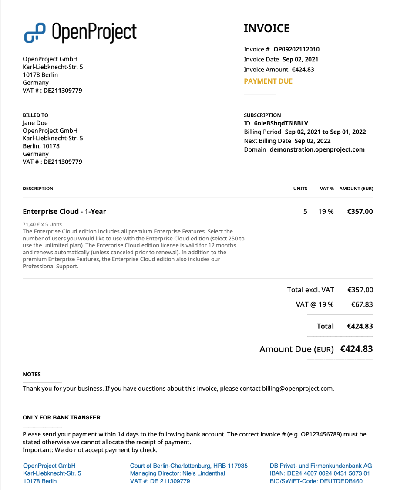
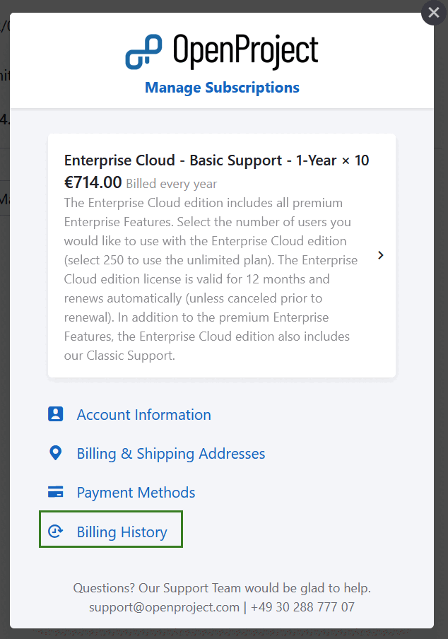
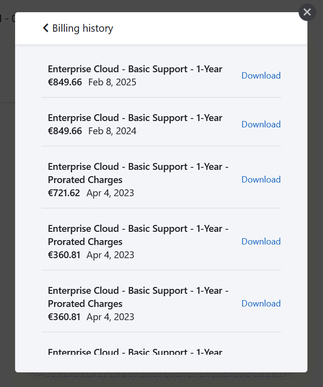

---
sidebar_navigation:
  title: Invoices and billing history
  priority: 980
description: View the invoices and payment history.
keywords: invoices, payment history
---

# Invoices for the OpenProject Enterprise cloud edition

You will **receive an invoice for your OpenProject Enterprise cloud edition via email** to the email address which you used during the booking process.

The invoice lists the subscription (billing) period as well as the next billing date.

You will also see the payment status.
For invoices via bank transfer, the money needs to be paid via bank transfer to the bank account listed at the bottom of the invoice.

> [!NOTE]
> For the correct assignment of payments, please enter the  invoice number on your bank transfer.

## Payment history and download invoices

If you want to see the billing history or download older invoices of your Enterprise cloud edition, navigate to *Administration* -> *Subscription* within your system's Administration.

Click the **Manage subscription** button.

In the overlay window, click on the link **Billing History**.

Here, you will get an overview about all your past payments for the Enterprise cloud edition.

With the **Download link** you can download the invoices.

