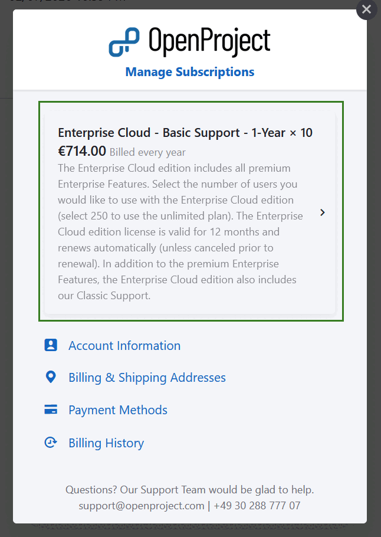
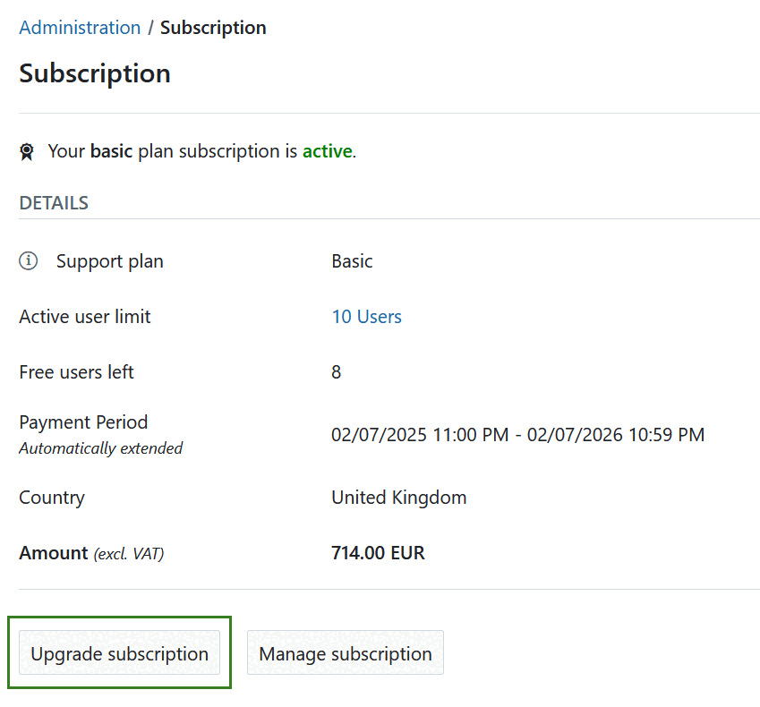
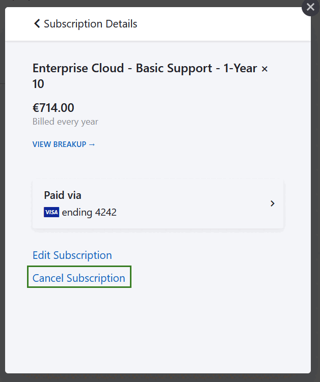

---
sidebar_navigation:
  title: Manage subscription
  priority: 970
description: Manage and change all subscription-related topics of your Enterprise cloud.
keywords: enterprise cloud edition, subscription, address, payment method, invoices
---

# Manage your OpenProject Enterprise cloud subscription

If you want to make changes to your subscription (Up- or downgrade, cancel, change your address or payment method), navigate to *Administration* -> *Subscription* within your system's Administration. Then click the **Manage subscription** button.

In the overlay window, you can choose between several options:

- [Upgrade, downgrade or cancel](#update-existing-subscriptions)
- Edit account information
- Edit billing and shipping addresses
- Edit or add payment methods
- [View billing history and download invoices](../invoices-and-billing-history)

## Update existing subscriptions

If you want to up- or downgrade the amount of users of an existing subscription, click on the subscription listed at the top of **Manage subscriptions** overlay window. 

Here you can either **Edit or Cancel the existing subscription**.

### Upgrade or downgrade subscription

To upgrade or downgrade your Enterprise cloud subscription, follow the steps described above and click the **Edit Subscription** link.

Alternatively, you can navigate to *Administration -> Subscription* and click the **Upgrade subscription** button directly.

Here you can choose the new amount of users. Your next payment will be displayed below.

You can **upgrade an existing subscription** in increments of 5 at any time. Additional users will be billed on a prorated basis, this means you will only pay for the additional users for the rest of the current subscription period.

You can **downgrade a subscription** to the end of a current subscription period. This means the downgrade becomes active with the next payment term.

Click the **Update your subscription now** button to save the changes.

### Cancel subscription

To cancel your subscription, open the [Manage subscription](#manage-your-openproject-enterprise-cloud-subscription) form and click to [update the subscription](#update-existing-subscriptions) you want to cancel.

Click the **Cancel Subscription link** if you want to terminate your OpenProject Enterprise cloud edition subscription.

> [!IMPORTANT]
> After cancellation you will receive an email confirmation. Your subscription will be terminated at the end of the current subscription period. After cancellation your data will be kept for a certain period of time in case of reactivation of a subscription.
