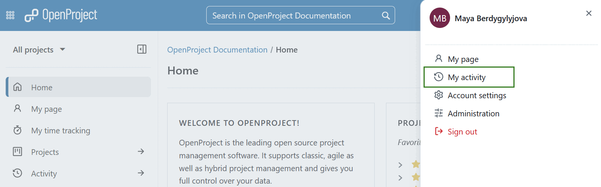

---
sidebar_navigation:
  title: My activity
  priority: 200
description: My activity in OpenProject - your latest actions
keywords: my activity, personal changes, dashboard
---

# My activity

**My activity** gives you an overview of all your latest actions and projects you are involved in.

You can open your **My activity** page by clicking on your user avatar in the upper right corner and then selecting **My activity** from the overlay menu that will open.

On the left side, you will see a list of all your activities that are being recorded in OpenProject.

> [!NOTE]
> Only activities from projects that have the **Activity** module enabled will be shown.

On the right side, you will see your user information, as well as all the **Groups** and **Projects** you are a member of. 

