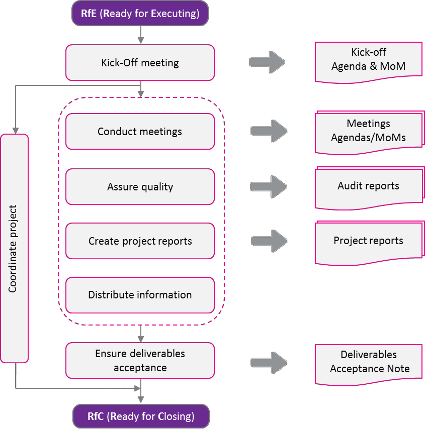
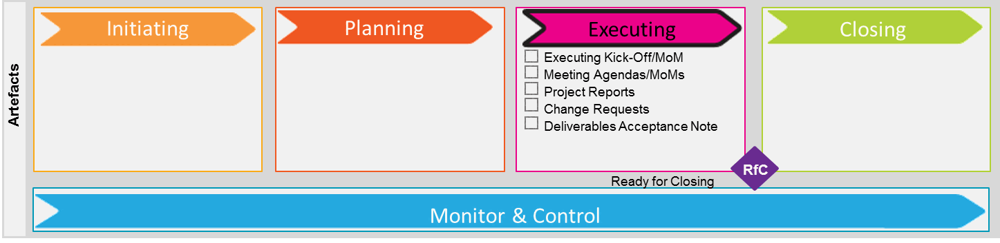
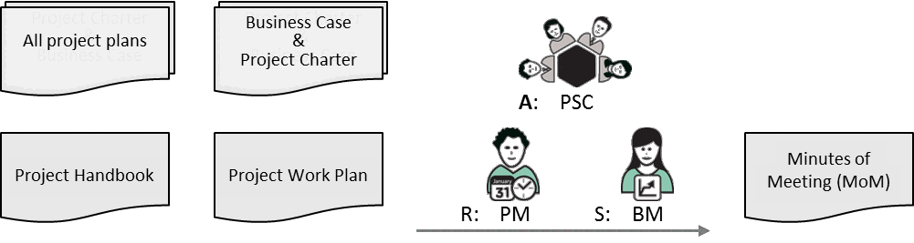
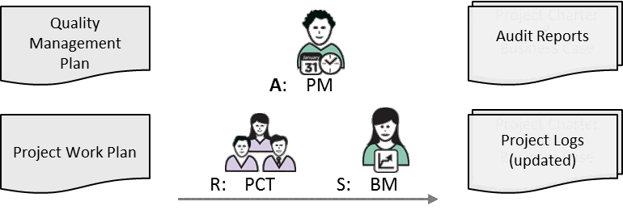
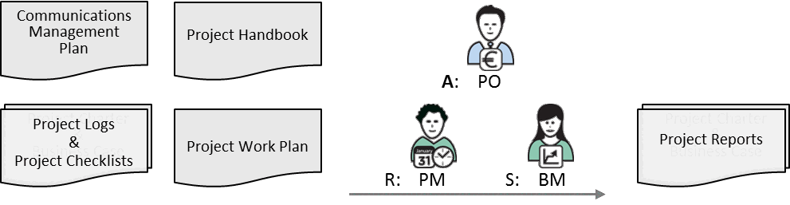

---
sidebar_navigation:
  title: 7 Executing phase
  priority: 650
description: Covers carrying out the project work according to the plan. It includes team coordination, quality assurance, stakeholder communication, performance monitoring, and progress reporting. Formal approval to move forward is given through the Request for Closing (RfC) gate once work is complete.
keywords: executing kick-off meeting, project coordination, quality assurance, project reporting, information distribution, ready for closing
---

# 7 Executing phase 

The third phase of a PM² project is the Executing Phase. During this phase, the project deliverables are produced and the requestor organisation prepares for their introduction. The Executing Phase begins with a Kick-off Meeting and ends with the acceptance (final or provisional-as per the Deliverables Acceptance Plan) by the requestor side.

## 7.1 Executing Kick-off Meeting 

The Executing Phase starts with the Executing Kick-off Meeting. This meeting ensures that the whole Project Team is aware of the project's key elements and rules.

| Key Participants | Description |
| :-- | :-- |
| Project Manager (PM) | Organises the meeting. |
| Project Core Team (PCT) | Required participants. |
| Project Manager Assistant (PMA) \& Project   Support Office (PSO) | Required to attend (if they are part of the project). |
| Other project roles or stakeholders | Optional participation (as per the project's needs). |

**Inputs**

- Business Case and Project Charter
- Project Handbook
- Project Work Plan
- All project plans and logs
- Any requirements documents

**Steps**

Before the Executing Kick-off Meeting:

1. Plan the meeting.
2. Draft the Meeting Agenda clearly indicating the main points to be discussed.
3. Send out the Meeting Agenda in advance.
4. Ensure the attendance of the required participants.
5. Address any logistical needs and prepare documentation or hand-outs for the meeting.

During the Executing Kick-off Meeting:

1. Ensure that someone is designated to take the Minutes of Meeting (MoM), including action points.
2. Present the Project Handbook and the Project Work Plan with the appropriate level of detail.
3. Present the Communications Management Plan.
4. Agree on the conflict resolution process and present the escalation procedure.
5. Present the Project Stakeholder Matrix.
6. Present the Risk Management, Issue Management and Project Change Management processes as well as the Quality Assurance \& Control activities.
7. Clarify the expectations of the Project Core Team (PCT).
8. Agree on the team's ground rules

After the Executing Kick-off Meeting:

1. Send out the Minutes of Meeting (MoM) to the relevant stakeholders. The minutes should include a summary of project issues raised, risks identified, decisions taken and changes proposed. Note that the issues, risks, decisions and project changes should also be recorded in the relevant logs.

| RAM (RASCI) | AGB | PSC | PO | BM | BIG | SP | PM | PCT |
| :--: | :--: | :--: | :--: | :--: | :--: | :--: | :--: | :--: |
| Executing Kick-off Meeting | I | A | C | S/C | C | C | R | C |

 
**Outputs**

- Minutes of Meeting (MoM)

## 7.2 Project Coordination 

The objective of project coordination is to facilitate the project's progress by continuously providing information to the Project Core Team (PCT) and supporting the completion of assigned work.

Project coordination includes allocating project resources to activities, performing regular quality checks of interim results, maintaining ongoing communication with all project team members, and keeping everyone involved in the project motivated through leadership, negotiations, conflict resolution and the application of appropriate Human Resource management techniques.

| Key Participants | Description |
| :-- | :-- |
| Project Manager (PM) | Coordinates all project activities. |
| Project Manager Assistant (PMA) | Assists the Project Manager (PM). |
| Business Manager (BM) | Can support (or contribute to) project coordination   depending on the context of the project. |

**Inputs**

- Project Handbook
- Project Work Plan

Note: Project coordination begins officially with the initiation of the project and ends with its closing. However, the intensity of project coordination peaks during the Executing Phase.

**Steps**

1. Manage and direct project activities and stakeholders.
2. Assign tasks to the Project Core Team (PCT) and coordinate their execution as per the Project Work Plan.
3. Provide information to the Project Core Team (PCT) as required for the progress of project.
4. Verify the completion of tasks and accept interim work deliverables in line with predefined acceptance criteria.
5. Provide leadership and motivate the project team.
6. Manage project team dynamics.
7. Use negotiations, conflict resolution, and people management techniques to ensure smooth collaboration among team members and the effective progress of project work.

| RAM (RASCI) | AGB | PSC | PO | BM | BIG | SP | PM | PCT |
| :-- | :--: | :--: | :--: | :--: | :--: | :--: | :--: | :--: |
| Project Coordination | I | I | A | S | I | I | R | I |

**Outputs**

- Signed off work assignments

## 7.3 Quality Assurance 

Quality Assurance is the activity of gathering evidence that proves the project work is following high-quality standards, methodologies and best practices. It seeks to allow us to be confident that the project will satisfy the desired scope and quality requirements within the project constraints.

Quality Assurance activities include determining whether appropriate project controls are in place, confirming that they are being implemented and assessing their effectiveness.

Quality Assurance activities are documented in the Quality Management Plan. These can be performed by the Project Manager (PM), the Project Quality Assurance (PQA) role, or other project roles such as the Project Core Team (PCT), the Business Manager (BM) or the Solution Provider (SP). External audits undertaken by entities outside the project can also be defined.

| Key Participants | Description |
| :-- | :-- |
| Project Manager (PM) | Accountable for carrying out all Quality Assurance activities. |
| Project Quality Assurance (PQA) | Establishes Quality Assurance standards and reviews project outputs   and deliverables. |
| Project Core Team (PCT) | Adheres to the project's Quality Assurance standards. |

**Inputs**

- Quality Management Plan
- Project Work Plan

**Guidelines**

- These Quality Assurance activities must be part of the Project Work Plan.
- The Project Core Team (PCT) must provide evidence of adherence to the quality assurance standards and procedures.

| RAM (RASCI) | AGB | PSC | PO | BM | BIG | SP | PM | PCT |
| :--: | :--: | :--: | :--: | :--: | :--: | :--: | :--: | :--: |
| Quality Assurance | I | I | I | S | C | I | A | R |

| Related Artefacts | Initiating | Planning | Executing | Monitor \& Control | Closing |
| :--: | :--: | :--: | :--: | :--: | :--: |
| Quality Management | Project Charter | Quality Management Plan | Quality Review Reports Audit Reports | Quality Review Checklist   Project Logs   Phase-Exit Review Checklist | Project-End Report   Project Acceptance Note |

**Outputs**

- Audit Reports
- Project Logs (updated)
- Quality Review Report

## 7.4 Project Reporting 

The purpose of Project Reports is to communicate consolidated information concerning project performance to the appropriate stakeholders. Project reports typically provide information on scope, schedule, effort/cost and quality, as well as information related to the status of risks, issues, project changes and outsourcing. This information should be presented to the various stakeholders in the appropriate form (e.g. text or charts) and with the appropriate level of detail, as defined in the Communications Management Plan.

Project Reports may also contain agreed project indicators and metrics for evaluating progress. The reports are formally presented and discussed during the various project meetings, and disseminated via the information distribution activities described in the Communications Management Plan.

| Key Participants | Description |
| :-- | :-- |
| Project Manager (PM) | Responsible for all Project Reports (except external audit reports). |
| Other project stakeholders | Review the reports. |

**Inputs**

- Project Handbook
- Project Work Plan
- Communications Management Plan
- Project Logs
- Project Checklists
- Outputs of the Monitor Project Performance activity

**Guidelines**

- Project Reports are an output of project monitoring and an important input for project control and decision-making. They are also an input into the Project-End Review and are an important way of capturing historical information. They should therefore be properly archived during the Closing Phase.
- Project Reports should be tailored to the project's needs, given that they exist to serve the information and communication needs of the project stakeholders.

**Steps**

1. List all reports to be used in the project in the Project Handbook, or more specifically in the Communications Management Plan. PM² provides templates for Status and Progress Reports.
2. Make sure the report templates used are fit for purpose.
3. Ensure the reports' content, level of detail and format are well thought out and appropriate for the intended audience (stakeholders).
4. If needed, create Ad Hoc reports to address specific reporting needs (e.g. in case of a project crisis).

| RAM (RASCI) | AGB | PSC | PO | BM | BIG | SP | PM | PCT |
| :-- | :--: | :--: | :--: | :--: | :--: | :--: | :--: | :--: |
| Project Reporting | I | I | A | S/C | I/C | I/C | R | C |

The following are examples of PM² reports:

- Project Status Report
- Project Progress Report
- Quality Review Report
- Contractor Status Report
- Custom or Ad Hoc Reports

**Project Status Report** 

The Project Status Report is produced by the Project Manager (PM) and is regularly submitted to the Project Steering Committee (PSC) and other stakeholders as per the Communications Management Plan.

It should provide a summary of the project's performance (rather than detailed task-level information). It should include tracking information on costs, scheduling, scope/changes, risks and issues, report on the status of important milestones for the current reporting period and provide forecasts for future reporting periods.

**Project Progress Report**

The Project Progress Report gives a high-level overview of the project and its status. It includes a project overview (project stakeholders, milestones and deliverables, project plan, budget, and costs) and additional project details (scope changes, major risks/issues and actions taken, achievements).

If a project is a multi-annual project and its overall vision/scope has not changed, the Project Progress Report can be used to secure project approval for the following year. However, if the project's vision/scope has changed, an updated Project Charter should be submitted.

**Quality Review Report**

The Project Manager (PM) produces a Quality Review Report after evaluating the results of qualityassurance activities and the effectiveness of the project's quality-management process for all aspects of the project (scope, time, cost, quality, project organisation, communication, risks, contracts, client satisfaction, etc.).

The Quality Review Report should give an overview of the status of all project quality-management activities and present the main quality assurance and control results, non-conformities, opportunities for improvement, recommendations and remediation/improvement actions, and their impact and status. It should also report on the status of important project configuration activities (assurance and control). The main input to the Quality Review Report is the Quality Review Checklist.

**Contractor Status Report**

The Contractor Status Report is filled out by the contractor (if there is one) and should be submitted to the Project Manager (PM) in accordance with the agreed schedule. The report presents the project status for the current reporting period and provides forecasts for future reporting periods along with information on any new risks, disputes and issues. The Project Manager (PM) should include a summary of the Contractor Status Reports in the Project Status Report.

**Custom or Ad Hoc Reports**

Reports should serve the project's needs. If it is decided that a custom report is needed, this should be defined during the Planning Phase and documented in the Project Handbook. Custom reports can be domain-specific (e.g. IT-related) or project-specific (i.e. related to the particularities of the project organisation or the project management approach).
Similarly, if a specific communication/reporting need arises during the project, an Ad-Hoc Report can be produced to address this need.

**Outputs**

- Project Status Report
- Project Progress Report
- Quality Review Report
- Contractor Status Report
- Custom or Ad Hoc Reports

## 7.5 Information Distribution 

Information distribution refers to the methods used to keep project stakeholders informed about relevant project details through the regular distribution of project reports, as per the Communications Management Plan and project stakeholder needs.

| Key Participants | Description |
| :-- | :-- |
| Project Support Office (PSO) | Manages internal communication and assists in activities such as   document change control, baselining of plans, etc. |
| Project Manager (PM) | Ensures that the Project Core Team (PCT) has all the necessary   information to carry out its tasks. |
| Other project stakeholders | Kept informed about the project, and in turn keep the project team   informed about external factors that might influence the project. |

**Inputs**

- Communications Management Plan
- Project Work Plan
- Project Reports and Project Logs
- Minutes of Meetings (MoMs)

**Guidelines**

- Relevant information resulting from the execution of project plans should be communicated to appropriate parties at the right time and in the appropriate format.
- If meetings are used to distribute information, ensure they are frequent enough to serve the communication needs of the project stakeholders.
- Keep stakeholders informed by sending them regular Status and Progress Reports that chart project progress against the baseline schedule and budget.

**Steps**

1. Carry out the tasks detailed in the Communications Management Plan.
2. Inform stakeholders about updates to the Project Work Plan.
3. Communicate any changes/updates to any key project documents and logs.
4. Send out the Project Reports as per the Communications Management Plan.

| RAM (RASCI) | AGB | PSC | PO | BM | BIG | SP | PM | PCT |
| :--: | :--: | :--: | :--: | :--: | :--: | :--: | :--: | :--: |
| Information Distribution | I | I | A | C | I | I | R | C |

## 7.6 Phase Gate: RfC (Ready for Closing) 

This is the third and final phase gate. A review and approval are recommended before the project can move to the next phase. The Project Manager (PM) assesses whether all the goals of the Executing Phase have been achieved, verifies that all planned activities have been carried out, that all requirements have been met, and that the project's outputs have been fully delivered. The Project Manager (PM) is also responsible for ensuring that the Project Owner (PO) accepts the deliverables (at least provisionally), finalises the transition and makes the outputs available to the end-users.

Once all the above conditions have been met, the Project Steering Committee (PSC) can authorise the Project Manager (PM) to move the project to the Closing Phase.
PM² provides a template Phase Exit Review Checklist for each phase that can be used by the Project Manager (PM) to guide the assessment, alongside a review of the phase's specific goals.
