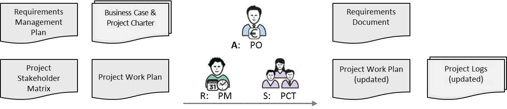
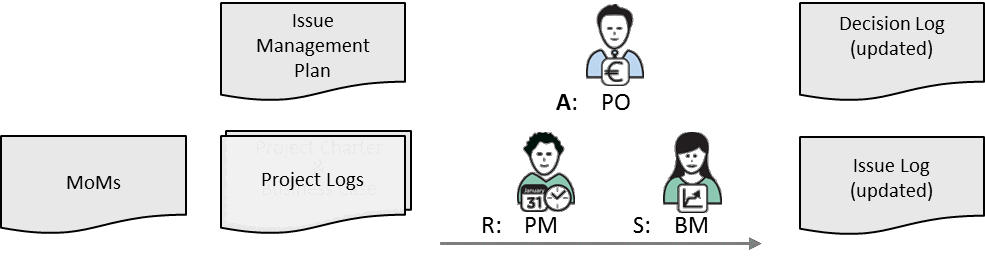
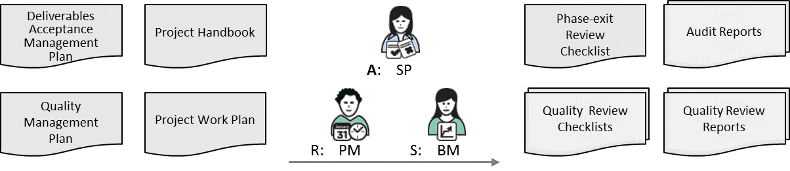
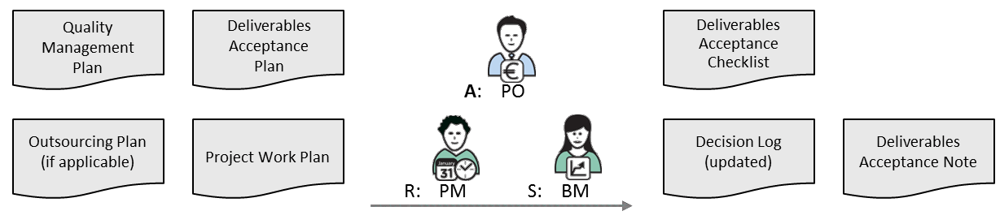
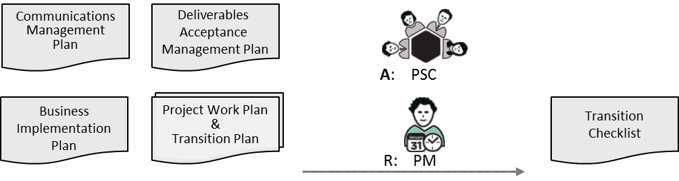
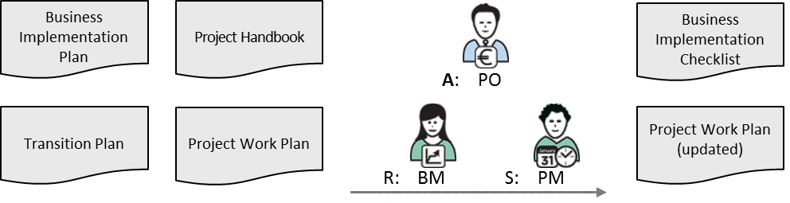

---
sidebar_navigation:
  title: 9 Monitor & control
  priority: 550
description: A transversal section that applies across all phases. It details how to monitor project performance, schedule, cost, stakeholder engagement, requirements, change requests, risks and issues, quality, acceptance, transition, and outsourced activities. It ensures the project stays aligned with plans and objectives.
keywords: control schedule, monitor project performance, control cost, manage stakeholders, manage requirements, manage project change, manage risk, manage issues and decisions, manage quality, manage deliverables acceptance, manage transition, manage business implementation, manage outsourcing
---

# 9 Monitor \& Control 

Monitor \& Control activities run throughout the duration of the project, but peak during the Executing Phase. All project management processes are executed as part of the Monitor \& Control process group.

The Monitor \& Control activities are carried out based on the processes described in the Project Management Plans developed during the Planning Phase. The effective execution of these processes is ultimately the responsibility of the Project Manager (PM).

**Manage**

- Execute all management processes defined in the Project Management Plans, and manage the outsourcing, transition, business implementation and deliverables acceptance activities as per the relevant Project Specific Plans.

**Monitor**

- Monitor project activities and overall project performance.
- Track the project performance against the baseline in order to facilitate reporting and controlling.

**Control**

- Devise, plan, propose and implement corrective actions to address existing or potential performance risks or issues, while updating the relevant project plans and logs.

Monitor \& Control artefacts comprise the Project Work Plan as well as a range of Project Logs and Checklists.

The Project Logs are regularly updated as new information becomes available (e.g. new issues can arise and new information can be added to the Issue Log).

There are several Checklists that can be used to help the Project Manager (PM) control the project better.

PM² provides the following Checklists:

- Phase-exit Review Checklist
- Quality Review Checklist
- Deliverables Acceptance Checklist
- Transition Checklist
- Stakeholders Checklist
- Business Implementation Checklist

## 9.1 Monitor Project Performance 

The purpose of project performance monitoring is to collect information about the state of the project's progress and overall health. The Project Manager (PM) tracks the project dimensions of scope, schedule, cost and quality, monitors risks, issues and project change, and forecasts their evolution for the purpose of reporting the overall project progress.

This information is then distributed to relevant stakeholders as per the Communications Management Plan.

| Key Participants | Description |
| :-- | :-- |
| Project Manager (PM) | Undertakes all project monitoring activities. |
| Project Core Team (PCT) | Contributes information on project progress. |

**Inputs**

- Project Handbook
- Project Work Plan
- Project Logs (Risk Log, Issue Log, Decision Log, Project Change Log)
- Quality Checklist
- Minutes of Meetings (MoMs)
- Input from the Contractor's Project Manager (CPM), if applicable

**Steps**

1. Use the baselined Project Work Plan as a reference for monitoring project performance.
2. Regularly exchange information about the project's current status and next steps with the Project Core Team (PCT) at formal and informal meetings.
3. Gather information on, and monitor the progress of:

- Tasks-i.e. the status of critical and next critical path tasks.
- Key outputs-i.e. completed and verified deliverables, and milestones achieved as planned.
- Resource utilisation-i.e. resources used as planned and costs as budgeted.
- Logs-i.e. the status and evolution of risks and issues, changes and decisions.
- People-i.e. team morale, stakeholder engagement, overall project dynamics and productivity.

| RAM (RASCI) | AGB | PSC | PO | BM | BIG | SP | PM | PCT |
| :--: | :--: | :--: | :--: | :--: | :--: | :--: | :--: | :--: |
| Monitor Project Performance | I | I | A | C | C | I | R | C |

**Outputs**

- Project Work Plan (tracked)

## 9.2 Control Schedule 

The purpose of schedule control is to ensure that project tasks are carried out as scheduled and that project deadlines are met. The Project Manager (PM) regularly monitors the schedule and tracks the difference between planned, actual and forecast activities/deadlines.

Approved project changes (e.g. addition of new tasks or changes to the required effort or start/end dates of existing ones) that have an impact on the overall project schedule are incorporated into the Project Work Plan (updated schedule). If the schedule is at risk or considerable delays are foreseen (beyond the predefined thresholds), the Project Steering Committee (PSC) needs to be informed and corrective actions must be devised, agreed and implemented. If this happens, affected project stakeholders should also be notified.

| Key Participants | Description |
| :-- | :-- |
| Project Manager (PM) | Monitors and controls the work schedule. |
| Project Core Team (PCT) | Works to keep to the baselined schedule and quality standards.   Reports on the status of their work, periodically or upon request. |

**Inputs**

- Project Handbook
- Project Work Plan
- Change Log (and other relevant Project Logs)
- Minutes of Meetings (MoMs) and Project Reports from previous reporting periods

**Steps**

1. Track the evolution of project tasks as per the approach defined in the Project Handbook.
2. Update the project schedule to reflect actual task status.
3. Review the Project Work Plan on a regular basis to identify potential sources of delays.
4. Track project changes, issues and risks, and monitor their impact on the project schedule.
5. Devise, agree and implement corrective actions if the schedule status has significant (or critical) deviations from the planned schedule.
6. Inform all affected project stakeholders about changes to the project schedule and/or tasks.

| RAM (RASCI) | AGB | PSC | PO | BM | BIG | SP | PM | PCT |
| :-- | :--: | :--: | :--: | :--: | :--: | :--: | :--: | :--: |
| Control Schedule | I | I | A | C | C | I | R | C |

| Related Artefacts | Initiating | Planning | Executing | Monitor \& Control | Closing |
| :--: | :--: | :--: | :--: | :--: | :--: |
| Schedule Management | Project Charter | Project Handbook Project Work Plan | Project Reports | Project Work Plan | Project-End Report |

**Outputs**

- Project Work Plan (updated)
- Project Logs (updated)

## 9.3 Control Cost 

The purpose of cost control is to manage the project costs so that they conform to the cost/effort baseline and overall project budget constraints. The Project Manager (PM) regularly monitors the budget and tracks the difference between budgeted, actual and expected costs.

If the project budget is at risk, the Project Steering Committee (PSC) needs to be informed and corrective actions must be devised, agreed and implemented. If considerable cost overruns are foreseen, these need to be justified, reported to and approved by the Project Owner (PO) or the Appropriate Governance Body (AGB).
Note: The project budget must have been approved by the Project Owner (PO) at the beginning of the project.

| Key Participants | Description |
| :-- | :-- |
| Project Manager (PM) | Monitors and controls the budget. |
| Project Owner (PO) | Owns and approves the budgeted costs. |

**Inputs**

- Project Handbook
- Project Work Plan
- Outsourcing Plan (if applicable)
- Change Log (and other relevant Project Logs)
- Minutes of Meetings (MoMs) and Project Reports from previous reporting periods

**Steps**

1. Track the project's effort/overall budget consumption as per the approach defined in the Project Handbook.
2. Regularly review the project budget with the Project Owner (PO).
3. Evaluate and communicate any differences between budgeted and actual project costs, securing approval for significant differences from the Project Owner (PO).
4. Devise and plan the implementation of corrective actions that will bring the budget back on track.
5. If the project budget needs to be considerably revised, this must be justified and documented (e.g. in the Project Progress Report). Formal approval from the Appropriate Governance Body (AGB) is required before the affected plans can be re-baselined.
6. If there is an impact on the project schedule, risks or quality, this must be reviewed and approved by the Project Owner (PO) and communicated to any affected project stakeholders.

| RAM (RASCI) | AGB | PSC | PO | BM | BIG | SP | PM | PCT |
| :-- | :--: | :--: | :--: | :--: | :--: | :--: | :--: | :--: |
| Control Cost | I | I | A | C | C | I | R | C |

| Related Artefacts | Initiating | Planning | Executing | Monitor \& Control | Closing |
| :--: | :--: | :--: | :--: | :--: | :--: |
| Cost Management | Business Case   Project Charter | Project Handbook   Project Work Plan | Project Reports | Project Work Plan   Project Logs | Project-End   Report |

**Outputs**

- Project Work Plan (updated)
- Project Logs (updated)

## 9.4 Manage Stakeholders 

Managing project stakeholders is a critical project management activity that begins in the Initiating Phase of the project, when project expectations and requirements are identified, and ends in the Closing Phase, when stakeholders' overall project experience and satisfaction are recorded.

Responsibility for this activity belongs to the Project Manager (PM). However, all members of the Project Steering Committee (PSC) should also be involved, in particular the Business Manager (BM) who should help manage stakeholders on the requestor side (e.g. users).

| Key Participants | Description |
| :-- | :-- |
| Project Manager (PM) | Manages project stakeholders. |
| Business Manager (BM) | Assists the Project Manager (PM) in this activity. |

**Inputs**

- Project Handbook
- Project Stakeholder Matrix
- Communications Management Plan
- Deliverables Acceptance and Transition Plans
- Business Implementation Plan

**Steps**

1. Analyse the expectations, attitudes, level of interest and influence of key project stakeholders. Beware of stakeholders who are less than enthusiastic or opposed to the project.
2. Devise communication and management strategies that encourage stakeholders to get involved and contribute.
3. Continually monitor stakeholder reactions or changing attitudes and manage accordingly. A oneoff analysis exercise is not enough, especially for longer-term and/or complex projects. Use the Stakeholders Checklist to identify specific actions to be taken at specific moments in the project.
4. Ensure that any planned stakeholder management activities are time-bound and focused. Keep in mind that the contribution/involvement of various stakeholders may be different in each project phase.
5. Align the Communications Management Plan with Stakeholder Management needs, particularly in the areas of project acceptance, transition, and business implementation.

| RAM (RASCI) | AGB | PSC | PO | BM | BIG | SP | PM | PCT |
| :-- | :--: | :--: | :--: | :--: | :--: | :--: | :--: | :--: |
| Manage Stakeholders | I | I | A | S/C | I | C | R | I |

| Related Artefacts | Initiating | Planning | Executing | Monitor \& Control | Closing |
| :--: | :--: | :--: | :--: | :--: | :--: |
| Stakeholder   Management | Business Case   Project Charter | Project Stakeholder   Matrix   Communications   Management Plan | Project   Reports | Project Logs   Stakeholders Checklist | Project-End   Report |

Outputs

- Project Stakeholder Matrix (updated)
- Issue and Decision Logs (updated)
- Stakeholders Checklist

## 9.5 Manage Requirements

Requirements management is the process of gathering, documenting and validating requirements and managing their implementation and change. It is a process that runs throughout the project lifecycle and relates to other project management processes, such as quality and change management.

The Requirements Management Process can be tailored and customised to a project's needs. It can be documented either in a Requirements Management Plan or in the Project Handbook. Separate requirements documents are used to specify, categorise and prioritise the requirements. These can be standalone documents or an annex to the Project Charter.

|  Key Participants | Description  |
| --- | --- |
|  Project Manager (PM) | Undertakes the requirements management process.  |
|  Business Manager (BM) | Provides information required to draft the requirements and
approves them.  |
|  User Representatives (URs) | Participate in the gathering and validation of the requirements.  |
|  Business Analyst (BA) (member
of the Project Core Team, PCT) | Responsible for many of the requirements management activities
(e.g. requirements documentation, specification, etc.).  |

**Inputs**

- Project Initiation Request, Business Case and Project Charter
- Requirements Management Plan
- Project Stakeholder Matrix

**Guidelines**

- A requirement is a capability that a product or service must have in order to satisfy a stakeholder's need(s).
- High-level requirements may also be referred to as business requirements, and are usually initially specified in the Project Initiation Request, the Business Case and the Project Charter.
- Adding further detail to the requirements produces lower-level requirements. These can be described in a variety of formats (e.g. text, use cases or user stories, models, business processes, sketches or graphics, etc.) and are documented in various requirements artefacts.
- The agreed and approved requirements of all stakeholders constitute the project's baseline scope.
- Any change to the baselined requirements should be made in accordance with the change management process described in the Change Management Plan.
- For each identified requirement, there should be a corresponding test to validate its acceptance. The test should be documented in the appropriate document (Deliverable Acceptance Plan, Deliverable Acceptance Checklist or Quality Review Checklist).
- Requirements should describe the need not the solution-non-ambiguous terms should be used and technology- or solution-oriented statements should be avoided.
- Even if requirements have been gathered before the project starts, it is still the responsibility of the Project Manager (PM) to ensure they are managed properly.

**Steps**

1. Specify the requirements: Together with the project stakeholders, gather the project requirements and document them clearly in the Requirements Artefacts. Structure them by adding relevant metadata.
2. Evaluate the requirements: The project team assesses the feasibility, consistency and completeness of the requirements, and estimates the effort/costs needed to implement them. The Project Manager (PM) balances the list of requirements against project constraints (budget, time, etc.) and makes a proposal to the project stakeholders.
3. Approve the requirements: The Project Manager (PM) and key stakeholders-such as the Project Owner (PO) or Business Manager (BM)—negotiate and agree on the requirements for the project.
4. Monitor the implementation of requirements: The Project Manager (PM) continuously monitors the Project Core Team's (PCT) implementation of the requirements, adds new requirements and changes existing ones when needed.
5. Validate the implemented requirements: When the requirements are implemented, User Representatives (URs) assess if the solution satisfies the initial business need. Formal acceptance of the project deliverables should comply with the Deliverables Acceptance process.

| RAM (RASCI) | AGB | PSC | PO | BM | BIG | SP | PM | PCT |
| :-- | :--: | :--: | :--: | :--: | :--: | :--: | :--: | :--: |
| Manage Requirements | I | I | A | C | C | I | R | S |

| Related Artefacts | Initiating | Planning | Executing | Monitor \& Control | Closing |
| :--: | :--: | :--: | :--: | :--: | :--: |
| Requirements   Management | Project Initiation   Request   Project Charter | Requirements   Management Plan   Deliverables Acceptance   Plan   Project Stakeholder   Matrix | Change   Requests | Requirements   Document   Project Work Plan   Project Logs | Project-End   Report |

**Outputs**

- Requirements Document
- Change Log (updated)
- Project Work Plan (updated)

## 9.6 Manage Project Change

Project change management defines the activities related to identifying, documenting, assessing, prioritising, approving, planning and controlling project changes, as well as communicating them to all relevant stakeholders. Changes can be requested (or identified and raised) throughout the project lifecycle by any project stakeholder.

The Project Change Management Process can be tailored and customised to a project's needs and can be documented either in a Project Change Management Plan or in the Project Handbook. A Change Log is used to document, monitor and control all project changes (see Appendix B). This makes it easier to track the changes and communicate them to the Project Owner (PO) and/or the Project Steering Committee (PSC) for approval.

|  Key Participants | Description  |
| --- | --- |
|  Project Manager (PM) | Monitors and controls the project changes.  |
|  Project Owner (PO) and/or
Project Steering Committee (PSC) | Approves or rejects the project changes.  |
|  Project Core Team (PCT) | Involved in analysing the requested project changes (estimating
the effort required to implement the changes).  |
|  Stakeholders | Informed about the approved project changes. May introduce
new project changes.  |

**Inputs**

- Business Case and Project Charter
- Project Change Management Process
- Project Work Plan
- Communications Management Plan
- Relevant logs (e.g. the Issue Log for managing changes related to issue resolution)

**Steps**

1. Identify the change: The purpose of this step is to identify and document change requests. The Project Manager (PM) ensures that a Change Request is appropriately documented (i.e. via a Change Request Form and in the Change Log).
2. Assess the change and recommend action: The purpose of this step is to a) assess whether this request is indeed a project change, b) consider the impact of not implementing the proposed change, c) estimate the size of the identified change based on its impact on the project objectives, schedule, cost and effort, and d) prioritise the implementation of the change request in relation to other change requests.
3. Approve the change: The purpose of this step is to reach a decision regarding the approval of the change based on the project's escalation procedure (i.e. the change must be reviewed by the appropriate decision-makers within the Managing/Directing/Steering Layers as defined by the project's Governance Model). There are four possible decisions: approve, reject, postpone or merge the change request. The decision details are documented in the Change Log and communicated to the requestor.
4. Implement the change: For approved or merged changes, the Project Manager (PM) should incorporate all related actions into the Project Work Plan and update the related documentation and logs (i.e. Risk, Issue, Change and Decision Logs and other plans).
5. Control the change: The purpose of this step is to monitor and control project changes so they can be easily communicated to the various project layers for approval or status updates. The Project Manager (PM) collects information on any project changes and related actions and controls the status of each change management activity.

All stakeholders affected by the project changes should be informed and the Change Log should be kept up-to-date.

| RAM (RASCI) | AGB | PSC | PO | BM | BIG | SP | PM | PCT |
| :-- | :--: | :--: | :--: | :--: | :--: | :--: | :--: | :--: |
| Manage Project Change | I | C | A | S | I | I | R | C |

| Related Artefacts | Initiating | Planning | Executing | Monitor \& Control | Closing |
| :-- | :--: | :--: | :--: | :--: | :--: |
| Project Change Management | Project Charter | Project Change Management Plan | Change Request Project Reports | Change Log   Project Work Plan | Project-End  Report |

**Outputs** 

- Change Request Form
- Change Log (updated)
- Project Work Plan (updated)

## 9.7 Manage Risk 

Risk management is a systematic ongoing process for identifying, assessing and managing risks so that they conform to the organisation's accepted risk attitude. Risk management improves the project team's confidence by proactively managing any potential event that might have a positive or negative impact on project objectives.

The Risk Management Process can be tailored and customised to a project's needs and can be documented either in a Risk Management Plan or in the Project Handbook. A Risk Log is used to document and communicate the risks and relevant risk-response actions and responsibilities (see Appendix B).

| Key Participants | Description |
| :-- | :-- |
| Project Manager (PM) | Monitors and controls the risks. |
| Other project stakeholders | Informed of the critical risks. |
| Project Core Team (PCT) | Involved in identifying and responding to risks. |
| Project Steering Committee (PSC) | Monitors projects with high levels of risk exposure. |
| Other stakeholders | Identify and communicate risks in their areas of expertise. |

**Inputs**

- Business Case and Project Charter
- Risk Management Process
- Risk Log

**Steps**

1. Identify risks: The purpose of this step is to identify and document the risks that can have impact on the project's objectives. Note that new risks may arise at any point during the project and should be added to the Risk Log for further analysis/action.
2. Carry out a risk assessment: The purpose of this step is to assess the likelihood of each risk and the severity of its impact on project objectives. This assessment is necessary before any risk response can be planned. Medium to high level risks are dealt with at a higher priority level.
3. Develop a risk-response strategy: The purpose of this step is to choose the best possible strategy to meet an identified risk and to plan actions necessary to implement this strategy.
4. Control risk-response activities: The purpose of this step is to monitor and control the implementation of risk-response activities and to revise/update the Risk Log based on a regular reassessment.
5. Record: Update the Project Work Plan with clear risk-response tasks whenever deemed necessary.
6. Report: Regularly inform the Project Steering Committee (PSC) about risk-related activities.

| RAM (RASCI) | AGB | PSC | PO | BM | BIG | SP | PM | PCT |
| :-- | :--: | :--: | :--: | :--: | :--: | :--: | :--: | :--: |
| Manage Risks | I | C | A | S/C | C | I | R | C |

| Related Artefacts | Initiating | Planning | Executing | Monitor \& Control | Closing |
| :--: | :--: | :--: | :--: | :--: | :--: |
| Risk   Management | Project   Charter | Risk Management Plan | Project Reports | Project Logs   Project Work Plan | Project-End Report |

**Outputs**

- Risk Log (updated)

## 9.8 Manage Issues and Decisions 

The Project Manager (PM) manages project issues and decisions. Issues are identified, evaluated and assigned for resolution to relevant project stakeholders as per the Issue Management process, which can be documented in either an Issue Management Plan or the Project Handbook. The Issue Log is used to manage project issues, while the Decision Log is used to document all relevant decisions (see Appendix B). Decisions may be implemented by the Project Manager (PM) or escalated to the Project Steering Committee (PSC), depending on their importance. Note that issues and decisions are often linked to the resolution of other log items (e.g. risks, changes).

| Key Participants | Description |
| :-- | :-- |
| Project Manager (PM) | Monitors issues and decides how to manage them. |
| Project Core Team (PCT) | Reviews proposed action plan, takes action to resolve pending issues. |
| Other project stakeholders | Informed about important issues and make critical and important   decisions. |

**Inputs**

- Issue Management Process
- Project Logs
- Minutes of Meetings (MoMs)

**Steps** (managing project issues):

1. Ensure that issue management activities are carried out as per the Issues Management Process.
2. Identify issues and add them to the Issue Log.
3. Escalate the largest/highest-impact issues to the Project Steering Committee (PSC) or follow the defined escalation procedure and thresholds.
4. If the size or number of issues/actions is significant, update the Project Work Plan with major issue management activities.
5. Monitor and control the resolution of issues.
6. Update the Issue Log regularly with new issues as they arise. Close resolved issues.
7. Regularly report on issue status to project stakeholders (as per the Communications Plan).

**Steps (managing decisions):**

1. Document decisions taken during the project (particularly during the Executing Phase).
2. Link decisions to the resolution of other log items (e.g. risks, issues and changes).
3. The Project Manager (PM) regularly reports on the status of decisions to project stakeholders.

| RAM (RASCI) | AGB | PSC | PO | BM | BIG | SP | PM | PCT |
| :-- | :--: | :--: | :--: | :--: | :--: | :--: | :--: | :--: |
| Manage Issues and Decisions | I | I | A | S | C | I | R | C |

| Related Artefacts | Initiating | Planning | Executing | Monitor \& Control | Closing |
| :--: | :--: | :--: | :--: | :--: | :--: |
| Issue Management |  | Issue Management Plan | Project Reports | Project Logs   Project Work Plan | Project-End Report |

**Outputs**

- Issue Log (updated)
- Decision Log (updated)

## 9.9 Manage Quality 

Project quality management aims to ensure that the project will achieve the expected results in the most efficient way and that deliverables will be accepted by the relevant stakeholders. It involves overseeing all the activities needed to maintain a desired level of excellence. This includes performing quality planning, quality assurance, quality control and quality improvement throughout the project until the Closing Phase and the final acceptance of the project. Configuration management helps project stakeholders manage project artefacts and deliverables effectively by providing a single reliable reference to these artefacts and deliverables, thereby ensuring that the correct versions are delivered to the project requestor/client.

The Project Manager (PM) must ensure that the objectives, approach, requirements, activities, metrics and responsibilities of the quality management process are clearly defined and documented in the Quality Management Plan.

| Key Participants | Description |
| :-- | :-- |
| Project Manager (PM) | Ensures that all quality controls are carried out as planned. |
| Project Quality Assurance (PQA) | Reviews project quality. |
| Project Core Team (PCT) | Assists with Quality Control. |

**Inputs**

- Project Handbook
- Project Work Plan
- Quality Management Plan
- Deliverables Acceptance Plan

**Steps**

1. Define and reach agreement on project quality characteristics that take into consideration project needs, constraints and the cost of quality, following a cost/benefit analysis.
2. Plan and perform quality assurance and control activities.
3. Verify that the configuration management procedure is being followed.
4. Actively involve the whole project team and relevant stakeholders.
5. Identify any non-conformity, analyse the root cause, and implement corrective actions.
6. Identify opportunities to improve the quality of both the process and the deliverables.
7. Ensure deliverables are accepted by the relevant stakeholders in line with predefined and documented deliverables acceptance criteria and the agreed acceptance process.

| RAM (RASCI) | AGB | PSC | PO | BM | BIG | SP | PM | PCT |
| :--: | :--: | :--: | :--: | :--: | :--: | :--: | :--: | :--: |
| Manage Quality | I | I | I | S/C | C | A | R | C |

| Related Artefacts | Initiating | Planning | Executing | Monitor \& Control | Closing |
| :--: | :--: | :--: | :--: | :--: | :--: |
| Quality Management | Project   Charter | Quality   Management   Plan | Quality Review   Reports   Audit Reports | Quality Review Checklist   Phase-exit Review   Checklist   Project Logs | Project-End Report   Project Acceptance   Note |

**Outputs**

- Quality Review Checklist
- Phase-exit Review Checklist
- Quality Review Reports
- Audit Reports

## 9.10 Manage Deliverables Acceptance 

A project may produce one or more deliverables. Each of these deliverables must be formally accepted. Deliverables acceptance management ensures that these deliverables meet the predefined objectives and criteria outlined in the Deliverables Acceptance Plan, so the project requestor can formally accept them.

Note that final project acceptance takes place in the Closing Phase.

| Key Participants | Description |
| :-- | :-- |
| Project Manager (PM) | Undertakes deliverables acceptance management. |
| Project Quality Assurance (PQA) | Assists the Project Manager (PM) and performs most of the quality   controls. |
| Project Steering Committee (PSC) | Provides the general project acceptance strategy. |
| Project Owner (PO) | Provides final acceptance of the project's deliverables. |

**Inputs**

- Deliverables Acceptance Plan
- Project Work Plan
- Quality Management Plan
- Outsourcing Plan (if applicable)

**Steps**

1. The Project Manager (PM) ensures that the acceptance procedures and guidelines are applied and the necessary environments (space, infrastructure, tools, etc.), materials and information are provided for the acceptance process to take place.
2. The Project Steering Committee (PSC) approves the application of the documented acceptance strategy and acceptance schedule.
3. The project deliverables are accepted if the acceptance activities (as described in the Deliverables Acceptance Plan) are carried out within a pre-specified tolerance range. Note that project deliverables can be conditionally accepted, even with a set of known defects or issues, if these are documented and if there is a plan in place for addressing them.
4. The Business Manager (BM) provides (qualified) resources to support the users' acceptance of the deliverables.
5. The Project Manager (PM) ensures that supporting deliverables (such as documentation) are supplied in addition to the main deliverables (taking an Information System as an example, such deliverables could include end-user support material, a User Manual, an Operations Manual, training materials, release notes, etc.).
6. The Project Owner (PO) formally accepts the project's deliverables.

Note: When domain-specific (e.g. technical) documentation is delivered for acceptance, it needs to be reviewed by a subject matter expert/representative.

For example:

- A stakeholder with business knowledge representing the business organisation-e.g. a User Representative (UR)-should review a User Manual.
- A stakeholder from the support and maintenance organisation should review an Operations Manual.
- A stakeholder from the organisation responsible for training should review training materials.
- A stakeholder from the service operations organisation should review release notes.

| RAM (RASCI) | AGB | PSC | PO | BM | BIG | SP | PM | PCT |
| :-- | :--: | :--: | :--: | :--: | :--: | :--: | :--: | :--: |
| Manage Deliverables Acceptance | I | I | A | S | C | C | R | C |

| Related Artefacts | Initiating | Planning | Executing | Monitor \& Control | Closing |
| :--: | :--: | :--: | :--: | :--: | :--: |
| Acceptance  Management | Project  Charter | Deliverables Acceptance Plan | Deliverables Acceptance Note | Deliverables Acceptance Checklist Decision Log | Project-End Report |

**Outputs** 

- Deliverables Acceptance Checklist
- Decision Log
- Deliverables Acceptance Note

## 9.11 Manage Transition 

Transition management ensures a controlled and smooth transition from the old state to the new state in which the new product/service developed by the project is put in place. It includes the management of any relevant communication activities and requires close cooperation between the Project Manager (PM) and the Business Manager (BM) to ensure the correct transfer of project deliverables to the client organisation.

| Key Participants | Description |
| :-- | :-- |
| Project Manager (PM) | Monitors and controls the transition. |
| Quality Assurance (PQA) | Can also be involved if necessary. |
| Other project stakeholders | Informed about progress and contribute as appropriate. |
| Project Owner (PO) | Provisionally accepts the product before the transition is complete. |

**Inputs**

- Transition Plan
- Project Work Plan
- Communications Management Plan
- Deliverables Acceptance Plan
- Business Implementation Plan

**Steps**

1. Ensure that the project acceptance criteria are met (and hence that all requirements are met and the deliverables are fully operational).
2. Ensure that the Transition Plan is carried out effectively. If there is no separate Transition Plan, the Project Manager (PM) needs to:

- Identify the various roles and stakeholders responsible for the transition process.
- Identify what must be achieved before the transition can be considered complete.
- If applicable, ensure that data backups and rollback scenarios are prepared.
- Ensure that business implementation activities are carried out and user training is delivered.
- Ensure that the delivery of the project's outputs is coordinated, communicated and accepted.
- Ensure that all maintenance and support activities begin as planned (if applicable).
- Ensure that all relevant documentation and other materials are handed over.

3. Ensure that the Project Owner (PO) has provisionally accepted the deliverables before the transition is complete.
4. Ensure that the ownership of, and responsibility for, project deliverables is transferred to the Project Owner (PO).
5. Ensure that the relevant acceptance document(s) are completed.

| RAM (RASCI) | AGB | PSC | PO | BM | BIG | SP | PM | PCT |
| :-- | :--: | :--: | :--: | :--: | :--: | :--: | :--: | :--: |
| Manage Transition | I | A | C | C | C | C | R | C |

| Related Artefacts | Initiating | Planning | Executing | Monitor \& Control | Closing |
| :--: | :--: | :--: | :--: | :--: | :--: |
| Implementation   Management | Project   Charter | Transition Plan | Project Reports | Transition Checklist Sign-off Documents | Project-End Report |

**Outputs**

- Transition Checklist.
- Any other records/reports planned for this activity.
- Any acceptance documents (subject to contractual agreements).

## 9.12 Manage Business Implementation 

The effective execution of all business implementation activities is critical for smooth operations, even after the project's outputs have been delivered to the stakeholder/user community. Business implementation activities are thus complementary to transition activities.

Note that business implementation activities will almost always be required long after the project has ended, so it is good practice to also define post-project change activities. The implementation of these activities is the responsibility of the permanent organisation and they are usually carried out as part of ongoing operations or future projects.

| Key Participants | Description |
| :-- | :-- |
| Business Manager (BM) | Manages the business implementation activities. |
| Project Manager (PM) | Assists the Business Manager (BM) in this activity. Updates the Project   Work Plan with any activity changes or progress information. |

**Inputs**

- Business Implementation Plan
- Project Handbook
- Project Work Plan
- Transition Plan

**Steps**

1. Ensure that the Business Implementation Plan is complete and realistic.
2. Ensure that all business implementation activities within the scope of the project are included in the Project Work Plan (i.e. are defined and scheduled, with the resources they require estimated).
3. Focus on the project business implementation activities, that is, those activities that will be implemented during the project's duration and clearly fall under the project's budget and control.
4. Manage the execution of all (project) business implementation activities:

- Redesign, adapt or update any affected business processes.
- Implement the communication activities defined in the Business Implementation Plan.
- Implement the planned organisational change management activities.
- Ensure that all training activities are completed.
- Manage business continuity plans for business-critical systems.

5. Report on the status of business implementation activities, including any changes.

| RAM (RASCI) | AGB | PSC | PO | BM | BIG | SP | PM | PCT |
| :-- | :--: | :--: | :--: | :--: | :--: | :--: | :--: | :--: |
| Manage Business Implementation | I | I | A | R | C | I | S | I |

| Related Artefacts | Initiating | Planning | Executing | Monitor \& Control | Closing |
| :--: | :--: | :--: | :--: | :--: | :--: |
| Implementation   Management |  | Business   Implementation Plan   Transition Plan | Project   Reports | Project Work Plan   Business Implementation   Checklist | Project-End Report   (Post-project   Recommendations) |

**Outputs**

- Business Implementation Checklist
- Project Work Plan (updated)

## 9.13 Manage Outsourcing 

The Project Manager (PM) manages the delivery of all products and/or services that have been outsourced. This work is undertaken in conjunction with the relevant procurement groups and the Contractor's Project Manager (CPM) in order to ensure that the contractor effectively manages the outsourced work and delivers according to the time, cost and quality expectations defined in the Outsourcing Plan.

| Key Participants | Description |
| :-- | :-- |
| Project Manager (PM) | Manages the contractor(s). |
| Contractor's Project Manager (CPM) | Delivers an acceptable quality of services as defined/requested. |
| Project Quality Assurance (PQA) | Performs most of the quality controls. |

**Inputs**

- Outsourcing Plan
- Business Case and Project Charter
- Project Work Plan

**Steps**

1. The Project Steering Committee (PSC) ensures that the contractor is chosen according to the organisation's processes and standards and to the criteria defined for the project.
2. The Project Steering Committee (PSC) ensures that all contracts clearly define the expectations of both parties.
3. The Project Manager (PM) ensures that the working methods detailed in the project's Outsourcing Plan are applied.
4. The Project Manager (PM) monitors costs and schedules.
5. The Contractor's Project Manager (CPM) reports on the project's status and progress to the Project Manager (PM) and, if necessary, the Project Steering Committee (PSC).
6. The Project Manager (PM) manages changes to the outsourced work.
7. The Project Manager (PM) and/or Project Steering Committee (PSC) validate interim and final deliverables and/or milestones based on agreed criteria and as defined in the Outsourcing Plan.
8. The Project Manager (PM) ensures that the required formal approval is received on time and in accordance with organisational standards.

| RAM (RASCI) | AGB | PSC | PO | BM | BIG | SP | PM | PCT |
| :--: | :--: | :--: | :--: | :--: | :--: | :--: | :--: | :--: |
| Manage Outsourcing | A | C | C | C | I | S | R | I |

| Related Artefacts | Initiating | Planning | Executing | Monitor \& Control | Closing |
| :--: | :--: | :--: | :--: | :--: | :--: |
| Outsourcing Management |  | Project Handbook   Outsourcing Plan   Deliverables   Acceptance Plan | Project   Reports | Outsourcing   Management artefacts | Project-End   Report |

**Outputs**

- Status and progress report(s)
- Signed contract(s)
- Signed purchase order(s)
- Signed timesheet(s)
