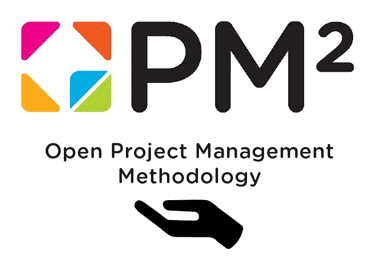

---
sidebar_navigation:
  title: PM² Project Management Guide
  priority: 954
description: Additional information and application guidelines for using OpenProject in PM² projects.
keywords: PM²
---

> [!TIP]
>
> One special feature of PM² is that the European Commission provides it under an open-source license. This makes it especially interesting and important for OpenProject, and it receives special attention from the OpenProject team to support this open methodology closely.

# PM² Project Management Methodology

Version 3.1, December 2023.

Additional information and hands-on application guidelines for using OpenProject in PM² projects.

| Topic                                                        | Content                                                      |
| ------------------------------------------------------------ | ------------------------------------------------------------ |
| [1 An introduction to the PM² guide](1-introduction)         | Explains the purpose and audience of the methodology. It introduces PM² as a light, practical, and adaptable approach suitable for various project types, developed by the European Commission. It outlines the structure of the guide and how to use it. |
| [2 Project management](2-project-management)                 | Provides the general project management concepts on which PM² is built. It covers the definition of projects, their environment, key success factors, and essential project management competencies (knowledge, skills, and mindsets). |
| [3 Overview of the PM² methodology](3-overview-pm2)          | Presents the House of PM² framework and explains its four pillars: Governance, Lifecycle, Processes, and Artefacts, all supported by PM² Mindsets. It introduces the four project lifecycle phases (Initiating, Planning, Executing, Closing) and explains tailoring to different project contexts. |
| [4 Project organisation and roles](4-project-organisation-and-roles) | Describes the PM² governance model in detail, including the main project roles and responsibilities: e.g., the Project Steering Committee, Project Owner, Business Manager, Project Manager, and Project Core Team. It explains reporting lines, decision-making, and escalation mechanisms. |
| [5 Initiating phase](5-initiating-phase)                     | Defines the activities needed to start a project. This includes preparing the Project Initiation Request (PIR), developing the Business Case, drafting the Project Charter, and obtaining formal approval through the Request for Planning (RfP) phase gate. |
| [6 Planning phase](6-planning-phase)                         | Focuses on defining how the project will be executed and controlled. It covers developing the Project Handbook and detailed management plans (scope, schedule, cost, risk, stakeholder, etc.), creating the Work Breakdown Structure (WBS), scheduling, resource planning, and getting approval through the Request for Execution (RfE) gate. |
| [7 Executing phase](7-executing-phase)                       | Covers carrying out the project work according to the plan. It includes team coordination, quality assurance, stakeholder communication, performance monitoring, and progress reporting. Formal approval to move forward is given through the Request for Closing (RfC) gate once work is complete. |
| [8 Closing phase](8-closing-phase)                           | Describes how to formally close the project. Activities include performing final reviews, accepting deliverables, capturing lessons learned, preparing the Project-End Report, completing administrative closure, and archiving documentation. |
| [9 Monitor & control](9-monitor-and-control)                 | A transversal section that applies across all phases. It details how to monitor project performance, schedule, cost, stakeholder engagement, requirements, change requests, risks and issues, quality, acceptance, transition, and outsourced activities. It ensures the project stays aligned with plans and objectives. |

**Disclaimer**

Reproduction and reuse is authorised provided the source is acknowledged.
Document licensed under CC BY 4.0 license (https://creativecommons.org/licenses/by/4.0/).
The Commission's reuse policy is implemented by Commission Decision 2011/833/EU of 12 December 2011 on the reuse of Commission documents (OJ L 330, 14.12.2011, p. 39 - https://eur-lex.europa.eu/eli/dec/2011/833/oj).

The PM² logo is the property of the European Union and may not be registered as a trademark or otherwise, nor used separately from these documents.

Neither the publication nor the logo can be used in a way which suggests endorsement of an external organisation by the European Union.
