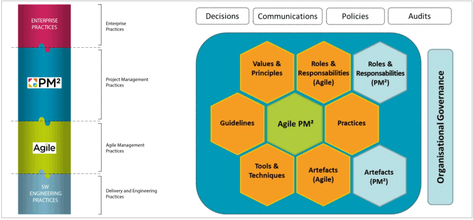
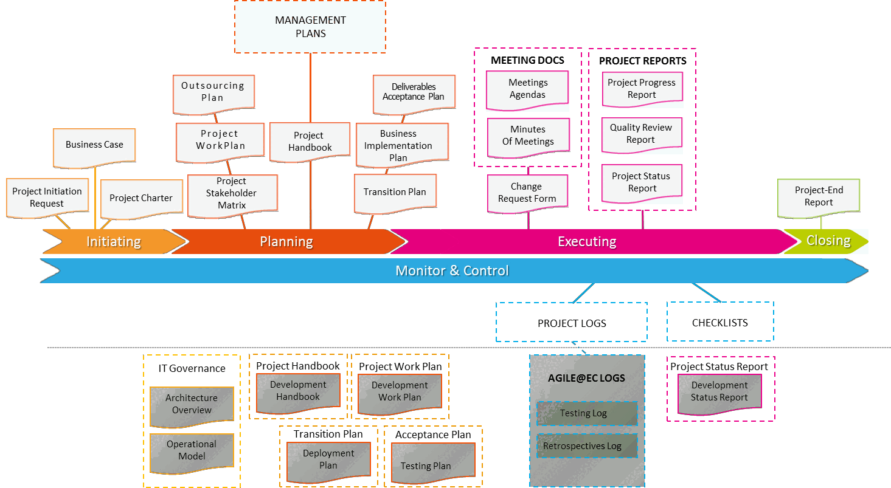
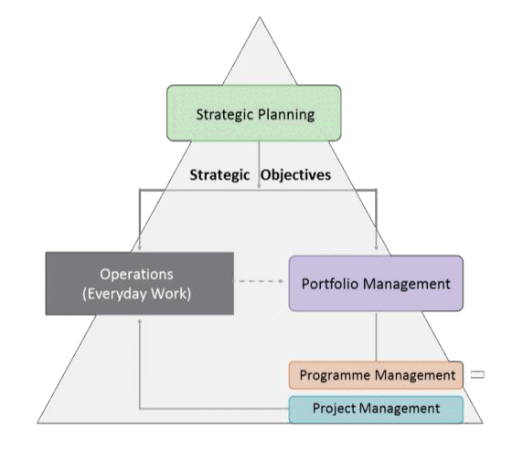
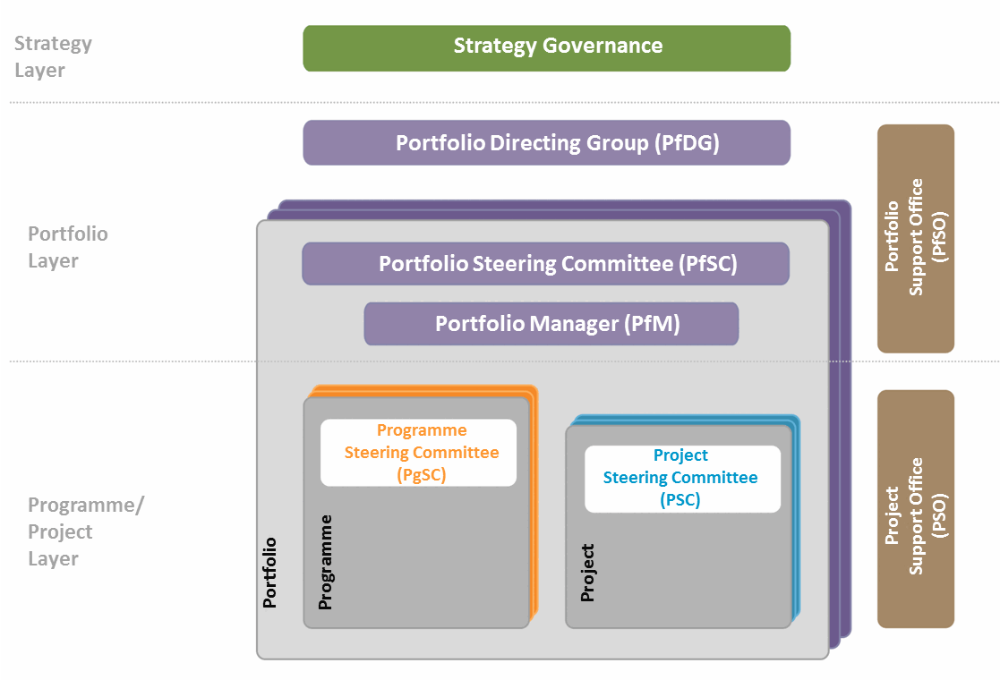

---
sidebar_navigation:
  title: Appendices
  priority: 450
description: Appendices to the PM² project management guide
keywords: Contributions and acknowledgements, project management plans and logs, 
---

# Appendices

## Appendix A: contributions and acknowledgements

The European Commission is grateful to all those who have contributed in the development of the PM² Project Management Methodology and wishes to acknowledge their contribution and support.
In alphabetical order:

The following people provided leadership and sponsorship for the PM² and Open PM² initiatives:

1. BERLAIRE Philippe
2. BOVALIS Konstantinos
3. CABRERO MORENO Daniel
4. DEASY Declan
5. GARCIA-MORAN Francisco
6. GEORGIANNAKIS Giorgos
7. INGESTAD Gertrud
8. IGLESIAS Jeremias
9. KOUROUNAKIS Nicos
10. MARASLIS Athanasios
11. MEULEMAN Stijn
12. QUEST Stephen
13. SCHILDERS Dirk
14. SILVA MENDES Pedro
15. VASSILIADIS Theodoros
16. VEKEMANS Tom
17. VLEMINCKX Philippe

Authors of the PM² Guide and Methodology:

1. KOUROUNAKIS Nicos
2. MARASLIS Athanasios

In addition, the following people served as project team members and contributed to the evolution of the PM² Methodology, provided text, concepts and expert knowledge, carried out reviews and assisted in developing the PM² Methodology and the PM² Guide:

1. ATIENZA FERNANDEZ Roberto
2. BORRELLY Christopher
3. BERGHMANS Marc CALAMITA Valter CRESPO GAMBADE Pablo DAMAS Pierre
4. André DEL CASTILLO SANCHEZ Manuel D’ELIA Sandro DZHUMALIEVA Stefka
5. GKOLFI Argyro
6. GIOVANNELLI Rosaria
7. OH Gavin
8. OLEKSY Henri
9. KATSAGOUNOS Ilias
10. KIPS Bert
11. KOENS Maarten
12. KUMMER Laurent LECOMTE Marie-Véronique
13. LECLERCQ Pierre MARTA Ana MARTINEZ RODRIGUEZ Eva
14. MARTINI Marco
15. MERGUERIAN George
16. MOIRA Anastasia
17. PADRAO Ana
18. PAPIER David
19. PECA Viorel
20. RUSTANOWICZ Michal
21. SEQUEIRA Luis
22. SUTHERLAND-SHERRIFF Sarah
23. TURLEY Frank
24. VAROTTO Anita
25. VOICU Denisa
26. WILLIAMS Kory
27. ZAININGER Renate

OPEN PM² WORK GROUP MEMBERS:

1. BACELLI Novella
2. CHLAPANI Angeliki
3. DAQUINO Giuseppe Giovanni
4. DYBA Wojciech
5. GALLOIS Laurent
6. GIMENO Francisco
7. HELBIN Tomek
8. LORANT Benoit
9. LICU Oana
10. MARTIN FERNANDEZ Jesus
11. MATTU Francesco
12. PARONI Panagiota
13. PARZANESE Pierpaolo
14. MARTO DE OLIVEIRA Teresa
15. MET DEN ANCXT Roland
16. MICHELIOUDAKIS Elias
17. SCHEINER Robert
18. SYMEONIDIS George
19. TORRECILLA SALINAS Carlos
20. TOURE Amadou
21. VIDALIS Antonios

This version of the PM² Guide has been produced by:

**European Commission**

DIGIT.A2.001, Procurement and Programme Management Solutions. Portfolio Methodologies and Tools

1. CHLAPANI Angeliki *Head of Unit*
2. KAMINSKI Thomasz *Deputy Head of Unit*
3. MUSAT Bogdan *Head of Sector*

Centre of Excellence in PM² (CoEPM²):

1. SEMERDZHIEVA Svetla *Team Lead*
2. WHYE Gregory Senior *Consultant*
3. SUFARU Maria-Cristina *Senior Consultant*
4. BOCHAROVA Ksenia *Senior Consultant*
5. LEFTER Diana-Mihaela *Senior Consultant*
6. COOPER GUMIEL Veronica *Communications Consultant*

Former CoEPM² members who recently moved on to other assignments:

1. BERGHMANS Marc
2. MICHELIOUDAKIS
3. Elias MICHOTTE Alexandra
4. VAN GAEVER Alain

## Appendix B: project management plans and logs 

### B. 1 Requirements management plan

The Requirements Management Plan defines and documents the requirements management approach, process steps and responsibilities, as well as tools, techniques and artefacts that will be used. Note that requirements themselves are documented and managed in separate artefact(s) (e.g. requirements matrix).

Effective requirements management is a critical success factor for projects, as requirements are the starting point for all project work, and principally affect the project risk, duration and budget.

Requirements are traditionally defined in detail early in the project lifecycle. However, depending on the type, scope and chosen project strategy, the requirements management process may need to accommodate a more agile definition and elaboration of requirements, thereby allowing for frequent and less formal requirements management cycles.

The Requirements Management Plan can be tailored and customised to the project's needs. In the absence of a more specialised role, the Project Manager (PM) is responsible for executing the process from project initiation until all requirements have been implemented and validated.

| Key participants | Description |
| :-- | :-- |
| Project Manager (PM) | Prepares this artefact. |
| Business Manager (BM) | Consulted for the tailoring and elaboration of this artefact. |

**Inputs**

- Project Charter
- Project Handbook
- Project Stakeholder Matrix

**Steps**

1. Check if a requirements management process already exists at the organisational level.
2. Tailor the Requirements Management Plan to the project's needs. Create it as a standalone document or as a section within the Project Handbook.
3. Define what a requirement is, and what the possible states of its lifecycle are.
4. Ensure that the requirements management process is aligned with the change management process, and that requirement changes are traced to the project's deliverables and activities.
5. Define the roles and responsibilities for each process step. Define clearly who is responsible for approving and validating the implementation of new requirements.
6. Define the tools and techniques that will be used to identify, evaluate, prioritise and manage requirements (e.g. brainstorming sessions, prototyping, MoSCoW, etc.).
7. Define the possible formats of representation of requirements for the project (e.g. text, use cases, diagrams, user stories, etc.)
8. Define the artefacts and repositories used for the documentation and management of the requirements (e.g. specification document or requirements traceability matrix).
9. Define the requirements validation process and make sure it is aligned with the overall deliverables acceptance process.
10. Ensure that the requirements management process is communicated to the project stakeholders.

| RAM (RASCI) |  | AGB | PSC | PO | BM | BIG | SP | PM | PCT |
| :--: | :--: | :--: | :--: | :--: | :--: | :--: | :--: | :--: | :--: |
| Requirements Management Plan |  | I | I | A | C | C | I | R | S |

| Related Artefacts | Initiating | Planning |  | Executing |  | Monitor \& Control |  | Closing |
| :--: | :--: | :--: | :--: | :--: | :--: | :--: | :--: | :--: |
| Requirements   Management | Project Charter | Project Handbook   Requirements   Management Plan   Deliverables   Acceptance Plan |  | Change   Requests | Requirements Document(s)   Project Work Plan   Project Logs |  | Project-End Report |  |

**Artefact** 

- Requirements Management Plan

### B. 2 Project change management plan

The Project Change Management Plan defines and documents the change process for a project. It defines the activities, roles and responsibilities related to identifying, documenting, assessing, approving, prioritising, implementing, controlling, and communicating requested project changes.

Project change management brings transparency, accountability and traceability to all project changes implemented after the project scope and project plans have been baselined. The escalation procedure ensures that changes with a significant impact on project performance are properly assessed and approved by the appropriate level of authority. The Project Change Log is used to document requested changes and trace all related decisions and planned actions.

| Key participants | Description |
| :-- | :-- |
| Project Manager (PM) | Prepares the Project Change Management Plan. |
| Project Owner (PO) | Approves the Project Change Management Plan. |
| Business Manager (BM) | Consulted for the elaboration of this artefact. |

**Inputs**

- Business Case and Project Charter
- Project Handbook
- Project Work Plan

**Steps**

1. Check if there is a pre-existing project change management process at the organisational level.
2. Tailor the Project Change Management Plan to the project's needs (e.g. define different steps depending on the type of change, its urgency or impact). Create it as a standalone document or as a section within the Project Handbook.
3. Ensure that there is no duplication of information contained in other management plans or the Project Handbook (e.g. the escalation procedure).
4. Define what is considered to be a change for the project, as well as the possible types of changes.
5. Define the artefacts and the tools and techniques that will be used to identify and assess changes (e.g. the Change Request Form or the Project Change Log).
6. Define who is responsible for approving changes at the various impact levels, and how this decision is communicated to the rest of the team.
7. Tailor the Change Log (if needed) and customise it to reflect any customisations of the Project Change Management Plan (e.g. scales of urgency, change impact and priority).
8. Describe the change monitoring and control activities, their frequency and supporting tools and techniques, e.g. review of changes at a predefined frequency based on the Change Log.
9. Ensure that the change management process is communicated to the project team and stakeholders.

| RAM (RASCI) |  | AGB | PSC | PO | BM | BIG | SP | PM | PCT |
| :--: | :--: | :--: | :--: | :--: | :--: | :--: | :--: | :--: | :--: |
| Project Change Management Plan |  | I | I | A | C | I | I | R | I |

| Related artefacts | Initiating | Planning | Executing | Monitor \& control | Closing |
| :--: | :--: | :--: | :--: | :--: | :--: |
| Project Change Management | Project   Charter | Project Handbook Project Change Management Plan | Project Reports Change Requests | Change Log   Project Logs   Project Work Plan | Project-End Report |

**Artefact**

- Project Change Management Plan
- Change Log (setup)

### B. 3 Risk management plan 

The Risk Management Plan defines and documents the Risk Management Process for a project. It describes how risks will be identified and assessed, what tools and techniques can be used, what the evaluation scales and tolerances are, the relevant roles and responsibilities, how often risks need to be revisited, etc. The Risk Management Plan also defines the risk monitoring and escalation process as well as the structure of the Risk Log, which is used to document and communicate the risks and their response actions.

Risk management brings visibility to risks and accountability as to how they are handled, and ensures that project risks are proactively dealt with and regularly monitored and controlled.

| Key Participants | Description |
| :-- | :-- |
| Project Manager (PM) | Prepares the Risk Management Plan. |
| Business Manager (BM) | Consulted for the elaboration of this artefact. |
| Project Owner (PO) | Approves the Risk Management Plan. |

**Inputs**

- Business Case and Project Charter
- Project Handbook
- Project Work Plan

**Steps**

1. Check if there is a pre-existing risk management process at the organisational level.
2. Tailor the Risk Management Plan to the project's needs (e.g. delete/add steps or activities, expand on or change the activities' description or related responsibilities, etc.). Create it as a standalone document or as a section within the Project Handbook.
3. Ensure that there is no duplication of information contained in other management plans or the Project Handbook (e.g. the escalation procedure).
4. Define the tools and techniques that will be used to identify, assess and monitor risks (e.g. brainstorming, Risks Database, Risk Breakdown Structure, Likelihood-Impact Matrix, Decision Tree Analysis, the Risk Log, etc.).
5. Customise the scales used for assessing risks (i.e. likelihood, impact and overall risk level).
6. Determine (with the involvement of key stakeholders) the project's risk appetite (the amount of risk that stakeholders are prepared to accept).
7. Decide on how frequently the Risk Log should be reassessed, considering both project and organisational conditions and policies.
8. Specify the escalation and communication procedures for risks that need special attention (i.e. which project stakeholders need to be informed if critical risks are triggered).
9. Identify the applicable risk response strategies both for identified threats and opportunities (i.e. avoid, transfer/share, reduce, accept or exploit, enhance, share and accept respectively).
10. Determine the level of detail with which risk response actions should be described in the Risk Log (e.g. action description, action owner, planned effort, etc.). Note that activities that need considerable effort should be included in the Project Work Plan.
11. Ensure that the risk management process is communicated to the project team and stakeholders.

| RAM (RASCI) | AGB | PSC | PO | BM | BIG | SP | PM | PCT |
| :--: | :--: | :--: | :--: | :--: | :--: | :--: | :--: | :--: |
| Risk Management Plan | I | C | A | C | I | I | R | I |

| Related Artefacts | Initiating | Planning | Executing | Monitor \& Control | Closing |
| :--: | :--: | :--: | :--: | :--: | :--: |
| Risk Management | Project   Charter | Project Handbook Risk Management Plan | Project   Reports | Risk Log   Project Logs | Project-End Report |

**Artefact**

- Risk Management Plan
- Risk Log

### B. 4 Issue management plan 

The Issue Management Plan defines and documents the activities, roles and responsibilities related to identifying, assessing, assigning, resolving and controlling project issues. Issues are defined as unplanned project-related events that require a project management action.

The issue management process helps the Project Manager (PM) to assess and act upon issues that have a potential impact on project scope, time, cost, quality, risk or stakeholder satisfaction. Related decisions can be logged in a Decision Log, which brings visibility to decisions and accountability as to how and by whom they are taken, and to whom they should be communicated.

An Issue Log is used to document the identification, evaluation and assignment of issues and to trace all key decisions and planned actions. It also helps keep track of who is responsible for solving specific issues by a certain deadline. It brings visibility and accountability as to how issues are acted upon, and ensures that they are properly managed and resolved.

| Key participants | Description |
| :-- | :-- |
| Project Manager (PM) | Prepares the Issue Management Plan. |
| Business Manager (BM) | Consulted for the elaboration of this artefact. |

**Inputs**

- Project Charter
- Project Handbook
- Project Work Plan

**Steps**

1. Check if there is a pre-existing issue management process at the organisational level.
2. Tailor the Issue Management Plan to the project's needs. Create it as a standalone document or as a section within the Project Handbook.
3. Ensure that there is no duplication of information contained in other management plans or the Project Handbook (e.g. the escalation procedure).
4. Define what will be considered an issue for the project and customise the possible issue categories relevant to the project.
5. Define all artefacts, tools and techniques that will be used to identify, assess, assign, resolve and monitor issues (e.g. the Issue Log, root cause analysis, etc.).
6. Specify how new issues can be identified and their status communicated, and when new and open issues (and pending decisions) can be discussed (e.g. in project Status Meetings).
7. Customise the Issue Log to reflect any changes to the scales of urgency, impact and priority.
8. Define which issues (depending on their category, urgency and impact) can be handled at the (Project) Management Layer and which ones need to be escalated.
9. Describe the issue control activities, their frequency, and supporting tools and techniques (e.g. a review of issues in project Status Meetings based on the Issue Log or Project Status Reports).
10. Define how issues will be linked to their source, to related decisions, actions, risks and changes.
11. Specify the procedure for updating the Lessons Learned after an issue is resolved.
12. Ensure that the issue management process is communicated to the project team and stakeholders.

| RAM/RASCI | AGB | PSC | PO | BM | BIG | SP | PM | PCT |
| :-- | :--: | :--: | :--: | :--: | :--: | :--: | :--: | :--: |
| Issue Management Plan | I | I | A | C | C | I | R | C |

| Related Artefacts | Initiating | Planning | Executing | Monitor \& Control | Closing |
| :--: | :--: | :--: | :--: | :--: | :--: |
| Issue Management | Project   Charter | Project Handbook   Issue Management Plan | Project   Reports | Issue Log   Decision Log | Project-End Report |

**Artefact**

- Issue Management Plan
- Issue Log
- Decision Log

### B. 5 Quality management plan 

The Quality Management Plan defines and documents the project's quality requirements, the quality management approach, process and responsibilities. It also outlines the quality assurance and control activities undertaken throughout the project.

Planning and executing quality assurance and control activities may be seen as a significant investment of time and effort, and therefore the desired balance between the planned quality, cost, time and risk should be carefully evaluated and considered. Appropriate quality metrics should be defined and later used to evaluate the project management quality. All quality-related activities should be well designed and planned.

A configuration management procedure is also documented in the Quality Management Plan. Configuration management helps project teams handle project artefacts and deliverables effectively (i.e. to ensure that the correct versions are delivered, to prevent unauthorised changes and to provide artefact traceability).

| Key Participants | Description |
| :-- | :-- |
| Project Manager (PM) | Prepares the Quality Management Plan. May also be supported by other   roles such as the Project Quality Assurance (PQA), Project Support Office   (PSO) and other project stakeholders. |
| Business Manager (BM) | Reviews and validates the quality requirements, quality assurance and   control activities, and the associated metrics. |

**Inputs**

- Project Charter
- Project Handbook
- Project Work Plan

**Steps**

1. Check if there is a pre-existing quality management process at the organisational level.
2. Tailor the Quality Management Plan to the project's needs. Create it as a standalone document or as a section within the Project Handbook.
3. Determine the quality management objectives and characteristics by reviewing project deliverables, success criteria, approach and other specific requirements (e.g. security requirements) as described in the Project Charter and Project Handbook.
4. Ensure that there is no duplication of information contained in other management plans or the Project Handbook (e.g. the escalation procedure).
5. Define approval criteria for phase exit reviews or for other key project management milestones.
6. Define all artefacts, and the tools and techniques that will be used for quality planning and quality assurance and control (e.g. the Quality Review Checklist).
7. Determine the quality assurance and control activities and define their frequency and timetable. Additionally, design metrics and acceptance tolerances for evaluating these activities.
8. Determine if a Project Quality Assurance (PQA) role (or other independent entity) is required to carry out quality assurance activities.
9. Define the roles and responsibilities for the quality process and ensure that these roles are agreed by and communicated to all stakeholders involved.
10. Review the quality characteristics with relevant stakeholders. Ask them to suggest quality assurance and control activities specifically for the project.
11. Define the quality and configuration procedures and records which show that quality and configuration management activities have been carried out as planned.
12. Tailor the Quality Review Checklist based on the quality control activities defined for the project.
13. Ensure that quality assurance and control activities are traceable back to specific work activities in the Project Work Plan.
14. Ensure that the document's reviewers and approver are clearly identified.
15. Present the planned activities and timetable to the Project Steering Committee (PSC) for approval.
16. Communicate the approved plan to the project team and relevant stakeholders.

**Guidelines (specific for configuration management)** 

- Review the configuration management process set out in the Quality Management Plan and tailor it to the project's needs (e.g. delete or add steps or activities, expand on or change the activities' description, related responsibilities, etc.).
- Define what will be considered to be a configuration item based on project deliverables and artefacts, and identify the attributes of such items.
- Identify who is responsible for changes to the configuration items and for maintaining and controlling their versions and releases.
- Define the artefacts and the tools and techniques that will be used to manage the configuration items.
- Depending on the project's complexity, a configuration management log can be used to control changes to the configuration items.
- Describe the naming conventions to be used in project documentation, folders and emails.
- Define the structure of project folders and the procedures and rights related to reviewing, changing or updating any project artefacts. Ensure that restricted access and confidentiality rules are correctly implemented.
- Define any procedures related to creating copies of project data, retention periods, storage devices and sanitisation/deletion of data (if required).
- Ensure that the configuration management procedure is communicated to the project team.
- Key information on configuration management may also be summarised in the Project Handbook.

| RAM (RASCI) |  | AGB | PSC | PO | BM | BIG | SP | PM | PCT |
| :--: | :--: | :--: | :--: | :--: | :--: | :--: | :--: | :--: | :--: |
| Quality Management Plan |  | I | A | C | C | C | C | R | C |

| Related Artefacts | Initiating | Planning | Executing | Monitor \& Control | Closing |
| :--: | :--: | :--: | :--: | :--: | :--: |
| Quality Management | Project   Charter | Project Handbook   Quality   Management Plan | Quality Review   Reports   Audit Reports | Quality Review Checklist Project Logs Phase-exit Review Checklist | Project-End Report   Project Acceptance   Note |

**Artefact**

- Quality Management Plan
- Quality Review Checklist
- Phase-exit Review Checklist

### B. 6 Communications management plan 

The Communications Management Plan helps to ensure that all project stakeholders have the information they need to perform their roles throughout the project. Planning and executing project communication activities is essential for project success.

The Communications Management Plan defines and documents communication activities, their goals, content, format, frequency and audience. It also defines how to communicate project status and the assignment of activities to the various stakeholders and includes a communication strategy for each key stakeholder, based on their interests, expectations and influence in the project.

| Key Participants | Description |
| :-- | :-- |
| Project Manager (PM) | Prepares the Communication Management Plan. |
| Business Manager (BM) | Provides input and assists in its creation. |

**Inputs**

- Project Charter
- Project Handbook
- Project Stakeholder Matrix
- Project Work Plan

**Steps**

1. Review the guidelines set out in the Communications Management Plan template to get a better understanding of how to tailor and customise it .
2. Ensure that there is no duplication of communication activities described in other management plans such as the Quality Management Plan, the Risk Management Plan, etc.
3. If certain processes are already described in the Project Handbook (e.g. the escalation process), reference them to avoid duplication and simply document any changes.
4. Identify project stakeholder groups based on the Project Stakeholder Matrix.
5. When determining the strategy for each communication activity, consider the interests and influence of both internal and external organisations to the project.
6. For each target group, determine what information needs to be communicated, and the purpose of the communication.
7. Define all artefacts (e.g. Project Reports) and other means to collect, analyse and distribute project information and manage stakeholders' expectations.
8. Determine the frequency of the communication activities, their format and the media to be used for the communications (e.g. reports, presentations, meetings, emails, calls).
9. Determine who will be responsible for each communication activity and describe the expected results.
10. Ensure that the communication management plan is communicated to the project stakeholders.

| RAM (RASCI) |  | AGB | PSC | PO | BM | BIG | SP | PM | PCT |
| :--: | :--: | :--: | :--: | :--: | :--: | :--: | :--: | :--: | :--: |
| Communications Management Plan |  | I | I | A | S | C | I | R | C |

| Related artefacts | Initiating | Planning |  | Executing |  | Monitor \& control |  | Closing |
| :--: | :--: | :--: | :--: | :--: | :--: | :--: | :--: | :--: |
| Communications   Management | Project   Charter | Project Stakeholder   Matrix   Communications   Management Plan |  | Project   Reports |  | Project Logs |  | Project-End   Report |

**Artefact**

- Communications Management Plan

### B. 7 Change log 

| Change Identification and Description |  |
| :--: | :--: |
| ID | The change identifier. |
| Category | Categorises the change. |
| Title | A short title for the requested change. |
| Description | A more detailed description of the requested change and the impact of not implementing the change. |
| Status | The status of the change can be any of the following:   Submitted: This is the initial status. Use this while the requested change is still being specified.   Assessing: Use this status to initiate an assessment.   Waiting for approval: Use this to initiate approval. Before applying this status, ensure that the investigation is complete, and the estimates shown are correct.   Approved: This status is set once the change has been approved, as proposed, or modified   Rejected: This status is set if the change was rejected.   Postponed: This status is set if the change is postponed indefinitely.   Merged: This status indicates that the change has been merged into some other change, so it is no longer being actively handled. Merging is common when there are many changes.   Implemented: This status indicates that the work implementing this change has been incorporated into the Project Work Plan. |
| Requested by | The name of the person requesting the change. |
| Date Identified (or Submission Date) | The initial submission date of the change request. |
| Change Assessment and Action Description |  |
| Action Details (effort \& responsible) | Description of the recommended action, including steps, deliverables, timescale, resources and effort involved. |
| Size | The effort required to implement the change.   The possible values are:   5=Very high, 4=High, 3=Medium, 2=Low, 1=Very low |
| Priority | A numerical value denoting the agreed priority of the change. The possible values are:   5=Very high, 4=High, 3=Medium, 2=Low, 1=Very low |
| Target Delivery Date | The target date for the change to be delivered. |
| Change Approval |  |
| Escalation | Escalation to the Directing or Steering layer is needed? (Yes or No). |
| Decision | The decision taken. |
| Decided by | Person or committee that denied or approved the change. |
| Decision Date | Date on which the decision was made. |
| Change Implementation |  |
| Actual Delivery Date | The date on which the change was actually delivered. |
| Traceability and Comments | The ID(s) of the tasks (in the Project Work Plan) that implement the change, and/or the IDs of related issues, risks or decisions. Also include any additional information/comments related to the change. |

### B. 8 Risk log 

| Risk Identification and Description |  |
| :--: | :--: |
| ID | The risk identifier. |
| Category | Risk category related to the area affected by the risk (e.g. business, IT, people \& organisation, external or legal). |
| Title | A short title for the risk. |
| Description | A structured formulation of the opportunity or threat in the form of (route) Cause - Risk -Effect, along with potential risk inter-dependencies. |
| Status | The risk status can be any of the following:   Proposed: This is the initial status. Use this while the risk is still being specified.   Assessing: Use this status to initiate an assessment.   Waiting for Approval: Use this to request approval. Before applying this status, make sure the assessment is complete and the estimates are reliable.   Approved: This status is set once the risk possibility has been accepted.   Rejected: This status is set if the risk was rejected as not relevant.   Closed: This status is set once the risk has been managed (e.g. mitigation |
| Identified by | The person who identified the risk. |
| Identification date | The date on which the risk was identified. |
| Risk Assessment |  |
| Likelihood (L) | A numerical value denoting the estimate of the probability that the risk will occur. The possible values are:   5=Very high, 4=High, 3=Medium, 2=Low, 1=Very low |
| Impact (I) | A numerical value denoting the severity of the risk's impact (should it occur). The possible values are:   5=Very high, 4=High, 3=Medium, 2=Low, 1=Very low |
| Risk Level (RL) | The risk level is the product of the likelihood and impact (RL=L*I). |
| Risk owner | The person accountable for managing and monitoring the risk. |
| Escalation | Whether or not the risk is to be escalated to the Directing or Steering Layers (Yes or No). |
| Risk Response |  |
| Risk response Strategy | Strategies for negative risks (threats):   Avoid, Reduce, Accept, Transfer/Share   Strategies for positive risks (opportunities):   -Exploit, Enhance, Accept, Share |
| Action details (effort \& responsible) | Description of the action(s) to be taken, including its objective, scope, deliverables, and the person responsible and estimated effort needed. |
| Target date | The date on which the action is expected to be implemented. |
| Traceability/Comments | The ID(s) of the tasks (in the Project Work Plan) that implement the risk response actions, and/or the IDs of related changes, issues, or decisions (log entries). Also include any additional information/comments related to the risk. |

### B. 9 Issue log 

| Issue Identification and Description |  |
| :--: | :--: |
| ID | The issue identifier. |
| Category | Issue category related to the area affected by the issue (e.g. business, IT, people \& organisation, external or legal). |
| Title | Short title for the issue. |
| Description | A description of the issue and its impact. |
| Status | The issue status can be any of the following:   Open: The issue has been identified and requires attention and, if possible, a resolution.   Postponed: This status is set if resolving the issue is postponed due to other priorities.   Resolved: This status indicates that all necessary actions are completed, and the issue is resolved.   Closed: This status indicates that all work is completed and verified. The issue can then be marked as closed. |
| Identified by | The name of the person who identified the issue. |
| Identification date | The date on which the issue was raised. |
| Issue Assessment and Action Description |  |
| Action details (effort \& responsible) | Description of the recommended action to be taken, and the steps, deliverables, timescale, resources, and effort involved. |
| Urgency | A numerical value denoting how urgent the issue is. The possible values are: 5=Very high, 4=High, 3=Medium, 2=Low, 1=Very low |
| Impact | A numerical value denoting the issue's impact. The possible values are: 5=Very high, 4=High, 3=Medium, 2=Low, 1=Very low |
| Size | Issue size represents the effort needed to resolve the issue.   The possible values are:   5=Very high, 4=High, 3=Medium, 2=Low, 1=Very low |
| Target date | The date on which the issue is expected to be resolved. |
| Issue owner | The person accountable for resolving the issue. |
| Escalation | Whether or not the issue is to be escalated to the Directing or Steering Layers (Yes or No). |
| Traceability/Comments | The ID(s) of the tasks (in the Project Work Plan) that implement the issue actions, and/or the IDs of related changes, risks or decisions (Log entries). Also include any additional information/comments related to the issue. |

### B. 10 Decision log 

| Decision Identification and Description |  |
| :-- | :-- |
| ID | The decision identifier. |
| Category | Decision category related to the area affected by the decision (e.g. business,   IT, people \& organisation, external or legal). |
| Title | Short title for the decision. |
| Description | A description of the decision's details and impact, if applicable. |
| Identified by | The name of the person who identified the need for a decision. |
| People present | Log the names of those present when then decision was made. Reference   can be made to the relevant Minutes of Meeting (MoM) if appropriate. |
| Comments | The IDs of related Change, Risk or Issue Log entries and any additional   information related to the decision. |
| Ownership |  |
| Decision owner | The person accountable for the decision. |
| Decision date | Date on which the decision was taken. |
| Escalation | Whether or not the decision is to be escalated to the Directing or Steering   Layers (Yes or No). |
| Decision Implementation |  |
| Date of Application | The date on which the decision is applicable. |
| Decision communicated   to: | The group, teams, and other audiences to whom the decision should be   communicated. |

## Appendix C: Project management tools \& techniques 

This section introduces a number of commonly used Project Management Tools \& Techniques useful for dealing with various project management challenges. Each Tool \& Technique is summarised in a few paragraphs providing a simple and high-level overview of that tool or technique.

Note that the set of tools presented is not an exhaustive list of Project Management Tools \& Techniques available. Relevant sources for further reading and exploration are also presented at the end of this section.

### C. 1 PESTEL Analysis

The PESTEL Analysis is used to understand how the environment might impact a project or an objective. PESTEL stands for: Political, Economic, Social, Technological, Environmental and Legal. A PESTEL analysis helps identify the external factors that influence an organisation, and therefore, could have an impact on the objectives, planning or execution of projects.

This type of analysis is particularly important in the context of business justification and risk management and will feed the process of designing a plan comprehensive enough to identify and tackle potential risk scenarios (threats/opportunities) arising from outside the organisation or project.

### C. 2 Make or Buy Analysis

A Make or Buy Analysis helps the organisation to take an informed decision about what to outsource and what not to outsource. Portfolio managers and project sponsors are often faced with the dilemma to make or buy, considering the availability and skills of resources at hand.

The various factors to be considered for a Make or Buy Analysis include cost comparison, technology and business processes, supplier-related information and support systems.

Potential reasons for a make decision include cost effectiveness, intellectual property concerns, quality control issues or supplier unreliability issues. Potential reasons for buy decision include cost considerations, lack of technical expertise, suppliers' technical experience and/or insufficient in-house resources.

### C. 3 Stakeholder Interest/Influence Matrix (SIIM)

This technique is used to facilitate and document the analysis of the interest and influence of each stakeholder in the project. It is of utmost importance to know the stakeholders and their relevance for the project in order to identify project champions and possible detractors. As the document makes reference to people within your organisation, care should be used to keep the information confidential.

Interest indicates the level of interest a stakeholder has for the project. Interest is measured as the degree of enthusiasm displayed by the stakeholder in support of the project. Stakeholders can be positive, neutral or negative towards the project.

Influence indicates the power the stakeholder has over the planning and implementation of activities. The higher a stakeholder's power of decision, the higher their influence. Most often the person(s) who can make decisions on project funding and/or resources has a high influence.

### C. 4 Risk Likelihood/Impact Matrix

The Risk Likelihood/Impact Matrix (sometimes called the Likelihood-Impact Matrix or Risk Matrix) is used in the qualitative assessment of risks, after the project risks have been identified. The matrix is designed as a tool to supplement the risk log or risk register.

The Risk Likelihood/Impact Matrix is based on two criteria: the likelihood that a risk will materialise and the potential impact caused by the risk event. Most commonly five bands are used for each of the dimensions of the matrix: 1=Very low, 2=Low, 3=Medium, 4=High, 5=Very high.

The two factors are then combined by multiplying their values, resulting in the Risk Level. Measured on a relative scale from 1 to 25 , the Risk Level will trigger different risk response strategies.

The cells of the matrix are painted in different colours to indicate the criticality of the risk, typically Green for low-level risks (risk level \<=2), Yellow for medium-level risks (risk level between 3 and 16), and Red for high-level risks (risk level >=20).

Based on the risk appetite of the organisation, adequate risk-response strategies can be developed for each identified risk.

### C. 5 Work Breakdown Structure (WBS) 

A Work Breakdown Structure (WBS) is a hierarchical division of the project into smaller work components that can be used to assign work or to estimate effort and cost. A well-made Work Breakdown Structure (WBS) should be easy to understand, be complete, and should facilitate progress monitoring during execution. Commonly used techniques include breaking down the project by phases or stages, deliverables or outputs, by work packages, or based on the organisation, its departments and business units.

The Work Breakdown Structure (WBS) constitutes a good basis for the Project Manager (PM) in assigning different responsibilities to team members. Each task in the structure can then be further defined: work can be estimated, risks and dependencies can be identified, and resources can be mobilised.

### C. 6 Deliverables Breakdown Structure (DBS)

A Deliverables Breakdown Structure (DBS) is an essential part of Product Based Planning. It can be used to identify and document the deliverables of a project (both project deliverables and project management deliverables) and their interdependencies. This results in a hierarchical tree of deliverables and subdeliverables (physical, functional or conceptual) that make up the entire project, which helps the project team to identify the full set of deliverables that comprise the project.

A Deliverables Breakdown Structure (DBS) is similar to a Work Breakdown Structure (WBS) but is used at a different step in the planning process. The former can precede the latter and identifies the desired outputs (deliverables) which are then used in the creation of the Work Breakdown Structure (WBS)—identification of tasks and activities required to deliver these outputs.

You could say that the Deliverables Breakdown Structure (DBS) defines what the project will produce (as a whole and as parts), and the Work Breakdown Structure (WBS) defines the work needed to produce them.

### C. 7 Effort and Cost Estimates

The Effort and Cost Estimates technique derives from the Work Breakdown Structure (WBS): each work item (task) is estimated in terms of effort and cost. Effort is typically measured in person days or person months. This work is done in close cooperation with the task owners or other experts within the Project Core Team (PCT), to ensure more precise estimates and buy-in from the team members in charge of executing the work.

A high-quality Work Breakdown Structure (WBS) forms the basis for high-quality estimates.

### C. 8 Three-Point Estimates

The Three-Point Estimate is commonly used, in conjunctions with Network Diagrams, to provide a weighted average of activity duration or cost. It is primarily a quantitative risk assessment technique that makes use of a stochastic approach rather than a deterministic one (e.g. single point estimates). The expected duration/cost and standard deviation of a project's duration or cost is calculated based on three data points, namely an optimistic estimate of duration or cost, a most likely estimate and a pessimistic estimate. These estimates are then weighed to provide a weighted average of the effort, cost or duration.

In addition, these estimates can be used to calculate a standard deviation, to estimate confidence levels of the weighted average per activity, and to build simple statistical models of a task's time and cost. This method can be applied to forecast and mitigate risk and to assign buffers/contingencies to tasks. Nowadays, numerous Project Management Software, can perform automated calculation of the above through modelling and simulation (e.g. by using the Beta-PERT distribution).

Involving experts increases the accuracy of the three-point estimates and reduces the degree of uncertainty of the project.

### C. 9 Decision Trees

The decision tree is a visual decision support tool, consisting of nodes and branches that helps us describe possible alternatives (paths) by representing choices, and events with different likelihood of occurrence. It uses three types of nodes: (a) Decision nodes (represented by squares) (b) Chance nodes (represented by circles) and (c) End nodes (represented by triangles).

In decision tree analysis (primarily being performed during project risk management), the decision tree is principally used in conjunction with the Expected Monetary Value (EMV) where we compute the EMV of

each alternative (branch) and thus select the most favourable one. The decision tree analysis can also be performed by creating a stochastically determined structure and then simulate the outcomes (e.g. through Monte Carlo simulation), in order to derive to probability-based decisions.

### C. 10 Project Scheduling 

Project Scheduling aims to identify dependencies between tasks, to assign resources for each task, to identify task start and end dates, and to work out the overall project duration.

Scheduling can be done for the entire project upfront or for portions thereof, such as individual stages or iterations. Different scheduling methods and representations can be used: a list of dates/deadlines, a milestone plan, bar charts, network diagrams and linked bar charts (Gantt charts), all of which can be seen complementary to each other.

Once approved, the project schedule is baselined and any further change to the schedule needs to follow the change management process and the corresponding governance arrangements.

### C. 11 Resource Levelling

Resource Levelling is a technique used to analyse the unbalanced use of project resources and to resolve conflicts related to resource allocation (i.e. human resources, material or equipment).

Resource Levelling focuses on an efficient/optimal resource allocation in order for the project to be completed within the defined timeline. Project Managers (PMs) analyse dependencies between projects or activities to ensure that activities can be executed in a timely manner. Considering the identified constraints, Resource Levelling can be performed. Resource Levelling can for example require the delay of specific tasks until resources are available, via resource reallocation.

### C. 12 Gantt Charts

A Gantt Chart is a common project management tool used to represent the schedule, phases and activities of a project in a single visual (generally a type of horizontal bar chart). It focuses on project sequence, duration, dependencies and status in a manner that is easy to understand.

A Gantt Chart represents the order in which activities need to be carried out and provides an overview of the progress that has been achieved at any point in time. A Gantt Chart is used to communicate a project schedule in a visual way but is also used to show progress made and current schedule status by adding percent-complete shadings and a vertical "today" line. The main strength of this technique is the ability to clearly display the status of each activity at a glance.

### C. 13 Critical Path Method (CPM)

The Critical Path Method (CPM) is a modelling technique that uses a mathematically based algorithm to calculate the total duration of a project. It calculates the longest necessary path (i.e. the longest unavoidable duration) of planned activities from beginning to the end of the project, otherwise known as the critical path of the project. This technique helps to understand which activities have a critical influence on the overall duration of the project.

Since the critical path represents the longest necessary path of activities, it also represents the shortest possible duration of the project to completion. Based on this information, activities can be prioritised in order to shorten the duration of the critical path by pruning the critical path activities, performing more activities in parallel or adding more resources.

### C. 14 Critical Chain Method (CCM)

The Critical Chain Method (CCM) is a modelling technique used to plan and schedule a set of activities or projects. It is similar to the Critical Path Method (CPM), but takes into account resources and their levelling, as well as the behaviour of the Project Manager (PM) when estimating the duration of project activities.

The technique is based on the observation that activity time estimates for projects are close to double the time required to complete the activities. Reasons that lead to a delay can include not taking advantage of the early finish of an activity, pacing of the team members to fill the time available for the completion of a task, waiting until the last moment to really focus on the task at hand, etc.

The Critical Chain Method (CCM) assumes that a Project Manager's (PM) estimates of duration for activities are padded, and immediately proceeds to reduce them. Additional buffers (project buffer, feeding buffer, resource buffer) are then added to account for the reduction in project estimates.

### C. 15 Earned Value Management (EVM) 

Earned Value Management (EVM) is a technique used to monitor and control the performance of projects, providing an objective view of performance based on the project financials. Both cost and value are measured in terms of cost units (e.g. person days or euro). Earned Value Management (EVM) provides relatively objective metrics-or key performance indicators (KPIs)-to proactively manage project performance. Some indicators reflect on progress made so far, or deviations from the plan from a cost or work value point of view, while other indicators focus on forecasting total budget deviation, or on the productivity levels required to complete the project on schedule.

The principal metrics being used are the Planned Value (PV), also known as Budgeted Cost of Work Scheduled (BCWS), the Actual Cost (AC), also known as Actual Cost of Work Performed (AVWP) and the Earned Value, also known as Budgeted Cost of Work Performed (BCWP). Through the combination of the above metrics we can have various KPIs, e.g. Schedule Variance (SV) and Schedule performance Index (SPI), Cost Variance (CV) and Cost Performance Index (CPI) or even more advanced ones for forecasting future project performance, like the Estimate at Completion (EAC), the Estimate to Complete (ETC) and the To Complete Performance Index (TCPI).

### C. 16 Pareto Analysis

The Pareto Analysis is a formal technique to identify those issues that cause the majority of problems in a project. The Pareto principle states that generally 80% of the effects come from 20% of the causes (e.g. 80% of costs may be attributed to 20% of activities or 80% of risk effects may arise from just 20% of identified risks).
By focusing on these top issues (the 20%), the Pareto Analysis can be useful for risk or quality management as it helps to focus on those risks or quality issues with the highest impact on a project, therefore facilitating the prioritisation of necessary mitigation or contingency actions.

### C. 17 Lessons Learned

Capturing Lessons Learned is a way of identifying areas for development/improvement within a project for the purpose of helping similar projects avoid certain pitfalls in the future. Information that can be captured includes Lessons Learned from the management of risks, quality issues, outsourcing or contractor issues, change requests, etc.

The project team can capture ideas through brainstorming sessions, reviewing project reports and logs, sending project questionnaires, etc., during the lifecycle of the project. The Project Manager (PM) will group and prioritise Lessons Learned in order to understand key potential improvement areas.

To avoid making the same mistakes twice, Lessons Learned should be shared with other project managers. In some cases, Lessons Learned can lead to process improvements, enhanced checklists and templates, or more effective training courses.

## Appendix D: PM² Extensions \& Considerations 

### D. 1 Agile, Programme, and Portfolio Management

#### D.1.1 PM² and Agile Management

PM² recognises the complex and uncertain nature of many types of projects and the positive contribution of the Agile way of thinking to their effective management.

Agile approaches face various challenges, which grow with the size of the organisations in which they are applied. In the case of many organisations, these challenges include coordination between Agile and nonAgile teams, compliance with various organisational governance and audit requirements, and organisational architecture and interoperability constraints.

The Agile extension to PM² incorporates Agile into the overall PM² framework and creates the foundations for moving towards increased project management and organisational agility. It helps project teams achieve the desired level of agility while accommodating tight procurement and audit requirements, coordination with the programme and portfolio levels, and collaboration with other projects, contractors, other organisational units and even external organisations.

**The Agile extension to PM² provides (for IT projects):**

- Agile roles \& responsibilities (as an extension to the PM² governance).
- integration with the overall PM² project lifecycle.
- a set of suggested Agile PM² Artefacts (as an extension to the PM² Artefacts).

Documenting the work planned and performed by the Agile teams is critical to increasing transparency and coordination between the different layers of the PM² project organisation (i.e. between the Directing, Managing and Performing layers).

A set of artefacts supports the use of Agile PM². These artefacts capture and document information related to the management approach, to specific (implementation) activities, milestones, issues and progress reporting. These artefacts are grouped in three categories: Agile-Specific Artefacts, Coordination \& Reporting Artefacts, and Project Governance Artefacts.

#### D.1.2 PM² Programme Management (PgM²) 

A programme is a collection of projects aimed towards a common goal which are managed in a coordinated way to obtain benefits and control that could not be obtained from managing them individually.

Programmes may also include work outside the scope of the discrete projects in the programme. Programme management is the process of applying knowledge, skills, and actions to a programme to achieve its objectives and benefits.

The programme management layer interacts with the project management layer in that it initiates and coordinates the projects within the programme. The programme itself is initiated from the portfolio management layer within the organisation.

**Programme Lifecycle** 

A programme has a defined start and end during which all programme activities are performed, and the projects are delivered. The PM² programme lifecycle has four phases, which are similar but distinct to the PM² project lifecycle: The Initiating Phase, the Planning Phase, the Executing Phase and the Closing Phase. Throughout the whole life of the programme Monitor \& Control activities are performed.

The Executing Phase can also contain several Stages, each one being linked to a major achievement in terms of programme outcomes, which enables the realisation of the benefits.

The typical programme management activities performed during each phase go hand-in-hand with a number of programme artefacts.

**Programme Organisation**

The Programme Owner (PgO) is accountable for the programme's success, whereas the day-to-day management of the programme is delegated to the Programme Manager (PgM), whose focus is to achieve the programme outcomes.

The Programme Business Manager (PgBM) represents the Programme Owner (PgO) on a daily basis within the programme and collaborates closely with the Programme Manager (PgM). The focus of this role is to realise the programme benefits, enabled by the programme outcomes.

The Programme Steering Committee (PgSC) comprises the Programme Owner (PgO), Programme Business Manager (PgBM) and Programme Manager (PgM). Other expert roles can participate as needed. The Programme Steering Committee (PgSC) is responsible for realising the programme's objectives and benefits.

A programme can also have a temporary Programme Support Team (PgST) to provide administrative assistance to the programme and its component projects.

#### D.1.3 PM² and Portfolio Management 

A Project Portfolio is a collection of projects, programmes and other activities which are grouped together to facilitate better control over their financial resources and to support their effective management in terms of meeting strategic objectives. The projects or programmes in the portfolio are not necessarily related or inter-dependent. From a strategic point of view, portfolios are higher-level structures than programmes and projects. It is at the portfolio level that investment decisions are made, priorities are identified, and resources are allocated.

It is very important for people involved in project definition and management to understand the differences between, and specific management requirements of, projects, programmes and portfolios. They should also be able to define or position their work at the right level (i.e. know if their work would be better managed as a programme or a network of projects), while always being aware of the management and organisational context of their work.

The PM² Portfolio management process encompasses a range of activities, which are organised in four groups.

##### 1. Portfolio Framework Definition

Defines the way the organisation will address portfolio management by delineating the portfolio structure, the governance bodies and their responsibilities, together with the necessary processes.

##### 2. Portfolio Composition

Is the process containing the activities to evaluate portfolio candidates, make investment decisions and allocate resources. These are activities that are regularly performed depending on the needs of the organisation.

##### 3. Portfolio Realisation

Is the continuous process in which the authorised programmes and projects are managed towards realising their objectives. Although programmes and projects are temporary endeavours, the portfolio activities are performed continuously until the portfolio is closed.

#### 4. Stakeholder Management \& Communication

Is the continuous process of analysing and interacting with the different stakeholders to ensure their effective involvement in the composition and realisation of the portfolio's objectives.

The Portfolio Composition process feeds the continuous processes of Portfolio Realisation with new portfolio components (i.e. programmes or projects), the progress and results of which are communicated by executing the Portfolio Communication \& Stakeholder Management process. The characteristics and governance of the portfolio, as well as the activities of the portfolio management processes and the artefacts produced are defined by the Portfolio Framework.

An overarching view of the organisational management of portfolios, programmes and projects is illustrated in the following diagram.

The Governance Structure of the PM² Portfolio Management is shown below.

### D. 2 Considerations in PM²: Sustainability, Data Protection, IT Security, UX 

The following sections present project management considerations which are more pertinent to specific domains. For instance, considerations for Data Protection, IT Security, and UX are more critical in the context of IT projects delivering digital solutions, while sustainability considerations are much more central to engineering or construction projects. Still all those aspects remain relevant across diverse project domains.

#### D.2.1 Sustainability Considerations in Project Management

The concept of sustainability has evolved from a noble aspiration to an imperative for organisations and projects. In recognition of its profound global significance, the European Commission has been at the forefront of initiatives to foster a sustainable economy. The European Green Deal underscores the need for an economic system that nurtures growth while safeguarding our planet and improving the lives of citizens and future generations.

Sustainability encompasses more than just environmental stewardship; it encompasses the intricate interplay between economic, environmental, and social well-being. It calls for a holistic approach that goes beyond mitigating harm and instead focuses on creating lasting positive impacts on the world we inhabit.

As organisations and projects seek to incorporate sustainability into their core, sustainability considerations become a major factor in the way public and private organisations define, approve, plan, and manage projects, and their results.

As a result, project management practices should inspire and empower organisations, project managers, and project teams, to understand what sustainability in the context of projects is, but also to equip them with the practical and actionable guidelines and tools that will enable them to seamlessly integrate sustainability into their project management, fostering a more sustainable, prosperous future for all.

#### D.2.2 Data Protection Considerations in Project Management

The European Union's General Data Protection Regulation (GDPR) stands as a significant framework for safeguarding personal data and the privacy rights of individuals. It establishes principles of data protection, emphasizing fairness, transparency, and accountability in data processing.

To attain data protection by design and by default, organisations and project teams must prioritise adherence to fundamental Data Protection principles. These encompass the critical aspects of Lawfulness, Fairness, and Transparency, Accuracy, Purpose Limitation, Data Minimization, Storage Limitation, and Data Security, including Integrity and Confidentiality.

In essence, these principles mandate that all personal data be processed in a manner that is both legal and equitable, with transparency toward the data subject. This entails acquiring explicit consent, diligently informing data subjects about data processing activities, and ensuring fairness throughout data treatment. Personal data collection is confined to precise, legitimate purposes, preventing any usage beyond the original data collection scope. Likewise, data collection and processing are restricted to the minimum necessary for the intended purposes, preventing unwarranted data accumulation and preserving data relevance. Furthermore, personal data must be maintained for accuracy and updated when necessary, guarding against the usage of outdated or erroneous data. The storage of personal data should not exceed the period required for its original purpose, averting indefinite data retention and facilitating timely data deletion when no longer necessary. Lastly, stringent data security measures are essential, encompassing protection against unauthorized access, disclosure, alterations, or destruction, safeguarding both the integrity and confidentiality of the data.

As project teams grapple with the intricacies of data protection and privacy regulations, they require practical, actionable guidelines and tools so that they can ensure that data protection becomes an inherent consideration of projects, aligning with legal requirements and ethical standards regarding the handling of personal data.

#### D.2.3 IT Security Considerations in Project Management

The European Commission's IT Security Policy, coupled with its IT Security Risk Management Methodology (ITSRM²), forms a robust framework that can help organisations safeguard digital assets and preserve their integrity.

IT security management comprises a set of practices and measures centered around assuring three fundamental dimensions: confidentiality, which involves keeping data accessible only to authorized users; integrity, ensuring that data is not altered without authorization; and availability, guaranteeing that data remains accessible and functional when needed. It addresses a range of potential threats, such as accidents, errors, deliberate attacks, and natural events, all of which are considered as risks. The primary objective is to reduce the likelihood and impact of these risk, maintaining them at an acceptable level while ensuring that the cost of their management do not outweigh benefits.

IT security measures should be tailored to align with the specific threats faced by digital solutions and be in compliance with organisational policies and regulations, typically describing a three-tiered model, comprising risk management, compliance reviews, and internal security audits.

A security-oriented risk management approach starts in the conceptualisation of digital solutions, and subsequently in the Initiating Phase of the relevant projects, and continues until their closing of those projects, but also continues throughout the entire lifecycle of the produced digital solutions. Thus, IT security considerations should be integrated from the outset into the project priorities and workplan.

However, most organisations, project managers and project teams struggle with the complexities of managing IT security and therefore should be educated on the processes, tools and artefacts that will help seamlessly integrate IT security management into project initiation, planning, and execution, fostering a resilient, secure digital environment.

#### D.2.4 UX Considerations in Project Management 

The role of user experience (UX) in increasing the value of digital solutions is increasingly appreciated. UX, which concentrates on user interactions with products, services, and processes, plays a pivotal part in shaping user experiences that resonate with their requirements and desires.

UX is not merely about interface design; it extends to optimising the complete user experience within Digital Solutions, services, and processes. This approach revolves around the central role of users, diminishing uncertainty, enhancing mutual comprehension, and fostering empathetic partnerships.

The inclusion of UX considerations (e.g. design thinking) for the Digital solution, in the project priorities and workplan makes the project outputs user-focused. It empowers project teams to bridge the gap between assumptions and experimentation.

## Appendix E: Additional Resources 

### E. 1 PM² Artefacts \& Activities Summary Tables and Diagrams

RAM (RASCI)—Responsible, Accountable, Supports, Consulted, Informed

| Initiating | AGB | PSC | PO | BM | BIG | SP | PM | PCT |
| :--: | :--: | :--: | :--: | :--: | :--: | :--: | :--: | :--: |
| Project Initiation Request | I | n.a. | A/S | R | S/C | I | n.a. | n.a. |
| Business Case | I | C | A | R | C | S | S | n.a. |
| Project Charter | I | A | C | S | C | S | R | C |
| Planning | AGB | PSC | PO | BM | BIG | SP | PM | PCT |
| Planning Kick-off Meeting | I | A | C | S | C | C | R | C |
| Project Handbook | I | I | A | S | C | I | R | C |
| Project Stakeholder Matrix | I | I | A | S | C | I | R | C |
| Project Work Plan | I | A | C | S/C | C | C | R | S/C |
| Outsourcing Plan | A | C | C | C | I | S | R | I |
| Deliverables Acceptance Plan | I | A | C | S | I | C | R | C |
| Transition Plan | I | A | C | C | C | C | R | C |
| Business Implementation Plan | I | I | A | R | C | I | S | I |
| Management Plans |  |  |  |  |  |  |  |  |
| Requirements Management Plan | I | I | A | C | C | I | R | S |
| Project Change Management Plan | I | I | A | C | I | I | R | I |
| Risk Management Plan | I | C | A | C | I | I | R | I |
| Issue Management Plan | I | I | A | C | C | I | R | C |
| Quality Management Plan | I | A | C | C | C | C | R | C |
| Communications Management Plan | I | I | A | S | C | I | R | C |
| Executing | AGB | PSC | PO | BM | BIG | SP | PM | PCT |
| Executing Kick-off Meeting | I | A | C | S/C | C | C | R | C |
| Project Coordination | I | I | A | S | I | I | R | I |
| Quality Assurance | I | I | I | S | C | I | A | R |
| Project Reporting | I | I | A | S/C | I/C | I/C | R | C |
| Information Distribution | I | I | A | C | I | I | R | C |
| Monitor \& Control | AGB | PSC | PO | BM | BIG | SP | PM | PCT |
| Monitor Project Performance | I | I | A | C | C | I | R | C |
| Control Schedule | I | I | A | C | C | I | R | C |
| Control Cost | I | I | A | C | C | I | R | C |
| Manage Stakeholders | I | I | A | S/C | I | C | R | I |
| Manage Requirements | I | I | A | C | C | I | R | S |
| Manage Project Changes | I | C | A | S | I | I | R | C |
| Manage Risks | I | C | A | S/C | C | I | R | C |
| Manage Issues \& Decisions | I | I | A | S | C | I | R | C |
| Manage Quality | I | I | I | S/C | C | A | R | C |
| Manage Deliverables Acceptance | I | I | A | S | C | C | R | C |
| Manage Business Implementation | I | I | A | R | C | I | S | I |
| Manage Transition | I | A | C | C | C | C | R | C |
| Manage Outsourcing | A | C | C | C | I | S | R | I |
| Closing | AGB | PSC | PO | BM | BIG | SP | PM | PCT |
| Project-End Review Meeting | I | A | C | S | C | C | R | C |
| Project-End Report | I | A | C | S | C | C | R | C |
| Administrative Closure | I | C | A | C | I | C | R | I |
| AGB (Appropriate Governance Body) |  |  | BIG (Business Implementation Group) |  |  |  |  |  |
| PSC (Project Steering Committee) |  |  | SP (Solution Provider) |  |  |  |  |  |
| PO (Project Owner) |  |  | PM (Project Manager) |  |  |  |  |  |
| BM (Business Manager) |  |  | PCT (Project Core team) |  |  |  |  |  |

**The PM³ Artefacts Landscape**

**Overview of PM² Activities & Artefacts**

### E. 2 Getting Started with PM² - Quick Start Tips 

The purpose of this quick start guide is to help you get started with applying PM². Naturally, you will want to start by learning more about the PM² Methodology and review the available PM² material. Keep in mind, however, that you don't have to become an expert before you can start applying the basics of PM² in your projects. All you need is a brief introduction to the PM² Methodology and then you can continue by following the six Quick Start steps:

#### 1. Define the Project Governance and Create a Business Case -> Business Case

- Set up the Project Steering Committee (PSC).
- Provide the justification for the project, capture the business requirements and establish its budgetary constraints.

#### 2. Identify stakeholders and create the Project Charter -> Project Charter

- Define the project scope.
- Identify the stakeholders who should contribute to the Project Charter.
- Capture the high-level requirements, assumptions and constraints.
- Decide on a project approach and estimate required resources, costs and timing.

#### 3. Set up the Project Logs -> Issue Log, Risk Log, Change Log, Decision Log

- Set up the Risk Log, Issue Log, Decision Log and Change Log. These will be used to document the management of risks, issues and changes to project scope.

#### 4. Kick-off the Project Planning with a Meeting -> Planning Kick off, Meeting/MoMs

- Invite all necessary participants to the planning meeting.
- Go over the Project Charter and ensure a common understanding.
- Communicate the next steps for the planning of the project.

#### 5. Tailor the Project Management approach -> Project Handbook

- Decide which planning documents to use and how they should be tailored.
- Define rules, assign team responsibilities and define a conflict-resolution process.
- Identify all stakeholders who require information during the project.

#### 6. Create the Project Work Plan -> Project Work Plan

- Break down the work that needs to be done into smaller and more manageable pieces (create the Work Breakdown).
- Estimate the effort and cost for each piece of work.
- Establish the detailed budgetary and resource requirements.
- Create a work schedule (identify dependencies, assign resources and dates).

### E. 3 Useful Online Resources 

The Centre of Excellence in PM² (CoEPM²) provides a central location for downloading all PM² information, publications, translations, etc. To study PM² in more detail you can download and review the free PM² Methodology Guide and artefact templates, and explore the online resources:

- PM² Website: https://pm2.europa.eu/downloads en
- EU Bookshop: https://op.europa.eu/en
- PM² on EU Academy: https://ec.europa.eu/newsroom/login?univers=informatics

Follow the eLearning modules on the:

- Essentials of PM² : https://academy.europa.eu/courses/pm-c1-pm-essentials-project-managementmethodology
- PM²-Agile: https://academy.europa.eu/courses/pm-a1-pm-agile-essentials

Join the Open PM² Community on Join-up:
https://joinup.ec.europa.eu/collection/open-pm2-project-management-methodology
Sign-up to our newsletter: https://ec.europa.eu/newsroom/login?univers=informatics

## Appendix E: Additional Resources

## Appendix F: Ethics and Conduct 

### F. 1 PM² Code of Professional Conduct

Many organisations provide a code of ethics and conduct that members are required to respect. The purpose is to help people navigate through the complexities of professional reality and remind them which attitudes and behaviours are aligned with a commonly accepted set of professional values.

Conduct means personal behaviour based on moral principles. Professionalism is the skill, good judgment, and polite behaviour that is expected from a person who is trained to do a job well. This section provides a useful reminder of the key principles that PM² practitioners (and project team members) should be aware of and respect.

- INDEPENDENCE: staff conduct, and decision-making should be determined by the need to serve the common good and public interest, and never by any other interests whether private or as a result of, for example, political pressure.
- IMPARTIALITY: staff members should be unbiased in any decisions they are called upon to make.
- OBJECTIVITY: any conclusions drawn by staff as part of the project work should be balanced and based on a thorough analysis of the facts and legal background.
- LOYALTY: loyalty towards the organisation is essential for maintaining its independence and achieving its objectives. It is also necessary for the functioning of each service.

Putting these principles into practice requires:

- CIRCUMSPECTION: which is about stopping and reflecting on the possible consequences and implications of potential actions, showing a degree of moderation and a sense of proportion and propriety.
- RESPONSIBILITY: which is about carrying out those tasks entrusted to you as dutifully as possible and looking for solutions when difficulties are encountered. It is also important to know and respect the legal obligations and administrative rules and procedures in force.

The key principles can be summarised as INTEGRITY, which means consistently adhering to ethical principles and making sound decisions based on them.

In addition to the aforementioned code of ethics, every practitioner of the PM² Project Management Methodology should act based on the following values:

- LAWFULNESS and ACCOUNTABILITY: act in accordance with the law and hold yourself accountable for decisions and acts.
- FAIRNESS: fairness is our duty to make decisions impartially and objectively, and free from selfinterest, prejudice and favouritism.
- NON-DISCRIMINATION and EQUAL TREATMENT: respect the principle of non-discrimination and, in particular, guarantee equal treatment for members of the public irrespective of nationality, gender, racial or ethnic origin, religion or beliefs, disability, age or sexual orientation.
- PROPORTIONALITY and CONSISTENCY: ensure that measures taken are proportional to the aim pursued and be consistent in your behaviour.
- RESPECT and LEADERSHIP: exercise the power of your position with responsibility and promote ethical principles and professional conduct by leadership and example.
- HONESTY and OPENESS: declare any private interests and openly provide reasons for any decision.
- TEAMWORK and CONFLICT RESOLUTON: work together to achieve common goals by finding solutions through better mutual understanding.
- POLITENESS and CLEAR COMMUNICATION: engage colleagues by showing respect and encouraging efficiency through clarity of instructions.

### F. 2 Personal and Professional Virtues 

Virtues are strengths (or excellence) of the person who possesses them and refer to the ideal management of our attitude, behaviour and actions that drive personal and professional performance. Virtues are expressed in a specific context as the healthy mean between the extremes of excess and deficiency, which, however, is not universal, but subjective, and as such will vary between individuals and their respective circumstances. This healthy mean should be determined by good judgment.

Virtues are developed through practice. Their application helps us discover the right principles of conduct, to know what we ought to do in a given situation. Acting in a virtuous way enables us to raise the effectiveness and efficiency of our performance as a means to serve our personal, professional, as well as our higher and more inclusive goals.

The virtue of prudence (practical wisdom) refers to our ability to carefully consider how we can achieve our goal. Prudence is characterised as an executive disposition because its outcome is something to be executed. It can be examined on two levels: the level of purpose (our ability to set worthy goals) and the level of deliberation (our ability to carefully consider the course and the means of our actions so as to achieve the desired goals).

Judgment refers to our ability to assess what is true and what is not. Judgment forms our perception about things around us. Therefore, it strongly affects our prudence, which in turn determines our actions. When there is a deficiency in our Judgment (e.g. due to emotional factors or past experiences), we may consider as true something that is not and vice-versa (e.g. consider an act as fair when it is unfair).

It is through intuitive insight that the mind grasps the principles of conduct that may point the way toward success and happiness. The virtue of insightfulness refers to our ability to perceive things correctly, to examine circumstances accurately, to understand the relationships between things, to analyse and synthesise. It determines our capacity to learn or know what is the right thing to do and what is not, and to transfer this knowledge to various contexts in order to contribute to our wellbeing.

The virtue of courage refers to the management of risk taking and is described as the productive mean between cowardice (a deficiency) and audacity or fearlessness (an excess). A courageous person pursues (not necessarily without fear) the right goals, for the right reasons, in the right way, at the right time and for the right amount of time. Therefore, a person who is courageous acts and endures whatever is logically required for the attainment of a worthy goal. Courage (which always involves a risk) is a necessary means for the further development of one's capacities.

The virtue of honour refers to our disposition to seek honours and rewards from others. This virtue is defined as the mean between lack of ambition (seeking less honours and rewards than are deserved or having no desire for honours) and over-ambitiousness (an excessive desire for honours or seeking more honours and rewards than are deserved).

Honesty refers to our ability to tell the truth about ourselves and demonstrate to others who we really are, without denying or exaggerating our qualities. This virtue is the mean between self-deprecation (deficiency) and boastfulness (excess).

The virtue of fairness (or Justice) in general is attained through the application of all other virtues. However, there is a particular type of fairness that refers to our disposition to fairly distribute benefits and damages to those who deserve them, either between others and ourselves or amongst others. Fairness is the mother of all virtues, and for one to be truly fair all virtues must be fully developed ("Fairness is superior to all virtues and excellent" - Aristotle).

The virtue of generosity refers to the management of things that have value (e.g. time, money, knowledge, information and other assets). It is defined as the productive mean between stinginess (deficiency) and wastefulness (excess). Generosity ensures that the valuable assets we possess, such as our knowledge, are shared with the right person, at the right time, in the right quantity and in the right way, so as to be used productively. Generosity is determined not only by our willingness and ability to give (e.g. to use and share our knowledge), but also by whether our giving is in harmony with the long-term interests of the people involved, and in accordance to the other moral virtues. One should follow the guidance of reason, as generosity is something that needs to be exercised with wisdom if it is to promote one's own good and that of others.

The virtue of friendliness refers to the management of our amicability in our interactions with others. It is defined as the mean between rudeness (deficiency) and obsequiousness (excess). A rude person enjoys conflict, without taking into consideration whether it displeases or embarrasses others, whereas an obsequious person demonstrates servitude and is mostly interested in being likeable to others, avoiding conflict even at great personal cost.

The virtue of humour is described as the mean between boorishness (deficiency) and buffoonery (excess) The boorish person does not enjoy humour, might even be unduly upset or annoyed by it. On the other hand, the buffoon is someone who enjoys humour in excess, expresses it in an unproductive way, with inappropriate timing or frequency, possibly causing annoyance to others.

The virtue of calmness refers to the management of anger. It is the mean between spiritlessness (deficiency) and irritability (excess). Spiritlessness refers to the lack of anger, while irritability refers to the excess of anger in its duration, intensity and frequency. The calm person desires to remain calm and not get carried away by passion or rage, but to always act within reasonable limits.

The virtue of temperance refers to the management of our desires and is the mean between insensibility (deficiency) and intemperance (excess). A temperate person is one who desires moderately and reasonably all those pleasures that promote health and wellness.

The virtue of magnificence is similar to generosity, but it refers to the management of large assets. It is defined as the mean between paltriness (deficiency) and vulgarity (excess). Paltriness prevails when someone contributes to an important cause with a miserly disposition. On the contrary, vulgarity is displayed when someone contributes excessively, much more than is required or expected.

The virtue of magnanimity is similar to honour, but it refers to the management of high honours and rewards. It is defined as the mean between meekness (deficiency) and vanity (excess). A meek person believes that they do not deserve great honours when they actually do deserve them, whereas a vain person believes that they deserve great honours when they actually do not deserve them. The magnanimous (magnum=great) consider they deserve the greatest goods (wealth, influence, prestige, distinctions, etc.) when they do indeed deserve them.

All virtues are required for the application of professional competences, however, the intellectual virtues of judgment, prudence and insightfulness need to be transversally applied for their development. The following table shows the strongest relations of moral virtues to key professional competencies.

|  Competence | Key Virtues  |
| --- | --- |
|  Leadership | All  |
|  Relationships and engagement | Fairness, Friendliness, Generosity, Honesty, Humour,   Temperance  |
|  Self-reflection and-self management | Calmness, Courage, Friendliness, Honesty, Honour, Temperance  |
|  Change and transformation | Calmness, Courage, Friendliness, Generosity  |
|  Personal communication | Calmness, Friendliness, Generosity, Humour  |
|  Resourcefulness | Fairness, Friendliness, Generosity, Honesty, Honour  |
|  Results orientation | Honour, Generosity, Magnanimity, Magnificence  |
|  Teamwork | Calmness, Courage, Fairness, Friendliness, Generosity, Honour,   Magnificence  |
|  Negotiation | Courage, Fairness, Friendliness, Generosity, Honesty, Honour  |
|  Conflict and crisis management | Calmness, Fairness, Friendliness, Generosity  |
|  Personal integrity and reliability | Calmness, Courage, Fairness, Friendliness, Honour, Temperance  |
|  Culture and values management | All virtues  |
