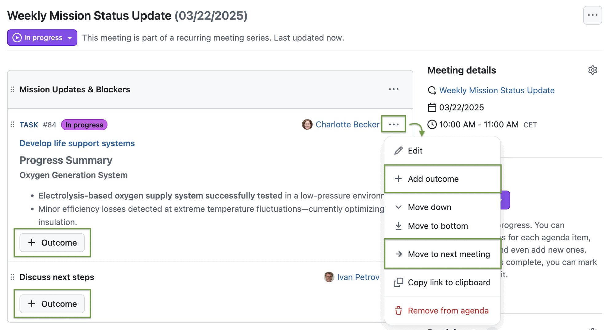
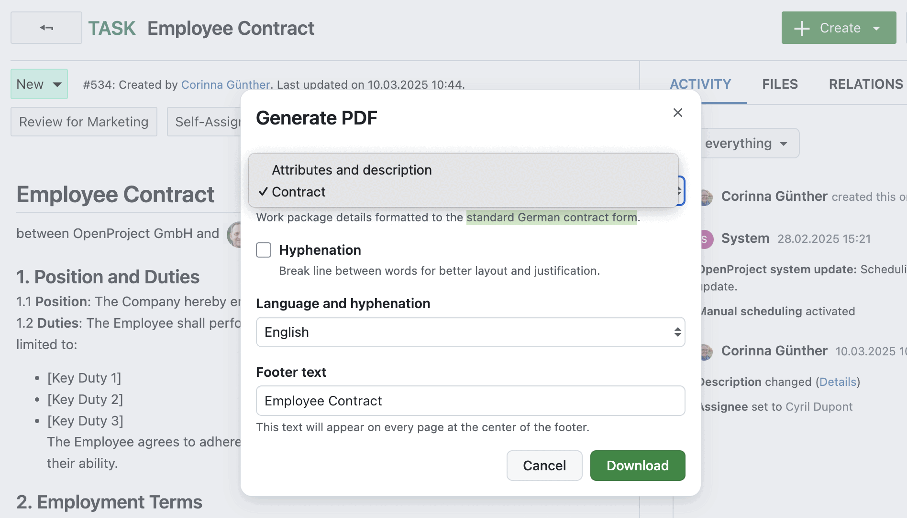
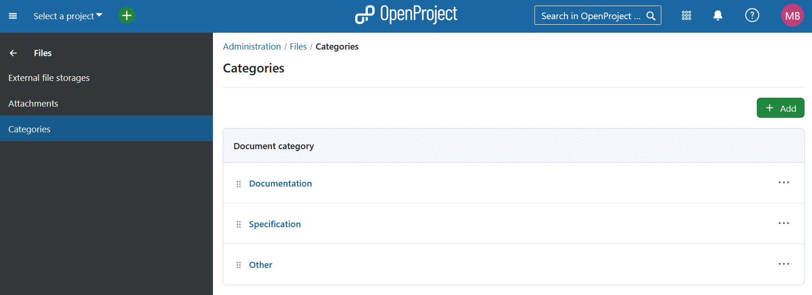
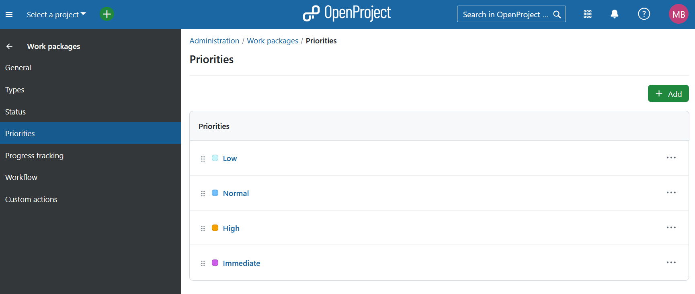
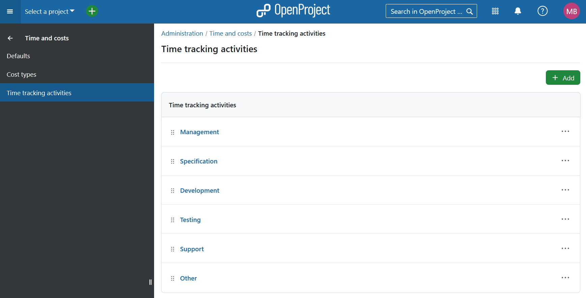

# OpenProject 15.4.0

Release date: 2025-03-19

We released [OpenProject 15.4.0](https://community.openproject.org/versions/2165). The release contains several bug fixes, and we recommend updating to the newest version. In these Release Notes, we will give an overview of important feature changes. At the end, you will find a complete list of all changes and bug fixes.

## Important feature changes

Take a look at our release video showing the most important features introduced in OpenProject 15.4.0:  

### Enable automatic scheduling mode - to start as soon as possible

Starting with OpenProject 15.4, users will be able to choose whether they want to manually schedule their work packages or enable automatic scheduling. This highly requested feature of automatic scheduling, based on predecessor and child relations, simplifies managing complex project setups.

> [!NOTE]
> The new feature will not overwrite existing dates for any existing work packages. However, it can change the scheduling mode. By default, manual scheduling is enabled. Existing work packages with children will be in automatic mode – with dates derived from their children.

**Manual mode** is the default scheduling mode for new work packages. Users can freely select dates and can set timelines based on specific needs, deadlines or external factors. Manually scheduled work packages behave as they did before 15.4.

In the **new automatic mode**, manually setting a start date is not possible. Instead, when a task is scheduled, the date picker automatically determines the start date based on the closest predecessor and optionally the specified lag to determine the minimum number of days between two work packages. Please also note that administrators can specify which days are considered working days, and only these are taken into account when scheduling based on a lag.

In other words: In automatic mode, **the work package starts as soon as possible**, considering related work packages.

However, you can still define a duration, which adjusts the finish date accordingly. This ensures a reliable sequence of automatically scheduled work packages that adapt dynamically to planning changes.

See the difference between manual scheduling and automatic scheduling in Gantt view:

> [!NOTE]
> With the updates of the scheduling mode in this release, an automatic entry will be added to the **Activity** of the work package: "*Scheduling mode set to: [..]*". If you are using the *updated at* information of work packages, for example, by including this information in work package lists, be aware that the most recent activity in the work packages will be updated accordingly.

To learn more about how this change might help you manage your projects, please read [this blog article on the new automatic scheduling mode](https://www.openproject.org/blog/new-automatic-scheduling-mode/) that we published some weeks ago. [See our documentation](../../user-guide/work-packages/set-change-dates/) to get detailed information about how to use the automatic scheduling mode.

#### Single date mode

The date picker now supports single date mode, making it easier to set deadlines without needing a start date. Previously, all work packages (except milestones) had both a start and finish date field, even when only one was needed. Now, by default, new work packages have only a finish date, simplifying workflows for teams that don't need a date range.

If you need both dates, simply click **+ Start date** or set a duration to switch back to range mode. Of course, if you want single date mode with just a Start date instead of a Finish date, this is possible too.

### Set agenda item outcomes for meetings

In February 2025, we already published a milestone for our Meetings module: [Recurring meetings](../../release-notes/15-3-0/#schedule-recurring-meetings-to-streamline-your-weekly-biweekly-or-custom-appointments). With OpenProject 15.4, we released another great new feature that will help users better manage their meeting outcomes. They can now note relevant decisions, questions and follow-up actions for each agenda item. This way, all participants as well as users that could not attend the meeting will have a documentation of the relevant meeting outcome(s), displayed on each agenda item. 

If you add an outcome to a work package in a meeting, this will also be displayed on the work package, if you navigate to the Meetings tab.

Additionally, you can now **move an agenda item to the next meeting**, if it is part of a meeting series.

> [!NOTE]
> In our classic Meetings module (which we plan to remove with OpenProject 16.0), users can write "minutes", which are notes taken during the meeting. This was a feature much requested also for our recurring and one-time meetings. Now, in recurring or one-time meetings, users can still add notes to an agenda item and edit them during the meeting, but now they can also use the outcome feature to make it more clear.

The updated Meetings module now allows you to set a meeting status: 

Once the status is "in progress", you can add outcomes to every agenda item. If it is a recurring meeting, you can also move the agenda item to the next meeting:

> [!NOTE]
> In the following months, we will continue working on the Meetings module. For example, when a recurring meeting is closed, it shall be possible to move all agenda items without outcomes to the next meeting ([see this feature](https://community.openproject.org/wp/61911)). Also, a meeting agenda items backlog for recurring meetings is planned ([see this feature](https://community.openproject.org/wp/54751)).

### Generate PDF documents from a work package description

With OpenProject 15.4, you can now generate nicely styled PDF files from a work package description. This is particularly helpful if you want to create contracts or other formal documents.

If you click the "More" menu in a work package, you previously had the "Download PDF" option which created a document that shows all important work package information, including attributes like assignee and the work package description. Now, this option is renamed to **Generate PDF** and includes many more possibilities. Clicking "Generate PDF" opens an interface where you can customize your PDF, e.g. by choosing if you want hyphenation and by entering a footer text. 

Most important, you can now choose between two templates: One is **Attributes and description**, which creates a document like you were used to before 15.4. The other is **Contract**, which generates a PDF in the style of a German contract and includes only the work package description:

Read this blog article to learn more about how this feature for automatically creating PDFs from the work package description can be a great help for organizations: [Beyond MS Word: Automatically generate beautifully styled pdf files for contracts, approval notices and project orders](https://www.openproject.org/blog/beyond-documents-generate-pdf-files/).

[See our documentation](../../user-guide/work-packages/exporting/#export-single-work-package-in-pdf-format) for information on how to use this feature.

### Better manage a large number of projects with an enhanced project lists view

Improving project portfolio management is one of our focus goals for 2025. With OpenProject 15.4, users who manage many projects and project attributes will benefit from feature updates regarding autocompleters in project lists:

- [Autocompleters for filter values on the project list](https://community.openproject.org/wp/60521)
- [Version autocompleter for filter values on the project list](https://community.openproject.org/wp/61398)

### Use @mention of user when quote replying to a comment

This feature seems small, but can have a big impact: When a user quotes another user in the work package activity tab, the quoted user now automatically gets @mentioned and therefore notified. This way, users won't miss information again that is clearly relevant for them.

### Restructured administration and enumerations page removed

With OpenProject 15.4, we restructured some parts in the administration, so that admins can find the settings for work package priorities and document categories in the existing settings for the modules – all in one place. Therefore, the enumerations page in the administration has been removed. Instead, you can now find...

- document categories under *Administration → Files → Categories*. [Read more in our system admin guide](../../system-admin-guide/files/categories/).

- work package priorities under *Administration → Work packages → Priorities*. [Read more in our system admin guide](../../system-admin-guide/manage-work-packages/work-package-priorities/).

- time tracking activities under *Administration* -> *Time and costs*. [Read more in our user guide](../../user-guide/projects/project-settings/activities-time-tracking/).

## Important updates and breaking changes

### Docker: Removed support for ppc64le

We have been offering docker builds for the following architectures:

- amd64
- arm64
- ppc64le

We have put in considerable effort trying to keep ppc64le running, but it keeps causing disproportionate maintenance effort. So without a native runner, it is unfortunately not practical to keep supporting this. Please reach out to us if you'd like to provide support to maintain a ppc64 architecture.

For more information, see [this code maintenance work package on our Community instance](https://community.openproject.org/wp/61975).

<!--more-->

## Bug fixes and changes

<!-- Warning: Anything within the below lines will be automatically removed by the release script -->
<!-- BEGIN AUTOMATED SECTION -->

- Feature: Use @-mention of user when quote replying to a comment \[[#37093](https://community.openproject.org/wp/37093)\]
- Feature: New scheduling mode: automatic (start as soon as possible) \[[#42388](https://community.openproject.org/wp/42388)\]
- Feature: Single-date mode for work package date pickers \[[#47519](https://community.openproject.org/wp/47519)\]
- Feature: Allow encoding of current enterprise plan in the Enterprise Token \[[#50900](https://community.openproject.org/wp/50900)\]
- Feature: Add and document Keycloak to the Docker based development setup \[[#53590](https://community.openproject.org/wp/53590)\]
- Feature: Agenda item outcomes - let meeting participants note relevant decisions, questions and follow-up actions during a meeting \[[#57799](https://community.openproject.org/wp/57799)\]
- Feature: Add automatic scheduling mode \[[#59539](https://community.openproject.org/wp/59539)\]
- Feature: Highlight closest predecessor in the relations tab \[[#59540](https://community.openproject.org/wp/59540)\]
- Feature: Update and Primerise Datepicker in the scope of automatic scheduling \[[#59845](https://community.openproject.org/wp/59845)\]
- Feature: Autocompleters for filter values on the project list \[[#60521](https://community.openproject.org/wp/60521)\]
- Feature: Consolidate &quot;Download PDF&quot; feature with the &quot;Generate PDF&quot; feature in one export modal \[[#60562](https://community.openproject.org/wp/60562)\]
- Feature: Primerize time tracking settings in administration \[[#61290](https://community.openproject.org/wp/61290)\]
- Feature: Store token expiration information for OIDC user tokens \[[#61344](https://community.openproject.org/wp/61344)\]
- Feature: Version autocompleter for filter values on the project list \[[#61398](https://community.openproject.org/wp/61398)\]
- Feature: OIDC provider creation: Prefill scopes instead of showing a placeholder \[[#61470](https://community.openproject.org/wp/61470)\]
- Feature: Move &#39;Meetings&#39; higher up in the left-hand sidebar  \[[#61475](https://community.openproject.org/wp/61475)\]
- Feature: Reword recurring meeting labels and frequency options \[[#61476](https://community.openproject.org/wp/61476)\]
- Feature: Add &quot;Move to next meeting&quot; option for agenda items in a recurring meeting \[[#61536](https://community.openproject.org/wp/61536)\]
- Feature: Allow more characters for Time Entry Comment \[[#61607](https://community.openproject.org/wp/61607)\]
- Feature: Show proper error message when refresh token is unusable \[[#61612](https://community.openproject.org/wp/61612)\]
- Feature: Restructure the administration and remove the enumerations page \[[#61733](https://community.openproject.org/wp/61733)\]
- Feature: Create component Status button based on Action menu \[[#61745](https://community.openproject.org/wp/61745)\]
- Feature: Redirect users to the home page, link to My Page to the global menu \[[#61881](https://community.openproject.org/wp/61881)\]
- Feature: Reduce flickering when switching between meeting states \[[#61895](https://community.openproject.org/wp/61895)\]
- Feature: Focus on the banner while opening the date picker \[[#61906](https://community.openproject.org/wp/61906)\]
- Feature: For recurring meetings, indicate original time zone in the meeting series details \[[#61946](https://community.openproject.org/wp/61946)\]
- Feature: Visual changes for outcomes \[[#61956](https://community.openproject.org/wp/61956)\]
- Feature: Add icon to indicate automatic scheduling mode \[[#61971](https://community.openproject.org/wp/61971)\]
- Bugfix: Missing space for no-results box on mobile \[[#43665](https://community.openproject.org/wp/43665)\]
- Bugfix: Always Show CKeditor Tool Bar On Screen When Scrolling \[[#53451](https://community.openproject.org/wp/53451)\]
- Bugfix: Calendar headers don&#39;t respect date format (always show it in North American MM/DD format) \[[#54378](https://community.openproject.org/wp/54378)\]
- Bugfix: Search results for projects does not render the description correctly \[[#56694](https://community.openproject.org/wp/56694)\]
- Bugfix: After Updating and saving a value in a Project attribute with type user It isn&#39;t shown in the information project page \[[#57504](https://community.openproject.org/wp/57504)\]
- Bugfix: If user removes all columns for their PDF export then default columns are used \[[#57618](https://community.openproject.org/wp/57618)\]
- Bugfix: Project members: Unexpected opening of links in new tab (target=&quot;\_blank&quot;) \[[#58135](https://community.openproject.org/wp/58135)\]
- Bugfix: Download button for backup does not work \[[#60720](https://community.openproject.org/wp/60720)\]
- Bugfix: Missing breadcrumb in Times &amp; Cost Administration \[[#60746](https://community.openproject.org/wp/60746)\]
- Bugfix: Time Entry creation via the API is not correctly handling user timezones \[[#61081](https://community.openproject.org/wp/61081)\]
- Bugfix: Date picker is partially off screen \[[#61091](https://community.openproject.org/wp/61091)\]
- Bugfix: Pattern input style issues \[[#61165](https://community.openproject.org/wp/61165)\]
- Bugfix: Adding custom field of the work package itself to subject pattern not possible (only for parents) \[[#61315](https://community.openproject.org/wp/61315)\]
- Bugfix: Subject field stays editable in create work package form after switching to a type that has automatically generated subjects \[[#61316](https://community.openproject.org/wp/61316)\]
- Bugfix: Activity tab scrolling top (leaving a lot of white space underneath) when adding new comments \[[#61399](https://community.openproject.org/wp/61399)\]
- Bugfix: Saving a new WP triggers browser warning message \[[#61428](https://community.openproject.org/wp/61428)\]
- Bugfix: Users in lists miss popover \[[#61465](https://community.openproject.org/wp/61465)\]
- Bugfix: Popover missing in multi-select custom fields of type user \[[#61466](https://community.openproject.org/wp/61466)\]
- Bugfix: Mail handler keyword translations are confusing, not stable \[[#61482](https://community.openproject.org/wp/61482)\]
- Bugfix: WP creation form: Click on file link renders API error \[[#61554](https://community.openproject.org/wp/61554)\]
- Bugfix: Can&#39;t click outside of an added attribute on Google Chrome \[[#61573](https://community.openproject.org/wp/61573)\]
- Bugfix: BCF API endpoint /api/bcf/2.1/auth should be public \[[#61584](https://community.openproject.org/wp/61584)\]
- Bugfix: Should not display &quot;Delete relation&quot; for child if lacking &quot;Manage work package hierarchies&quot; permission \[[#61597](https://community.openproject.org/wp/61597)\]
- Bugfix: Unclear error when cf that was added as an attribute does not belong to wp configuration form \[[#61604](https://community.openproject.org/wp/61604)\]
- Bugfix: Unclear error message upon save on empty Subject patterns \[[#61619](https://community.openproject.org/wp/61619)\]
- Bugfix: Wrong tab opens upon error message on Subject configuration tab \[[#61625](https://community.openproject.org/wp/61625)\]
- Bugfix: Redis cache fills up over time \[[#61633](https://community.openproject.org/wp/61633)\]
- Bugfix: The cost log edit form shows incorrect cost value after update \[[#61689](https://community.openproject.org/wp/61689)\]
- Bugfix: OIDC data sent to AppSignal \[[#61691](https://community.openproject.org/wp/61691)\]
- Bugfix: Rescheduled series creates invalid open meetings \[[#61729](https://community.openproject.org/wp/61729)\]
- Bugfix: Edit relation modal doesn&#39;t show the WP subject \[[#61737](https://community.openproject.org/wp/61737)\]
- Bugfix: Regression: Rich text headlines show link icon on hover before the headline, while rendering after would be correct \[[#61780](https://community.openproject.org/wp/61780)\]
- Bugfix: Meeting filter gets reset when clicking on &#39;Show more&#39; \[[#61873](https://community.openproject.org/wp/61873)\]
- Bugfix: Applying filter to &#39;Past&#39; meetings redirects you to &#39;Upcoming&#39; meetings \[[#61875](https://community.openproject.org/wp/61875)\]
- Bugfix: Filter for Meetings with no invited user does not work \[[#61878](https://community.openproject.org/wp/61878)\]
- Bugfix: Error when creating new outcome if the user has only the manage minutes permission \[[#61958](https://community.openproject.org/wp/61958)\]
- Bugfix: Cannot import BCF issues \[[#61974](https://community.openproject.org/wp/61974)\]
- Bugfix: New icons look weird in card view \[[#61983](https://community.openproject.org/wp/61983)\]
- Bugfix: Icons are barely visible in dark mode \[[#61989](https://community.openproject.org/wp/61989)\]
- Bugfix: Dialogs close when moving mouse outside of it \[[#62041](https://community.openproject.org/wp/62041)\]
- Bugfix: Loading of filepicker from project storages UI broken \[[#62047](https://community.openproject.org/wp/62047)\]
- Bugfix: Not possible to re-allocate / move booked time to work packages in other projects \[[#62066](https://community.openproject.org/wp/62066)\]
- Bugfix: &quot;New child&quot; modal closes unexpectedly on mouse release outside. Confirmation also missing. \[[#62076](https://community.openproject.org/wp/62076)\]
- Bugfix: Trying to create OIDC user tokens, even for non-OIDC providers \[[#62086](https://community.openproject.org/wp/62086)\]
- Bugfix: Activity journals around scheduling mode changes aren't adapted to the new scheduling mode \[[#62091](https://community.openproject.org/wp/62091)\]
- Bugfix: work packages links in relation tab should open in same browser tab \[[#62109](https://community.openproject.org/wp/62109)\]
- Bugfix: The Version custom field options are not grouped on the project general settings page \[[#62160](https://community.openproject.org/wp/62160)\]
- Feature: Generate PDF document from a work package description  \[[#45896](https://community.openproject.org/wp/45896)\]

<!-- END AUTOMATED SECTION -->
<!-- Warning: Anything above this line will be automatically removed by the release script -->

## Contributions

A very special thank you goes to City of Cologne, Deutsche Bahn and ZenDiS for sponsoring released or upcoming features. Your support, alongside the efforts of our amazing Community, helps drive these innovations. We also thank the City of Chemnitz for providing us with a lot of helpful input regarding the automatic scheduling mode.

Also, a big thanks to our Community members for reporting bugs and helping us identify and provide fixes. Special thanks for reporting and finding bugs go to René Schodder, Abhiyan Paudyal, Gunter Ohrner and Markus K..

Last but not least, we are very grateful for our very engaged translation contributors on Crowdin, who translated quite a few OpenProject strings! This release we would like to particularly thank user [greench](https://crowdin.com/profile/greench), for an outstanding number of translations into Turkish.

Would you like to help out with translations yourself? Then take a look at our [translation guide](../../contributions-guide/translate-openproject/) and find out exactly how you can contribute. It is very much appreciated!
