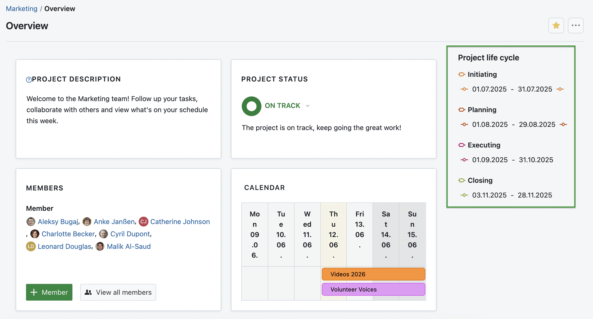
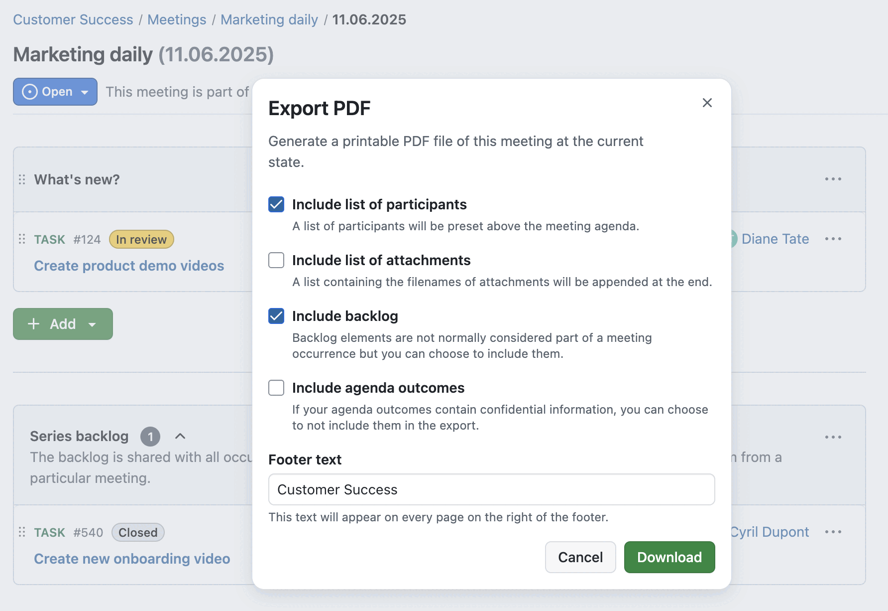
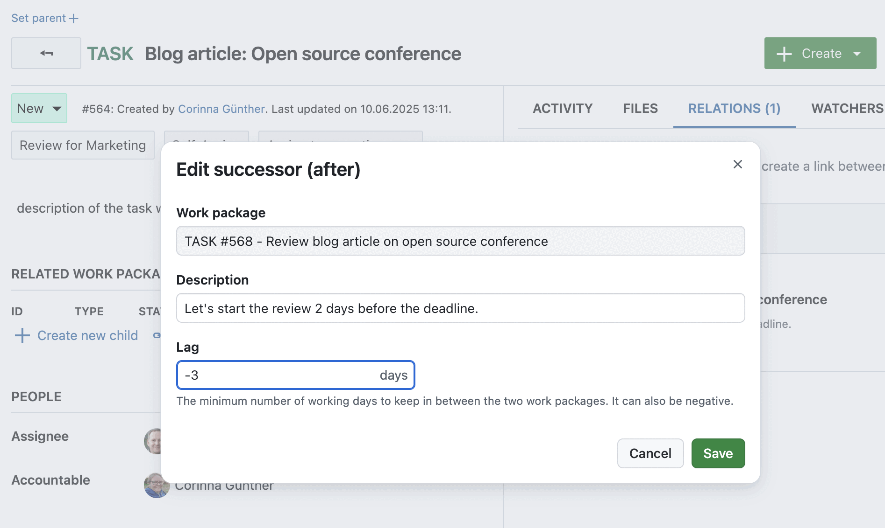
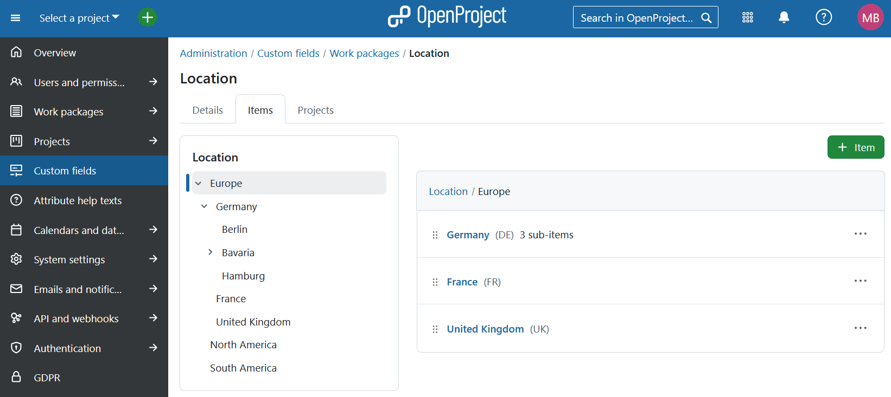

# OpenProject 16.1.0

Release date: 2025-06-18

We released [OpenProject 16.1.0](https://community.openproject.org/versions/2194). The release contains several bug fixes and we recommend updating to the newest version. In these Release Notes, we will give an overview of important feature changes and important technical changes. At the end, you will find a complete list of all changes and bug fixes. 

## Important feature changes

Take a look at our release video showing the most important features introduced in OpenProject 16.1.0:
  

### Structure the project life cycle with phases and phase gates

OpenProject 16.1 introduces a powerful new way to reflect your project’s structure over time: using project phases like **Initiating, Planning, Executing, and Closing**, with optional phase gates at the start or end of each phase.

Project administrators can now **activate relevant phases and phase gates per project**. Portfolio managers can then assign start and finish dates to each phase, with automatic scheduling of all following phases and phase gates based on working days. This helps reduce manual effort and keeps your project timelines consistent.

Work packages can be assigned to a specific phase, making it easier to understand their context, filter by phase, and group work in the table view. And in the project list, you can use columns and new filters to track which projects are currently in which phase or gate – ideal for portfolio level planning and reporting.

You’ll find the full life cycle directly in the project overview page, where you can enter dates, view the current phase, and access the new scheduling tools at a glance:

> [!NOTE]
> With the Enterprise add-on available in the Premium plan or higher, you can configure existing project phases and phase gates and even create new ones. This is done in the global settings. The project-level features are available in all editions, with pre-defined phases based on the [open source PM² framework](https://www.openproject.org/pm2/).

[Read more about working with a project life cycle in OpenProject](../../system-admin-guide/projects/project-life-cycle/).

### Export meetings in PDF format

One of the most upvoted Community requests is now available: You can now **export meetings as PDF documents** in OpenProject.

Meeting organizers and participants can generate a printable PDF that includes the agenda, outcomes, participants, and more. This makes it ideal for sharing with colleagues, archiving meeting records, or informing stakeholders who could not attend.

The export is available via the More (⋯) menu for both one-time meetings and individual occurrences of recurring meetings. You can **customize the PDF** before download by choosing whether to include:

- the list of participants,
- the list of attachments,
- the backlog,
- the agenda outcomes,
- a customized footer text (e.g. project name), which appears on each page.

The PDF is generated in A4 format and includes a clearly structured layout. 

[Learn more about exporting meetings in PDF format in our documentation](../../user-guide/meetings/one-time-meetings/#export-a-meeting).

### Set smart default options for reminders

We released work package reminders with OpenProject 15.2 in January 2025. With this update, it’s easier than ever to use them to stay organized and keep your notification center clean.

To make setting reminders even quicker, OpenProject now offers pre-filled options when clicking the reminder icon on a work package. Instead of entering details manually, you can now choose one of the following defaults:

- Tomorrow
- In 3 days
- In a week
- In a month
- At a particular date/time

Selecting one of the quick options will open the reminder dialog with a pre-filled date and time – typically at 9:00 local time on the selected future day. You can still adjust the date, time, and add a note before saving the reminder.

[Learn more about work package reminders in our documentation](../../user-guide/work-packages/edit-work-package/#work-package-reminders).

### Use negative lag for work package dates

You can now define **negative lag** when setting up relations between work packages. This allows you to specify that a work package should start a few days before its **predecessor** finishes.

When adding or editing a successor or predecessor relation, the Lag field now accepts negative values. The updated help text reads: “The minimum number of working days in between the two work packages. It can also be negative.”

This makes it easier to represent overlapping tasks and more flexible schedules in your project plan. For example, you may want the review of a document to begin two days before the final draft is complete. You will then have to enter a lag of -3 days for the (review) Successor work package.

Please note that negative lags can be counterintuitive:

- A lag of 0 schedules the successor one day after the predecessor’s finish date.
- A lag of -1 schedules it on the same day.
- A lag of -2 schedules it one day before, and so on.

> [!NOTE]
> **Only working days** are taken into account. For example: If work package A finishes on a Tuesday and Saturday/Sunday are non-working days, then a lag of -3 will schedule its successor (work package B) to start on the previous Friday.

[Learn more about work package relations in our documentation](../../user-guide/work-packages/work-package-relations-hierarchies/#work-package-relations).

### Display hierarchy trees for hierarchy custom fields (Enterprise add-on)

Hierarchy custom fields are now easier to explore and use. When viewing such a custom field, a **hierarchical tree is displayed next to the details section**, showing the entire structure at a glance.

This tree helps you understand the position of the current item in the overall hierarchy and makes it easier to add or navigate related items. The currently selected item is highlighted, and all its parent nodes are automatically expanded, while unrelated branches remain collapsed by default.

Clicking on any entry in the tree opens that item in the same view, making it easy to move through even complex hierarchies without losing context.

[Learn more about custom fields in our system admin guide](../../system-admin-guide/custom-fields/).

### Benefit from improved accessibility for the date picker with ARIA live regions

OpenProject 16.1 includes an important accessibility enhancement for users working with screen readers: Dynamic updates are now announced automatically using ARIA live regions.

This applies to **changes in the date picker** such as scheduling mode, working days only selector, start and finish dates, and duration. When one of these values is updated, the screen reader will announce a full summary like: “Date picker updated. Scheduling mode: Manual, Working days only, Start date: June 10, Finish date: June 12, Duration: 3 days”.

This ensures that no important context is lost and improves the experience for all users relying on assistive technologies.

To learn what more is planned regarding accessibility in OpenProject, see [these open work packages on our Community instance](https://community.openproject.org/projects/openproject/work_packages?query_id=2906).

## Important technical changes

### Added API for emoji reactions, reminders, and internal comments

OpenProject 16.1 extends its API to support three features that were previously only available via the web interface. This update enables integrations with other clients to access:

- Emoji reactions on work package comments
- Reminders for work packages
- Internal comments with restricted visibility

Developers can now read and manage emoji reactions, create and update reminders, and write internal comments via API V3.

<!--more-->

## Bug fixes and changes

<!-- Warning: Anything within the below lines will be automatically removed by the release script -->
<!-- BEGIN AUTOMATED SECTION -->

- Feature: Extend API V3 to cover Emoji reactions on work package comments (read, toggle) and extend documentation \[[#57265](https://community.openproject.org/wp/57265)\]
- Feature: Allow users to enter negative lag \[[#58011](https://community.openproject.org/wp/58011)\]
- Feature: Fixed set of project phases and gates editable on project overview page \[[#58159](https://community.openproject.org/wp/58159)\]
- Feature: Project phase columns on project list \[[#58160](https://community.openproject.org/wp/58160)\]
- Feature: Global phase administration \[[#58161](https://community.openproject.org/wp/58161)\]
- Feature: Phases as work package attribute \[[#58162](https://community.openproject.org/wp/58162)\]
- Feature: Project specific phase administration \[[#58163](https://community.openproject.org/wp/58163)\]
- Feature: Journalize changes to phases and gates \[[#59178](https://community.openproject.org/wp/59178)\]
- Feature: Option to copy phase on copying a project \[[#59179](https://community.openproject.org/wp/59179)\]
- Feature: Automatic scheduling for phases and phase gates \[[#59180](https://community.openproject.org/wp/59180)\]
- Feature: Filters for phases and phase gates in project list \[[#59183](https://community.openproject.org/wp/59183)\]
- Feature: Order by phases and phase gates on project list \[[#59184](https://community.openproject.org/wp/59184)\]
- Feature: Extend Reminders API V3 to include create, update &amp; delete operations \[[#59473](https://community.openproject.org/wp/59473)\]
- Feature: Optimize life cycle modal UX \[[#60330](https://community.openproject.org/wp/60330)\]
- Feature: Document and implement proper mobile behaviour for Sub Header component (OP Primer) \[[#60332](https://community.openproject.org/wp/60332)\]
- Feature: Reminders: Offer quick-set options like &#39;tomorrow&#39; or &#39;next week&#39; with smart defaults \[[#60357](https://community.openproject.org/wp/60357)\]
- Feature: PDF export of meetings \[[#60730](https://community.openproject.org/wp/60730)\]
- Feature: Date picker to edit phases and phase gates of a project life cycle \[[#61610](https://community.openproject.org/wp/61610)\]
- Feature: Turn gates into property of phase (rename life cycle elements to &quot;Phase&quot; and &quot;Phase gates&quot;) \[[#61952](https://community.openproject.org/wp/61952)\]
- Feature: Add hovercard to gates \[[#62608](https://community.openproject.org/wp/62608)\]
- Feature: TreeView Primer View Component \[[#62667](https://community.openproject.org/wp/62667)\]
- Feature: Implementing ARIA live regions to communicate contextual changes \[[#62708](https://community.openproject.org/wp/62708)\]
- Feature: Show a TreeView on the page of hierarchy customFields \[[#62993](https://community.openproject.org/wp/62993)\]
- Feature: Show attribute help texts in Primerized Project Settings &gt; Information form \[[#63737](https://community.openproject.org/wp/63737)\]
- Feature: Primerize attribute help texts \[[#63738](https://community.openproject.org/wp/63738)\]
- Feature: Re-order and re-structure the &#39;More&#39; action menu for sections and agenda items \[[#64074](https://community.openproject.org/wp/64074)\]
- Feature: Configure scopes to be used during Token Exchange \[[#64121](https://community.openproject.org/wp/64121)\]
- Feature: \[TreeView\] Allow nodes to be anchors or buttons \[[#64132](https://community.openproject.org/wp/64132)\]
- Feature: Add work package internal comments (write) API \[[#64166](https://community.openproject.org/wp/64166)\]
- Feature: \[TreeView\] Bubble the expanded state from children to parents \[[#64215](https://community.openproject.org/wp/64215)\]
- Feature: Meeting PDF export: show if users are invited or attended \[[#64565](https://community.openproject.org/wp/64565)\]
- Feature: Differentiate between meeting agenda and meeting minutes in pdf export \[[#64793](https://community.openproject.org/wp/64793)\]
- Feature: Meeting PDF export: Refinement \[[#64828](https://community.openproject.org/wp/64828)\]
- Bugfix: Project search is under the Search icon in New Recurring Meeting modal \[[#59945](https://community.openproject.org/wp/59945)\]
- Bugfix: User can&#39;t save lifecycle modal if project is invalid \[[#60666](https://community.openproject.org/wp/60666)\]
- Bugfix: Activity Tab renders the same turbo frame multiple times inside of itself \[[#61544](https://community.openproject.org/wp/61544)\]
- Bugfix: The &#39;overdue&#39; date color does not adapt well to dark mode (fixed hex/odd color variable) \[[#62199](https://community.openproject.org/wp/62199)\]
- Bugfix: Seeder fails during upgrade with ArgumentError: Nothing registered with reference :default\_role\_project\_admin (ArgumentError) \[[#62582](https://community.openproject.org/wp/62582)\]
- Bugfix: (Regression) Error on Save (in various places) \[[#62627](https://community.openproject.org/wp/62627)\]
- Bugfix: Reminders: saving without entering a date or time throws an error but also unnecessarily clears the other field \[[#63461](https://community.openproject.org/wp/63461)\]
- Bugfix: ArgumentError in seeder \[[#63826](https://community.openproject.org/wp/63826)\]
- Bugfix: ActiveRecord::RecordNotUnique in POST::API::V3::TimeEntries::TimeEntriesAPI#/time\_entries \[[#63839](https://community.openproject.org/wp/63839)\]
- Bugfix: Projects tab displayed for custom fields of type user, group, spent time and version \[[#63900](https://community.openproject.org/wp/63900)\]
- Bugfix: Back arrow cannot be reached via keyboard \[[#64222](https://community.openproject.org/wp/64222)\]
- Bugfix: Project overview page renders an h2 inside an h3 \[[#64226](https://community.openproject.org/wp/64226)\]
- Bugfix: \[Accessibility\] Editable toolbar header is not recognized as headline by screenreaders \[[#64227](https://community.openproject.org/wp/64227)\]
- Bugfix: Home screen widgets have the wrong headline tag \[[#64228](https://community.openproject.org/wp/64228)\]
- Bugfix: Focus issues with WP primary button \[[#64236](https://community.openproject.org/wp/64236)\]
- Bugfix: Access tokens of disabled OAuth applications are accepted by API \[[#64258](https://community.openproject.org/wp/64258)\]
- Bugfix: Disabling an incomplete phase leads to inconsistencies \[[#64292](https://community.openproject.org/wp/64292)\]
- Bugfix: Input fields suggest previously entered text \[[#64312](https://community.openproject.org/wp/64312)\]
- Bugfix: The time in the pdf export is different from the time in the file name \[[#64337](https://community.openproject.org/wp/64337)\]
- Bugfix: No updated path to 16.0.0 package source in manual  \[[#64362](https://community.openproject.org/wp/64362)\]
- Bugfix: Checkbox label not clickable in 2FA settings \[[#64367](https://community.openproject.org/wp/64367)\]
- Bugfix: Work packages &quot;default&quot; priority is lost when deleted. \[[#64369](https://community.openproject.org/wp/64369)\]
- Bugfix: Attribute help text page is missing a page title \[[#64417](https://community.openproject.org/wp/64417)\]
- Bugfix: The second phase&#39;s start date selection is not enabled \[[#64496](https://community.openproject.org/wp/64496)\]
- Bugfix: OpenProject 16.0.1: Error 500 when clicking on a revision link in a repository \[[#64508](https://community.openproject.org/wp/64508)\]
- Bugfix: NoMethodError during Meetings::ExportJob \[[#64510](https://community.openproject.org/wp/64510)\]
- Bugfix: The following phase&#39;s finish date is inconsistent with the start date \[[#64532](https://community.openproject.org/wp/64532)\]
- Bugfix: My time tracking has two dividers in the PageHeader \[[#64573](https://community.openproject.org/wp/64573)\]
- Bugfix: Cannot switch back from Manual to Automatic scheduling on milestone successor \[[#64603](https://community.openproject.org/wp/64603)\]
- Bugfix: Clearing the start date of a following phase is not possible \[[#64628](https://community.openproject.org/wp/64628)\]
- Bugfix: Seeding error when seeding a second time with a different language \[[#64711](https://community.openproject.org/wp/64711)\]
- Bugfix: Nothing registered with reference :default\_color\_green\_light \[[#64811](https://community.openproject.org/wp/64811)\]
- Bugfix: Attachments delete confirmation dialog opens behind attribute help text dialog \[[#64831](https://community.openproject.org/wp/64831)\]
- Bugfix: Incorrect rescheduling after non working days are changed \[[#64836](https://community.openproject.org/wp/64836)\]
- Bugfix: Error banners persist on page reload on Project Settings &gt; Information form \[[#64839](https://community.openproject.org/wp/64839)\]
- Bugfix: Attribute help text links for widgets on Projects Overview page lack padding \[[#64846](https://community.openproject.org/wp/64846)\]
- Bugfix: Update working days settings warning messages to include phases \[[#64855](https://community.openproject.org/wp/64855)\]
- Feature: Add API for recent Communicator features (Emoji, Reminders, Internal Comments) \[[#62507](https://community.openproject.org/wp/62507)\]

<!-- END AUTOMATED SECTION -->
<!-- Warning: Anything above this line will be automatically removed by the release script -->

## Contributions

A very special thank you goes to City of Cologne, Deutsche Bahn and ZenDiS for sponsoring released or upcoming features. Your support, alongside the efforts of our amazing Community, helps drive these innovations. Also a big thanks to our Community members for reporting bugs and helping us identify and provide fixes. Special thanks for reporting and finding bugs go to Cameron Dutro and Maxim Béliveau.

Last but not least, we are very grateful for our very engaged translation contributors on Crowdin, who translated quite a few OpenProject strings! This release we would like to particularly thank the following users:

- [BigSeung](https://crowdin.com/profile/bigseung), for a great number of translations into Korean.
- [rmiyata](https://crowdin.com/profile/rmiyata), for a great number of translations into Japanese.
- [William](https://crowdin.com/profile/williamfromtw), for a great number of translations into Chinese Traditional.

Would you like to help out with translations yourself? Then take a look at our [translation guide](../../contributions-guide/translate-openproject/) and find out exactly how you can contribute. It is very much appreciated!
