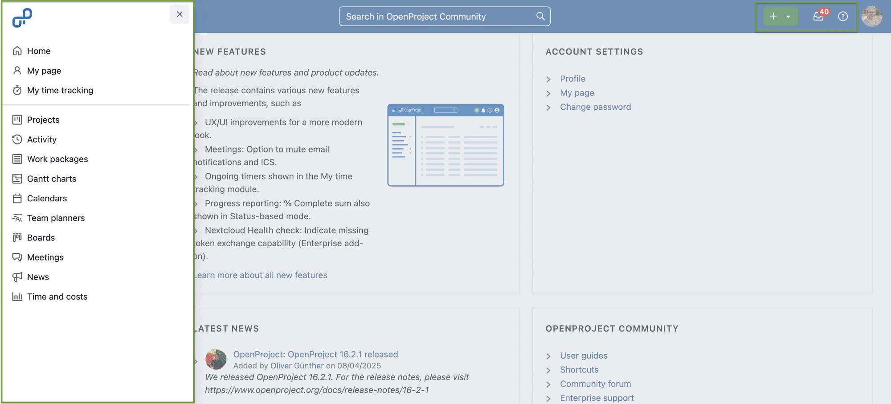
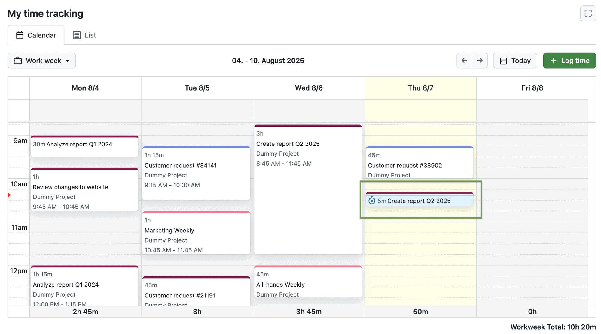

# OpenProject 16.3.0

Release date: 2025-08-13

We released OpenProject [OpenProject 16.3.0](https://community.openproject.org/versions/2204). The release contains several bug fixes and we recommend updating to the newest version. In these Release Notes, we will give an overview of important feature changes and important technical changes. At the end, you will find a complete list of all changes and bug fixes. 

## Important feature changes

Take a look at our release video showing the most important features introduced in OpenProject 16.3.0:

### UX/UI improvements for a more modern look

There have been several design and user experience updates with OpenProject 16.3:
- The **header has been redesigned with Primer**, including a new icon for notifications.
- The grid (waffle) icon in the header menu is now an overlapping lateral menu, including **Home**, **My Page** and **My time tracking**.

- The Sign-in modal and the running time-tracking section have been **moved to the new right sidesheet**.

### Meetings: Option to mute email notifications and ICS

With OpenProject 16.3, you can now **disable email calendar updates when creating or copying meetings**. This helps avoid sending invitations too early or accidentally sharing drafts. 

The setting is available as a checkbox in the meeting template form and lets you decide whether participants should be notified by email. The current status is always visible in the meeting sidebar and can be changed for one-time and recurring meetings — giving you full control over how and when participants are informed of changes.

[Learn more about meeting management with OpenProject](../../user-guide/meetings/).

### Ongoing timers shown in the My time tracking module

Ongoing timers are now clearly displayed in the My time tracking module. Whether you’re working in list view or calendar view, a small **timer icon will appear on the work package that’s currently being tracked**. 

This makes it easier to spot if a timer is running and avoid duplicate or overlapping entries and is especially useful if you return to your time tracking later in the day. It’s a small but effective improvement that helps you stay organized and focused.

Not familiar with the My time tracking module yet? [Learn more about it in our blog](https://www.openproject.org/blog/time-tracking-module/).

### Progress reporting: % Complete sum also shown in Status-based mode

In OpenProject 15.5, we introduced the ability to display a sum for the % Complete column in work package tables. In 16.3, this feature has been improved to ensure **accurate sums across different progress calculation modes**. This applies especially when some work packages do not contain values for Work or Remaining work.

[Learn more about progress tracking and reporting with OpenProject](../../user-guide/time-and-costs/progress-tracking/).

### Nextcloud Health check: Indicate missing token exchange capability (Enterprise add-on)

Administrators using the Nextcloud integration in the Corporate plan can now benefit from a more specific health check. If **token exchange is configured but not supported by the linked identity provider** (e.g. due to older OIDC settings), the new check will now clearly identify this issue. This helps diagnose connection problems more reliably and avoids misleading error messages about token refresh failures.

[Learn more about monitoring your OpenProject installation](../../installation-and-operations/operation/monitoring/).

### Autocomplete for cost reporting user and work package fields

Creating **cost reports** is now easier and faster. OpenProject 16.3 introduces **autocomplete for key filter fields** like User, Project and Work package, helping you find the right person or task with just a few keystrokes.

[Learn more about cost reporting with OpenProject](../../user-guide/time-and-costs/reporting/).

<!--more-->

## Bug fixes and changes

<!-- Warning: Anything within the below lines will be automatically removed by the release script -->
<!-- BEGIN AUTOMATED SECTION -->

- Feature: Redesign the top bar app header using Primer \[[#56583](https://community.openproject.org/wp/56583)\]
- Feature: Autocomplete for cost reporting user and work package fields \[[#59049](https://community.openproject.org/wp/59049)\]
- Feature: Allow muting email notifications and ICS for meetings \[[#61773](https://community.openproject.org/wp/61773)\]
- Feature: Show more action in agenda items and outcomes also when meeting is closed \[[#62669](https://community.openproject.org/wp/62669)\]
- Feature: Add permissions, work package attributes and demo data to seeds \[[#63151](https://community.openproject.org/wp/63151)\]
- Feature: Calculate a % Complete sum for simple average mode \[[#63191](https://community.openproject.org/wp/63191)\]
- Feature: Health check: Indicate missing token exchange capability \[[#64466](https://community.openproject.org/wp/64466)\]
- Feature: Migrate waffle icon from a normal menu to a overlapping lateral menu \[[#65090](https://community.openproject.org/wp/65090)\]
- Feature: Add copy-able backchannel logout uri to OIDC edit page \[[#65112](https://community.openproject.org/wp/65112)\]
- Feature: Show ongoing timers in &quot;My time tracking&quot; page \[[#65504](https://community.openproject.org/wp/65504)\]
- Feature: Close mobile sidebar menu by outside click \[[#65547](https://community.openproject.org/wp/65547)\]
- Feature: Add Home, My page and My time tracking to the waffle menu \[[#65564](https://community.openproject.org/wp/65564)\]
- Feature: Add delete button to the context menu of time entries \[[#65610](https://community.openproject.org/wp/65610)\]
- Feature: Adapt openDesk waffle menu to look like in OpenProject. \[[#65936](https://community.openproject.org/wp/65936)\]
- Feature: Add the OpenProject logo in the mobile header \[[#66026](https://community.openproject.org/wp/66026)\]
- Feature: Move the sign in and running time-tracking sections to the new right sidesheet \[[#66318](https://community.openproject.org/wp/66318)\]
- Bugfix: Work package pdf export - table width formatting \[[#61037](https://community.openproject.org/wp/61037)\]
- Bugfix: Pattern input dropdown does not overlay background \[[#61937](https://community.openproject.org/wp/61937)\]
- Bugfix: Work package datepicker incorrectly renders turbo frame response \[[#62523](https://community.openproject.org/wp/62523)\]
- Bugfix: User can&#39;t move item to next meeting if they deactivated the &#39;are you sure&#39; warning \[[#62547](https://community.openproject.org/wp/62547)\]
- Bugfix: Version from the shared work package not available in Version filter on global wp page \[[#62610](https://community.openproject.org/wp/62610)\]
- Bugfix: Lose track of meeting item and switch to template editing after adding a backlog agenda item \[[#64106](https://community.openproject.org/wp/64106)\]
- Bugfix: Meetings can&#39;t be deleted on server with no/broken smtp settings \[[#64199](https://community.openproject.org/wp/64199)\]
- Bugfix: \[Accessibility\] Contrast issues in avatars, sidebar and graph widget \[[#64230](https://community.openproject.org/wp/64230)\]
- Bugfix: Meeting text fields cleared without warning when status is changed \[[#64260](https://community.openproject.org/wp/64260)\]
- Bugfix: Automatic subject pattern is not visible after enterprise token got invalid \[[#64290](https://community.openproject.org/wp/64290)\]
- Bugfix: TreeView is not updated when a new item is added \[[#64557](https://community.openproject.org/wp/64557)\]
- Bugfix: cannot load such file -- DummyConfig \[[#64804](https://community.openproject.org/wp/64804)\]
- Bugfix: Can&#39;t delete a meeting series \[[#65018](https://community.openproject.org/wp/65018)\]
- Bugfix: Copying project fails with internal error (lock version null) \[[#65021](https://community.openproject.org/wp/65021)\]
- Bugfix: ActiveRecord::Deadlocked from Journals::CreateService#create\_journal \[[#65109](https://community.openproject.org/wp/65109)\]
- Bugfix: Wrong focused field in date picker \[[#65236](https://community.openproject.org/wp/65236)\]
- Bugfix: Time entry without start and end time display lateral handles that are unactionable on calendar view \[[#65516](https://community.openproject.org/wp/65516)\]
- Bugfix: Log time cards of 30min generate an overlap with next time entry \[[#65520](https://community.openproject.org/wp/65520)\]
- Bugfix: NoMethodError in  TimeEntriesController \[[#65622](https://community.openproject.org/wp/65622)\]
- Bugfix: Use WorkPackage::InfoLine and top-align rows in my time tracking border box table \[[#65626](https://community.openproject.org/wp/65626)\]
- Bugfix: Notification center WP Overview tab: Link to project not working \[[#65652](https://community.openproject.org/wp/65652)\]
- Bugfix: User with view and edit meetings permissions cannot edit a meeting \[[#65762](https://community.openproject.org/wp/65762)\]
- Bugfix: Server error when cancelling OAuth flow \[[#65836](https://community.openproject.org/wp/65836)\]
- Bugfix: NoMethodError in GET::API::V3::Queries::QueriesAPI#/queries/:id/ \[[#65866](https://community.openproject.org/wp/65866)\]
- Bugfix: Meeting status captions are underlined \[[#65869](https://community.openproject.org/wp/65869)\]
- Bugfix: Multi-language input broken in Administration &gt; Email Notifications, User Settings \[[#65886](https://community.openproject.org/wp/65886)\]
- Bugfix: ActionMenu SubMenu does not support dividers \[[#65898](https://community.openproject.org/wp/65898)\]
- Bugfix: JavaScript error when adding a new story in Backlogs module \[[#65927](https://community.openproject.org/wp/65927)\]
- Bugfix: On My tracking page, clicking on Today doesn&#39;t always take you to the current day \[[#65966](https://community.openproject.org/wp/65966)\]
- Bugfix: Hierarchy left side box doesn&#39;t go down the whole page \[[#65971](https://community.openproject.org/wp/65971)\]
- Bugfix: Cursor jumps to the front in PatternInput \[[#66089](https://community.openproject.org/wp/66089)\]
- Bugfix: OpenID Connect: Claims and ACR values are not being used \[[#66217](https://community.openproject.org/wp/66217)\]
- Bugfix: NoMethodError on Storages::CopyProjectFoldersJob#perform \[[#66221](https://community.openproject.org/wp/66221)\]
- Bugfix:  ArgumentError in  GET::API::V3::Storages::StorageOpenAPI#/storages/:storage\_id/open/ \[[#66225](https://community.openproject.org/wp/66225)\]
- Bugfix: NoMethodError in Storages::Admin::HealthStatusController#create\_health\_status\_report \[[#66226](https://community.openproject.org/wp/66226)\]
- Bugfix: Storages::Adapters::Errors::UnknownProvider in Storages::Admin::StoragesController#new \[[#66227](https://community.openproject.org/wp/66227)\]
- Bugfix: NoMethodError in GET::API::V3::StorageFiles::StorageFilesAPI#/storages/:storage\_id/files/:file\_id/  \[[#66290](https://community.openproject.org/wp/66290)\]
- Bugfix: Send email invite immediately when enabling email notifications \[[#66293](https://community.openproject.org/wp/66293)\]
- Bugfix: Server error on JWT API requests, when JWKS\_URL is empty \[[#66305](https://community.openproject.org/wp/66305)\]
- Bugfix: Clicking on &quot;today&quot; breaks calendar layout \[[#66340](https://community.openproject.org/wp/66340)\]
- Bugfix: Poor performance on initial request to notifications center \[[#66403](https://community.openproject.org/wp/66403)\]
- Bugfix: Unsaved changes notification in notification center after commenting \[[#66416](https://community.openproject.org/wp/66416)\]
- Bugfix: Single select list custom field always showing default value if one is set \[[#66433](https://community.openproject.org/wp/66433)\]
- Bugfix: Unable to set storage scope with API request for file storage creation \[[#66442](https://community.openproject.org/wp/66442)\]
- Bugfix: Insufficient space between Close and Save buttons on Log time modal \[[#66482](https://community.openproject.org/wp/66482)\]

<!-- END AUTOMATED SECTION -->
<!-- Warning: Anything above this line will be automatically removed by the release script -->

## Contributions

A very special thank you goes to City of Cologne, Deutsche Bahn and ZenDiS for sponsoring released or upcoming features. Your support, alongside the efforts of our amazing Community, helps drive these innovations. Also a big thanks to our Community members for reporting bugs and helping us identify and provide fixes. Special thanks for reporting and finding bugs go to Sven Kunze, Michael Lathion, Gábor Alexovics, and Tom Gugel.

Last but not least, we are very grateful for our very engaged translation contributors on Crowdin, who translated quite a few OpenProject strings! This release we would like to particularly thank the following users:

- [Alin Marcu](https://crowdin.com/profile/deconfcom), for a great number of translations into Romanian.
- [William](https://crowdin.com/profile/williamfromtw), for a great number of translations into Chinese Traditional.
- [OlhaTrotska](https://crowdin.com/profile/OlhaTrotska), for a great number of translations into Ukrainian.

Would you like to help out with translations yourself? Then take a look at our [translation guide](../../contributions-guide/translate-openproject/) and find out exactly how you can contribute. It is very much appreciated!

