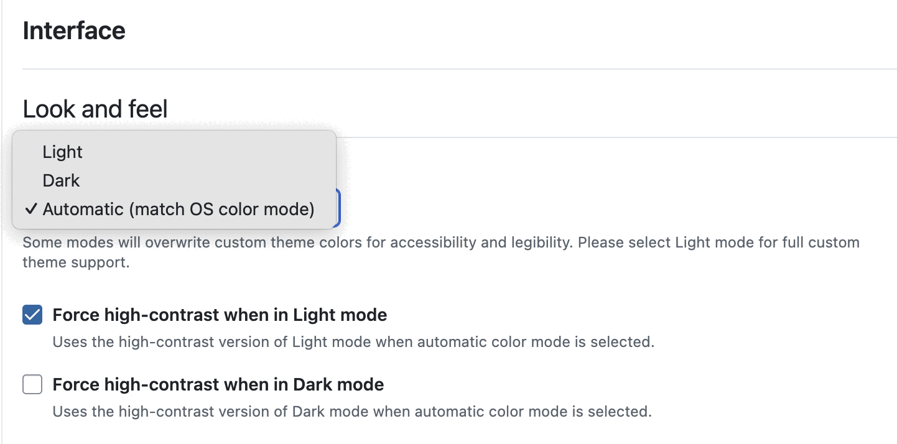
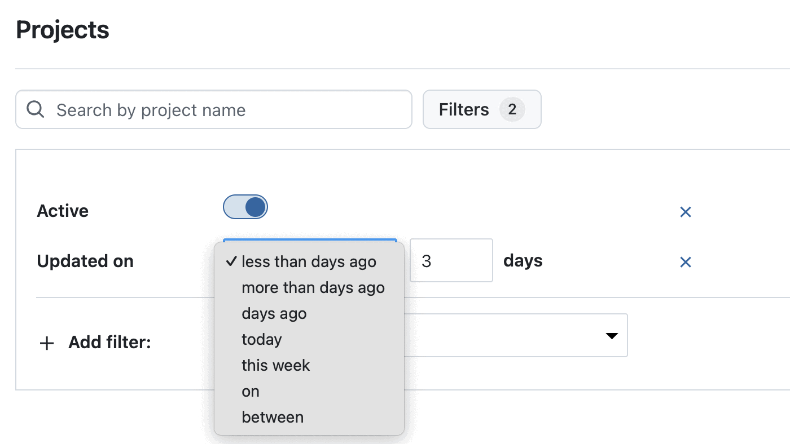

# OpenProject 16.5.0

Release date: 2025-10-08

We released [OpenProject 16.5.0](https://community.openproject.org/versions/2215). The release contains several bug fixes and we recommend updating to the newest version. In these Release Notes, we will give an overview of important feature changes. At the end, you will find a complete list of all changes and bug fixes.

## Important feature changes

Take a look at our release video showing the most important features introduced in OpenProject 16.5.0:

### Add work packages to a meeting section in the Meetings tab

You can now place a work package directly into a specific agenda section when adding it to a meeting from the Meetings tab. Open a work package, go to the tab *Meetings* and select an upcoming meeting. If you selected one, you can now choose in which section the work package should be displayed. 

>[!NOTE]
> If you choose a one-time meeting with no sections, the work package will automatically be added to the Agenda backlog.

In the *Notes* section, you can add text that will be displayed together with the meeting title in the *Meetings* tab of the work package.

[See our user guide to learn more about how to add work packages to meetings](../../user-guide/work-packages/add-work-packages-to-meetings).

### Choose color mode more conveniently with "Increase contrast" checkboxes

To give our users a clearer and better selection of the recently released new color modes, we have simplified the settings under *Account settings* → *Interface*. Users can now only choose between:
- Light
- Dark
- Automatic (match OS color mode)

Additionally, **checkboxes for high contrast** are now displayed, depending on the selection. So if you  selected *Light high contrast* in previous versions, starting with 16.5, you can now select *Light* and check the box for *Increase contrast*.

This new feature is particularly helpful for the automatic mode, where you can now differentiate whether you want high contrast to be displayed only in dark mode or only in light mode, for example.

[Learn more about the *Look and feel* options in OpenProject](../../user-guide/account-settings/#look-and-feel).

### Filter projects by last update

Projects can now be filtered and sorted by the last update time. To enable this, a new "Updated on" filter and sortable column is available in the project lists. This allows you to quickly find projects that have recently changed.

In the API, the updated_at filter has been added to the /api/v3/projects endpoint. This makes it possible to request only projects that have changed since a given timestamp.

>[!NOTE]
> **Updated on** includes all direct changes to the project itself, e.g. a new custom field or a change of the project name. In contrast to this, the filter **Latest activity at** includes a broader list of changes, e.g. a new work package or wiki that has been added.

### Jump to highlighted target elements from deep links

Deep links now take you to the right spot and highlight the target so you immediately see what to look at.

Following a link with an anchor (e.g., a specific comment in Activity or a meeting agenda item) auto-scrolls the page so the target is displayed near the top and temporarily highlighted with a blue outline.

After your next interaction (e.g., any click), the browser URL is cleaned to the canonical form and the highlight is removed.

### Confirm critical actions with more accessible danger dialogs

Danger dialogs have been improved to better support users of assistive technologies. The confirmation step before potentially destructive actions is now clearly announced through ARIA semantics. Screen readers inform when the confirmation checkbox is checked or unchecked, and whether the action button is active or inactive.

This ensures that all users can confidently understand and complete critical actions.

### Consistent entering of hours in duration fields

Entering and displaying durations has been made more consistent across the application. Time entries, work, and remaining work now accept input in the **hh:mm** format, and meetings also support this format. 

For German, the correct decimal separator (,) is applied, and durations are displayed in hh:mm. Durations are formatted as working days rather than calendar days, making it clearer and easier to interpret time values across different modules.

### Improved help menu and Community widget

The help menu in the header navigation – indicated with the **?** icon – has been improved. We restructured some entries, updated the links, added localizations, and included a new Getting started video.

This menu is useful not only for new users, but also for anyone looking for additional information about OpenProject. The same changes have also been applied to the Community widget shown on the home page when starting a new instance.

<!--more-->

## Bug fixes and changes

<!-- Warning: Anything within the below lines will be automatically removed by the release script -->
<!-- BEGIN AUTOMATED SECTION -->

- Bugfix: Work package exports fails for queries using custom fields not enabled for filtering \[[#40119](https://community.openproject.org/wp/40119)\]
- Bugfix: Spent time widget: No rounding \[[#56505](https://community.openproject.org/wp/56505)\]
- Bugfix: i18n for english translation not loading for requests \[[#59238](https://community.openproject.org/wp/59238)\]
- Bugfix: User is not taken to the Edit page after creating a custom field \[[#59359](https://community.openproject.org/wp/59359)\]
- Bugfix: PDF Gantt export potentially exports huge date ranges \[[#60585](https://community.openproject.org/wp/60585)\]
- Bugfix: Wrong Time and costs menu item path \[[#60613](https://community.openproject.org/wp/60613)\]
- Bugfix: Possible to create, update and delete relations to work package for which user does not have permission to manage relations \[[#61438](https://community.openproject.org/wp/61438)\]
- Bugfix: I18n::ArgumentError in WorkPackages::ProgressController#edit \[[#62075](https://community.openproject.org/wp/62075)\]
- Bugfix: Adding or removing successor in relations tab is not correctly reflected in Gantt chart \[[#63437](https://community.openproject.org/wp/63437)\]
- Bugfix: Image not visible in PDF export \[[#64356](https://community.openproject.org/wp/64356)\]
- Bugfix: Possible to deactivate the default work package priority \[[#64842](https://community.openproject.org/wp/64842)\]
- Bugfix: Characters &quot;eaten&quot; when modifying duration in work package date picker \[[#65132](https://community.openproject.org/wp/65132)\]
- Bugfix: WP items in bulk delete modal are misaligned \[[#65417](https://community.openproject.org/wp/65417)\]
- Bugfix: Plan name in enterprise banners has insufficient color contrast \[[#65507](https://community.openproject.org/wp/65507)\]
- Bugfix: Second line of breadcrumb is not properly left-aligned on non-mobile/desktop viewports \[[#65635](https://community.openproject.org/wp/65635)\]
- Bugfix: Error when exporting wp table grouped by project phase \[[#65740](https://community.openproject.org/wp/65740)\]
- Bugfix: Left side menu icon overlaps with header on Log unit costs page \[[#65896](https://community.openproject.org/wp/65896)\]
- Bugfix: &quot;Start new timer&quot; button not displayed in mobile view \[[#65907](https://community.openproject.org/wp/65907)\]
- Bugfix: \[Accessibility\] Contrast issues in widget graphs \[[#66624](https://community.openproject.org/wp/66624)\]
- Bugfix: ID link in notification center always points to last opened project \[[#66751](https://community.openproject.org/wp/66751)\]
- Bugfix: Removing widgets from Projects Overview page is very slow/unresponsive \[[#66753](https://community.openproject.org/wp/66753)\]
- Bugfix: Activity shows changes to admin only custom fields also to non admin users \[[#66925](https://community.openproject.org/wp/66925)\]
- Bugfix: LDAP Groupsync settings can&#39;t be edited in synced LDAP group \[[#66941](https://community.openproject.org/wp/66941)\]
- Bugfix: Do not use unspecified ServiceProviderConfig.AuthenticationSchemes.type \[[#67055](https://community.openproject.org/wp/67055)\]
- Bugfix: Application password cannot be validated for Nextcloud storage using SSO \[[#67071](https://community.openproject.org/wp/67071)\]
- Bugfix: Work packages export dialog description attribute dragger locale \[[#67181](https://community.openproject.org/wp/67181)\]
- Bugfix: Meeting token name not correctly validated \[[#67227](https://community.openproject.org/wp/67227)\]
- Bugfix: User cannot create a folder in the File picker \[[#67233](https://community.openproject.org/wp/67233)\]
- Bugfix: File picker UI lets user upload to root folder even though it&#39;s not permitted \[[#67235](https://community.openproject.org/wp/67235)\]
- Bugfix: User doesn&#39;t get visual feedback their new OIDC provider was successfully saved \[[#67257](https://community.openproject.org/wp/67257)\]
- Bugfix: Meetings series is not correctly ended if series has more than 1 existing occurence \[[#67297](https://community.openproject.org/wp/67297)\]
- Bugfix: Incorrect terminology in docs and UI: &quot;Favored&quot; vs &quot;Favorited&quot; \[[#67312](https://community.openproject.org/wp/67312)\]
- Bugfix: Older meetings show series backlog as &#39;untitled section&#39; \[[#67381](https://community.openproject.org/wp/67381)\]
- Bugfix: Cost reports month locale \[[#67466](https://community.openproject.org/wp/67466)\]
- Bugfix: Project overview click zone doesn&#39;t react to clicking + displays wrong cursor type \[[#67470](https://community.openproject.org/wp/67470)\]
- Bugfix: User see internal server error when opening a file that was uploaded from WP \[[#67515](https://community.openproject.org/wp/67515)\]
- Bugfix: Redundant and inconsistent translation strings in file storage creation \[[#67516](https://community.openproject.org/wp/67516)\]
- Bugfix: It is possible to change custom field format by providing different format to update action \[[#67521](https://community.openproject.org/wp/67521)\]
- Bugfix: Icons are misaligned on WP list baseline view \[[#67530](https://community.openproject.org/wp/67530)\]
- Bugfix: Cannot load Sharepoint links on QA edge \[[#67532](https://community.openproject.org/wp/67532)\]
- Bugfix: Increase spacing for Baseline button in WP toolbar \[[#67535](https://community.openproject.org/wp/67535)\]
- Bugfix: File links break as soon as they&#39;re uploaded and saved \[[#67557](https://community.openproject.org/wp/67557)\]
- Bugfix: Wrong hover icon when hovering over active timer in right side bar \[[#67572](https://community.openproject.org/wp/67572)\]
- Bugfix: Primerized login dropdown does not autofocus on input fields \[[#67602](https://community.openproject.org/wp/67602)\]
- Bugfix: Icons are misaligned on WP and meeting attachments \[[#67618](https://community.openproject.org/wp/67618)\]
- Bugfix: Icons are very close to the words on &#39;Remove file link&#39; dialog \[[#67619](https://community.openproject.org/wp/67619)\]
- Bugfix: Project dropdown search icon is hardly visible in dark mode \[[#67621](https://community.openproject.org/wp/67621)\]
- Bugfix: Page header tab nav is broken in combination with items page and page header description \[[#67625](https://community.openproject.org/wp/67625)\]
- Bugfix: CTA on Project settings file storage page are too close to another \[[#67645](https://community.openproject.org/wp/67645)\]
- Bugfix: User sees 500 when creating or editing a custom action when scored list custom field exists \[[#67649](https://community.openproject.org/wp/67649)\]
- Bugfix: Virus scanning is not triggered after uploading a file to S3 storage \[[#67664](https://community.openproject.org/wp/67664)\]
- Bugfix: Create button: plus icon is smaller than before and no longer centred with the label \[[#67699](https://community.openproject.org/wp/67699)\]
- Bugfix: Change working days pop-up: position of icons is off on the buttons \[[#67702](https://community.openproject.org/wp/67702)\]
- Bugfix: Team planner: no spacing between the icon and the Assignee \[[#67710](https://community.openproject.org/wp/67710)\]
- Bugfix: Project search dropdown: no spacing between the icon and the label \[[#67711](https://community.openproject.org/wp/67711)\]
- Bugfix: New Assignee icon in Team planner invisible in dark mode \[[#67721](https://community.openproject.org/wp/67721)\]
- Bugfix: Search bar of filterable tree view is misaligned if segmented control and include checkbox are disabled \[[#67723](https://community.openproject.org/wp/67723)\]
- Bugfix: On filterable tree view, sub items are not included when sub-item checkbox is ticked \[[#67727](https://community.openproject.org/wp/67727)\]
- Bugfix: Wrong warning message when revoking a browser session \[[#67733](https://community.openproject.org/wp/67733)\]
- Feature: Consistent entering of hours in duration fields \[[#61367](https://community.openproject.org/wp/61367)\]
- Feature: Advanced accessibility for the Danger Dialogs (with ARIA semantics to communicate contextual changes) \[[#61890](https://community.openproject.org/wp/61890)\]
- Feature: Advanced work package meeting selector \[[#62265](https://community.openproject.org/wp/62265)\]
- Feature: Highlight the relevant target element when the user gets to a page via a deep link  \[[#62712](https://community.openproject.org/wp/62712)\]
- Feature: Redesign the &quot;My Account / Session management&quot; page using Primer \[[#65412](https://community.openproject.org/wp/65412)\]
- Feature: Extend link\_translate helper to use localized links \[[#66253](https://community.openproject.org/wp/66253)\]
- Feature: Add &quot;Increase contrast&quot; checkboxes for &quot;Light high contrast&quot; and &quot;Dark high contrast&quot; that force high contrast in Automatic mode \[[#66396](https://community.openproject.org/wp/66396)\]
- Feature: Publish release candidates on docker hub \[[#67165](https://community.openproject.org/wp/67165)\]
- Feature: Update the Getting started video linked in the application help menu \[[#67176](https://community.openproject.org/wp/67176)\]
- Feature: Update help menu and widget on start page in application \[[#67177](https://community.openproject.org/wp/67177)\]
- Feature: Update Enterprise plan text in widget on application start page \[[#67178](https://community.openproject.org/wp/67178)\]
- Feature: Add/remove projects from favourite via the API \[[#67241](https://community.openproject.org/wp/67241)\]
- Feature: Hide segmented control and include sub-itmes checkbox of the filterable tree view \[[#67541](https://community.openproject.org/wp/67541)\]

<!-- END AUTOMATED SECTION -->
<!-- Warning: Anything above this line will be automatically removed by the release script -->

## Contributions

A very special thank you goes to Helmholtz-Zentrum Berlin, City of Cologne, Deutsche Bahn and ZenDiS for sponsoring released or upcoming features. Your support, alongside the efforts of our amazing Community, helps drive these innovations. Also a big thanks to our Community members for reporting bugs and helping us identify and provide fixes. Special thanks for reporting and finding bugs go to Alexander Aleschenko, Lars Tiedemann, Akihiko Fujikawa, and Johannes Baumgarten.

Last but not least, we are very grateful for our very engaged translation contributors on Crowdin, who translated quite a few OpenProject strings! This release we would like to particularly thank the following users:

- [Haura Nabila Rinaldi](https://crowdin.com/profile/hauranblr), for a great number of translations into Indonesian.
- [Samo](https://crowdin.com/profile/SamoE), for a great number of translations into Turkish.
- [Kuma Yamashita](https://crowdin.com/profile/dredgk), for a great number of translations into Japanese.

Would you like to help out with translations yourself? Then take a look at our [translation guide](../../contributions-guide/translate-openproject/) and find out exactly how you can contribute. It is very much appreciated!
