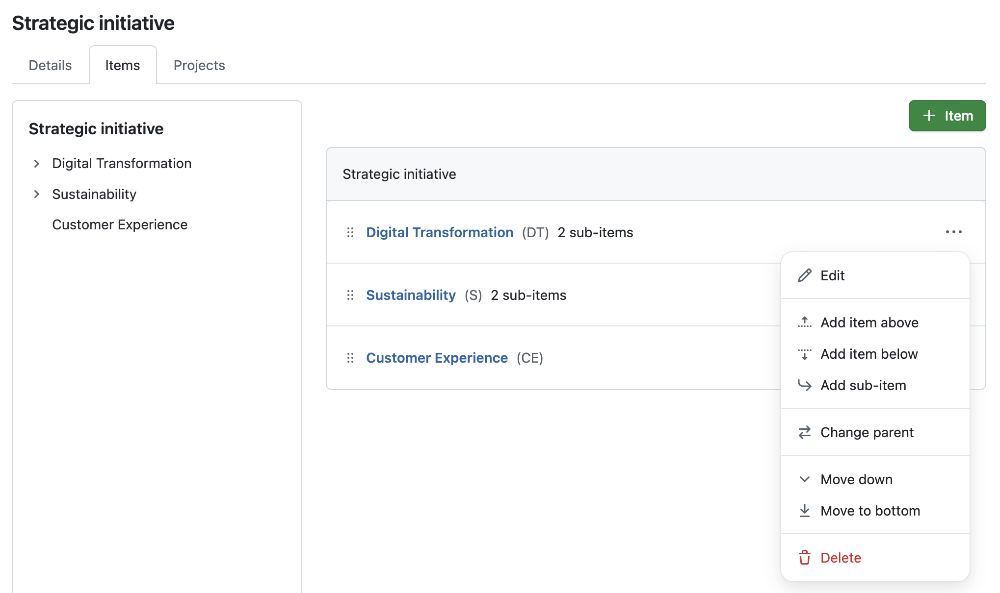
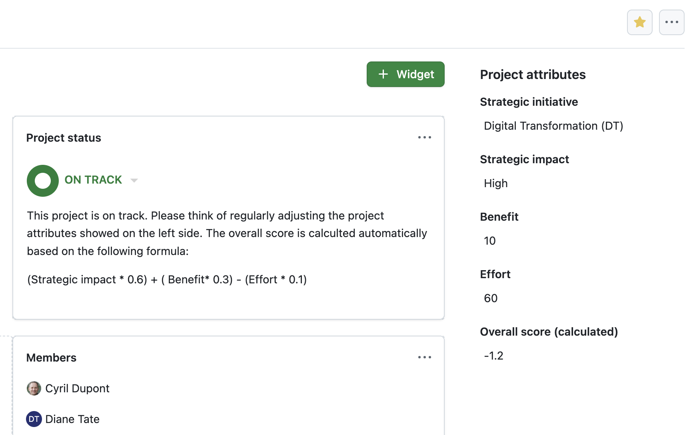
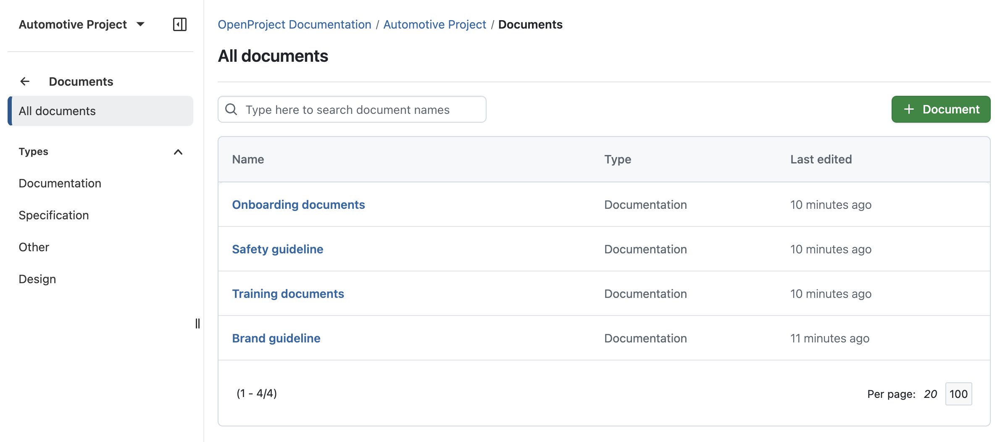
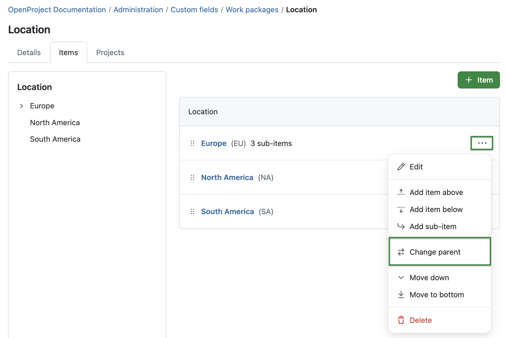

# OpenProject 16.6.0

Release date: 2025-11-05

We released [OpenProject 16.6.0](https://community.openproject.org/versions/1413). The release contains several bug fixes and we recommend updating to the newest version. In these Release Notes, we will give an overview of important feature changes. At the end, you will find a complete list of all changes and bug fixes.

## Important feature changes

Take a look at our release video showing the most important features introduced in OpenProject 16.6.0:

### Calculated values for project evaluation and scoring (Enterprise add-on)

OpenProject 16.6 introduces new project attribute types that make portfolio evaluation measurable and transparent: Hierarchy, Weighted item list, and Calculated value:

**Hierarchy** project attributes let you organize project information in a structured, nested way — for example, grouping initiatives by region, department, or program.

**Weighted item lists** extend this concept by allowing administrators to assign numeric scores to list options, such as effort levels or risk ratings. These values can then be used as input for calculated results.

**Calculated values** enable automatic computations based on formulas using numeric project attributes, including scores from Weighted item lists or even other calculated values. The computed result is displayed directly on the project overview and in the project list. It automatically updates whenever one of its source attributes (e.g., *Benefit* or *Effort* in the example below) is changed. This allows teams to calculate project scores and prioritise consistently across the portfolio.

Here's an example of a calculated value called 'Overall score (calculated)' with the following formula: `(Strategic impact * 0.6) + (Benefit ​* 0.3) - (Effort * 0.1)`

Together, these additions give project portfolio managers a flexible foundation for data-driven project evaluation and more transparent portfolio decisions. Of course, all project attributes, including calculated values, can be used for many other purposes.

>[!NOTE]
> Please note that these new project attributes are part of our [Enterprise add-ons in the Enterprise Premium plan](https://www.openproject.org/pricing/).

### Performance updates

OpenProject 16.6 introduces several backend optimizations that significantly improve performance in large environments. [Database queries for collection endpoints in the API v3 have been optimized](https://community.openproject.org/wp/68457) to avoid unnecessary counting operations, and the [autocompleter for adding work package relations now requests only the data it actually needs](https://community.openproject.org/wp/68458).

These improvements reduce query load and shorten response times, especially for installations with thousands of projects and millions of work packages.

### New index page for Documents module

With OpenProject 16.6, a new index page provides a structured overview of all documents within a project. The list is sorted by last edited, showing the latest changes first, and includes columns for Name, Type (the category), and Last edited. Users can search document titles via a quick text filter or narrow results by document category using the *Types* filter menu on the left. A new *+ Document* button lets users quickly add new items. 

Of course, the view automatically respects project permissions, ensuring that users only see documents they are allowed to access. On mobile, the list is optimized to show just the most relevant information.

While this is a small update by itself, it marks the beginning of a major improvement of the Documents module, which will make managing and [live collaborating on documents in OpenProject](https://community.openproject.org/wp/66309) much easier in the future.

### Possibility to change parent of a custom field item (Enterprise add-on)

Administrators can now change the parent of an item within a [hierarchical custom field (Enterprise add-on)](../../system-admin-guide/custom-fields/#hierarchy-custom-field-enterprise-add-on) or project attribute. This makes it easier to rearrange existing items without recreating them from scratch. 

To do so, administrators need to navigate to *Administration → Custom fields*, select a custom field type hierarchy and click on the *Items* tab. Then they click on the *More* icon and select *Change parent*. A dialog opens showing the current hierarchy tree. From there, administrators can search, select a new parent, and save the updated structure. The hierarchy is updated immediately after saving. Like mentioned above, this also works for project attributes.

### Updated 'More' menu of meetings with a 'Move to section' option

In the Meetings module, the *More (three dots) menu* for agenda items has been improved to make it easier to move items between sections. Moderators can now directly move an item to another section without manually reordering it step by step. 

The new *Move → Move to section* option opens a dialog where users can select the desired section from a dropdown list. Additionally, users can still move an agenda item to the backlog or to the next meeting (if it's part of a meeting series).

[Learn more about meeting management with OpenProject](../../user-guide/work-packages/add-work-packages-to-meetings).

### Editing individual attributes even if other fields are invalid

In OpenProject 16.6, users can now edit individual attributes of a project, work package, or other object even if some required fields are missing or invalid. Previously, a single missing value — for example, a required custom field added after a project’s creation — could block users from saving any changes at all.

With this improvement, OpenProject now only enforces required fields when they are visible in the form being edited. For example, a user can update a project name even if a required custom field for that project has not been filled in, since that field is not shown in the name edit view. However, when editing a work package where the required field is part of the form, the value must still be provided before saving. This change helps reduce unnecessary validation errors and prevents users from being blocked by unrelated fields.

### Work package type workflow table with a sticky header and sticky first column

In *Administration → Work packages → Workflows*, the workflow table now features a sticky header and sticky first column. This makes it much easier for project administrators to keep track of which transitions are enabled when scrolling through large tables, vertically or horizontally.

Additionally, the table is now split into three tabs — *Default transitions*, *User is author*, and *User is assignee* — each showing the relevant workflow configuration. Before 16.6, these additional transitions were often overlooked as they were positioned below the table.

[Read more about managing work package workflows in OpenProject](../../system-admin-guide/manage-work-packages/work-package-workflows/).

### Mini calendar re-added in the date picker of mobile web

On mobile devices, including Safari on iOS, the date picker now once again includes a mini calendar view for selecting start and finish dates. This update makes it easier to see the weekday of a selected date and to distinguish working days from non-working days at a glance. The mini calendar replaces the previous text-only date input, providing a more intuitive way to choose dates while avoiding Safari’s inconsistent native date picker behavior. The calendar shows a single month view and is now the default way to select dates on mobile devices.

## Important technical updates

### Autoscaling

OpenProject 16.6 introduces autoscaling support for containerized installations. The application now exposes Puma metrics (including busy_threads and backlog) that can be used by a horizontal pod autoscaler to automatically scale web instances based on load. 

Autoscaling can be configured through the Helm chart, allowing system administrators to optimize resource usage and reduce operational costs during periods of low activity.

<!--more-->

## Bug fixes and changes

<!-- Warning: Anything within the below lines will be automatically removed by the release script -->
<!-- BEGIN AUTOMATED SECTION -->

- Bugfix: Inconsistent position of search icon in search box \[[#42064](https://community.openproject.org/wp/42064)\]
- Bugfix: \[Work-Package\] Move work-package with an invalid user in a custom field \[[#59381](https://community.openproject.org/wp/59381)\]
- Bugfix: No errors displayed from dates and progress edit modals when unable to save work package \[[#62563](https://community.openproject.org/wp/62563)\]
- Bugfix: Project identifier cannot be updated if a required project attribute is created \[[#63668](https://community.openproject.org/wp/63668)\]
- Bugfix: Add new workpackage in Backlog module not possible on Firefox \[[#64158](https://community.openproject.org/wp/64158)\]
- Bugfix: Activity Module delivers error 404 in newly set up instances \[[#66444](https://community.openproject.org/wp/66444)\]
- Bugfix: ActiveRecord::StatementInvalid in GET::API::V3::Queries::QueriesAPI#/queries/:id/ and GET::API::V3::Queries::QueriesByProjectAPI#/projects/:id/queries/default/ \[[#66611](https://community.openproject.org/wp/66611)\]
- Bugfix: Users are not informed that manually specifying OAuth token exchange is the preferred method \[[#67171](https://community.openproject.org/wp/67171)\]
- Bugfix: Confusing formulation in Nextcloud storage health report \[[#67419](https://community.openproject.org/wp/67419)\]
- Bugfix: When user saves form with missing data, focus is not set on field where data is missing \[[#67644](https://community.openproject.org/wp/67644)\]
- Bugfix: On mobile, list of names for mentions spills out of screen if some names are long \[[#67693](https://community.openproject.org/wp/67693)\]
- Bugfix: Clearing backlog doesn&#39;t remove the items \[[#67844](https://community.openproject.org/wp/67844)\]
- Bugfix: &quot;New Document&quot; action stuck on pending \[[#67996](https://community.openproject.org/wp/67996)\]
- Bugfix: Toggleable fieldsets do not toggle \[[#68031](https://community.openproject.org/wp/68031)\]
- Bugfix: workPackageValue:attribute macros don&#39;t work if custom field name contains &quot;.&quot; (dot) \[[#68125](https://community.openproject.org/wp/68125)\]
- Bugfix: On small screens the lazy page might never load \[[#68252](https://community.openproject.org/wp/68252)\]
- Bugfix: user provided links are opened in a new tab, but it is not read out by screen reader \[[#68267](https://community.openproject.org/wp/68267)\]
- Bugfix: Filtering of past Meeting series is not working correctly \[[#68311](https://community.openproject.org/wp/68311)\]
- Bugfix: Padding before and behind macros, e.g. user avatar \[[#68341](https://community.openproject.org/wp/68341)\]
- Bugfix: Version overview widgets don&#39;t have enough space \[[#68352](https://community.openproject.org/wp/68352)\]
- Bugfix: When switching to Automatic mode, &quot;Working days only&quot; is not set correctly \[[#68357](https://community.openproject.org/wp/68357)\]
- Bugfix: WP graph legend does not match the actual graph  \[[#68364](https://community.openproject.org/wp/68364)\]
- Bugfix: Unsaved changes are lost when sections are reordered \[[#68374](https://community.openproject.org/wp/68374)\]
- Bugfix: Unsaved changes are lost when dealing with outcomes \[[#68375](https://community.openproject.org/wp/68375)\]
- Bugfix: On work package creation, &quot;Working days only&quot; is not saved \[[#68380](https://community.openproject.org/wp/68380)\]
- Bugfix: Incorrect dates displayed in date picker when switching to automatic mode \[[#68402](https://community.openproject.org/wp/68402)\]
- Bugfix: On Work Package Side View (via &quot;info&quot; ℹ️ icon) the lazy pages never load, only the first page is loaded \[[#68404](https://community.openproject.org/wp/68404)\]
- Bugfix: Base Amount Field: Error 500 on Empty Submission, Expected Behavior - Reset to Zero \[[#68428](https://community.openproject.org/wp/68428)\]
- Bugfix: Custom fields in project settings not ordered \[[#68440](https://community.openproject.org/wp/68440)\]
- Bugfix: Nothing happens except page reload when user clicks &#39;Show more&#39; on Meeting series index page \[[#68454](https://community.openproject.org/wp/68454)\]
- Bugfix: APIv3: Totals are counted, even if not selected \[[#68457](https://community.openproject.org/wp/68457)\]
- Bugfix: Parent WP goes to &quot;automatic&quot; when only one child remains after removing all others \[[#68465](https://community.openproject.org/wp/68465)\]
- Bugfix: Missing space when renaming project attribute section \[[#68483](https://community.openproject.org/wp/68483)\]
- Bugfix: Deleted work package cannot be removed from meeting agenda \[[#68488](https://community.openproject.org/wp/68488)\]
- Bugfix: APIv3: Missing eager load in /api/v3/projects \[[#68496](https://community.openproject.org/wp/68496)\]
- Bugfix: &quot;Close completed versions&quot; is not connected to the backend -&gt; 404 returned \[[#68502](https://community.openproject.org/wp/68502)\]
- Bugfix: Apiv3: Missing preload in /api/v3/time\_entries \[[#68513](https://community.openproject.org/wp/68513)\]
- Bugfix: Magnifying glass icon barely visible in dark mode in Include projects option \[[#68546](https://community.openproject.org/wp/68546)\]
- Bugfix: Marking calculated value required for all projects doesn&#39;t calculate the value \[[#68549](https://community.openproject.org/wp/68549)\]
- Bugfix: Creating a calculated value project attribute marked required doesn&#39;t calculate values \[[#68553](https://community.openproject.org/wp/68553)\]
- Bugfix: Changing dates on children WP with automatically generated subjects does not affect parent dates \[[#68560](https://community.openproject.org/wp/68560)\]
- Bugfix: Enabling calculated value by adding project to through custom field admin doesn&#39;t trigger calculation \[[#68589](https://community.openproject.org/wp/68589)\]
- Bugfix: Poor performance on work package id filter and time\_entries API  \[[#68593](https://community.openproject.org/wp/68593)\]
- Bugfix: In activity, applying a filter should not remove the user filter  \[[#68600](https://community.openproject.org/wp/68600)\]
- Bugfix: Not possible to create token exchange capable OIDC provider from environment variables \[[#68601](https://community.openproject.org/wp/68601)\]
- Bugfix: Meeting invitation decline in Gmail results in deliverability error mails \[[#68659](https://community.openproject.org/wp/68659)\]
- Feature: Project attribute of type &quot;Calculated value&quot; \[[#50112](https://community.openproject.org/wp/50112)\]
- Feature: Change parent of a custom field item \[[#57828](https://community.openproject.org/wp/57828)\]
- Feature: Use hierarchical lists as project attributes \[[#59173](https://community.openproject.org/wp/59173)\]
- Feature: Primer Alpha::ToggleSwitch locale support \[[#62820](https://community.openproject.org/wp/62820)\]
- Feature: Allow editing of individual work package/project attributes even if certain other attributes are invalid (eg. required field empty) \[[#63550](https://community.openproject.org/wp/63550)\]
- Feature: Provide work package type workflow table with a sticky header and sticky first column \[[#64823](https://community.openproject.org/wp/64823)\]
- Feature: Re-add the mini calendar in the date picker of mobile web \[[#66050](https://community.openproject.org/wp/66050)\]
- Feature: Add numeric values to custom field hierarchy items \[[#66408](https://community.openproject.org/wp/66408)\]
- Feature: Overview widget for Subitems \[[#66493](https://community.openproject.org/wp/66493)\]
- Feature: Automatically detect and apply OS theme in Login screen \[[#66594](https://community.openproject.org/wp/66594)\]
- Feature: Index page for documents module \[[#66595](https://community.openproject.org/wp/66595)\]
- Feature: Update &#39;More&#39; menu of meetings with a &#39;Add to section&#39; option \[[#67060](https://community.openproject.org/wp/67060)\]
- Feature: Highlight the meeting agenda item when the user gets to a meeting via a deep link  \[[#67276](https://community.openproject.org/wp/67276)\]
- Feature: Allow single selection variant for the (filterable) tree view \[[#67542](https://community.openproject.org/wp/67542)\]
- Feature: Autoscaling \[[#67698](https://community.openproject.org/wp/67698)\]
- Feature: Limit number of subitems shown in the subitems widget \[[#67969](https://community.openproject.org/wp/67969)\]
- Feature: Autocompleter for available relation candidates should select necessary attributes from API \[[#68458](https://community.openproject.org/wp/68458)\]

<!-- END AUTOMATED SECTION -->
<!-- Warning: Anything above this line will be automatically removed by the release script -->

## Contributions

A very special thank you goes to Helmholtz-Zentrum Berlin, City of Cologne, Deutsche Bahn and ZenDiS for sponsoring released or upcoming features. Your support, alongside the efforts of our amazing Community, helps drive these innovations. Also a big thanks to our Community members for reporting bugs and helping us identify and provide fixes. Special thanks for reporting and finding bugs go to Sven Kunze, Stefan Weiberg, Gábor Alexovics, Alexander Aleschenko, Tobias Nowakow.

This release, we specifically want to thank Emon for reporting a security vulnerability on our website. Reports and feedback like this are one of the reasons we love OSS and appreciate being part of such an amazing community.

Last but not least, we are very grateful for our very engaged translation contributors on Crowdin, who translated quite a few OpenProject strings! This release we would like to particularly thank the following users:

- [William](https://crowdin.com/profile/williamfromtw), for a great number of translations into Chinese Traditional.
- [Pickart](https://crowdin.com/profile/fantasmak10), for a great number of translations into Catalan.
- [Maxime77](https://crowdin.com/profile/maxime77), for a great number of translations into French.

Would you like to help out with translations yourself? Then take a look at our [translation guide](../../contributions-guide/translate-openproject/) and find out exactly how you can contribute. It is very much appreciated!
