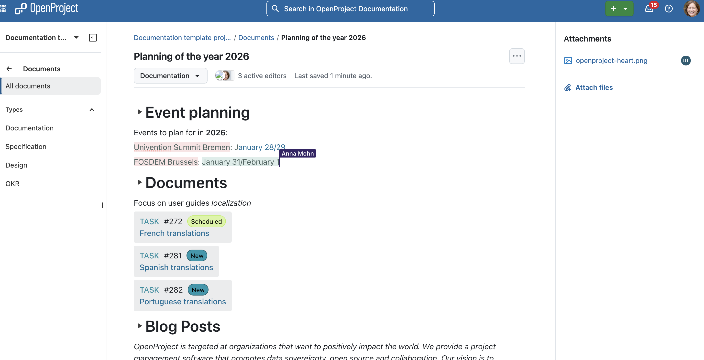
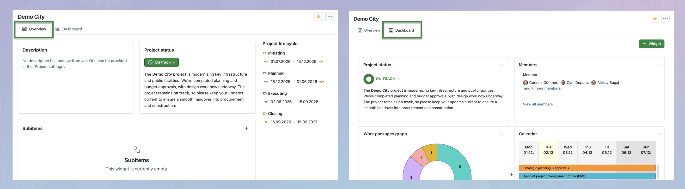
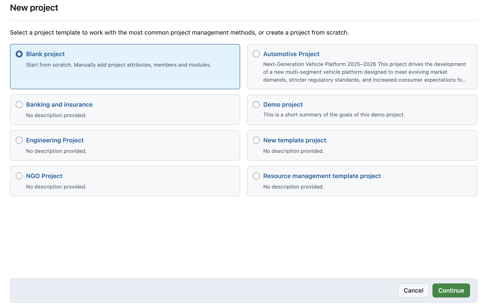
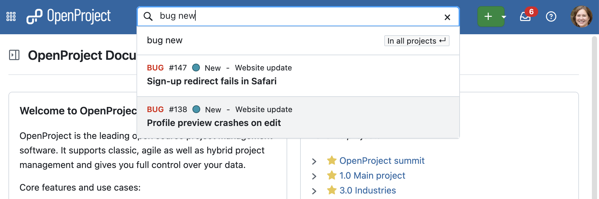
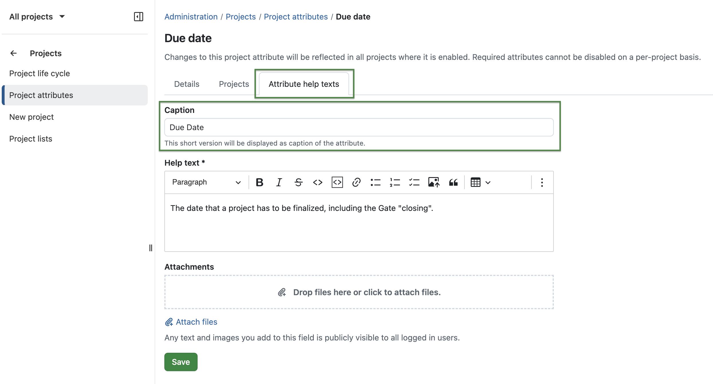

# OpenProject 17.0.0

Release date: 2025-12-17

We released [OpenProject 17.0.0](https://community.openproject.org/versions/2233).
The release contains several bug fixes and we recommend updating to the newest version.
In these Release Notes, we will give an overview of important feature changes. At the end, you will find a complete list of all changes and bug fixes.

## Important feature changes

Take a look at our release video showing the most important features introduced in OpenProject 16.6.0:


### Real-time documents collaboration

OpenProject 17.0 introduces **real-time collaborative editing in the Documents module**. Multiple users can work on the same document simultaneously, with live cursors, continuous updates, and automatic saving. The new BlockNote editor replaces the previous CKEditor-based documents for all installations where real-time collaboration is enabled.

Real-time collaboration requires a **running Hocuspocus server**:

- **OpenProject Cloud**: Real-time collaboration is enabled automatically for all Cloud instances.
- **Container-based on-premises installations** (Docker, Docker Compose, Helm/Kubernetes): Intended to work out of the box with 17.0. A Hocuspocus service will be automatically provided as part of the standard setup.
- **Package-based installations** (DEB/RPM): Does not include Hocuspocus. These installations will continue using CKEditor-based documents unless administrators set up their own Hocuspocus server and configure OpenProject accordingly.

When real-time editing is enabled, Documents support:

- Live collaborative editing with visible cursors from all connected users.
- Real-time updates in both edit and read-only mode.
- Work package integration via slash commands:
  - Link or embed work packages as rich preview blocks.
  - Users without access see secure ghost references.
- Continuously updating "last edited" timestamp.
- List of connected users, including read-only viewers.
- Automatic saving without a manual save button.
- Improved document layout with breadcrumbs, editable title, type selector, connected user avatars, and last-updated indicator.
- Inline file uploads by dragging files directly into the editor.
- Files panel that updates instantly and supports deleting attachments.
- Editor skeleton displayed while loading.
- Unified document URL (`/documents/<id>`) for both editing and viewing.

>[!NOTE]
> If real-time collaboration is enabled but no functioning Hocuspocus server is reachable, OpenProject does not fall back to CKEditor. Instead, the document editor is temporarily hidden and an error banner is shown with an option to retry. Once the connection to the collaboration server is restored, the editor becomes available again automatically.



### Programs and portfolios for strategic structuring (Enterprise add-on)

OpenProject 17.0 introduces hierarchical workspaces to better organize large project landscapes. Customers of the **Enterprise Premium plan** can now structure related items — **projects, programs, and portfolios** — to align operational work with strategic goals.

With this new hierarchy:

- **Projects** represent operational work.
- **Programs** group related projects into coordinated initiatives.
- **Portfolios** provide a higher-level view across multiple programs and projects.

Projects, programs, and portfolios all use the same familiar concept of an overview page with widgets, lifecycle dates and attributes. Portfolios and projects appear as top-level entries in the global navigation and project selector, while programs are accessed through portfolios.

Creating workspaces also becomes more consistent: administrators can define default templates for programs, portfolios, and projects so that new items follow the correct structure from the start. When users create new entries through the Subitems widget or other creation shortcuts, both the parent hierarchy and the appropriate template are prefilled automatically.

A dedicated global permission now controls who may create programs and portfolios, ensuring that the new hierarchy can be introduced in a controlled way.

This update lays the foundation for future portfolio-level and program-level capabilities in OpenProject.

>[!NOTE]
> This new hierarchy is especially valuable for organizations working with structured project management frameworks such as **PM²** or **PMflex**, where programs and portfolios play a central role.

screenshot

### Better meeting management with draft mode, presentation mode, multiple outcomes, and iCal subscription

OpenProject 17.0 introduces several great improvements that make meeting preparation and documentation more intuitive, structured, and efficient.

#### Draft mode

New meetings now open in **draft mode**, allowing moderators to prepare agendas, add participants, and structure content before sending out invitations or updates.

A banner clearly indicates draft mode, and invitations are only sent once the meeting is explicitly opened by clicking on the green "Open meeting" button. Only then, invitations can be sent and the usual update behaviour applies.


#### Full-screen presentation mode

The new **presentation mode** offers a distraction-free, full-screen view that focuses on the current agenda item. It shows the meeting title, agenda item details, and navigation controls in a clear layout, including:

- a sticky header with the meeting title and exit button,
- a sticky footer with progress, previous/next navigation and a running timer.

Unlike the standard view, changes made by participants are reflected **live** in presentation mode, so moderators and attendees always see the current state of the agenda without additional pop-ups. Keyboard navigation using arrow keys is possible.

#### Multiple text-based outcomes per agenda item

Agenda items can now hold **multiple text-based outcomes**: The **+ Outcome** button remains available while the meeting is *In progress* and allows moderators to record more than one result for the same item. The first outcome is labelled "Outcome", additional ones are numbered ("Outcome 1", "Outcome 2", and so on). These outcomes are also supported in the PDF exports of meetings. This feature is a preparation for future improvements, such as [creating work packages as outcomes](https://community.openproject.org/work_packages/62093).


#### Unified “My meetings” iCal subscription

To avoid duplicate or confusing calendar invites, **users can now subscribe to all their meetings through a single iCal subscription URL** from the My meetings page or settings. External calendars (for example Outlook, Apple Calendar, or Open-Xchange) stay in sync automatically. Individual *.ics files* remain available when needed, but sending them is now more clearly controlled via dedicated options when creating or updating meetings.


### Updated SharePoint integration with more restrictive permissions (Enterprise add-on)

Before OpenProject 17.0, the Microsoft 365 file storage integration was a single combined OneDrive/SharePoint integration available as an Enterprise add-on in the Professional plan. With this release, it is now split into **two separate integrations** — one for **OneDrive** and one for **SharePoint** — giving administrators clearer setup options and more flexibility.

For the SharePoint integration, OpenProject 17.0 introduces support for Microsoft's *Sites.Selected* permission model. This allows administrators to grant the OpenProject Entra ID application access only to specific SharePoint sites, instead of using the broader *`Files.ReadWrite.All`* permission required in earlier versions.

This new option helps organizations meet stricter security and compliance requirements while preserving all existing functionality.

When configuring SharePoint storage, administrators now benefit from:

- Separate, clearer setup options for OneDrive and SharePoint.
- Support for the *Sites.Selected* permission scope, requiring a SharePoint Site ID.
- Improved helper texts and documentation links.
- Enhanced validation and error messages during configuration.

OpenProject continues to support both the legacy permission model and the new *Sites.Selected* approach, allowing administrators to choose whichever fits their security standards.

screenshot

### Redesigned project overview with new tabs, configurable widgets, and an improved layout

OpenProject 17.0 introduces a **major redesign of the project overview**, making key information easier to understand and share.

The page is now split into two tabs:

- **Overview** — a clean, structured summary with fixed widgets such as description, status, members, subitems, news, lifecycle dates, and project attributes.
- **Dashboard** — the fully editable area for custom widgets, now without the previous right-hand panel.

The redesign also introduces a **new widget for Subitems** and improves existing ones through updated Primer styling. Administrators can additionally decide whether specific **project attribute sections** appear in the sidebar or directly in the main Overview as dedicated widgets.



### Improved project creation flow with better template selection

Creating new projects is now easier and more structured. The template selection has been moved to a **dedicated first step**, offering a clearer visual layout and better guidance. After choosing a template or a blank project, users proceed to the regular creation form.

When using blank projects, required custom fields are shown in a separate final step. Project templates used for programs and portfolios are also prefilling properly when created from context (e.g., via the Subitems widget or the top navigation).



### Option to guard the privacy of users not working in the same project more strictly

This release introduces a new global permission that allows administrators to **allow the visibility of all users in the system**. This global permission was previously enabled by default, allowing all users with "Manage members" permission in a project to list all users globally.

When this global permission is _not_ assigned, project administrators only see:

- users who share a project with them,
- users in the same groups as them, or
- users they explicitly invite by email (if permitted).

This prevents unintended disclosure of user names across unrelated teams and helps organizations meet stricter privacy and compliance requirements, especially when multiple unrelated teams are working together inside one installation of OpenProject.

Existing permission configurations are automatically migrated so that **current behavior remains unchanged** unless administrators choose to restrict visibility. A migrated global role has been created and assigned to all users that previously had "Manage members", to not interrupt any existing workflows.


### Updated invitation flow with Primer components

The user invitation dialog has been redesigned with Primer for a clearer and more consistent experience. The flow now shows only the projects where a user is allowed to invite members, improves autocompletion for users and emails, and displays errors inline instead of multi-step confirmations. This update also prepares the system for the new [visibility rules introduced in this release](#option-to-guard-the-privacy-of-users-not-working-in-the-same-project-more-strictly).

screenshot

### Smarter global search including type and status, improving precision in several autocompleters

The global search now understands **work package type**, **status**, and **meta-status** (open/closed). This makes it much easier to find the right item in projects with many similarly named work packages.

Examples:

- Searching for *bug* shows only work packages of type *Bug*.
- Searching for *bug new* shows only work packages of typ *Bug* and status *New*.
- Searching for *open* shows only items in an open status.

These improvements **also benefit several autocompleters throughout the application**, such as the `#` and `##` work package quick-link references in comments and descriptions, helping users filter large datasets more precisely.



### Accessibility improvements with ALT texts and improved chart colors

OpenProject 17.0 continues the accessibility initiative with several enhancements:

- Meaningful ALT text added to functional images (e.g., avatars).
- Decorative images are now correctly marked to be skipped by screen readers.
- Charts on the project overview include improved color contrast and descriptive summaries to support assistive technologies.
- The Gantt chart is now hidden from screen readers to avoid confusing non-informational output.

These improvements make OpenProject easier to navigate for users relying on screen readers or high-contrast environments.

### Enhanced project attribute help texts with captions and direct editing

Administrators can now **manage attribute help texts directly from each project attribute or custom field** without navigating to the separate *Attribute help texts* section. Additionally, a new **caption** field allows adding short clarifying text shown below input fields in forms to guide users more effectively. Please note that for now, this only applies for project attributes, not for (work package) custom fields.

Help texts continue to appear in the familiar dialog triggered by the question-mark icon.



### Custom logo for mobile (Enterprise add-on)

Customers of the Enterprise Basic plan can now upload a dedicated **mobile logo** as part of their branded theme.

Depending on screen size:

- mobile logo only
- desktop logo only
- or both (automatically switching between them)

...are shown.

If no custom logo is provided, the OpenProject logo remains the default.

### Required project attributes

Project attributes now have a separate **Required** setting. This works in the same way as for work package custom fields and controls whether a value is mandatory when editing a project. It is independent from the existing **For all projects** option, which still defines whether the attribute is activated in every project.

>[!NOTE]
> When upgrading to OpenProject 17.0, all project attributes that are configured **For all projects** are automatically set to **Required** so that existing mandatory fields keep their behavior.

### Support for non-nested long text fields in PDF exports

Long text custom fields and descriptions included via macros such as the following are now supported in PDF exports:

```
workPackageValue:description  
projectValue:"Field name"
```

This includes meetings, single work package exports, work package list reports, and project lists.

When placed at the start of a line, long text is rendered fully. If inserted mid-sentence, the content moves to its own paragraph. Nested embedding (e.g., inside tables) is supported only for plain text; otherwise, a clear fallback message appears.

### New permission to export projects

A new permission allows administrators to control who may export project lists as XLS, CSV, or PDF. This helps manage server load and restrict data extraction to authorized users.

### Updated tab order in the work package view

To reflect usage patterns, the tab order in the work package view has been updated:

1. Activity
2. Relations
3. Meetings (if enabled)
4. GitLab / GitHub integrations (if enabled)
5. Watchers

## Important technical changes

### PostgreSQL update to 17.0

The docker and packaged installations are now using PostgreSQL 17.0 by default. Note that there is no automatic upgrade for your cluster if you are running older versions of PostgreSQL. Please see [our database migration guide](../../installation-and-operations/misc/migration-to-postgresql17/) on how to upgrade to newer versions of PostgreSQL.

For packaged installations using SLES 12 and 15, automatic installation of PostgreSQL has been removed due to incompatible repositories being used. Please [follow the official documentation](https://www.postgresql.org/about/news/installing-postgresql-on-sles-15-just-got-easier-and-better-2814/) on how to upgrade your database for these distributions.

### Removal of special semver

We removed the `special` fragment of the semantic version of OpenProject. This has not been in use.
Unless you are relying on this value in one of your plugins, you can ignore this change.

Reference: \[[#67036](https://community.openproject.org/wp/67036)\]

### Built-in OAuth application for easier external client setup

OpenProject now includes a built-in OAuth application that simplifies authentication for external clients such as the mobile app. System administrators no longer need to manually create an OAuth configuration. The default application is available out of the box and can be used immediately for secure, user-based authentication.

### Improved perceived performance of the project selector

The project selector has been optimised to feel significantly faster, especially in instances with many projects. Instead of loading the full project tree at once, OpenProject now loads up to 300 projects initially and fetches additional entries dynamically during search. This reduces waiting times and improves responsiveness across the application.


### PostgreSQL update to 17.0

The docker and packaged installations are now using PostgreSQL 17.0 by default. Note that there is no automatic upgrade for your cluster if you are running older versions of PostgreSQL. Please see [our database migration guide](../../installation-and-operations/misc/migration-to-postgresql17/) on how to upgrade to newer versions of PostgreSQL.

For packaged installations using SLES 12 and 15, automatic installation of PostgreSQL has been removed due to incompatible repositories being used. Please [follow the official documentation](https://www.postgresql.org/about/news/installing-postgresql-on-sles-15-just-got-easier-and-better-2814/) on how to upgrade your database for these distributions.


### Removal of special semver

We removed the `special` fragment of the semantic version of OpenProject. This has not been in use.
Unless you are relying on this value in one of your plugins, you can ignore this change.

Reference: \[[#67036](https://community.openproject.org/wp/67036)\]

<!--more-->

## Bug fixes and changes

<!-- Warning: Anything within the below lines will be automatically removed by the release script -->
<!-- BEGIN AUTOMATED SECTION -->

- Bugfix: User avatar is missing in user invite modal \[[#38109](https://community.openproject.org/wp/38109)\]
- Bugfix: &quot;Stay logged in&quot; in German (and Spanish) truncated on login screen - not enough spacing \[[#45921](https://community.openproject.org/wp/45921)\]
- Bugfix: Inconsistent wording on filter operators for hierarchy CF \[[#59752](https://community.openproject.org/wp/59752)\]
- Bugfix: CKEditor logo z-index bug \[[#60535](https://community.openproject.org/wp/60535)\]
- Bugfix: Back navigation from Full work package page to Rails pages broken \[[#60636](https://community.openproject.org/wp/60636)\]
- Bugfix: List of supported environment variables doesn&#39;t contain OIDC variables \[[#61278](https://community.openproject.org/wp/61278)\]
- Bugfix: Time is not displayed clearly in an auto-generated subject \[[#63477](https://community.openproject.org/wp/63477)\]
- Bugfix: Low contrast in dark mode: links in ckEditor \[[#64461](https://community.openproject.org/wp/64461)\]
- Bugfix: SSO users can still use the internal login but can&#39;t change password \[[#64567](https://community.openproject.org/wp/64567)\]
- Bugfix: Global search is not usable via keyboard \[[#65066](https://community.openproject.org/wp/65066)\]
- Bugfix: Truncation of &quot;Tage&quot; (Days) in duration field when language=DE \[[#65227](https://community.openproject.org/wp/65227)\]
- Bugfix: Validation of essential OIDC claims causes server error when failing \[[#66289](https://community.openproject.org/wp/66289)\]
- Bugfix: Insufficient contrast in color mode light high contrast \[[#67175](https://community.openproject.org/wp/67175)\]
- Bugfix: Wrong time indicated for some meetings in iCal download \[[#67330](https://community.openproject.org/wp/67330)\]
- Bugfix: BlockNote: bullet points don&#39;t show when saved if followed by checklist \[[#67383](https://community.openproject.org/wp/67383)\]
- Bugfix: BlockNote: Toggle lists appear as bullet points after a document is saved \[[#67384](https://community.openproject.org/wp/67384)\]
- Bugfix: BlockNote: Always adding an extra row (header) in the table \[[#67389](https://community.openproject.org/wp/67389)\]
- Bugfix: Fix accessibility issues in Angular templates detected by ESLint \[[#67399](https://community.openproject.org/wp/67399)\]
- Bugfix: BlockNote: Color for text not applied from the block side menu \[[#67507](https://community.openproject.org/wp/67507)\]
- Bugfix: BlockNote: Video and audio don&#39;t play and don&#39;t show when saved \[[#67533](https://community.openproject.org/wp/67533)\]
- Bugfix: BlockNote: OpenProject work packages are sorted by their ID instead of the last updated by \[[#67536](https://community.openproject.org/wp/67536)\]
- Bugfix: BlockNote: Work package macro loses its styling upon save and also loses its functionality on edit \[[#67537](https://community.openproject.org/wp/67537)\]
- Bugfix: BlockNote: On the Work package macro the status is invisible on black background \[[#67538](https://community.openproject.org/wp/67538)\]
- Bugfix: BlockNote: work package search does not list the correct wp when searching with ID \[[#67540](https://community.openproject.org/wp/67540)\]
- Bugfix: BlockNote: searching for a non-existent work package results in placeholder string being saved in the editor \[[#67554](https://community.openproject.org/wp/67554)\]
- Bugfix: BlockNote: underline functionality doesn&#39;t render correctly when saved \[[#67555](https://community.openproject.org/wp/67555)\]
- Bugfix: Low color contrast on Buy now button on enterprise banners \[[#67834](https://community.openproject.org/wp/67834)\]
- Bugfix: BlockNote on mobile: slash menu almost out of sight \[[#67849](https://community.openproject.org/wp/67849)\]
- Bugfix: BlockNote on mobile: placeholder text overlaps the list element in toggle list \[[#67850](https://community.openproject.org/wp/67850)\]
- Bugfix: BlockNote on mobile: emoji picker overflows horizontally and unable to scroll \[[#67852](https://community.openproject.org/wp/67852)\]
- Bugfix: BlockNote on mobile: impossible to scroll through work package dropdown \[[#67853](https://community.openproject.org/wp/67853)\]
- Bugfix: TypeError in Storages::AutomaticallyManagedStorageSyncJob#perform \[[#68026](https://community.openproject.org/wp/68026)\]
- Bugfix: Mobile web: When deep linking to a comment the comment is not fully scrolled into view \[[#68221](https://community.openproject.org/wp/68221)\]
- Bugfix: Updating the activity anchor URL without a page load does not highlight the relevant target element \[[#68262](https://community.openproject.org/wp/68262)\]
- Bugfix: DangerDialog text is unnecessarily convoluted \[[#68377](https://community.openproject.org/wp/68377)\]
- Bugfix: When deep linking after a large image comment, the highlighted comment is out of view \[[#68409](https://community.openproject.org/wp/68409)\]
- Bugfix: When logging out, display shortly defaults to light mode before detecting OS display mode \[[#68459](https://community.openproject.org/wp/68459)\]
- Bugfix: Sending a &quot;name&quot; property to the users API crashes \[[#68501](https://community.openproject.org/wp/68501)\]
- Bugfix: User with readonly access to documents can connect to hocuspocus and make changes \[[#68503](https://community.openproject.org/wp/68503)\]
- Bugfix: Documents index page: pagination per page options overflow on mobile \[[#68533](https://community.openproject.org/wp/68533)\]
- Bugfix: UI broken when user with whom a wp has been shared opens the project \[[#68561](https://community.openproject.org/wp/68561)\]
- Bugfix: Health check for offline\_access happens too late \[[#68615](https://community.openproject.org/wp/68615)\]
- Bugfix: Documents index page: loading indicator for search is old \[[#68625](https://community.openproject.org/wp/68625)\]
- Bugfix: Opening placeholder user profile gives a 500 \[[#68655](https://community.openproject.org/wp/68655)\]
- Bugfix: User cannot correct input in user invite modal \[[#68658](https://community.openproject.org/wp/68658)\]
- Bugfix: Fix various Browser console warnings 😈 \[[#68666](https://community.openproject.org/wp/68666)\]
- Bugfix: &quot;Session expiry time after inactivity&quot; always shown in Admin &gt; Authentication &gt; Login and registration form \[[#68679](https://community.openproject.org/wp/68679)\]
- Bugfix: Form state is not initialized when rendering a tree view with already selected items \[[#68698](https://community.openproject.org/wp/68698)\]
- Bugfix: Project CF of type user does not display groups or placeholder users \[[#68702](https://community.openproject.org/wp/68702)\]
- Bugfix: Incorrect (British) usage: &quot;expiry&quot; vs &quot;expiration&quot; \[[#68715](https://community.openproject.org/wp/68715)\]
- Bugfix: Radio buttons to compare Repository Revisions do not adjust correctly \[[#68740](https://community.openproject.org/wp/68740)\]
- Bugfix: Custom logos with higher details than OpenProject might look small \[[#68766](https://community.openproject.org/wp/68766)\]
- Bugfix: Adding 1 meeting outcome actually adds 2 \[[#68770](https://community.openproject.org/wp/68770)\]
- Bugfix: Incorrect phrasing &quot;Copy as one-time&quot; in More menu of meeting series \[[#68825](https://community.openproject.org/wp/68825)\]
- Bugfix: Grammatical error in Project life cycle description \[[#68966](https://community.openproject.org/wp/68966)\]
- Bugfix: Angular widget titles are truncated too much on mobile \[[#68969](https://community.openproject.org/wp/68969)\]
- Bugfix: When a hierarchy/weighted item list is used as filter, sub-items show the short name/score of the ancestor \[[#69014](https://community.openproject.org/wp/69014)\]
- Bugfix: Draft meetings don&#39;t show up in the meetings selector \[[#69015](https://community.openproject.org/wp/69015)\]
- Bugfix: Shared work package not showing images of comments \[[#69056](https://community.openproject.org/wp/69056)\]
- Bugfix: Ungracefully stop synchronization if Nextcloud plugin is disabled \[[#69177](https://community.openproject.org/wp/69177)\]
- Bugfix: 500er when changing sort order of work package status in administration \[[#69186](https://community.openproject.org/wp/69186)\]
- Bugfix: Reduce the amount of Document journals being created \[[#69228](https://community.openproject.org/wp/69228)\]
- Bugfix: SSO Logout Url not correctly forwarded to Logout Endpoint \[[#69234](https://community.openproject.org/wp/69234)\]
- Bugfix: Label for the admin document types reflects &quot;priorities&quot; instead of &quot;types&quot; in it&#39;s messaging \[[#69304](https://community.openproject.org/wp/69304)\]
- Bugfix: Clicking &quot;Check all&quot;/&quot;Uncheck all&quot; opens and closes collapsible sections \[[#69325](https://community.openproject.org/wp/69325)\]
- Bugfix: The step counter is incorrect for templates \[[#69348](https://community.openproject.org/wp/69348)\]
- Bugfix: Adding child items to a hierarchy sometimes inserts them at the wrong place \[[#69358](https://community.openproject.org/wp/69358)\]
- Bugfix: Subitems overview widget can be navigated until blankslate + does not update URL \[[#69359](https://community.openproject.org/wp/69359)\]
- Bugfix: Project filter does not work \[[#69439](https://community.openproject.org/wp/69439)\]
- Feature: Reduce visibility of all users when addings members to a project \[[#55270](https://community.openproject.org/wp/55270)\]
- Feature: Add work package type, status and meta status to what the global search is searching on during typeahead  \[[#56831](https://community.openproject.org/wp/56831)\]
- Feature: Configure project attribute sections to be shown as widgets on the project overview page \[[#61445](https://community.openproject.org/wp/61445)\]
- Feature: A single &#39;My Meetings&#39; iCal calendar subscription action so users can always have their calendars in sync with the meetings \[[#63463](https://community.openproject.org/wp/63463)\]
- Feature: Presentation mode for Meetings \[[#63634](https://community.openproject.org/wp/63634)\]
- Feature: SharePoint Storage Creation \[[#64176](https://community.openproject.org/wp/64176)\]
- Feature: SharePoint Storage Basic Functionality \[[#64177](https://community.openproject.org/wp/64177)\]
- Feature: SharePoint Storage AMPF support \[[#64178](https://community.openproject.org/wp/64178)\]
- Feature: \[Accessibility\] Provide alternative text for images \[[#64225](https://community.openproject.org/wp/64225)\]
- Feature: Primerize user invitation flow \[[#64879](https://community.openproject.org/wp/64879)\]
- Feature: Redesign the &quot;My Account&quot; page using Primer \[[#65402](https://community.openproject.org/wp/65402)\]
- Feature: Project attribute help texts can be added directly in creation or edit of the attribute \[[#65413](https://community.openproject.org/wp/65413)\]
- Feature: Add SharePoint documentation \[[#65553](https://community.openproject.org/wp/65553)\]
- Feature: Create &quot;Portfolio&quot; and &quot;Program&quot; \[[#65850](https://community.openproject.org/wp/65850)\]
- Feature: Visualize &quot;Portfolio&quot;, &quot;Program&quot; and &quot;Project&quot; differently in dropdowns and lists \[[#66307](https://community.openproject.org/wp/66307)\]
- Feature: Limit hierarchy options based on workspace type \[[#66308](https://community.openproject.org/wp/66308)\]
- Feature: Limit template options based on workspace type \[[#66313](https://community.openproject.org/wp/66313)\]
- Feature: Differentiate workspace types in API \[[#66314](https://community.openproject.org/wp/66314)\]
- Feature: Seeding Document types \[[#66325](https://community.openproject.org/wp/66325)\]
- Feature: Slash command: Link existing work package (size: small-block) \[[#66326](https://community.openproject.org/wp/66326)\]
- Feature: Collaborative editing \[[#66328](https://community.openproject.org/wp/66328)\]
- Feature: Create a new global module: &quot;Portfolios&quot; \[[#66435](https://community.openproject.org/wp/66435)\]
- Feature: Split project overview into tabs &quot;Dashboard&quot; and &quot;Overview&quot; \[[#66492](https://community.openproject.org/wp/66492)\]
- Feature: Update the look and feel of the &#39;Project status&#39; widget in Project overview \[[#67203](https://community.openproject.org/wp/67203)\]
- Feature: Meeting draft mode \[[#67268](https://community.openproject.org/wp/67268)\]
- Feature: Allow multiple text-based outcomes \[[#67310](https://community.openproject.org/wp/67310)\]
- Feature: BlockNote: Does not handle uploading attachments \[[#67403](https://community.openproject.org/wp/67403)\]
- Feature: Document show/edit view layout \[[#67424](https://community.openproject.org/wp/67424)\]
- Feature: Administration of document types \[[#67443](https://community.openproject.org/wp/67443)\]
- Feature: Style the rich-link workpackage macro (light theme) \[[#67471](https://community.openproject.org/wp/67471)\]
- Feature: Individual home/overview of widgets for each level (project, program, portfolio) \[[#67610](https://community.openproject.org/wp/67610)\]
- Feature: Ensure that the existing Document permissions are respected \[[#67651](https://community.openproject.org/wp/67651)\]
- Feature: Improve comprehension and navigation (PageHeaders and Breadcrumbs) of entry pages \[[#67724](https://community.openproject.org/wp/67724)\]
- Feature: Custom logo for mobile \[[#68323](https://community.openproject.org/wp/68323)\]
- Feature: Overview member widget groups members by role \[[#68486](https://community.openproject.org/wp/68486)\]
- Feature: Support non-nested long text fields macro in PDF Export \[[#68540](https://community.openproject.org/wp/68540)\]
- Feature: Place &quot;Move to section&quot; above &quot;Move to backlog&quot; in the menu \[[#68547](https://community.openproject.org/wp/68547)\]
- Feature: All widgets (Overview): Add a blankslate for when there is nothing to show (empty or no permissions) \[[#68556](https://community.openproject.org/wp/68556)\]
- Feature: Add i18n for BlockNote \[[#68606](https://community.openproject.org/wp/68606)\]
- Feature: Improve perceived performance of project selector \[[#68612](https://community.openproject.org/wp/68612)\]
- Feature: Support multiple outcomes in the PDF exports \[[#68636](https://community.openproject.org/wp/68636)\]
- Feature: Documents viewed in read-only should see live updates \[[#68699](https://community.openproject.org/wp/68699)\]
- Feature: Add Files tab to existing document edit view \[[#68710](https://community.openproject.org/wp/68710)\]
- Feature: Administration of real-time collaboration settings \[[#68732](https://community.openproject.org/wp/68732)\]
- Feature: Enforce EE level for portfolio module and the creation of programs and portfolios \[[#68763](https://community.openproject.org/wp/68763)\]
- Feature: List currently connected users \[[#68764](https://community.openproject.org/wp/68764)\]
- Feature: Add translations to the rich-link workpackage macro \[[#68811](https://community.openproject.org/wp/68811)\]
- Feature: Improve project create form by moving template selection to a separate page \[[#68856](https://community.openproject.org/wp/68856)\]
- Feature: Set project roles based on selection in user project attribute \[[#68859](https://community.openproject.org/wp/68859)\]
- Feature: Send out notification on creation of a project \[[#68860](https://community.openproject.org/wp/68860)\]
- Feature: Create work package to submit project initiation request \[[#68862](https://community.openproject.org/wp/68862)\]
- Feature: Store PDF export of project wizard in Nextcloud/project storage \[[#68864](https://community.openproject.org/wp/68864)\]
- Feature: Remove experimental feature flag for built-in OAuth2 application \[[#68875](https://community.openproject.org/wp/68875)\]
- Feature: Truncate breadcrumb in PageHeader \[[#68906](https://community.openproject.org/wp/68906)\]
- Feature: Introduce &quot;Create program&quot; and &quot;Create portfolio&quot; permission \[[#68918](https://community.openproject.org/wp/68918)\]
- Feature: Sync up last updated at via hocuspocus awareness protocol \[[#68939](https://community.openproject.org/wp/68939)\]
- Feature: Primerize Administation &gt; Attribute help texts forms \[[#68953](https://community.openproject.org/wp/68953)\]
- Feature: Style the rich-link workpackage macro (dark theme) \[[#68978](https://community.openproject.org/wp/68978)\]
- Feature: Primerize Admin &gt; System Settings forms \[[#69095](https://community.openproject.org/wp/69095)\]
- Feature: Move &quot;meetings&quot; tab before GitHub and GitHub \[[#69118](https://community.openproject.org/wp/69118)\]
- Feature: Introduce permission to export projects \[[#69124](https://community.openproject.org/wp/69124)\]
- Feature: Design Custom Admin Page for associating the custom field with a role \[[#69164](https://community.openproject.org/wp/69164)\]
- Feature: When changing roles associated with a custom field, modify existing memberships \[[#69166](https://community.openproject.org/wp/69166)\]
- Feature: Adapt styles and information when user has no permission to see the work package \[[#69192](https://community.openproject.org/wp/69192)\]
- Feature: Max width for create wizard and centered design \[[#69194](https://community.openproject.org/wp/69194)\]
- Feature: Use caption text for project attributes \[[#69198](https://community.openproject.org/wp/69198)\]
- Feature: Add high contrast color variants for status and type to BlockNote work package link block \[[#69224](https://community.openproject.org/wp/69224)\]
- Feature: Button to create a project from the subitem widget in a portfolio overview with pre-selected templates \[[#69347](https://community.openproject.org/wp/69347)\]
- Feature: Button to open project creation wizard from overview \[[#69402](https://community.openproject.org/wp/69402)\]
- Feature: Add relative link to project initiation request from work package comment \[[#69403](https://community.openproject.org/wp/69403)\]
- Feature: Remove border box in project creation form \[[#69405](https://community.openproject.org/wp/69405)\]
- Feature: Filter project attributes of type hierarchy by short name \[[#69412](https://community.openproject.org/wp/69412)\]
- Feature: Better naming of the project copy status when copying from template \[[#69418](https://community.openproject.org/wp/69418)\]
- Feature: Hide &quot;Subproject of&quot; field when selected from inside a parent \[[#69419](https://community.openproject.org/wp/69419)\]
- Feature: Allow SharePoint integration setup with more restrictive permissions \[[#58445](https://community.openproject.org/wp/58445)\]

<!-- END AUTOMATED SECTION -->
<!-- Warning: Anything above this line will be automatically removed by the release script -->

## Contributions
A very special thank you goes to Helmholtz-Zentrum Berlin, City of Cologne, Deutsche Bahn and ZenDiS for sponsoring released or upcoming features. Your support, alongside the efforts of our amazing Community, helps drive these innovations. Also a big thanks to our Community members for reporting bugs and helping us identify and provide fixes. Special thanks for reporting and finding bugs go to  Alexander Aleschenko, Stefan Weiberg, and Markus Preisinger.

Last but not least, we are very grateful for our very engaged translation contributors on Crowdin, who translated quite a few OpenProject strings! This release we would like to particularly thank the following users:

- [William](https://crowdin.com/profile/williamfromtw), for a great number of translations into Chinese Traditional.
- [Pickart](https://crowdin.com/profile/fantasmak10), for a great number of translations into Catalan.
- [Maxime77](https://crowdin.com/profile/maxime77), for a great number of translations into French.

Would you like to help out with translations yourself? Then take a look at our [translation guide](../../contributions-guide/translate-openproject/) and find out exactly how you can contribute. It is very much appreciated!

