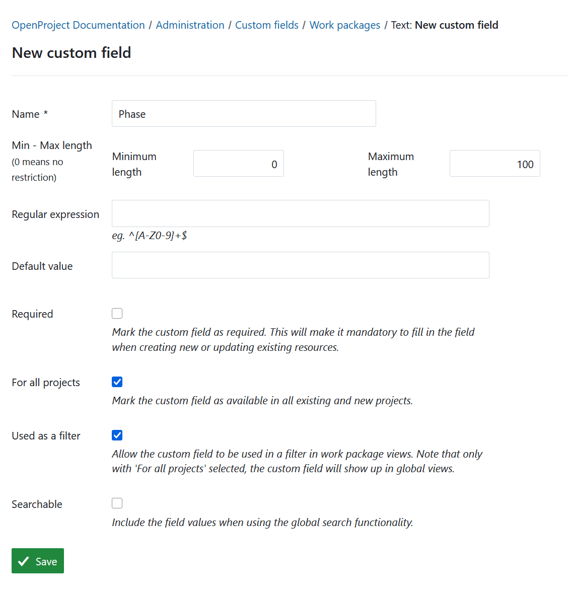
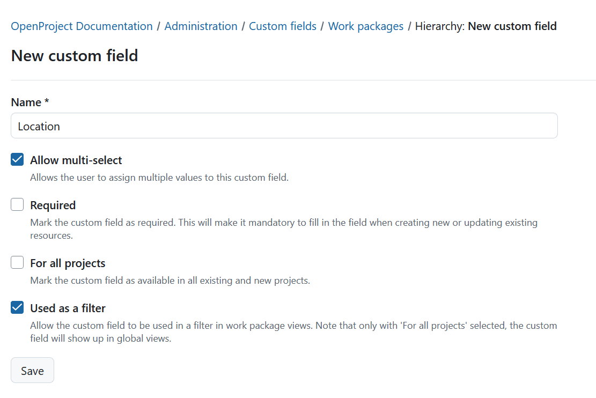
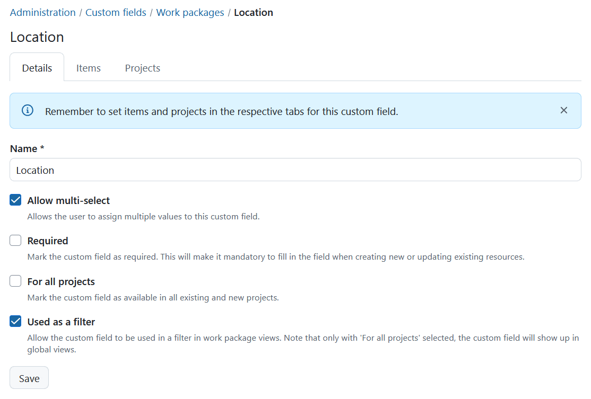
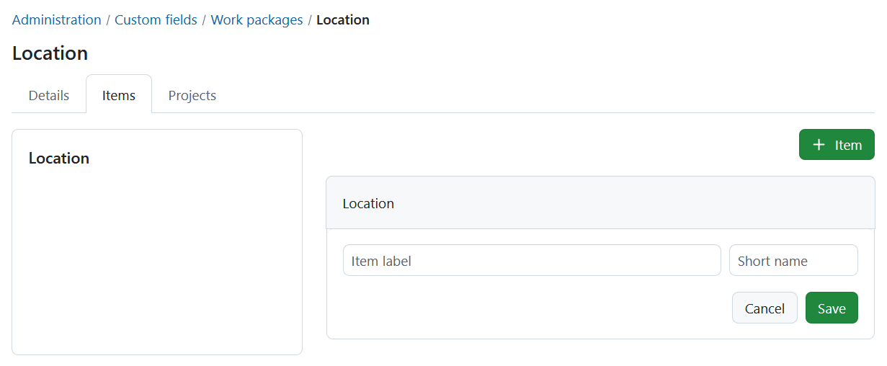
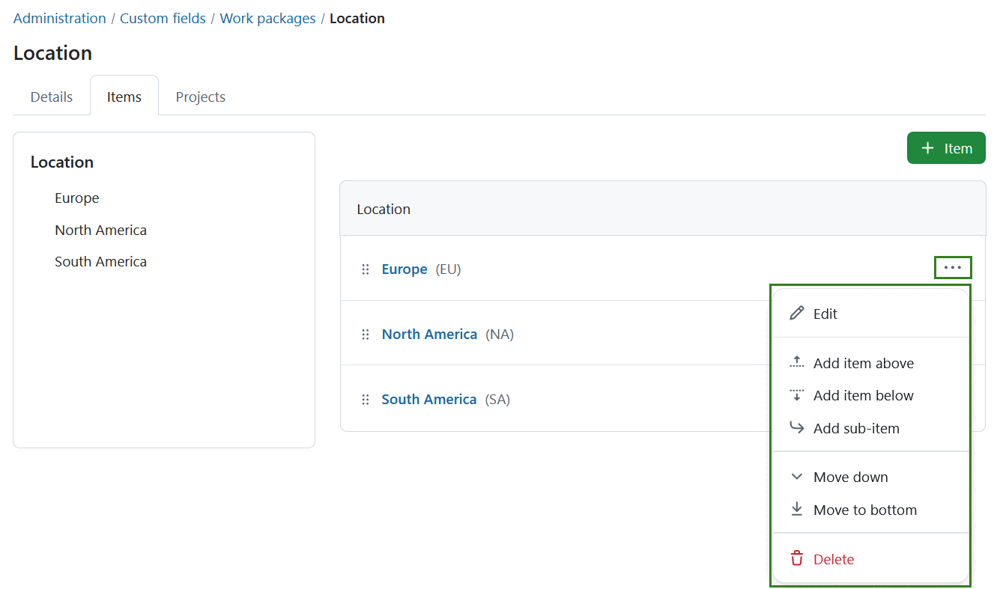
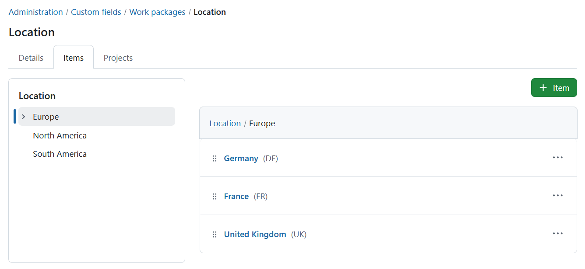
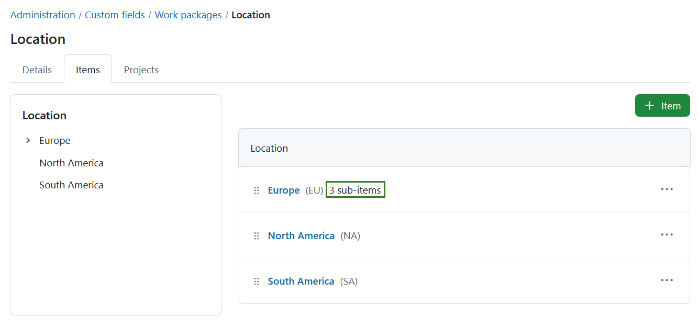
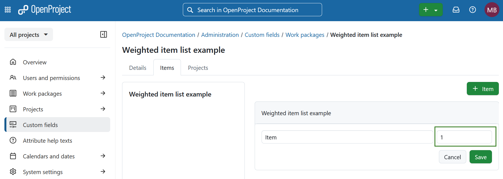
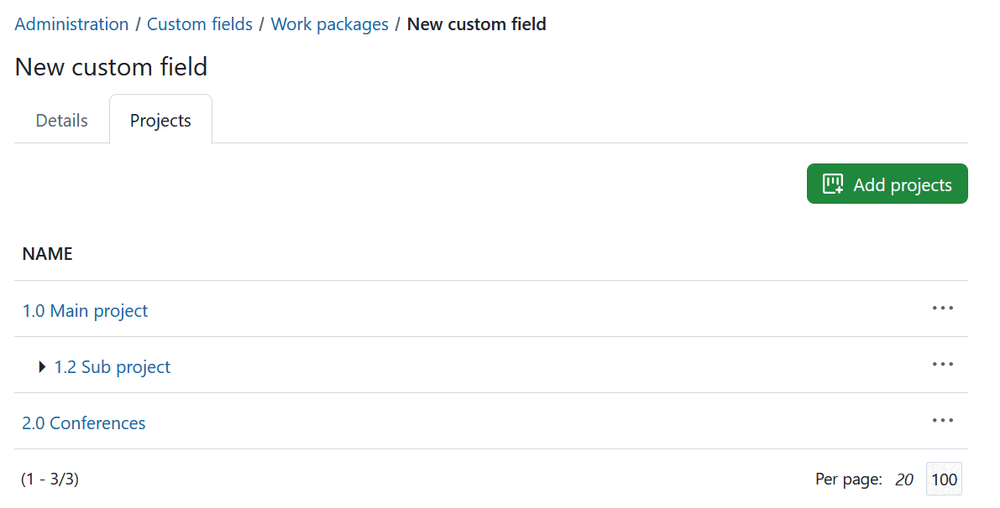
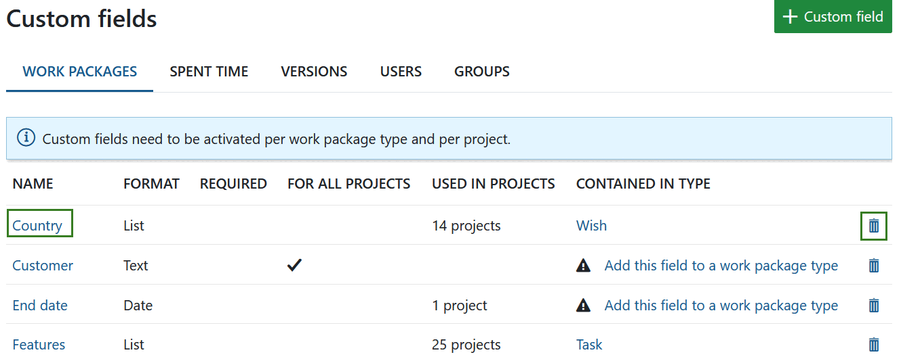

---
sidebar_navigation:
  title: Custom fields
  priority: 960
description: Manage custom fields in OpenProject.
keywords: manage custom fields
---
# Manage custom fields

You can **create additional custom fields for different sections**, e.g. work packages, projects, users or groups in OpenProject.

Custom fields enable to configure your OpenProject exactly to your needs, i.e. to adapt work package forms to your company specific requirements.

<video src="https://openproject-docs.s3.eu-central-1.amazonaws.com/videos/OpenProject-Forms-and-Custom-Fields-1.mp4"></video>

## Add a new custom field

To **create a new custom field** navigate to *Administration* -> *Custom fields* and select the section for which you will create a new custom field, e.g. for work packages.

You will see the list of all the custom fields that have been created so far, divided by the section on the different tabs for which they were created.

If none have been created so far, click on the link **Create a new custom field** in the respective section, e.g. on the tab for work packages and select the custom field format.

Depending on the module for which the new custom field is being created, slightly different options may be available. The example below shows a new custom field (with the **Text** format selected) for a **Work Package**.

> [!TIP]
> Depending on the format of the custom field, the fields to specify vary.

1. Custom field **Name**, which will appear as the attribute name on the work package form.
2. Specify the **minimal and maximal length**. If a 0 is chosen, no restriction will be imposed on the length of the custom field.
3. **Regular expression** specifying which values are allowed for the custom field.
4. **Default value** will be used as a default value for the custom field.
5. Set if the new custom field should be a **required** field.
6. Specify if the new custom field should be **used for all projects**. This means the custom field will be active for all projects and does not need to be activated separately per project.
7. Specify if the new custom field should be **used as a filter for work packages**. See [here](../../user-guide/work-packages/work-package-table-configuration/#filter-work-packages) how to filter work packages.
8. Specify if the new custom field should be **searchable** via the global search.
9. **Save** the new custom field.

## Custom field formats

There are multiple format options for custom fields in OpenProject. You can select one of the following formats:

- **Boolean** - creates a custom field for an attribute, that is either true or false. It is represented by a checkbox that can be checked or unchecked.
- **Date** - creates a custom field, which allows selecting dates from a date picker.
- **Float** - creates a custom field for rational numbers.
- **Hierarchy (Enterprise add-on)** - creates a custom field, which allows selecting one or multiple items from a hierarchical list structure. The structure can be created in the *Items* tab of the custom field. See more in the section below.
- **Integer** - creates a custom field for integers.
- **Link (URL)** - creates a custom field for URLs.
- **List** - creates a custom field with flat list options. 
- **Text** - creates a custom field in text format with the specified length restrictions.
- **Long text** - creates a custom field for cases where longer text needs to entered.
- **User** - creates a custom field, which allows selecting users that are allowed to access the entity containing the custom field.
- **Version** - creates a custom field, which allows selecting one or multiple versions. Versions are created on the project level in *Backlogs* module.
- **Weighted item list (Enterprise add-on)** - creates a custom field similar to the *Hierarchy* type, but with underlying numerical values used for project evaluation (e.g., [calculated values project attributes](../projects/project-attributes/)). Please keep in mind that **weighted item lists** custom fields can't be used as multi-select.  

### Hierarchy custom field (Enterprise add-on)

[feature: custom_field_hierarchies ]

Hierarchy custom fields allow organizing hierarchical structures in work packages by making use of multi-level select lists. To create a custom field of type **Hierarchy** follow the same steps as you would when [creating a standard custom field](#add-a-new-custom-field) and select **Hierarchy** format. You can then name the custom field, allow multi-select, specify if it should be a required field or used as a filter, and activate it for all projects. Click the **Save** button to proceed.

You can edit the name and initial settings under the *Details* tab. 

Under the *Items* tab you can specify which hierarchy items should be selectable for this specific custom field. Initially the list of items will be empty. To add items, click the **+Item** button. 

You can then specify labels and short names for each of the items you want to add. The short name can be used e.g. for an abbreviation of a name or another associated short description. The short name is optional and will be displayed next to the item label in brackets. 

All items you add here will constitute one hierarchical level. Once added, all items will be displayed in the hierarchy tree on the left side for easier navigation. 

You can add further levels to each of the items. Here you can edit the items, change the position in the list or delete the items. To do that click the icon with the three dots on the far right and select the respective option. You can also re-arrange the items by dragging and dropping.

You can add further hierarchical levels by clicking on the name of the item and adding the items same way you did on the first level. 

Once you have added sub-items, the number of nested items will appear next to the name of the parent item. In the hierarchy tree on the left, an **arrow icon** will be shown next to any item that contains sub-items. By default, these sub-menus are collapsed. Clicking the arrow icon will expand the view to show all associated sub-items.

You can add as many sub-times and hierarchy levels as you need. You can always navigate to the level you need by clicking the respective option from the hierarchy tree on the left or in the path displayed above the items.

Once you have specified all items for the hierarchy custom field, you need to: 

1. [Activate this custom field for projects under the *Projects* tab](#add-a-custom-field-to-one-or-multiple-projects)
2. [Assign a custom field to a work package type](../manage-work-packages/work-package-types/#work-package-form-configuration-enterprise-add-on) 

### Weighted item list custom field (Enterprise add-on)

[feature: weighted_item_lists ]

Weighted item list custom fields work much like the **Hierarchy** type. They also allow you to create a hierarchical structure of items for selection. To create a custom field of type **Weighted item list**, follow the same steps as when [creating a standard custom field](#add-a-new-custom-field) and select **Weighted item list** format.

Creating and editing items in a weighted item list work exactly like with a hierarchy custom field. Unlike **Hierarchy**, the items of a weighted item list do not have a **Short**, but instead have a **Weight**. 

This underlying numerical value is mandatory, and can be used for calculation - for example for the project attribute of type [**Calculated value**](../projects/project-attributes/). Due to this constraint, weighted item lists cannot be configured to be multi-select.

## Required custom fields

Custom fields can be configured as **required**. As the name suggests, **required** custom fields need to be filled out when a resource like a work package or a project is created. Without filling in a field, the user will be prevented from creating the resource.

The *required* flag can also be set on existing custom fields. This might lead to a problem for resources that existed before the flag was later set to required. For example, a work package might have already been created and worked with for some time. But because the field was not required before, it might not have been filled in. Once the custom field becomes 'required', the next user wanting to modify the work package *needs* to fill in the field. There are other scenarios where this might occur, for example, when the activation of a required custom field for a project or a work package type. 

In the above scenario of a required custom field being absent on existing resources, OpenProject will try to minimize the times in which users are blocked from performing their intended action. A user might want to change the name of the project with no value filled in for a required custom field. Since the interface for changing the name does not display the custom fields, the user cannot provide a value at this point and OpenProject will not enforce the *required* setting then.

Generally speaking, OpenProject will enforce the *required* characteristic whenever the UI displays the field but allows modifications when it does not. When creating a new resource, it will be enforced.

> [!NOTE]
> Prior to version 16.6, required custom fields were always enforced, even on existing resources. This led to some actions becoming impossible or unnecessarily hard to perform, which is why the behavior was adjusted.

## Create a multi-select custom field

For work package custom fields of type **List**, **User**, **Version** and **Hierarchy** you may also select **multi-select custom fields** to select more than one value at once.

To create a multi-select custom field follow the same steps as you would when [creating a standard custom field](#add-a-new-custom-field). Select format **List**, **User**, **Version** or **Hierarchy** and check the option *Allow multi-select*.

When using multi-select custom fields, you can add as many options as required. The cross icon next to an option will remove it from the selection. The check mark will save your changes.

## Assign a custom field to a work package type and project

> [!IMPORTANT]
> Custom fields need to be activated per work package type and added to a project. Work package custom fields are only visible when two conditions are met:
>
> 1. Custom field has been added to the work package type (form configuration).
> 2. Custom field is activated for the project.

### Assign a custom field to a work package type (Enterprise add-on)

You can [assign a custom field to a work package type](../manage-work-packages/work-package-types/#work-package-form-configuration-enterprise-add-on) (form configuration) directly via the link in the custom field overview.

> [!IMPORTANT]
> Starting with OpenProject 15.0, when adding new custom fields to a type through the  form configuration, the added custom fields will not automatically be enabled in all projects that have this work package type currently enabled.

### Add a custom field to one or multiple projects

You can activate the custom field for specific projects under the respective [project settings](../../user-guide/projects/project-settings/work-packages/#work-package-custom-fields). 

> [!TIP]
> This is not relevant if the setting **For all projects** has been configured for the custom field.

You can active a custom field for multiple projects at once by opening the custom field in question and selecting the *Projects* tab. Click the **Add projects** button.

Use the search field to identify the projects and select multiple projects at once. You can also include the sub-projects by checking the respective option. Click the **Add** button to active the custom fields in all of the selected projects.

## Edit or remove a custom field

To **edit an existing custom field** select the appropriate tab and click on the custom field name.

To **delete** a custom field, click on the delete icon next to the respective custom field in the list.

