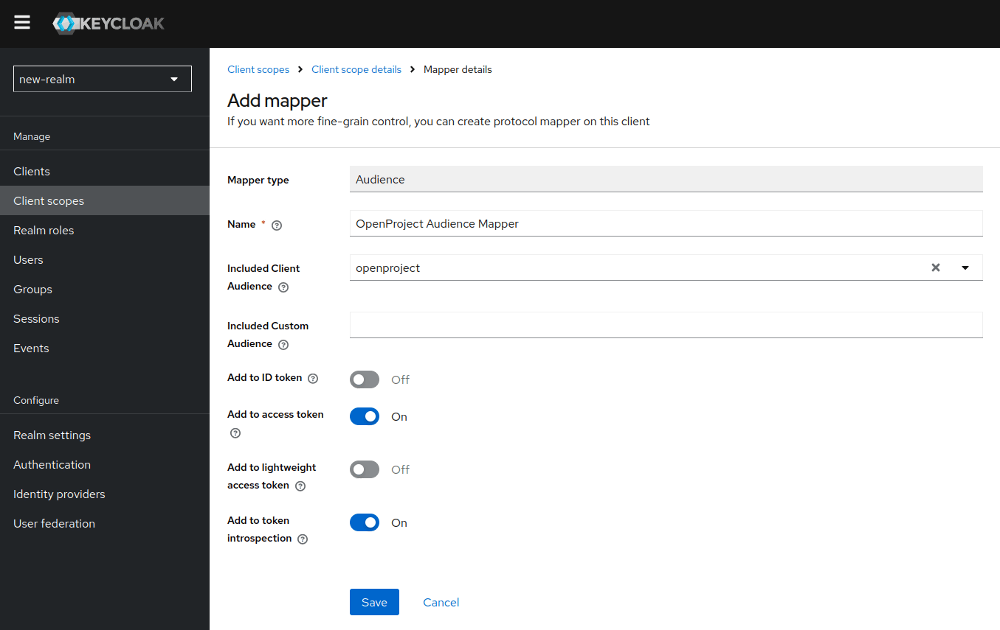
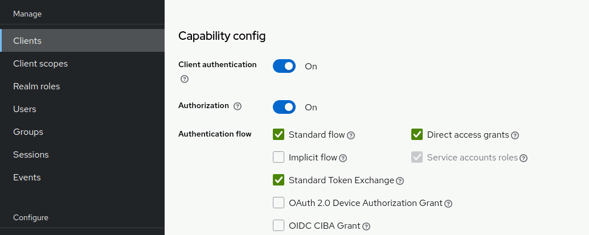
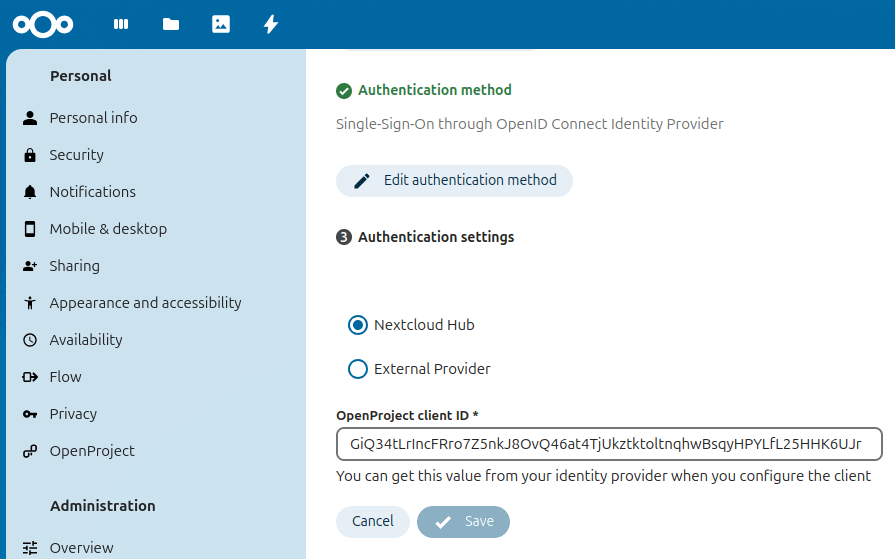

---
sidebar_navigation:
  title: Set up Single Sign-On through OpenID Connect Identity Provider
  priority: 900
description: Set up Single Sign-On through OpenID Connect Identity Provider as the authentication method for your Nextcloud storage
keywords: Nextcloud file storage integration
---

# Set up Single Sign-On through OpenID Connect Identity Provider (Enterprise add-on)

[feature: nextcloud_sso ]

This authentication mode will use access tokens provided by an identity provider shared among Nextcloud and OpenProject to authenticate requests performed in the name of users.

You will have to perform configuration in OpenProject, Nextcloud and in your chosen identity provider.

## 1. Prerequisites

To use SSO authentication between OpenProject and Nextcloud, a few prerequisites have to be met:

1. Users need to login to OpenProject and Nextcloud through the same identity provider
2. The identity provider needs to hand out compatible access tokens
3. The identity provider needs to allow long-term access (e.g. through the `offline_access` scope)

These requirements are explained in more detail below.

### User authentication

The requests between OpenProject and Nextcloud usually happen on behalf of a specific user. For example, when OpenProject requests a file, Nextcloud will need to make sure that the user for whom we download the file has access to it in the first place.

For that to be possible, the user must authenticate in both applications through the same identity provider.

Additionally, the user account has to be created in both systems already at the time of the request. Right now this requires users to log in to both systems at least once. In the future, the initial creation of accounts will also be automated.

### Token compatibility

The identity provider will need to hand out JWT-encoded access tokens that can be validated according to the rules of [RFC 9068](https://www.rfc-editor.org/rfc/rfc9068). Such tokens indicate which application they are allowed to be used  in (the so-called Token _Audience_) and can be validated by an application mostly without performing additional web requests to the identity provider.

It must be possible for OpenProject to obtain an access token that includes the Nextcloud client in the audience and vice versa, to allow making requests between the two applications. This has to be supported in one of two ways by the identity provider:

1. It allows performing _OAuth 2.0 Token Exchange_ according to [RFC 8693](https://www.rfc-editor.org/rfc/rfc8693)
2. Alternatively, it provides tokens with the necessary audience during initial SSO authentication of the user

Token exchange is generally the more secure option, since it allows stricter control by the identity provider which application can obtain tokens to make requests to other applications. It's usually harder to use leaked access tokens of this kind for privilege escalation. However, depending on the provider, the latter option may be easier to set up.

### Long-term access

OpenProject relies on the ability to retain access to issued tokens over a long duration. This means that issued refresh tokens should not expire under normal circumstances. This is usually achieved by requesting the `offline_access` scope from the identity provider.

## 2. Configuring supported identity providers

The integration between OpenProject and Nextcloud has been tested with the following identity providers, which we consider officially supported:

* Keycloak
* Nextcloud Hub

Other identity providers might work as well, but we have only limited capacity to assist with their setup. The Keycloak instructions should explain all the general steps necessary to make it work, but the exact way to configure it for your identity provider will likely differ.

### Keycloak

Keycloak can provide tokens via Token Exchange, as well as immediately after user sign-in. Using Token Exchange is preferred, because it works
with tokens that grant more narrow access.

Alternatively, it's also possible to use wide-access tokens, i.e. configure the access token that is handed out after user sign-in to also grant access to other applications.

#### Common setup steps

Regardless of how tokens are handed out, you need to configure the clients correctly. Assuming that users can already sign in
to your OpenProject and Nextcloud instances via Keycloak, you should already have configured a client for both applications. For the rest of
this guide, we will assume that these clients exist with the client ID `openproject` and `nextcloud` respectively.

To make requests to the API of OpenProject, a client needs to obtain a token with the scope `api_v3`. We need to configure this client scope
in Keycloak, so that the Nextcloud client can obtain it. We will also need an additional scope that extends the audience of the OpenProject
token.

First, navigate to "Client scopes", click the "Create client scope" button and name the scope `api_v3`. Make sure
to enable the option "Include in token scope", then save the form. Create a second client scope with a name of your choice, for example
`add-nextcloud-audience`. For this scope "Include in token scope" is not necessary, though it can be helpful for your own debugging.

These scopes do not have any effect yet, we have to add a mapper first. Navigate to the "Mappers" tab of the `api_v3` scope, Click "Configure a new mapper" and select "Audience". Give the mapper a name of your choice and make sure to select `openproject` in "Included Client Audience". This will make sure that tokens with the `api_v3` scope, will get an additional audience of `openproject`:



Afterwards repeat the same steps for the `add-nextcloud-audience` scope, choosing the `nextcloud` audience there.

This makes the scopes ready to use. How we use them depends on the way that tokens are handed out to clients.

#### Keycloak using Token Exchange

##### Configuring Keycloak

We need to enable Token Exchange for both clients. Navigate to the `openproject` client, scroll down to "Capability config" and enable
the Authentication flow "Standard Token Exchange". Do the same for the `nextcloud` client:



The `nextcloud` client requires an additional configuration step, where we allow to directly exchange a refresh token, instead of just an access token.
From the `nextcloud` client, go to the tab Advanced and scroll down to the section "OpenID Connect Compatibility Modes". Set
the option "Allow refresh token in Standard Token Exchange" to "Same session":


We will need to allow OpenProject to exchange tokens with `nextcloud` in the audience, as well as allowing Nextcloud to exchange tokens with `openproject` in the audience. Additionally Nextcloud tokens need to include the `api_v3` scope so that they are usable for requests against OpenProject's API.

Navigate to "Clients", choose `openproject` and then go to the Tab called "Client Scopes". Press the button to "Add client scope" and select the `add-nextcloud-audience` scope, make sure it is set to "Optional", so that the scope is only included when it was requested. Afterwards go to the `nextcloud` client and add the scope `api_v3` there the same way.

Both clients are now able to request the given scopes during token exchange.

##### Configuring OpenProject

In OpenProject we need to configure the ID of the Nextcloud client (in our example: `nextcloud`) as the "Storage Audience".
This will make sure that OpenProject will attempt to exchange a token for that audience before making requests to Nextcloud.

We also need to request the previously created `add-nextcloud-audience` scope during Token Exchange. To do that configure the "Storage Scope" to `add-nextcloud-audience`:


##### Configuring Nextcloud

In Nextcloud we need to configure that we are using an "external provider" by selecting the corresponding radio button in the authentication settings of the OpenProject integration. Select the OIDC provider that we are using as a common identity provider from the dropdown.
After enabling the toggle called "enable token exchange", you have to set the client ID of OpenProject as it's configured in Keycloak (in our case: `openproject`):


Additionally we need to configure the OpenID Connect provider in Nextcloud. Navigate to "Administration", and choose "OpenID Connect" from the sidebar. You should see a list of your configured OpenID Connect providers. At the top of that page enable the checkbox called "Store login tokens". This setting is required by Nextcloud to allow using tokens obtained during login for token exchange or requests to other services.

This wraps up the configuration of this authentication method using Keycloak and token exchange. For details on the next step continue with the [general setup instructions](../#4-automatically-managed-project-folders).

#### Keycloak using wide-access tokens

##### Configuring Keycloak

We will add the previously prepared client scopes that result in the inclusion of an additional audience to the tokens returned during user authentication. This will cause OpenProject to receive tokens with an additional `nextcloud` audience and Nextcloud to receive tokens with an additional `openproject` audience as well as the `api_v3` scope.

Navigate to the Nextcloud client, open the "Client Scopes" tab of the client and click "Add client scope". Then select the `api_v3` scope and add it as a "Default" scope:


Adding the scope as a default scope means that it doesn't have to be explicitly requested by the client, but will be implicitly included whenever requesting a token. Lastly repeat the same steps on the OpenProject client, adding the `add-nextcloud-audience` scope.

##### Configuring OpenProject

In OpenProject configure the storage to "Use first access token obtained by identity provider". This means OpenProject will not attempt to perform a token exchange, but simply use the first token returned by the identity provider for authentication against the storage as well:


##### Configuring Nextcloud

In Nextcloud, we need to configure that we are using an "external provider" by selecting the corresponding radio button in the authentication settings of the OpenProject integration. Select the OIDC provider we’re using as the common identity provider from the dropdown.
Make sure to leave the toggle "enable token exchange" disabled:


Additionally, we need to configure the OpenID Connect provider in Nextcloud. Navigate to "Administration" and choose "OpenID Connect" from the sidebar. You should see a list of your configured OpenID Connect providers. At the top of that page enable the "Store login tokens" checkbox. This setting is required by Nextcloud to allow using tokens obtained during login for token exchange or requests to other services.

This wraps up the configuration of this authentication method using Keycloak without token exchange. For details on the next step continue with the [general setup instructions](../#4-automatically-managed-project-folders).

### Nextcloud Hub

In the Nextcloud Hub use case, Nextcloud fulfills two roles:

* It acts as a storage provider, just as usual
* It acts as the identity provider

This deployment is simpler than running a dedicated identity provider, because it requires deployment and configuration of fewer applications.

This guide will cover the setup related to using Nextcloud as a storage provider and will assume that it was already configured to be the OpenID Connect Provider of OpenProject.

#### Configuring OpenProject

In OpenProject, configure the storage to "Use first access token obtained by identity provider". This means OpenProject will not attempt to perform a token exchange, but simply use the first token returned by the identity provider for authentication against the storage as well:


#### Configuring Nextcloud

In Nextcloud, we configure the OIDC provider to be "Nextcloud Hub". In the field "OpenProject client ID" you have to set the client ID of OpenProject as it's configured in Nextcloud (in the sidebar select "Security" and then scroll down to "OpenID Connect clients"):



Additionally we need to make sure that the settings of the OIDC Identity Provider app allow to use the tokens for communication across applications. Navigate to "Administration settings" and select "Security" from the sidebar, then scroll down to "OpenID Connect clients".
For the client of the OpenProject application make sure that the signing method is set to RS256 and the "Access Token Type" is "JWT Access Token (RFC 9068)". These two settings allow OpenProject to validate the tokens when it receives them in API requests. Afterwards scroll down to the
section "Settings" and set the "Refresh Token Expire Time" to "Never". Non-expiring refresh tokens are a requirement by OpenProject right now.

Furthermore we need to configure Nextcloud to accept the access tokens it issued to us itself. This can only be enabled via an OCC command
on the command line:

```shell
occ config:system:set user_oidc --type boolean --value="true" oidc_provider_bearer_validation
```

General information about running OCC commands [can be found in the Nextcloud documentation](https://docs.nextcloud.com/server/stable/admin_manual/configuration_server/occ_command.html).

This wraps up the configuration of this authentication method using Nextcloud Hub. For details on the next step continue with the [general setup instructions](../#4-automatically-managed-project-folders).

## 3. Migrating from Two-way OAuth 2.0 authentication

It is possible to migrate an existing storage to use SSO authentication. You can follow the steps outlined above for your specific setup, all of the relevant options
in OpenProject and Nextcloud are also accessible from the views to edit your storage.

Please note that all the [prerequisites](#1-prerequisites) mentioned above still apply. This means if your users don't already authenticate to OpenProject and Nextcloud through the same
identity provider, you will have to migrate them to a common identity provider first.

If you want to go back to Two-way OAuth 2.0 authentication, this is possible as well, but will require you to reconfigure the integration, so your users will have to
reapprove the corresponding consent screens.
