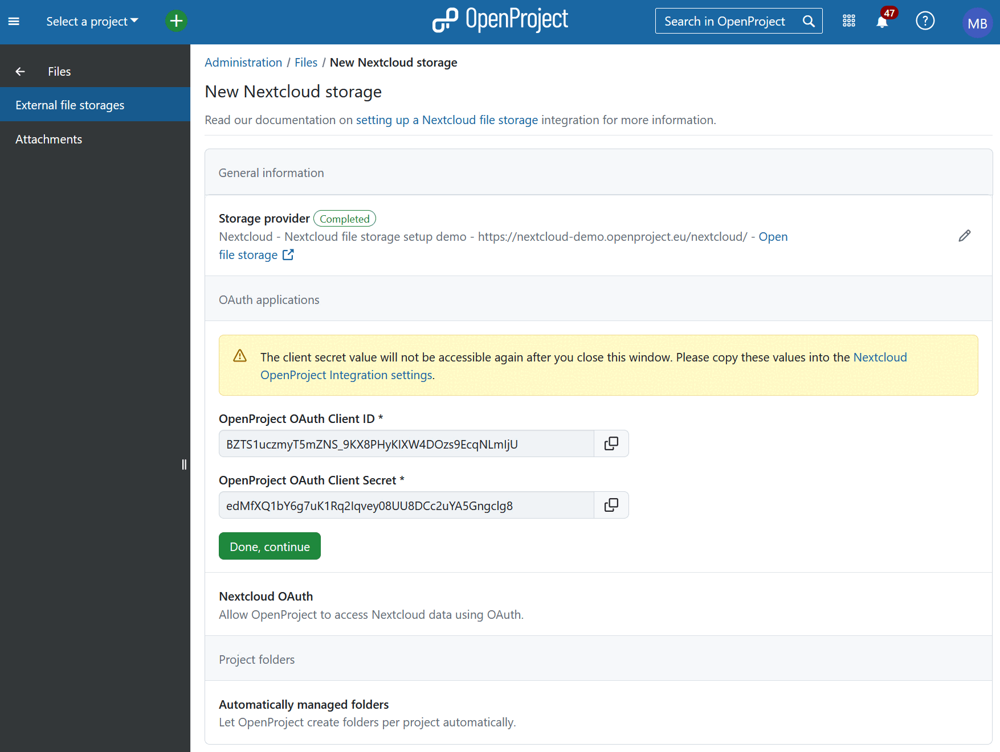

---
sidebar_navigation:
  title: Set up Two-way OAuth 2.0 authentication
  priority: 800
description: Set up Two-way OAuth 2.0 authentication as the authentication method for your Nextcloud storage
keywords: Nextcloud file storage integration
---

# Set up Two-way OAuth 2.0 authentication

This authentication mode uses access tokens provided by an OAuth application on either side of the integration between OpenProject and Nextcloud to authenticate requests performed in the name of users.

You will need to perform configuration in OpenProject and in Nextcloud.

## 1. Enter OpenProject OAuth values in Nextcloud settings

After selecting and saving the authentication method in OpenProject, you will see a form with two text fields that show a **client ID** and a **client secret** that belong to the OAuth application that OpenProject has just automatically created.

These values are required to permit Nextcloud to connect to OpenProject.

> [!IMPORTANT]
> These generated values are not accessible again after you close the window. Please do not navigate away from this page before copying them over to Nextcloud, as instructed below. Treat these values with care, as you would an important password. Please do not share them with anyone.

Go back to the browser tab where you were configuring the **OpenProject Integration** app. (We recommend keeping two browser tabs open: one for OpenProject and one for Nextcloud).

Copy the two generated values (client ID and secret) from the OpenProject tab into the corresponding fields in Nextcloud, namely **OpenProject OAuth client ID** and **OpenProject OAuth client secret**.

Once you have copied the values, click on **Save** to proceed to the next step.

## 2. Enter Nextcloud OAuth values in OpenProject

On the page that appears, you will see new OAuth values that are again generated automatically, this time by Nextcloud.

OpenProject will need these values to be able to connect with your Nextcloud instance.

As in the previous step, copy these two generated values (**Nextcloud OAuth client ID** and **Nextcloud OAuth client secret**) and paste them into OpenProject.

Navigate back to your OpenProject tab and click the **Done, continue** button on the screen you previously left it. You will now see a screen where you will be able to enter the Nextcloud values.

Once you have entered the client ID and client secrets on this page, click on **Save and continue**.

This wraps up the configuration of the authentication method. For details on the next step, continue with the [general setup instructions](../#4-automatically-managed-project-folders).
