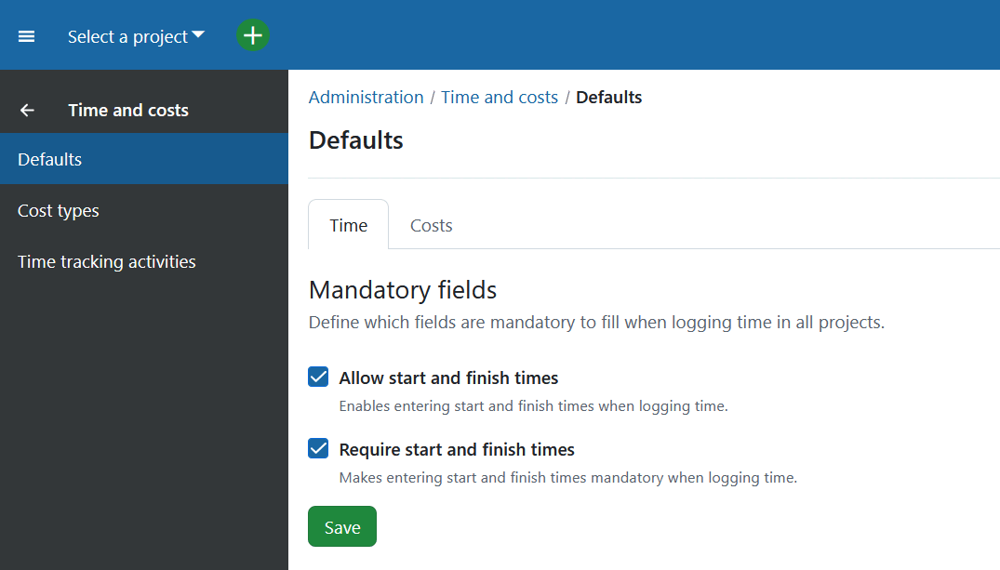
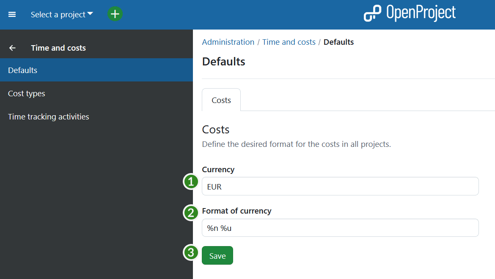
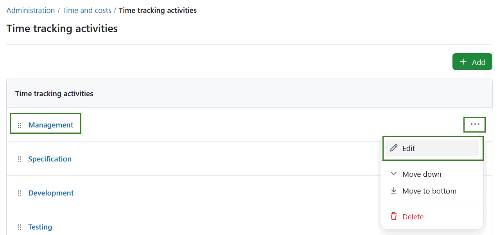

---
sidebar_navigation:
  title: Time and costs
  priority: 850
description: Define cost types and change the currency in OpenProject.
keywords: cost type, currency, time and costs, budget
---
# Time and costs

Navigate to *Administration* -> *Time and costs*. Here you can configure costs in OpenProject and create cost types to track unit costs. Also, you can configure the currency you want to use for your cost reports.

## Default time and cost settings

To define default settings for logging time and costs navigate to *Administration* -> *Time and costs* -> *Defaults* and select *Time* or *Costs* tab respectively.

### Define default time settings (Enterprise add-on)

[feature: time_entry_time_restrictions ]

Under the *Time* tab you can define which fields are required to be fill out when logging time across all projects. 

- **Allow exact times tracking**: enables entering start and finish times when logging time.  If disabled, only the amount of time spent can be logged, but not the start or end times. 
  
  If this option is activated, calendar mode is shown by default under My time tracking page. If not, list view will be shown by default.
  
- **Require exact times**: makes entering start and finish times mandatory when logging time.

### Define default cost settings

1. Configure the **currency used in the system, e.g. EUR**.
2. **Specify the format of the currency**, if the number should be before or after the currency, e.g. 10 EUR, or $ 10.
3. Press the **Apply** button to save your changes.

## Create and manage cost types

You can create and manage **cost types** to [book unit costs to work packages in OpenProject](../../user-guide/time-and-costs/cost-tracking/).

Navigate to *Administration* -> *Time and costs* -> *Cost types* to create and manage unit costs types.

Click the green **+ Cost type** button to create a new cost type.

You can set the following options:

1. Enter a **name** for the cost type.
2. Define the **unit name** for this cost type, e.g. Euro, piece, day, etc.
3. Set the **pluralized unit name**, e.g. Euros, pieces, days, etc.
4. Choose if the cost type should be the **default cost type** when booking new unit costs.
5. Define the Rate history and **set a date** from which this cost type should be valid and **set a rate** (in the specified unit) for this date.
6. With the + icon you can add **additional rates for other dates**.
7. The delete icon will **remove a rate** for a certain date.
8. Do not forget to **save** your changes.

In the overview list of all cost types you can define the following.

1. **Filter for cost types at a certain fixed date** in the list
2. Choose whether also locked cost types should be displayed
3. Press the **apply** button: This way you will get the cost types with the rate (at the chosen fixed date) displayed in the list below.
4. Click on the name of a cost type to **edit an existing cost type**.
5. **Set a current rate** (for the current valid from period) and press the save icon to apply it.
6. **Lock** a cost type.

> [!TIP]
> Please note that you **can only lock but not delete** cost types.

> [!NOTE]
> With cost types you can also book any kind of units to work packages, e.g. vacation days, leaves, travel days, etc.. Just choose 1 as a unit. This way, you could e.g. track vacation days against a vacation budget and evaluate the days in the [cost reporting](../../user-guide/time-and-costs/reporting/).

## Create and manage time tracking activities

To get an overview of existing values for time tracking activities, navigate to *Administration -> Time and Costs -> Time tracking activities*. You can adjust the items within the list by using the options behind the **More (three dots)** menu on the right side. You can also re-arrange the order by using the drag-and-drop handle on the left. 

> [!NOTE]
> To activate the [Activities for time tracking](../../user-guide/projects/project-settings/activities-time-tracking) in a certain project, navigate to *Project settings -> Time tracking activities*.

### Create new time tracking activity

To create a new value, select the **+ Add** button in the top right corner.

You will then be able to name the value and activate it. Press the **Save** button to save your changes.

### Edit or remove time tracking activity

To **edit** an existing configuration either click on the name of the activity directly or select the **Edit** option from the **More (three dots)** menu on the right end of the row.

To remove a time tracking activity, open the **More (three dots)** menu on the right end of the row and click on the **delete icon**.

> [!NOTE]
> To activate the [Activities for time tracking](../../user-guide/projects/project-settings/activities-time-tracking) in a certain project, navigate to *Project settings -> Time tracking activities*.
