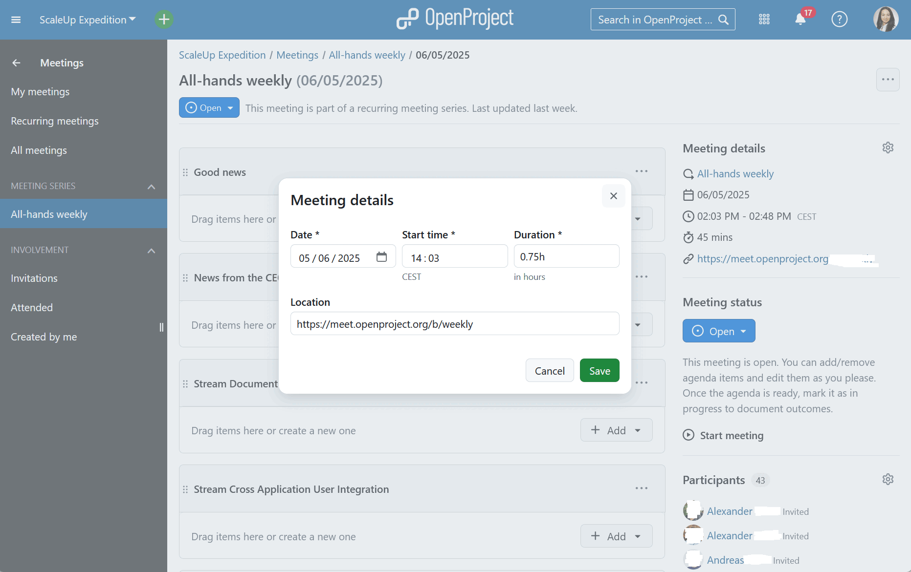
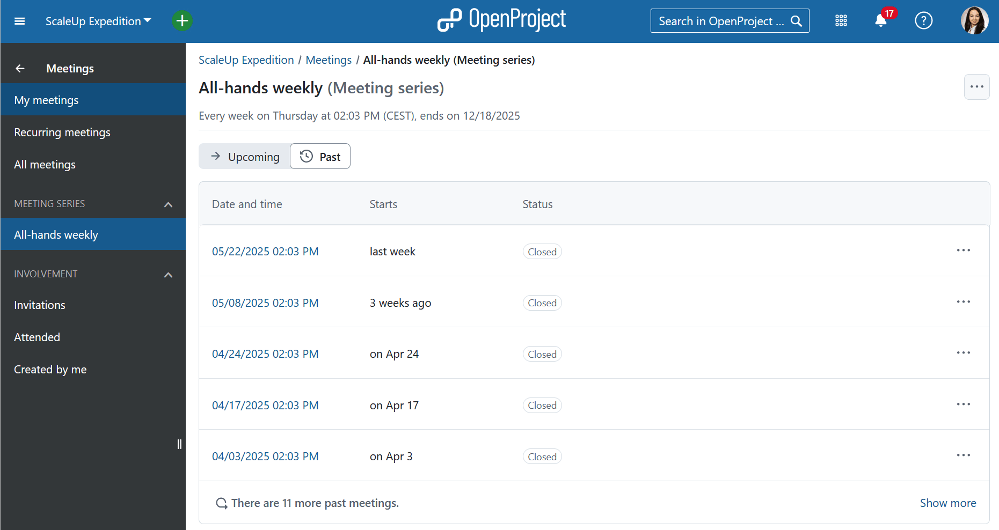

---
sidebar_navigation:
  title: Meeting management
  priority: 999

description: Meeting management in OpenProject
keywords: meetings, meeting management, use case, use-case, agenda
---

# Meeting management with OpenProject

At OpenProject, we manage internal team coordination using the very tools we build. We actively use the [Meetings module](https://www.openproject.org/collaboration-software-features/meeting-management/) in our daily work at OpenProject. It’s a key part of how we plan, collaborate, and follow up — and it saves us real time and effort.

**Key benefits we rely on**:

- **Time-saving templates**: Recurring meetings with agenda templates to reduce manual setup
- **Shared ownership**: All participants contributes to the agenda
- **Live editing & linking of work packages**: Stay focused and in context
- **Agenda backlog**: Park topics for future discussion — without losing them

This use case shows how we run our **weekly all-hands team meetings** with the **Meetings module**, using recurring meetings, collaborative agenda building, and integrated follow-ups.

------

## Set up recurring meetings with agenda templates

We create a **recurring meeting series** to maintain a consistent rhythm for our weekly team sync. We define the participants, the schedule and the meeting room link.

We then configure a **template agenda** to structure our recurring weeklies. Every new meeting will be based on this template. It includes sections like:

- **Good news** – a space where everyone can share exciting updates about OpenProject in the past week
- **News from the CEO** – our CEO highlights any company-wide updates
- **Team updates** – each team gives a short summary of what they've been working on
- **Customer and user feedback** – we highlight notable user feedback, especially on newly released features
- **[Core values](https://www.openproject.org/blog/core-values-openproject/)** – a moment to recognize each other and reflect on how we embody our values
- **Roadmap outlook** – a look at upcoming initiatives and changes

This setup saves time and ensures a clear structure. Of course, we can still add topics that are specific to a particular week.

------

## Collaborate on agenda building

Throughout the week, team members add agenda items directly to the upcoming meeting. We also link **work packages** (for example, features and epics we work on) to agenda items — especially helpful for development updates. This keeps discussion connected to actual work and allows anyone interested to go explore the original specifications.

If there are topics that we don't get to or that need to moved out of the day's agenda, we use the **Series Backlog**. This is a parking lot shared with all occurrences of a meeting series for topics and issues that aren’t urgent. It appears in every agenda, so we can easily pull in topics when time allows.

------

## Run the meeting: live, linked, and structured

During the meeting, we project the agenda live for everyone to follow. Each item includes links to tasks, documents, or discussions. We can edit the agenda in real time and document outcomes directly.

If someone adds a last-minute agenda item just before the meeting (or even during), the system shows a helpful banner saying that something was changed by another user and reminding the person viewing the agenda (including the one projecting) that they should reload the screen. This makes it easy to refresh the agenda and stay on track.

------

## Document important decisions

We document **meeting outcomes** right after the meeting (or live during it). These include decisions, notes, and follow-ups — often linked directly to **work packages**. This ensure that next steps are clear and actionable. 

When we add meeting notes or document outcomes for agenda items that have linked work packages, that information is also directly visible from within each work package via the 'Meetings' tab. This makes it easier to find related discussions and decisions.

Nothing gets lost, and action items stay tied to project workflows.

------

## Easy access for follow-up

Meeting minutes are always available for team members who couldn’t attend — whether because they on vacation, busy with client work, or sick on leave. It’s easy to catch up on what was discussed, what was decided, and what the next steps are. All team members can navigate to the Meetings module and click on  "All-hands weekly" from the menu on the left. They will then see a list of all past meetings so they can easily catch up.

This keeps everyone aligned, even when not everyone is in the room.

## Why it matters

Using the Meetings module helps us keep our communication clear, our priorities visible, and our teams aligned. It’s not just a tool for note-taking — it’s a shared workspace that supports structure, transparency, and accountability across the entire company. By integrating meetings with our projects, we turned a routine process into a driver of clarity and momentum.

For more information on how to use the module, you can read our [documentation on the Meetings module](../../user-guide/meetings).
