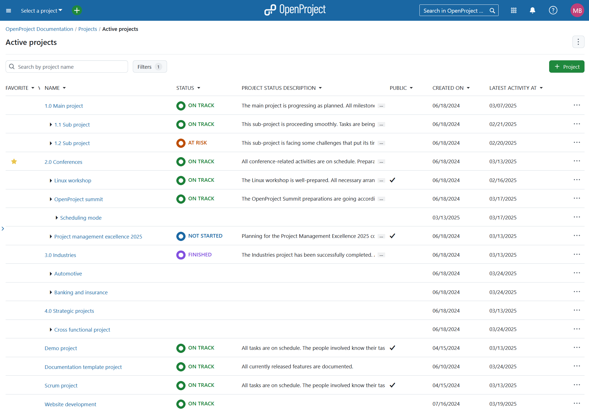
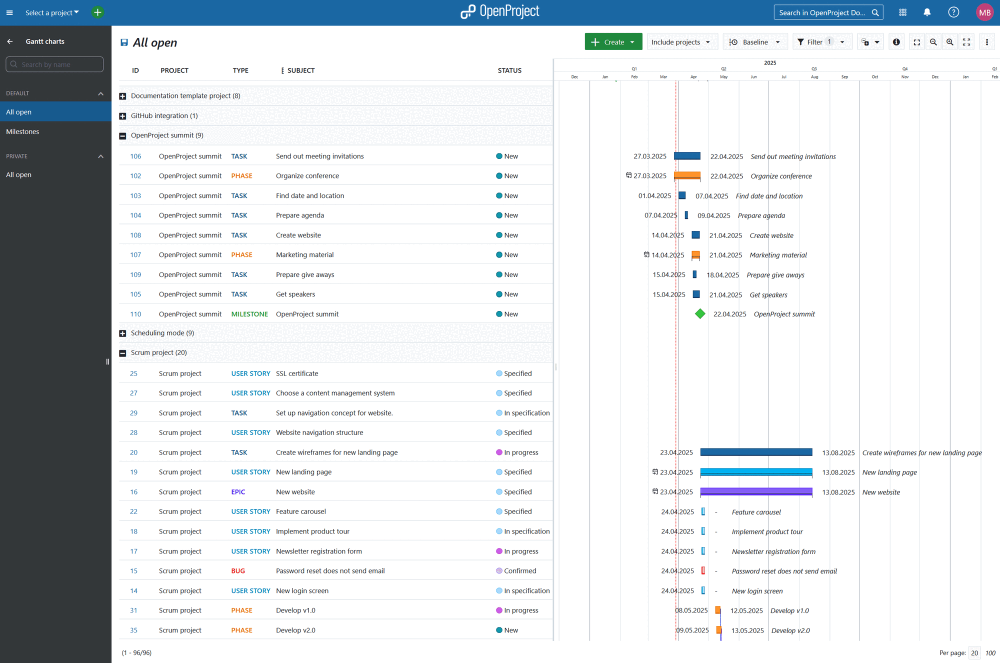
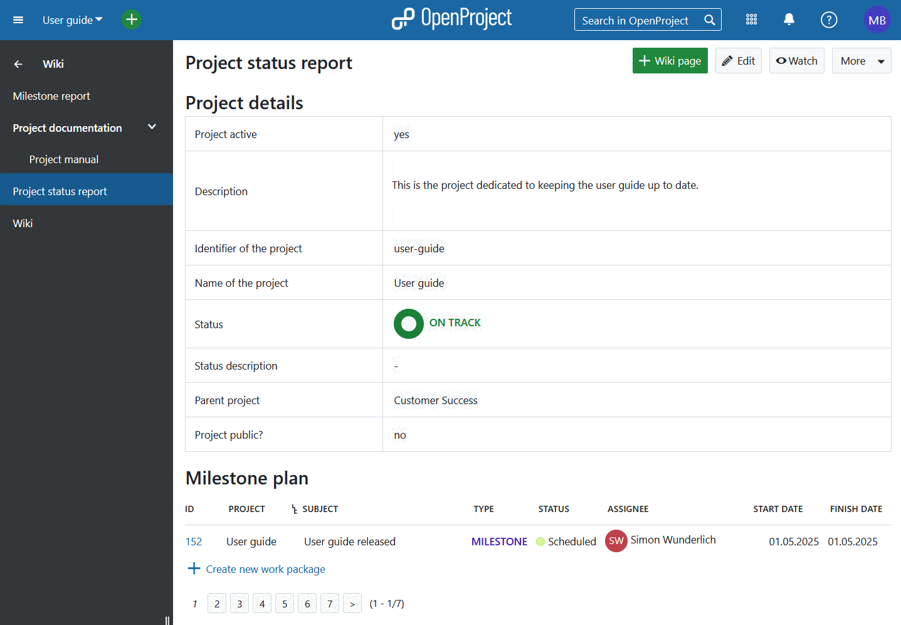
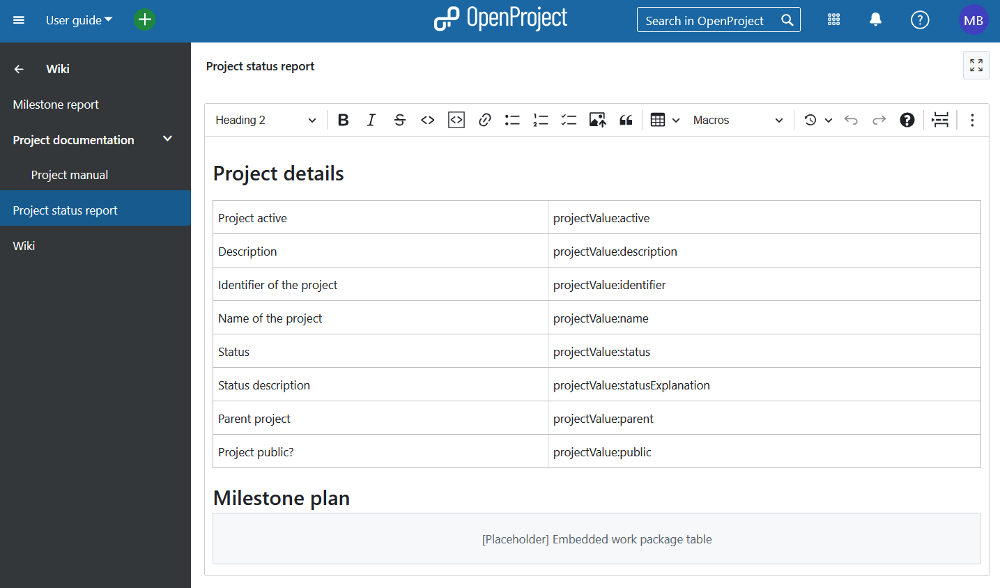

---
sidebar_navigation:
  title: Portfolio management and custom reporting
  priority: 990
description: Step-by-step instructions about portfolio management and custom reporting
keywords: use-case, portfolio management
---

# Use Case: Portfolio management and custom reporting options

If you have a lot of projects running at the same time it can be helpful and even necessary to have a meta-level overview of your projects, keep track of the project status and due dates. With OpenProject you can do just that.

## Create projects overview

### Access project list

To view all projects, first select the **Select a project** dropdown menu, then click on the **Project lists** button. 
You can also get to projects overview by selecting **Projects** from the [global modules](../../user-guide/home/global-modules) menu in the top right corner.

### Filter and sort projects

You will see a list of all projects within your organization. You can filter this list by various attributes, such as **Project owner** or **Created on**. Additionally, project custom fields can be used as filters (Enterprise add-on). If you haven't added custom fields yet, follow the instructions [here](../../system-admin-guide/custom-fields/).

You can further adjust this view by adding or re-arranging columns and changing the sorting order. To sort the project list, click on a column heading, such as **Status**. Read more about [configuring project lists](../../user-guide/projects/project-lists/#configure-project-lists-view). 

After you have adjusted the projects overview to your liking, you can save it, 
[export it](../../user-guide/projects/project-lists/#export-project-lists) or 
[share it with key stakeholders](../../user-guide/projects/project-lists/#share-project-lists).

### Projects in Gantt view

You can add a visual component to the overview by clicking on the **Open as Gantt view** button.

The **Gantt charts** module will open and the selected projects will be displayed in Gantt view.

You can configure this view using the button with the three dots in the upper right corner and select **Configure view**. Find out more about [Gantt charts configuration](../../user-guide/gantt-chart/#gantt-chart-configuration).

## Create custom reports

### Export project reports

For creating custom project reports you can use the export function in the work packages table view or in the Gantt charts view.

You can export the work packages in one of the following formats: PDF, XLS and CSV. Read more about [exporting work packages in OpenProject](../../user-guide/work-packages/exporting/#export-multiple-work-packages).

To export or print a Gantt chart, use the print function (**CTRL+P**) and then save it as a PDF. Only information displayed in the main screen area is included. Design elements, side menus, and top menus are excluded. Please see here [how to print a Gantt chart in OpenProject](../../user-guide/gantt-chart/#how-to-print-a-gantt-chart).

### Project status reporting

You can [display and configure the individual project status](../../user-guide/projects/project-status/) on the project overview page.

For more advanced project reporting requirements, using the [Wiki module](../../user-guide/wiki/) is another powerful tool. The Wiki allows you to build complete custom reports using embedded work package tables, macros and even embedded calculations.

Here is an example of how a project report wiki could look:

And how the dynamic data, such as calculations, filters, macros and reference language work behind the scenes:

For more information about the syntax and how the attributes work, please look [here](../../user-guide/wysiwyg/).

If you want to work with multiple Wiki-based reports, you can create a parent Wiki page as a table of contents, for example, on which all the other reports are listed.

See more info on Wiki and the use of Macros [here](../../user-guide/wiki/).
