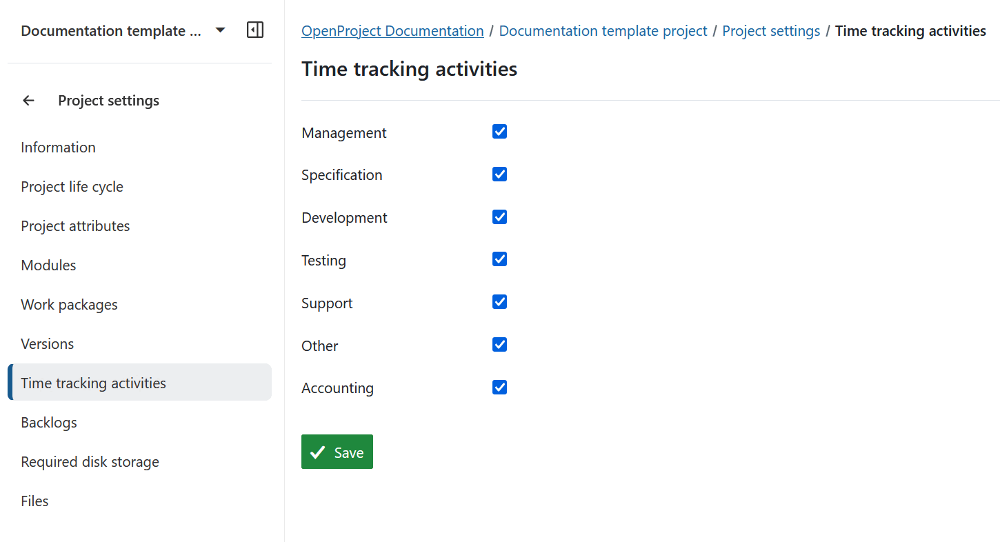

---
sidebar_navigation:
  title: Time tracking activities
  priority: 400
description: Manage activities for time tracking.
keywords: activities for time tracking, log time settings
---
# Manage activities for time tracking

You can [configure available activities](../../../../system-admin-guide/time-and-costs/#create-and-manage-time-tracking-activities) for time tracking in *Administration -> Time and costs -> Time tracking activities*. You can activate or deactivate time tracking activities per project.

**Time tracking** is defined as a module which allows users to log time on work packages. Once the time tracking module is activated, time can be logged via the action menu of a work package.

To enable time tracking activities for a specific project, navigate to *Project settings -> Time tracking activities*.

Select the activities which you want to activate for time tracking in your project. Press the **Save** button to apply your changes.

