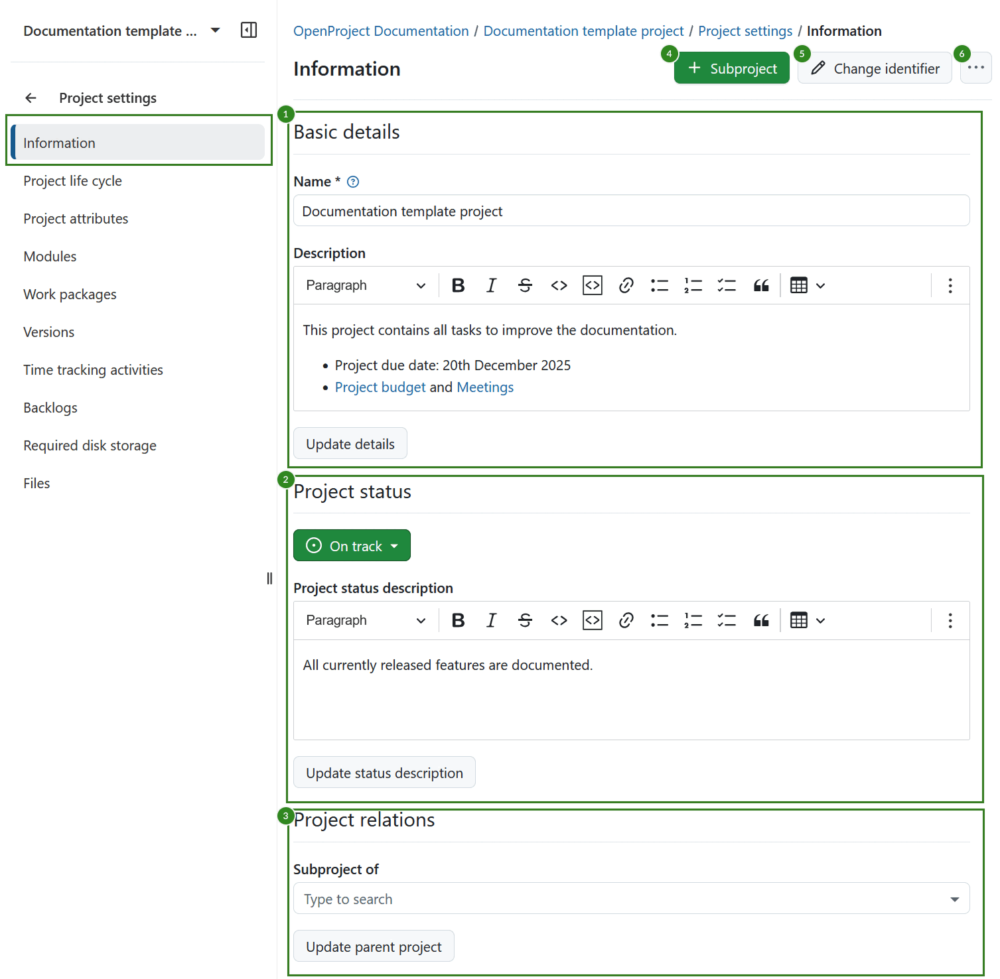
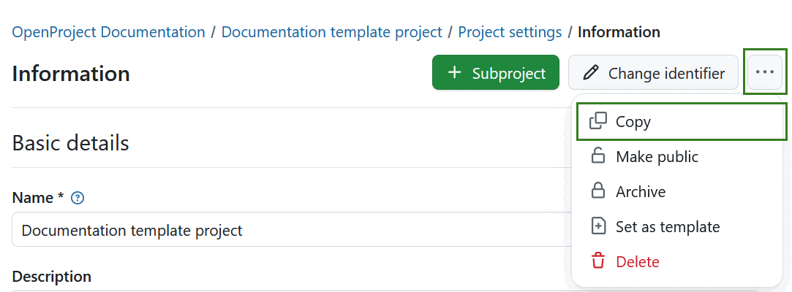
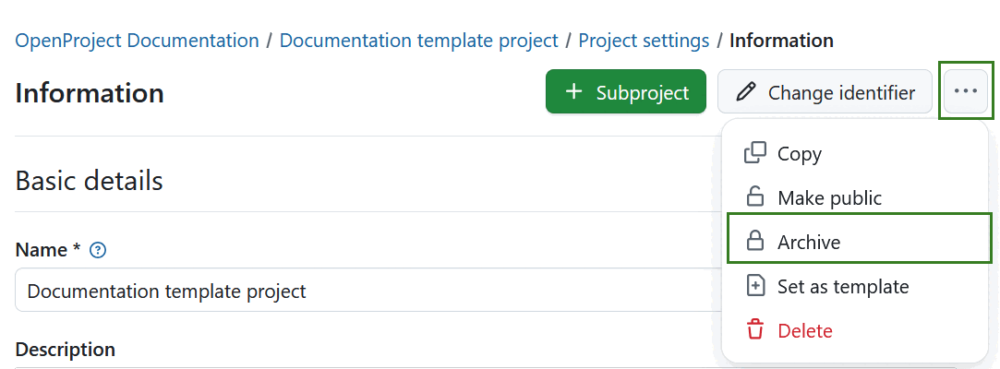

---
sidebar_navigation:
  title: Project information
  priority: 990
description: General project information.
keywords: project information
---
# Manage project information

## Edit project information

To edit your project information in OpenProject, select a project from the **Select a project** drop-down menu. Then navigate to *Project settings → Information* in the project menu on the left.

Project settings are grouped into three sections:

1. **Basic details**. Here you can edit: 

    - **Project name**. The name will be displayed in the project list.
    - Add a project **description**.

2. **Project status**. Here you can: 

   - Set a **project status**. The project status can be displayed in the [project overview](../../../project-overview). If you want to set additional or different status options you can create and use a [project custom field](../../../../system-admin-guide/custom-fields/custom-fields-projects).
   - Add a **project status description**. The status description will be shown on the [project overview](../../../project-overview) page.

3. **Project relations**, where you can select the **parent project**.

**Save** your changes by clicking the **Update** button at the bottom of each respective section.

Further, in the top right corner you can: 

4. [Add a subproject](#create-a-subproject) 

5. [Change project identifier](#change-project-identifier)
6. Click the **More (three dots)** icon, which opens a dropdown menu with the following options: 
   - [Copy a project](#copy-a-project)
   - [Make a project public](#make-a-project-public)
   - [Archive a project](#archive-a-project)
   - [Set a project as a template](../../project-templates) 
   - [Delete a project](#delete-a-project)

> [!NOTE]
> After 16.0 release, project attributes can be edited directly on the project overview page.

## Create a subproject

To create a subproject for an existing project, navigate to [*Project settings*](../) -> *Information* and click on the green **+ Subproject** button.

Then follow the instructions to [create a new project](../../../../getting-started/projects/#create-a-new-project).

## Change project identifier

A project identifier is the part of the project name shown in the URL, e.g. /demo-project. To change the project identifier navigate to Project settings and click the **Change identifier** button in the top right corner.

You will then see the form to change and save the new project identifier. 

> [!WARNING]
>
> Keep in mind that once a project identifier is changed, members of the project will have to relocate the project's repositories. 
>
> Existing project links will no longer work. 

## Copy a project

You can copy an existing project by navigating to the *Project settings -> Project information*. Click the **More (three dots)** icon in the upper right corner and select **Copy** from the dropdown menu.

Under the **Copy from project** section you can select what additional project data and settings, such as versions, work package categories, attachments, project life cycle and project members should be copied as well. 
You can copy existing [boards](../../../agile-boards/) (apart from the Subproject board) and the [Project overview](../../../project-overview/#project-overview) dashboards along with your project, too. 

Select which modules and settings you want to copy and whether or not you want to notify users via email during copying.

> [!IMPORTANT]
> **Budgets** cannot be copied, so they must be removed from the work package table beforehand. Alternatively, you can delete them in the Budget module and thus delete them from the work packages as well.

> [!NOTE]
> The File storages options only apply if the template project had a file storage with automatically managed folders activated.

If you select the **File Storages: Project folders** option, both the storage and the storage folders are copied into the new project if automatically managed project folders were selected for the original file storage. For storages with manually managed project folders setup the copied storage will be referencing the same folder as the original project.

If you de-select the **File Storages: Project folders** option, the storage is copied, but no specific folder is set up.

If you de-select the **File Storages** option, no storages are copied to the new project.

Give the new project a name and select a parent project if needed.

Click the **Copy** button to proceed.

## Make a project public

If you want to set a project to be public, navigate to the *Project settings -> Project information*. Click the **More (three dots)** icon in the upper right corner and select **Make public**.

Setting a project to public will make it accessible to all people within your OpenProject instance.

> [!IMPORTANT]
>
> If your instance is [accessible without authentication](../../../../system-admin-guide/authentication/login-registration-settings/) this option will make the project visible to the general public outside your instance.

## Archive a project

In order to archive a project, navigate to the *Project settings -> Project information*. Click the **More (three dots)** icon in the upper right corner and select **Archive project**.

> [!NOTE]
> This option is always available to instance and project administrators. It can also be activated for specific roles by enabling the _Archive project_ permission for that role via the [Roles and permissions](../../../../system-admin-guide/users-permissions/roles-permissions/) page in the administrator settings.

Once archived, a project can no longer be selected from the project list accessible via header navigation. It is still visible in the [Project lists](../../project-lists/) dashboard if you set the "Active" filter to "off" (move slider to the left). You can unarchive the project there, too, using the three dots at the right end of a row and clicking **Unarchive**.

You can also archive a project directly on the [project overview page.](../../../project-overview/#archive-a-project) 

## Change the project hierarchy

To change the project's hierarchy, navigate to the *Project settings -> Information* and change the **Subproject of** in *Project relations* section.

## Delete a project

If you want to delete a project, navigate to the [Project settings](../../project-settings/). Click the button **Delete project** on the top right of the page.

You can also delete a project via the [projects overview list](../../project-lists/).

> [!NOTE]
> Deleting projects is only available for System administrators.
