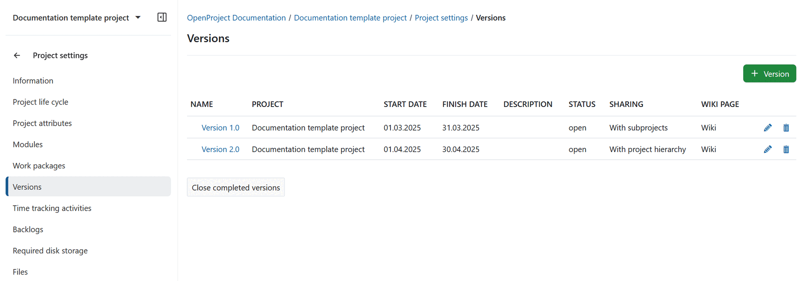
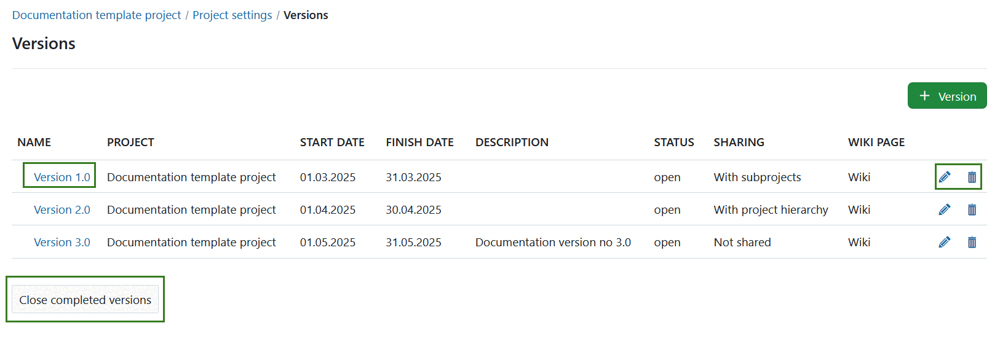

---
sidebar_navigation:
  title: Versions
  priority: 500
description: Manage versions in OpenProject.
keywords: manage versions
---
# Manage versions

Versions are used to track product versions or releases, for example in roadmap planning. Work packages can be assigned to a version and will be displayed in the  [Roadmap](../../../roadmap).

Versions are also used to enable the Backlogs module, i.e., to create a product backlog and manage sprints in OpenProject.

[Learn how to create a new backlogs version](../../../backlogs-scrum/manage-sprints).

## Create a new version

To create a new version for your project, navigate to *Project settings → Versions* in the project menu and click the green **+ Version** button.

You can configure the following details:

- **Name**: Set a name for the version.
- **Description**: Add a description to clarify the purpose of the version.
- **Status**: Choose the status of the version. The default status is open.
- **Wiki page**: Select a wiki page to link directly from the version in the Roadmap.
- **Start and finish date**: Set the planned start and finish dates.
- **Sharing**: Choose whether the version should be shared with other projects (e.g., in the project hierarchy or with subprojects).

> [!NOTE]
> You’ll need to configure the backlog column separately in each project that uses the version.

- **Backlogs column**: Select a column for this version in the backlogs view. This is only necessary if you’re managing a [Scrum backlog](../../../backlogs-scrum).

Click the Create button to save your changes.

## Edit or delete versions

Click on the **edit** icon at the right of the row to edit the version.

To remove a version, press the **delete** button.

To close all completed versions at once, use the **Close completed versions** button at the bottom of the list. To close a specific version, open its details and change the **Status** to *Closed* (see above).

> [!NOTE]
>
> You can only edit versions in the project they were originally created in. In projects where a version is shared, the edit option won’t be available.

## Close a version

To close a version, open its details and set the **Status** to *Closed*.

## Differences between open, locked and closed versions

There are a few differences between open, locked and closed versions:

- **Open version**:
Versions in this state can be used throughout the system. Work packages can be added or removed. The version is visible in both the Backlogs and Roadmap modules.
- **Locked version**:
Work packages cannot be added or removed. The version is **not** visible in the Backlogs module but is still shown in the Roadmap module.
*Use case:* You’ve finalized the scope of a sprint or release and want to prevent changes while it's being worked on.
- **Closed version**:
Work packages cannot be added or removed. The version is no longer shown in the Backlogs or Roadmap modules, unless you explicitly filter for closed versions.
*Use case:* The release or sprint is complete, and you’ve moved on to the next one.
