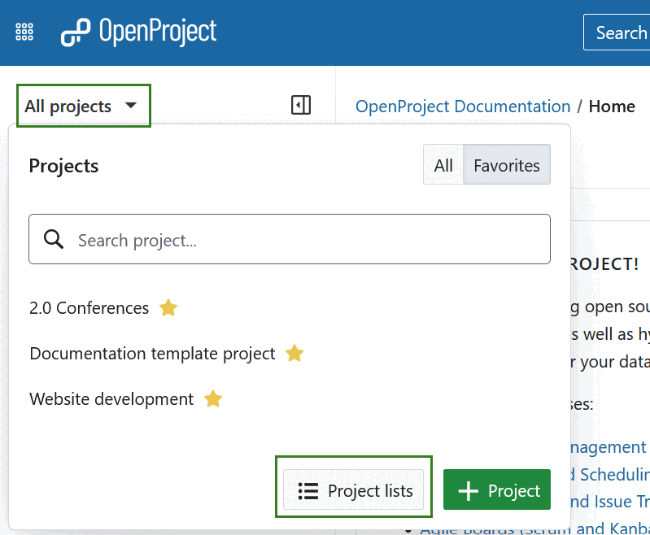
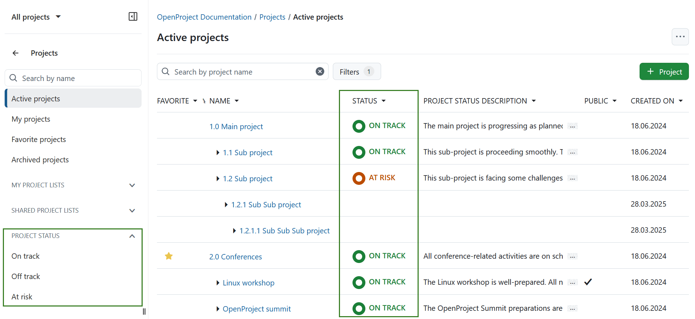
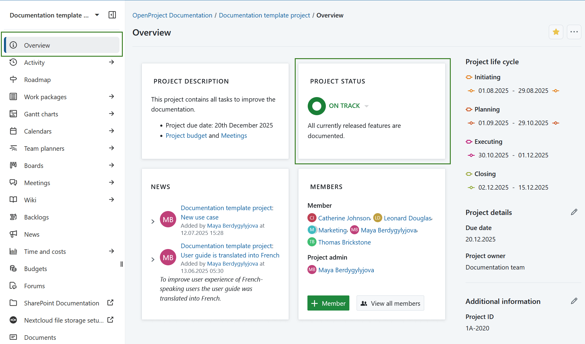

---
sidebar_navigation:
  title: Project status
  priority: 700
description: How to set and display the project status.
keywords: project status
---
# Project status

The project status provides information for you and your team on whether the project is on track, enabling quick action if it's not.

## Set the project status

You can set your project status in the **project settings**. To do this, click Project settings in the left-hand project modules menu and then select the relevant status. To add more information to your project status, you can use the status description field below to manually note changes, project KPIs, or other relevant details.

Alternatively, you can also set the project status on the **project overview** page. If not configured yet, the project status widget appears by default and you can set the project status using the dropdown menu.

Learn more about [project status widget on a project overview page](../../project-overview/#project-status).

## Display the project status

The project status is displayed in different OpenProject modules.

### Project lists

Click **[Project lists](../../projects/project-lists/)** button at the bottom of the *All projects* dropdown menu in the header navigation to open the project lists, which displays all your projects including their status.

### Project overview

The [project overview ](../../project-overview/) will also display your project status. The project status appears as a widget, which you can drag and drop to customize your project overview layout.

