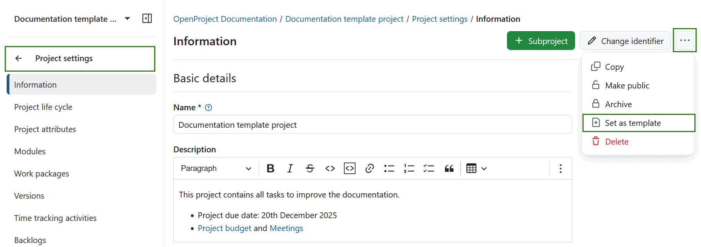

---
sidebar_navigation:
  title: Project templates
  priority: 600
description: How to create project templates.
keywords: project templates
---
# Project templates

Project templates are useful for projects that share a similar structure or team composition. They help save time when setting up new projects.

## Create a project template

You can create a project template in OpenProject by [creating a new project](../../../getting-started/projects/#create-a-new-project) and configuring your project to your needs. Give the project a clear name to identify it as a template, e.g., *Project XY [Template]*.

Configure everything you want included in future projects:
- Add project members 
- Select the necessary modules  
- Set up the default project structure in the Gantt chart  
- Create work package templates  

Navigate to the [project settings](../project-settings), click the **More (three dots)** icon in the upper right corner and select **Set as template** from the dropdown menu. You can later remove the project from the template list at the same location.

> [!NOTE]
>
> Only administrators can set or remove projects as templates

## Use a project template

You can create a new project by using an existing template. This copies the template’s settings and structure to the new project. Find out in our Getting started guide how to [create a new project](../../../getting-started/projects/#create-a-new-project) in OpenProject.

Alternatively, you can [copy the project](../project-settings/project-information/#copy-a-project) to use it as a template.

<video src="https://openproject-docs.s3.eu-central-1.amazonaws.com/videos/OpenProject-Project-Templates.mp4"></video>

For more information, see our blog articles on [Creating, configuring and managing projects in OpenProject](https://www.openproject.org/blog/create-configure-manage-projects-openproject/) and [Project templates in OpenProject](https://www.openproject.org/blog/project-templates/).
