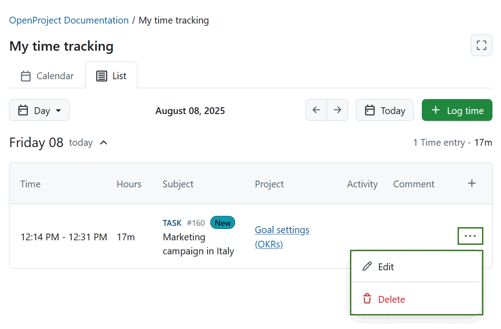
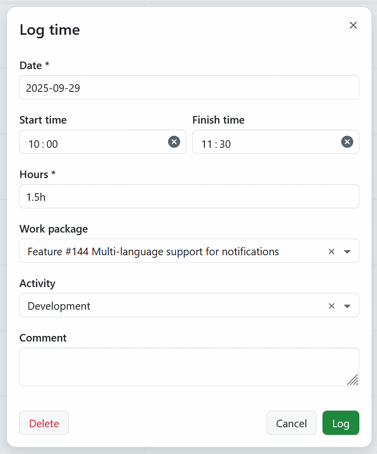

---
sidebar_navigation:
  title: My time tracking
  priority: 950
description: Get an overview of time logs in a calendar or list view. Easily log time directly from My time tracking page.
keywords: time tracking, log time, time spent, calendar, time spent calendar, time logs
---

# My time tracking

## Overview

The *My time tracking* module offers a clear overview of your personal time entries. You can quickly log time directly from this page. To access it, select **My time tracking** from the left-hand menu.

Alternatively, click the grid icon in the top left corner and select *My time tracking* from the overlay menu that will open.

### My time tracking page filters

1. On the *My time tracking* page, you’ll find the following interface elements:
   1. **Zen mode** button — toggles a distraction-free view.
   2. **Tab selector** — switch between *Calendar* and *List* views.
   3. **Zoom level dropdown menu** — choose the time scale for the view. Following options are available:
      - Day
      - Work week
      - Week
      - Month
   4. **Displayed date range** — shows the currently visible timeframe.
   5. **Navigation arrows** — move to the previous or next time period.
   6. **Today** button — jump directly to the current day.
   7. **+ Log time** button — add a new time entry.

### Calendar view

The *Calendar* view opens by default if start and finish times for time entries have been enabled in [System Administration](../../../system-admin-guide/time-and-costs). You can adjust the zoom level using the dropdown menu, with options for **Day**, **Work week**, **Week**, or **Month**. The current day is highlighted.

Existing time entries appear on the corresponding days they were logged. Entry colors reflect the type of work package associated with the logged time.

At the top section of each day in the calendar, there is a dedicated area that allows you to log time without specifying a start or finish time. This is useful for quick entries or for logging effort that isn't tied to a specific time range.

You can log time by selecting a time range anywhere on the calendar or by using the **+ Log time** button.

You can drag and drop time entries to reposition them within the same day or move them to a different day. To adjust the duration of an entry, drag the top or bottom edge of the time entry up or down.

To edit a time entry, click it in the calendar, make your changes, and save. You can also delete it from the same menu.

At the bottom of each day a sum of hours per day is displayed. If week or month is selected, a respective total is also shown in the bottom right corner. 

If you are currently tracking time with a timer for a specific work package, you will also see the ongoing time tracking timer for the respective work package. The work package in question also has a different background color for easier differentiation. 

### List view

The *List* view opens by default if start and finish times for time entries are **disabled** in [System Administration](../../../system-admin-guide/time-and-costs). Just like in the *Calendar* view, you can select the zoom level using the dropdown menu — options include **Day**, **Work week**, **Week**, or **Month**.

In this view, time entries are grouped by day. Each day displays the total number of entries and their combined duration on the right side of the header line.

- When the **Day** zoom is selected, the view is expanded by default.

- When **Week** or **Work week** zoom is selected, past and future days are collapsed by default. However, the current day is expanded.

- When **Month** zoom is selected, past days or weeks are collapsed by default. However, the current week is expanded, along with all future weeks of that month.

> [!TIP]
> If monthly level is chosen in the list view mode, time entries are aggregated by  week and not by day. This is especially useful to get an overview of your tracked hours for each week. 

Expanded days display time entries in a table format with the following columns:

- **Time**
- **Hours**
- **Subject** (with a clickable link to the work package)
- **Project**
- **Activity**
- **Comment**
- **+** (last column, used to log time for that specific day)

To log time in *List* view, you can either:

- Click the **+ Log Time** button to add a time entry for any date outside the currently displayed range.
- Use the **+** icon in the table to log time directly for a specific day.

To edit or delete a time entry in the *List* view, click the **More** (three dots) icon at the end of the entry’s row in the table, then select the **Edit** (pencil) or **Delete** icon respectively.

## Log time in My time tracking module

To log time on the *My time tracking* page, click the **+ Log time** button. A modal window will appear with the following fields:

- **Date** – Select the day for the time entry.

- **Start time** and **Finish time** – When both are entered, the **Hours** field is calculated automatically.

> [!TIP]
> These fields are only visible if the **Allow exact times tracking** option is enabled by an administrator.
> If the **Require exact times** option is also enabled, these fields become mandatory in order to save the time entry.

- **Hours** – Enter the number of hours you want to log for a specific work package. 

> [!TIP]
>  Duration can be entered both in hours and minutes. For example for logging 1,5 hours, you can enter:
>  - 1.5h
>  - 90m
>  - 90min
>  - 1:30

- **Work package** – Type to search for a work package or select from the list of recently used ones.

- **Activity** – Choose an activity that is active for the project the selected work package belongs to.

- **Comment** – Add any relevant notes or details for the time entry.

Don't forget to click the **Log** button to save your time entry.

