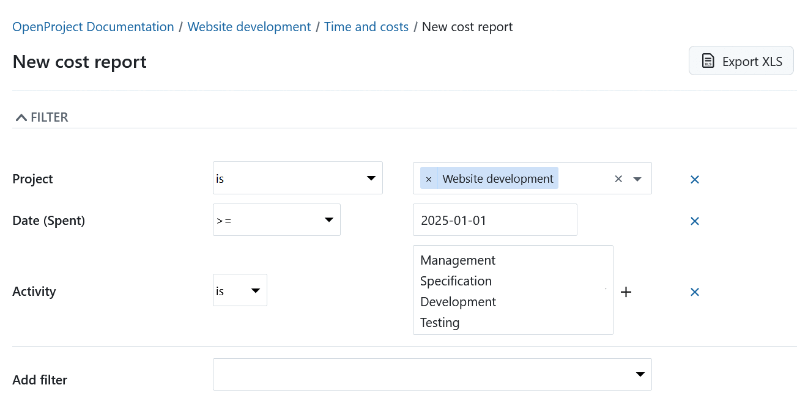
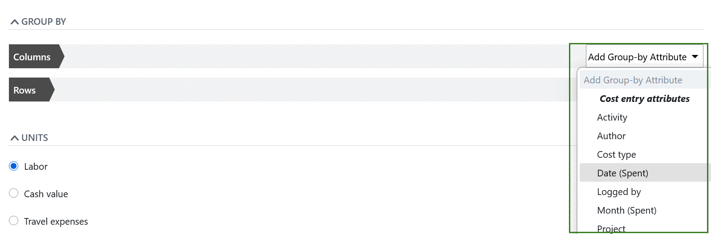
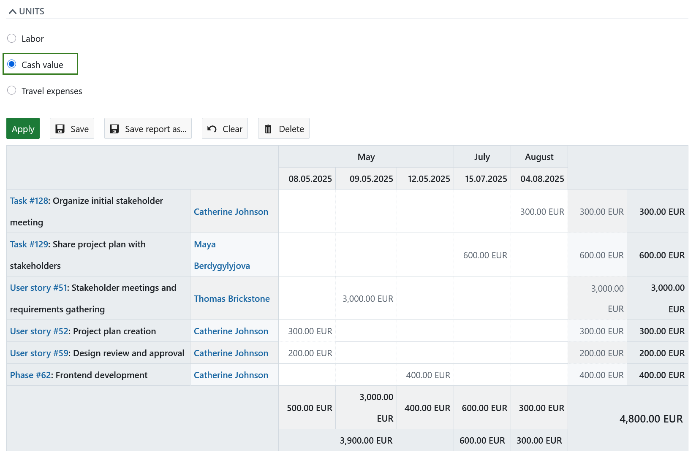
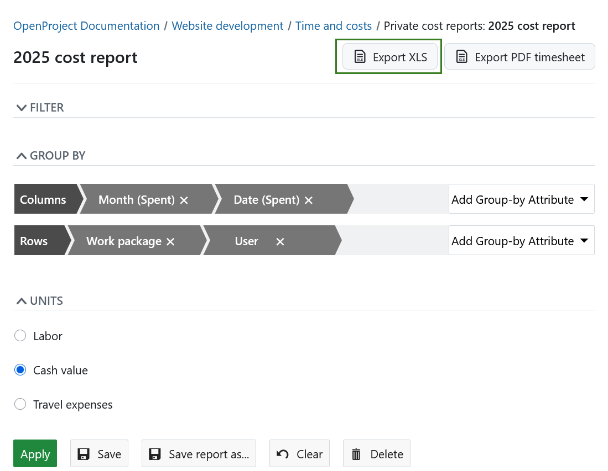
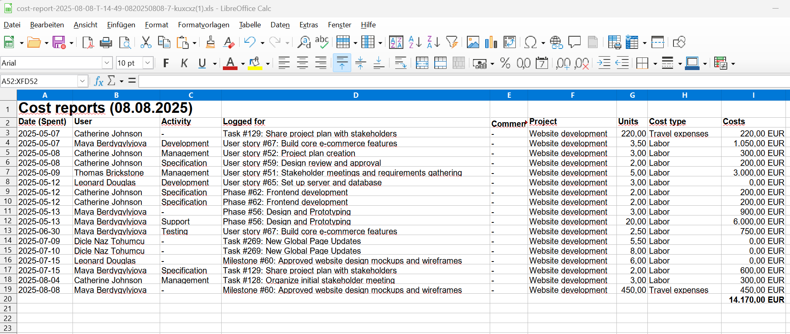
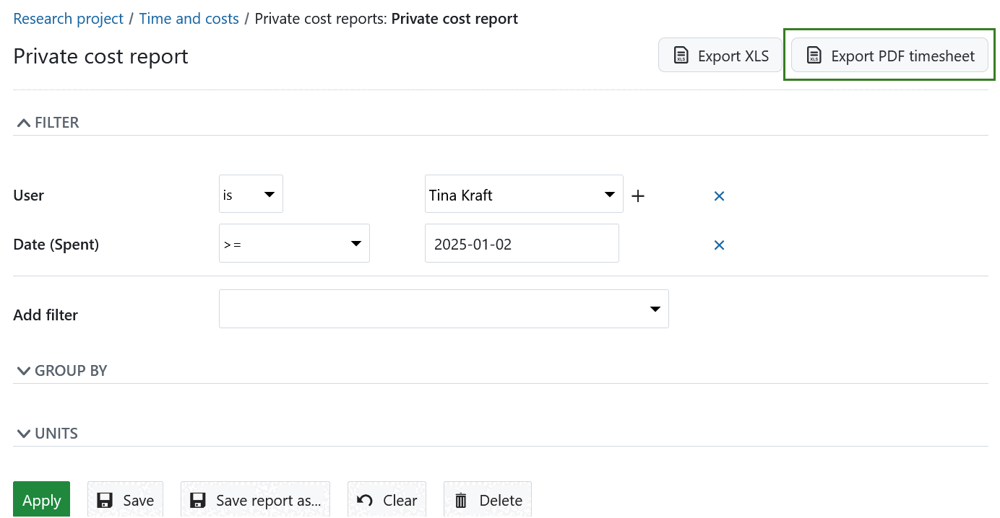
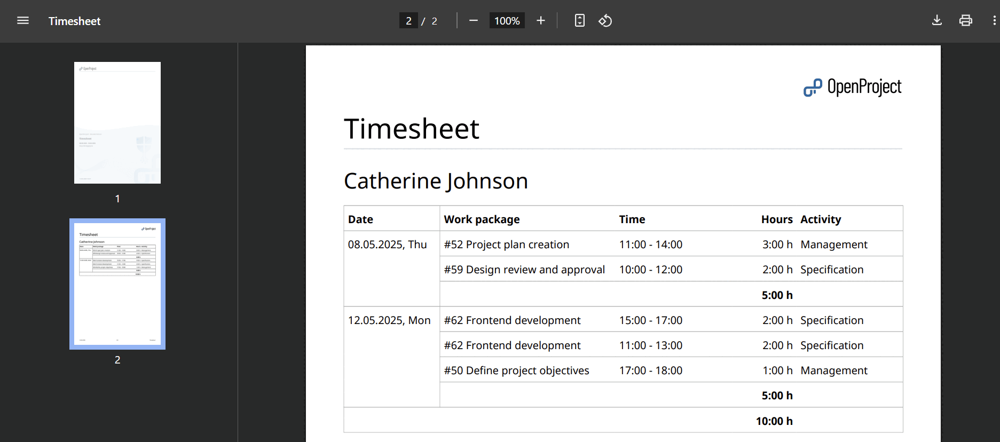

---
sidebar_navigation:
  title: Time and cost reporting
  priority: 797
description: Time and cost reporting
keywords: time and cost reporting
---

# Time and cost reporting

You can easily report spent time and costs in OpenProject and filter, group and save the reports according to your needs.

> [!NOTE]
> To use the time tracking functionality, the **Time and costs module** needs to be activated in the [project settings](../../projects/project-settings/modules/).

| Topic                                                                     | Content                                                                                           |
|---------------------------------------------------------------------------|---------------------------------------------------------------------------------------------------|
| [Time and costs report](#time-and-costs-reports)                          | How to open time and costs reports in OpenProject.                                                |
| [Change time and costs reports](#change-time-and-costs-reports)           | How to change the view of the reports, e.g. to filter, group by and select units to be displayed. |
| [Filter cost reports](#filter-cost-reports)                               | How to filter time and cost reports.                                                              |
| [Group by criteria for cost reports](#group-by-criteria-for-cost-reports) | How to group time and cost reports.                                                               |
| [Select units to display](#select-units-to-display)                       | How to choose the unit to be displayed in a report.                                               |
| [Export time and cost reports](#export-time-and-cost-reports)             | How to export time and cost reports to Excel.                                                     |

## Time and costs reports

To open the time and costs reports in OpenProject, navigate to the **Time and costs** module in the project navigation.

**Time and costs** is a plugin to filter cost reports on individual or multiple users across individual or multiple projects. The plugin has to be activated as a module in the project settings to be displayed in the side navigation.

## Change time and costs reports

You can change the view of a cost reports and adapt it to your needs by adjusting filters, grouping criteria and units of measurement.

### Filter cost reports

You can select and apply various filters, such as work package, author, start date, or target version, to refine the displayed data. Autocomplete functionality enables faster navigation through **Work Packages**, **Projects**, and **Users**. 

> [!TIP]
>
> Autocomplete supports following filters: author, user, logged by, assignee, responsible, work package and project. 

The **Projects** filter allows selection of multiple projects. Depending on your rights within a project, multiple users can also be selected.

The **Work Package** and **Projects** filters support the inclusion or exclusion of related elements. The **Work Package** filter can include or exclude children work packages, while the **Projects** filter can include or exclude subprojects.

### Group by criteria for cost reports

The time and cost reports can be grouped by selected criteria, such as dates, work packages, assignee, or any other field, including custom fields.

To add grouping criteria to the columns or rows of the report, select the drop-down field on the right to **add a group-by attribute**.

The grouping criteria will then be added to the columns or rows of the report.

Click the **Apply** button to display your changes.

The report will then be displayed according to the selected criteria in the columns and rows.

You can make changes to the order of the grouping criteria in the columns or rows with drag and drop.

### Select units to display

In the time and cost reports you can select the **units** which you want to display.

You can either select **Labor** which will display the logged time to the work packages according the filter and group by criteria above. Depending on your filter, e.g. when you filter by assignee, it will give you an overview like a timesheet.

The **Cash value** will display the costs logged according to the filter and grouping criteria above. This includes labor costs (calculated based on the logged time and the [hourly rate](../time-tracking/#define-hourly-rate-for-labor-costs) as well as the unit costs.

## Report unit costs

If you just want to report on spent **unit costs**, e.g. travel expenses, choose the respective unit costs in the cost report under units. Only the logged unit costs will then be displayed in the report according to your filter and grouping criteria.

## Export time and cost reports

To **export reports for time and costs** to Excel you can open or create a report in the Time and costs module in your project. For the Excel export, first filter the report according to your needs. Select the [units to be displayed](#select-units-to-display) (Labor, Cash value, etc.).

Please note that "Group by" settings won't be applied to the exported file.

Click the **Export XLS** (Excel) button.

You can then continue working in the Excel spreadsheet to filter, group, or import the data in different systems.

## Export time sheets

You can  **export reports for time entries** in PDF format in the *Time and costs* module of your project. 

> [!TIP]
> Keep in mind that this report will only include time entries, but not the cost ones.

To prepare the export, first filter and set up the report according to your preferences and click the **Export PDF timesheet** button.

> [!NOTE]
> Please note that "Group by" settings won't be applied to the exported file.

A PDF file will be generated, containing the time entries specified by the report. 

In the user details section, if there are several entries on the same day, the hours are combined and shown in one row. When entries span multiple days, a total for all days is also shown. Each row lists the work package IDs (with links), and the first column shows the date and abbreviated weekday.

> [!TIP]
> If the exported PDF includes multiple users, an additional page after the cover page will provide an overview table displaying the total hours worked by each user, as well as a sum per user. It will also include an overview of hours worked per user per day.

