---
sidebar_navigation:
  title: Configure work package table
  priority: 950
description: How to configure the work package list in OpenProject.
keywords: work packages table configuration, work package table, columns, filter, group
---

# Work package table configuration

| Topic                                                        | Content                                                      |
| ------------------------------------------------------------ | ------------------------------------------------------------ |
| [Add or remove columns](#add-or-remove-columns-in-the-work-package-table) | How to add or remove columns in the work package table.      |
| [Filter work packages](#filter-work-packages)                | How to filter in the work package table.                     |
| [Sort the work package table](#sort-the-work-package-table)  | How to sort within the work package table.                   |
| [Display settings](#flat-list-hierarchy-mode-and-group-by)   | Get to know the flat list, the hierarchy mode, the group by and the sum feature. |
| [Attribute highlighting (Enterprise add-on)](#attribute-highlighting-enterprise-add-on) | How to highlight certain attributes in the work package table. |
| [Save work package views](#save-work-package-views)          | How to save a new work package view and how to change existing ones. |

You can configure the work package table view in OpenProject to display the information you need in the table.

You can change the header in the table and add or remove columns, filter and group work packages or sort them according to specific criteria. You can also switch between a flat list view, a hierarchy view and a grouped view.

Save the view to make it directly accessible from your project menu. A work package view is the sum of all modifications you’ve made to the default table (e.g., filters you set).

To open the work package table configuration, click the **More** icon (three dots) at the top right of the work package table and select **Configure view**.

You can also click the **Settings** icon at the far right of the row listing column names to open the table configuration.

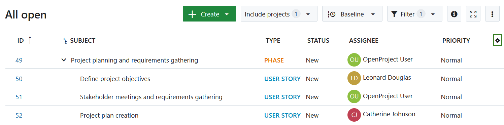

## Add or remove columns in the work package table

To configure the view of the work package table and display different attributes, you can add or remove columns in the work package table.

First, [open the work package table configuration](#work-package-table-configuration).

In the pop-up window, choose the **Columns** tab.

- To add columns, start typing the name of the attribute you’d like to add.

- To remove columns, click the **x** icon next to the attribute.

- You can reorder the attributes using drag and drop.

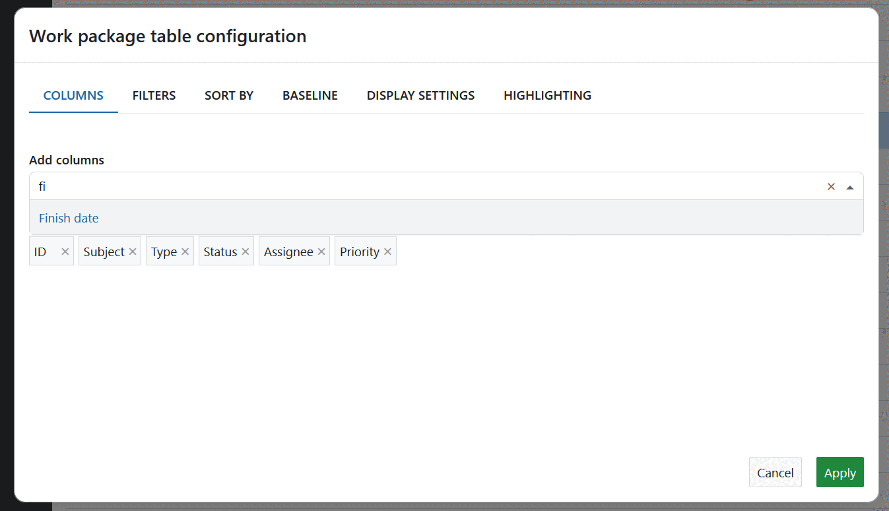

Click the **Apply** button to save your changes and update the table according to your configuration.

## Filter work packages

To filter the work packages in the table, click the **Filter** button at the top of the work packages view. The number next to it indicates how many filter criteria are currently applied.

In this example, one filter criterion is applied: Status = open.

To add a filter criterion, select one from the drop-down list next to **+ Add filter**, or start typing to search for a specific criterion. You can add as many filter criteria as needed.

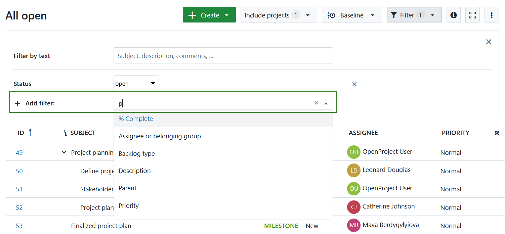

You can also filter the work package table by [custom fields](../../../system-admin-guide/custom-fields), if these are configured in the custom field settings.

> [!TIP]
> Filtering a work package table will temporarily adjust the default work package type and status to match the values used in the filters. This ensures that newly created work packages are visible in the table.

### Filter operators

Different attributes offer different filter criteria but most selection attributes like Assignee offer these:

- **is (OR)**: returns all work packages that match any one of the entered values
- **is not**: returns all work packages that do not match any of the entered values
- **is not empty**: returns all work packages for which the attribute has a value
- **is empty**: returns all work packages for which the attribute does not have a value

Multi-select attributes also have one extra options:

- **is (AND)**: returns all work packages that match _all_ of the entered values.

Other attributes like Version might offer additional criteria like *open*, *closed* or *locked*. Required attributes might only offer two options, _is (OR)_ and _is not_, since they cannot be empty.

### Filter by text

If you want to search for specific text in the subject, description, or comments of a work package, type your search term into the **Filter by text** field.

The results will automatically update and display in the work package table.

### Filter for a work package's children

To display only work packages with specific parent packages (e.g., all work packages within a particular project phase), use the **Parent** filter. Enter the desired parent work package(s) and press Enter. This will display the selected parent package(s) along with their child work packages.

> [!TIP]
> If you select only work packages that have no children, no results will be shown.

### Filter for descendants of a work package

To display all subordinate work packages (children, grandchildren, etc.) of a specific work package, use the **Descendants of** filter. Enter one or more parent work package IDs into the filter field and press Enter. This will display all descendant work packages across all hierarchy levels below the selected work package(s). if the selected work packages have no descendants, no results will be shown.

> [!NOTE]
> It is not currently possible to limit the filter to a specific level of hierarchy: i.e. only show "grandchildren".

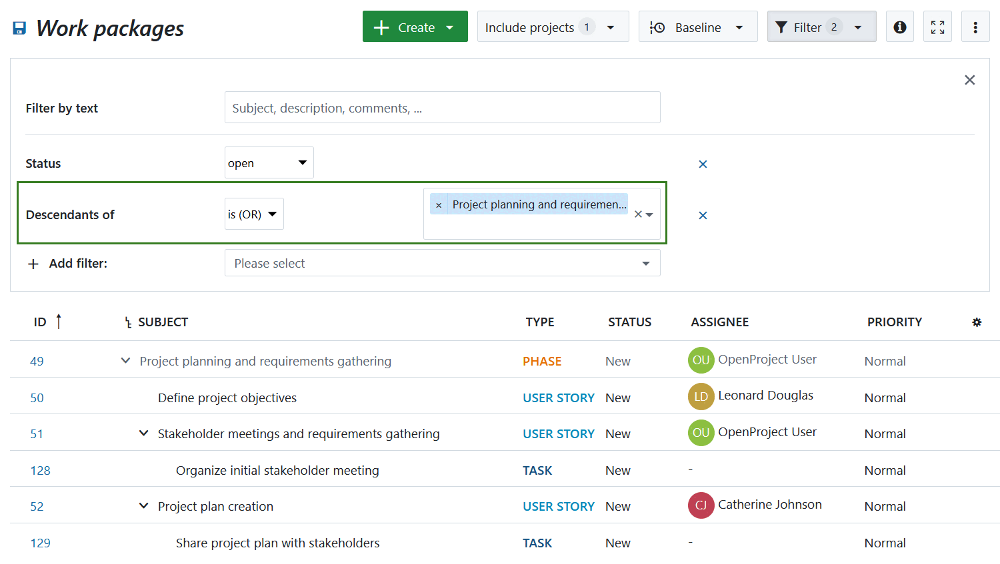

### Include/exclude work packages from a specific project or subproject

It is possible to display work packages from multiple projects. To include or exclude work packages from specific projects, click the **Include projects** button at the top of the work package table view. From there, you can select or deselect the projects and sub-projects you want to include.

To automatically include all sub-projects for each selected project, check the **Include all sub-projects** box at the bottom of the dialog.

If you want to view all work packages across all projects, you can either select all projects manually or use the [global work package tables](../../projects/project-lists/#global-work-package-tables).

### Filter by ID or work package name

If you want to [create a work package view](#save-work-package-views) that includes only specific work packages, you can use the **ID** filter. By entering the ID or subject of the work packages, you can select them individually.

Another use case is *excluding* specific work packages — for example, if you want to display all milestones except one. To do this, use the **is not** option next to the filter name on the left.

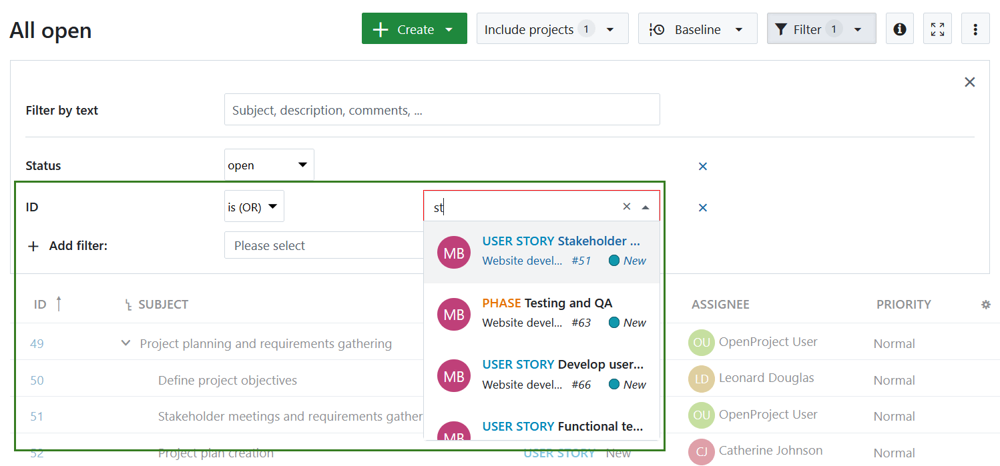

### Filter for assignees or assigned groups

There are several options to filter for the assignee of a work package. You can choose one of these filters:

- Assignee: Filters for work packages where the specified user or group is set as Assignee
- Assignee or belonging group:
  - When filtering for a single user: Work packages assigned to this user, and any group it belongs to
  - When filtering for a group: Work packages assigned to this group, and any users within
- Assignee's group: Filters for work packages assigned to a user from this group
- Assignee's role: Filters for work packages assigned to users with the specified project role

### Filter for attachment file name and content

You can run a full text search and filter and search not only headings and text contents but also file names or file contents of attached documents to work packages.

Use the filter *Attachment content* or *Attachment file name* to filter attached documents in the work package table.

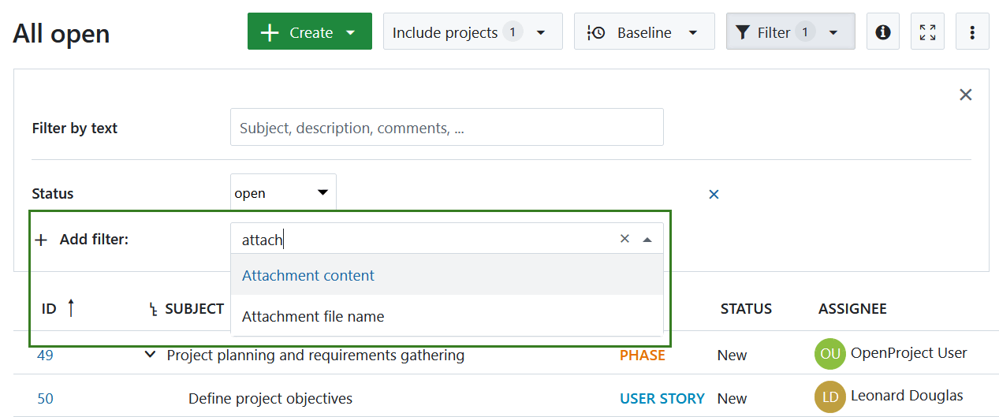

For both the file name and the content, you can then differentiate the filtering with the "contains" and "does not contain" options for selected keywords and text passages. To do this, please enter the corresponding text in the field next to it.

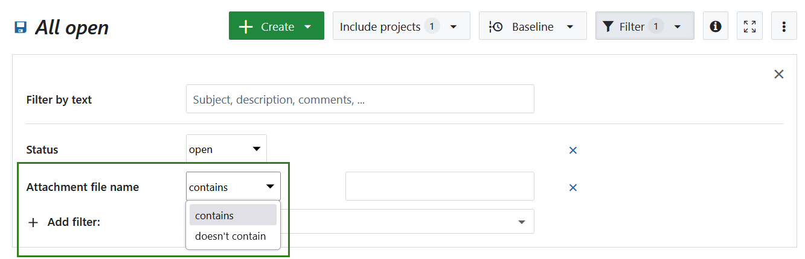

It will then display the corresponding work package with the attachment.

### Filter for project phases and phase gates

To focus on specific stages of your project, you can use the **Project phase** filter in the work packages table. Simply select the relevant phase(s) from the filter dropdown to display all associated work packages.

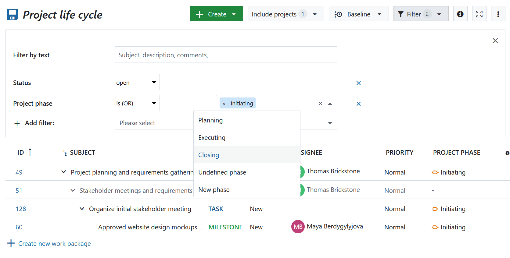

Once applied, the filtered view shows only the work packages assigned to the selected phase(s), providing a clear snapshot of where your tasks sit within the overall project lifecycle. 

> [!TIP]
>
> To be able to assign a work package to a specific project phase,  it is required to enable the **project phase** attribute in the administration for a a specific work package type and to active this work package type for a project. Read more about [configuring work package forms](../../../system-admin-guide/manage-work-packages/work-package-types/#work-package-form-configuration-enterprise-add-on)

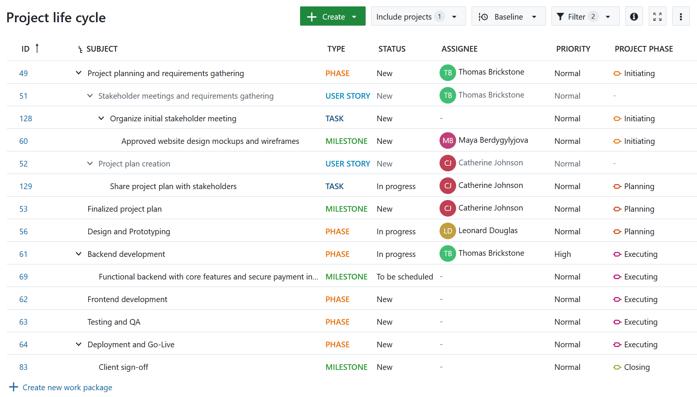

To gain even more insight, you can group the work packages by project phase. This helps visualize how tasks are distributed across phases and identify any gaps or overlaps in planning. This filtering and grouping combination makes it easier to manage progress, align tasks with strategic milestones, and ensure smooth transitions through phase gates.

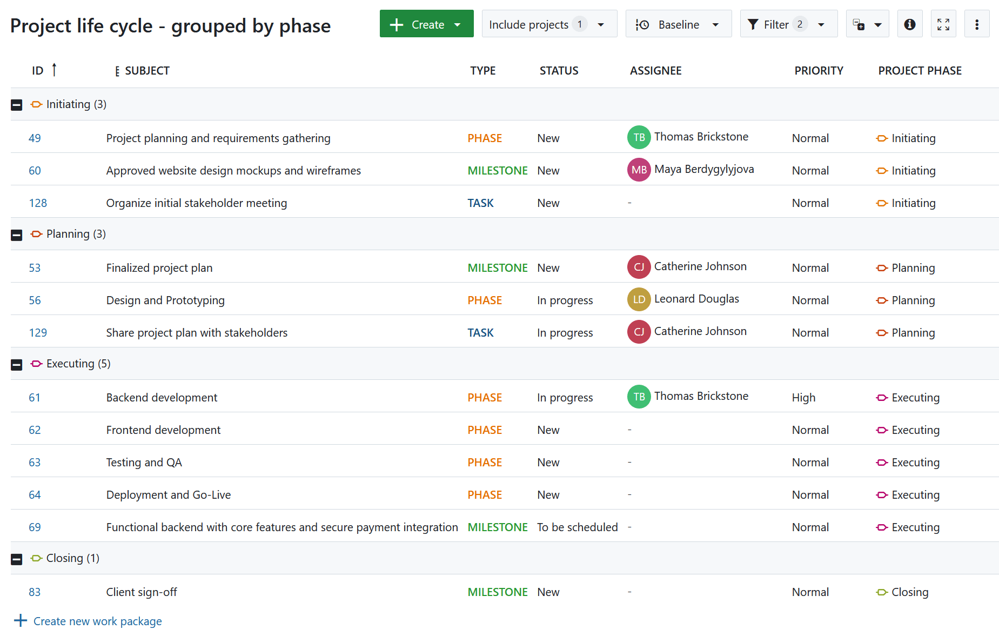

## Sort the work package table

### Automatic sorting of the work package table

By default, the work package table will be sorted by work package ID.

The **ID** is unique for a work package within OpenProject. It will be set automatically from the system. With the ID you can reference a specific work package in OpenProject.

To sort the work package table view, open the [work package table configuration](#work-package-table-configuration) and select the tab **Sort by**. You can sort by up to three attributes, either ascending or descending.

Clicking the blue **Apply** button will save your changes and display the results accordingly in the table view.

> [!NOTE]
> If you have the hierarchy mode activated, all filtered table results will be augmented with their ancestors. Hierarchies can be expanded and collapsed.

Therefore, the results may differ if you sort in a flat list or in a hierarchy mode.

### Manual sorting of the work package table

You can sort the work package table manually, using the icon with the three dots on the left of each work package to drag and drop it.

Moving a work package will change its attributes, depending on the kind of table displayed, e.g. hierarchy changes or priority.

To keep the sorting it is necessary to [save the work package view](#save-work-package-views).
Please note: This has no effect on the "All open" view; you have to save your sorting with another name.

## Flat list, Hierarchy mode and Group by

You have three different options to display results in the work package table.

* A **Flat list** (default), which contains all work packages in a list no matter how their parent-child-relation is.
* A **Hierarchy**, which will display the filtered results within the parent-child-relation.
* **Group by** will group the table according to a defined attribute.

To display the work package table you have to choose one of these options.

To switch between the different criteria, open the [work package table configuration](#work-package-table-configuration) and open the tab **Display settings**. Choose how to display the work packages in the table and click the blue **Apply** button.

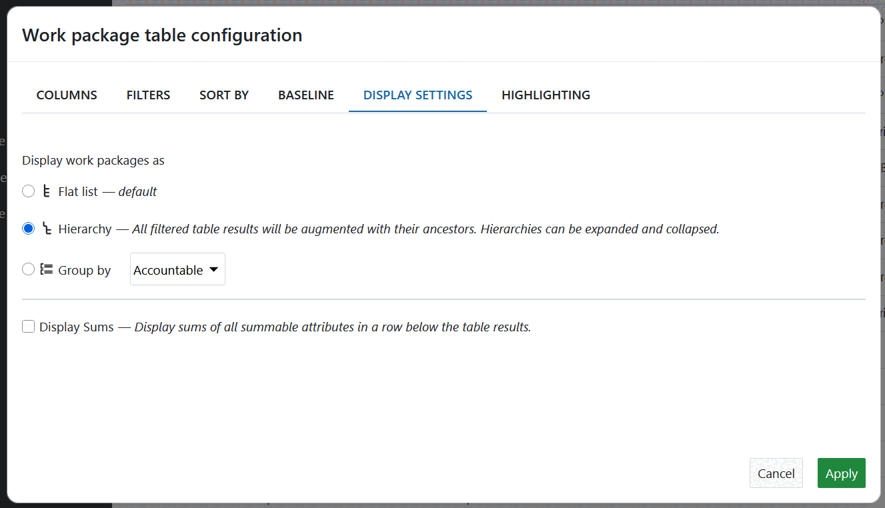

When you group the work package table by an attribute or by project a **button to collapse groups** shows up:

Use it to quickly collapse or expand all groups at the same time. Find out [here](../../gantt-chart/#aggregation-by-project) how to use this feature for a **quick overview of several projects** at once.

### Display sums in work package table

To display the sums of eligible work package attributes, go to the work package table configuration and click on the tab **Display settings** (see screenshot above). When you tick the box next to **Display sums** the sums of **Work**, **Remaining work**, **% Complete**, as well as custom fields of the type Integer or Float will be displayed at the bottom of the work package table.

If you group the work package table, sums will be shown for each group.

## Attribute highlighting (Enterprise add-on)

[feature: conditional_highlighting ]

You can highlight attributes in the work package table to emphasize the importance of certain attributes and have important topics at a glance. To activate attribute highlighting open the work package configuration table and select the **Highlighting** tab.

The following attributes can be highlighted in the table:

* Priority
* Status
* Finish date

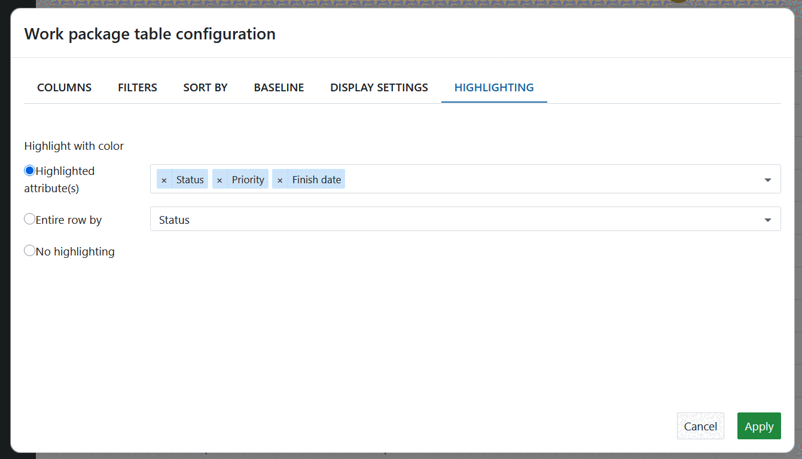

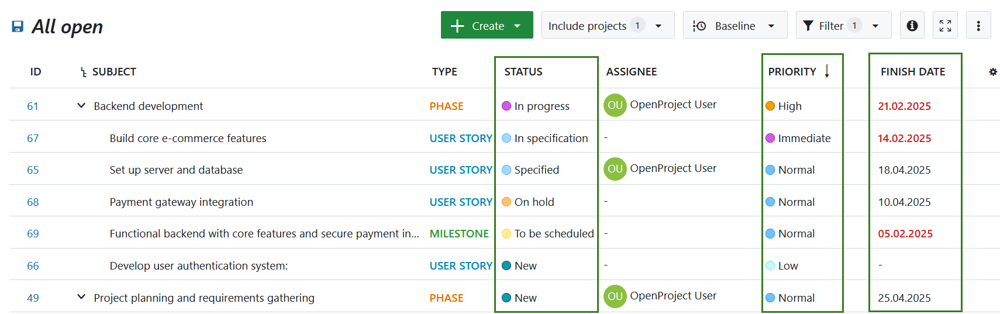

Furthermore, you can highlight the entire row by an attribute. The following attributes can be highlighted as a complete row:

* Priority
* Status

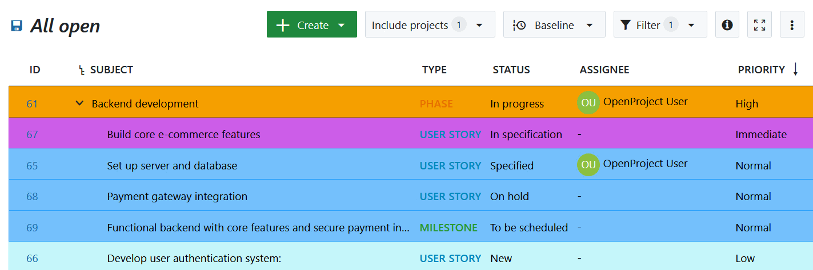

You can configure the colors for attribute highlighting in the system administration. Find out how to set it for the color of the priority [here](../../../system-admin-guide/manage-work-packages/work-package-priorities/#edit-or-remove-work-package-priority) and for the color of the status [here](../../../system-admin-guide/manage-work-packages/work-package-status/#edit-re-order-or-remove-a-work-package-status).

## Save work package views

When you have configured your work package table, you can save the views to access them again and share them with your team.

Press the **Settings icon** with the three dots on the top right corner of the work package table and choose **Save as...**

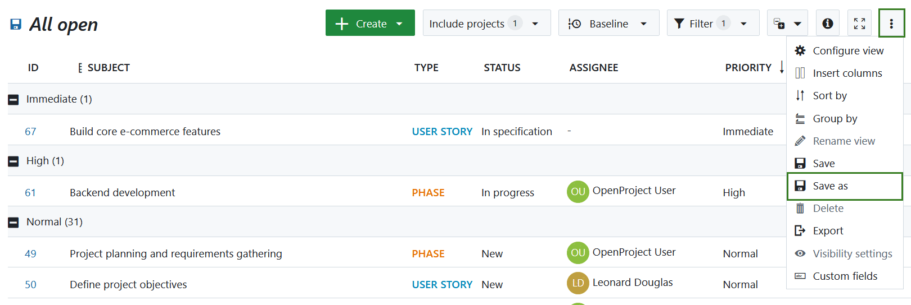

Enter a **Name** for your saved view (according to the criteria you have chosen in your work package table configuration).

In this example, the table was filtered for work packages assigned to me which have a high priority.

**Public:** Check the public checkbox if you want to have this work package view accessible also for other users from this project.

**Favorited:** Check this favorited checkbox if you want to have this work package as a menu item in your favorite views.

Press the **Save** button to save your view.

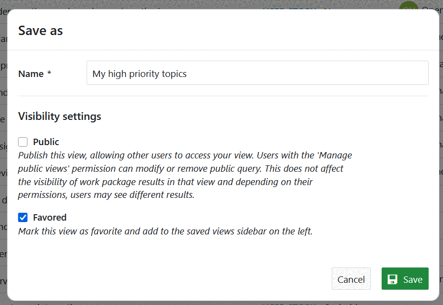

The view will then be saved in the work packages menu in your **Favorite views**:

If you check the public visibility, the view will be saved under your public views in the work package menu:

> [!NOTE]
> The collapse status (collapsed or expanded groups) can not be saved.

### Change saved work package views

If you make changes to a saved view, e.g. change a filter criteria, you have to save the new view once again. In order to apply the change to the actual saved view, click on the disk icon which appears next to the title of the saved view:

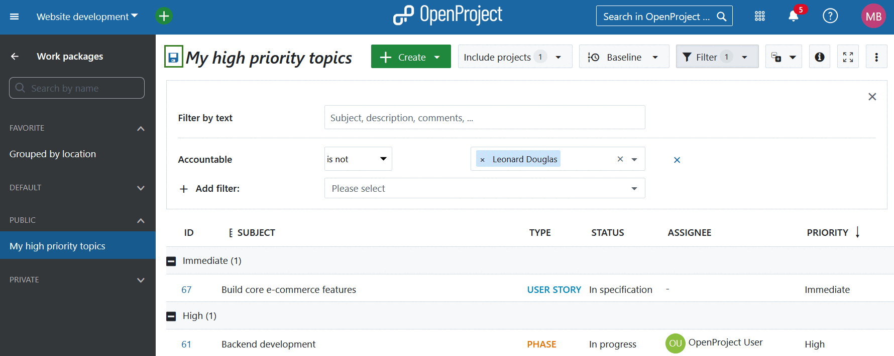

If you want to save a completely new work package view, again click on the settings and select **Save as...** as described [above](#save-work-package-views).

> [!IMPORTANT]
> You can't change the default "All open" view. Therefore pressing the disc icon won't have any effect on the default view that is displayed when navigating to the work packages module. You always have to create a new view (filter, group, etc.), set a name and save it (private or public).
