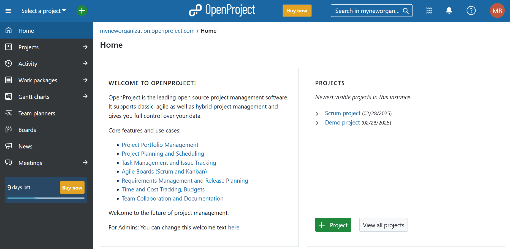
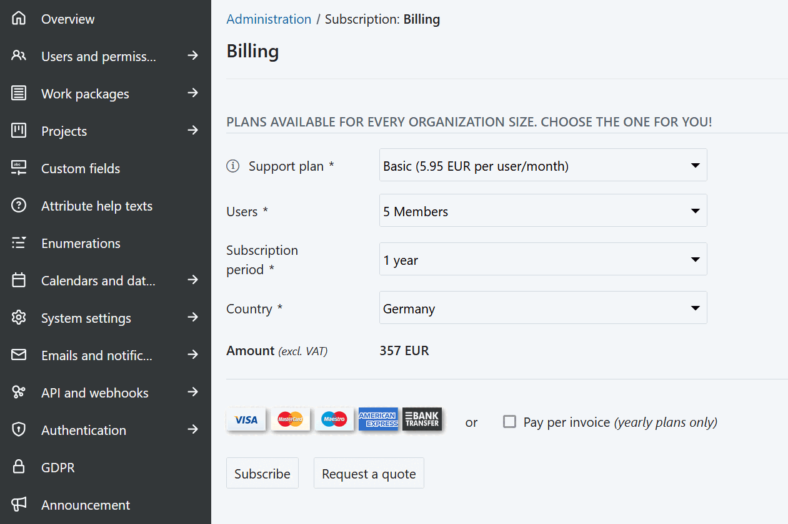
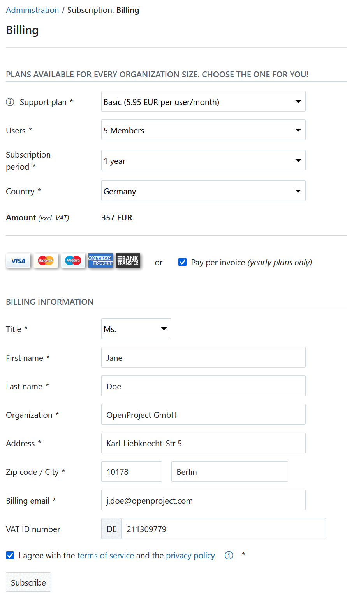

---
sidebar_navigation:
  title: Subscribe
  priority: 960
description: Book the OpenProject Enterprise cloud edition.
keywords: book, enterprise cloud edition
---
# Book the Enterprise cloud edition

After you have tested the OpenProject Enterprise cloud edition and want to continue working with OpenProject, you can subscribe to one of our plans.

Please refer to our website for the Enterprise cloud edition [pricing](https://www.openproject.org/pricing/).

You can subscribe to a monthly or yearly plan. The subscription can be **paid via Credit Card or via bank transfer (per invoice)**. 

> [!IMPORTANT]
>
> Payment via bank transfer (invoice option) is only available for yearly subscriptions (at least 1 year) for customers in the EU, Switzerland and the United States.
>

To upgrade your trial to the full version, click the **Buy now** button in the application header or project menu on the left.

You will then be directed to *Administration* -> *Subscription* -> *Billing*.

1. **Select a support plan** – Choose between the **professional** and **basic** support plans.
2. Choose the **amount of users** - Select the number of users from the drop-down list. Users can only be selected in increments of five, with a minimum of five users.
3. Specify your **subscription period** and select your **country** from the drop-down list.
4. The **total amount** (excluding VAT) will be displayed based on your selections.
5. Click the **Subscribe** button. 

Next, click the **Proceed to Checkout** button.

Verify your **account details** and click the **Next** button.

Add your **Billing address and VAT number** and click the blue **Next** button.

Enter your **payment details** (in this example, credit card information). Make sure to verify your address (same as for the invoice) in order to avoid payment failures via credit card. If your credit card is stated to a different address, make sure to enter it here as card address.

Click the blue **Next** button.

You will once again get an overview about your subscription.
Here, you can edit the account or billing information if needed.

Click the **Pay** button and subscribe to the OpenProject Enterprise cloud edition.

A payment receipt will be sent via email.

## Pay per invoice (via bank transfer)

To select the **Pay per invoice** option, select the respective checkbox. This will open additional fields to be filled out.

Enter your **Billing information**. If you are a business customer from the EU, please enter a valid **VAT ID number**.

> [!TIP]
> Make sure to validate your billing email to receive the required information and invoice.

> [!IMPORTANT]
> You have to **agree to our terms of services and privacy policy**.

Click the **Subscribe** button.

 

You will get an overview of your booked subscription.

An invoice will be sent via email to the billing email address you specified.

