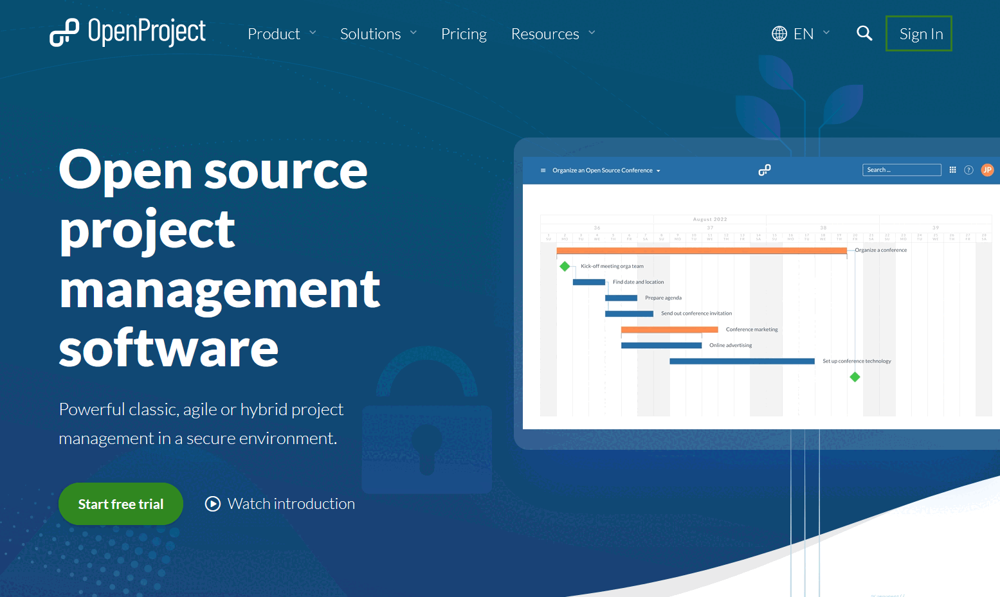
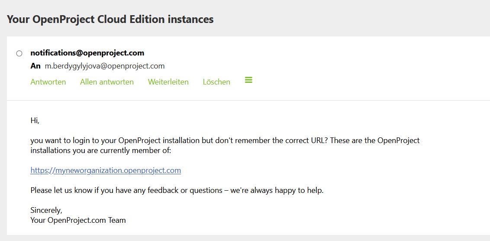

---
sidebar_navigation:
  title: Sign in
  priority: 997
description: Sign in to your OpenProject Enterprise cloud edition.
keywords: sign in, cloud, openproject enterprise 
---

# Sign in to the OpenProject Enterprise cloud edition

Sign in to your OpenProject Enterprise cloud via the website or by directly entering the URL of your OpenProject instance. You can find it in your activation email if you forgot the exact address. 

If you do not have an OpenProject Enterprise cloud edition, you can [set up your own OpenProject instance](../create-cloud-trial).

## Sign in via the OpenProject website

In order to sign in to your OpenProject Enterprise cloud edition directly through OpenProject website, navigate to [www.openproject.org](https://www.openproject.org/) and click the **Sign in** button in the top right corner of the page.

Enter your OpenProject instance name. This is the name that appears in the first part of the URL, e.g. `myneworganization.openproject.com`.

Click the **Sign in** button to access your OpenProject installation.

## Forgot organization name of OpenProject Enterprise cloud

If you forgot the URL or the organization name of your OpenProject Enterprise cloud edition and need to find your organization, you can click the **Find your organization** link on the sign in page of the website.

You will then be asked to enter your e-mail address with which you signed in to OpenProject.

Click the Submit button to get an email with further information.

You will receive an email from OpenProject with the installations you are currently member of.

Click the link in the email to get directed to your installation. If you are member of several OpenProject installations, they will all be listed in this email.

Watch this video about sign in and registration:

<video src="https://openproject-docs.s3.eu-central-1.amazonaws.com/videos/OpenProject-Sign-in-and-Registration-2.mp4"></video>
