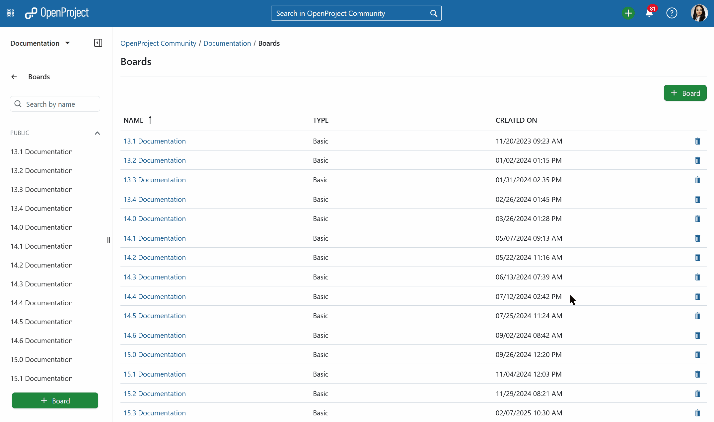

---
sidebar_navigation:
  title: Agile boards introduction
  priority: 500
description: Introduction to agile Boards in OpenProject.
keywords: Agile Boards
---

# Introduction to agile boards

This document provides an initial introduction to the boards in OpenProject, i.e. how to use a Kanban board to manage your tasks in an agile way. To learn more about working with Boards in OpenProject, please visit our [user guide for boards](../../user-guide/agile-boards).

> [!NOTE]
> The basic agile boards are included in the OpenProject Community edition. OpenProject advanced Action boards are an Enterprise add-on and can only be used with [Enterprise cloud](../../enterprise-guide/enterprise-cloud-guide) or [Enterprise on-premises](../../enterprise-guide/enterprise-on-premises-guide). An upgrade from the free Community edition is easily possible.

**Boards** in OpenProject enable agile project management, i.e. Kanban. Boards consist of lists (columns) with cards (work packages) on it. They help to visualize work, limit work-in-progress, and maximize efficiency (or flow).

| Topic                                                       | Content                                    |
|-------------------------------------------------------------|--------------------------------------------|
| [What is a Board?](#what-is-a-board)                        | Find out what a Board in OpenProject is.   |
| [Manage your work in a Board](#manage-your-work-in-a-board) | How to manage your work in an agile Board. |

<video src="https://openproject-docs.s3.eu-central-1.amazonaws.com/videos/OpenProject-Agile-Boards.mp4"></video>

## What is a Board?

Agile Boards in OpenProject support teams in their agile project management methodology, e.g. Scrum or Kanban.

You can create as many flexible boards as you want with both lists and cards on them. A list usually represents a workflow, e.g. status or version of a work package. The cards are work packages, e.g. tasks, on these lists.

## Manage your work in a Board

To manage your work in an agile board, open the boards module in the project menu. Choose a board from the list where you want to work on. Open it by double clicking the board's title.

You can prioritize cards within a list via drag and drop, add new cards and update a card's status directly in a board. To edit the details of a card, double click it. 

Agile Boards are just one of the many powerful features OpenProject offers. For a full comparison between OpenProject and Trello, explore our detailed guide: [OpenProject vs. Trello](https://www.openproject.org/project-management-software-alternatives/best-trello-alternative/).
