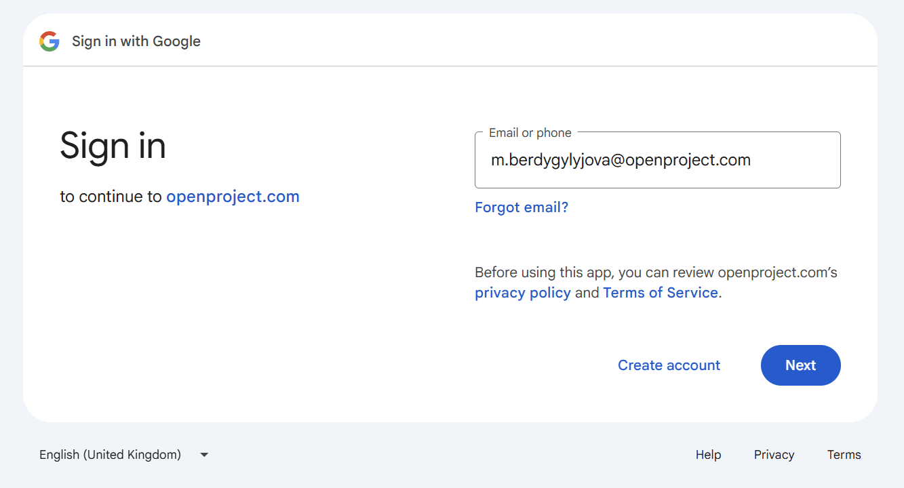
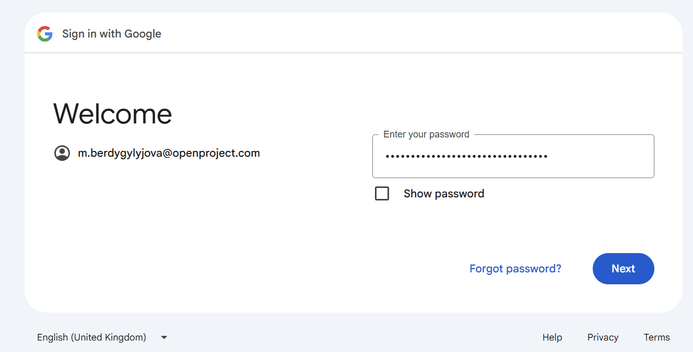
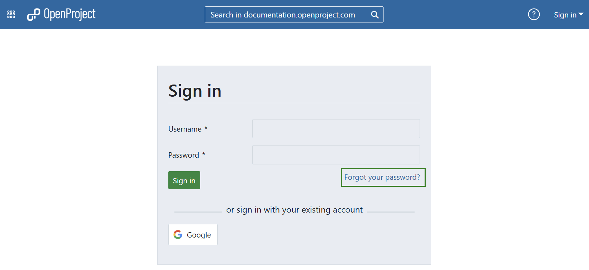

---
sidebar_navigation:
  title: Sign in and registration
  priority: 990
description: Sign in and registration in OpenProject.
keywords: sign in, login, registration
---

# Sign in and registration

This page will give you an overview of how to register or sign in to an existing OpenProject installation.

> [!NOTE]
> If you do not have an OpenProject installation yet, please visit our site on [how to create an OpenProject trial installation](../../enterprise-guide/enterprise-cloud-guide/create-cloud-trial/).

| Topic                                                                         | Content                                                            |
|-------------------------------------------------------------------------------|--------------------------------------------------------------------|
| [Sign in with an existing account](#sign-in-with-an-existing-account)         | Sign in with an existing account to an OpenProject installation.   |
| [Sign in with Google](#sign-in-with-a-google-account)                         | Find out how to sign in with a Google account.                     |
| [Sign in from the OpenProject website](#sign-in-from-the-openproject-website) | Sign in to an existing OpenProject Enterprise cloud edition from the website. |
| [Create a new account](#create-a-new-account)                                 | Create a new account for OpenProject.                              |
| [Choose your language](#choose-your-language)                                 | How to select your language in OpenProject.                        |
| [Reset your password](#reset-your-password)                                   | If you forgot your password find out how to reset it.              |

<video src="https://openproject-docs.s3.eu-central-1.amazonaws.com/videos/OpenProject-Sign-in-and-Registration-2.mp4"></video>

## Sign in with an existing account

To sign in to an OpenProject installation with an existing account, please enter the URL of your OpenProject in a modern browser, e.g. documentation.openproject.com.

Type in your user name and password in the respective fields and click the blue Sign in button. You will then be signed in to your OpenProject environment. If the autologin option was activated for your installation you will also be able to stay logged in for several days.

## Sign in with a Google account

Enterprise on-premises and Enterprise cloud customers can sign in with OpenID Connect, using their Google account. To sign in just click the Google button below the sign in form.

Please enter your email and click the blue Next button.

Enter your password and click the blue Next button.

If you have activated Two-factor authentication, please enter your second factor and continue.

When logging in for the first time, you will be asked to create your OpenProject Account.

## Sign in from the OpenProject website

If you are using the OpenProject Enterprise cloud edition, you can sign in to your installation directly from the OpenProject website.

Please follow the [instructions in our Enterprise cloud edition guide](../../enterprise-guide/enterprise-cloud-guide/sign-in).

## Create a new account

If you have been invited via email to an OpenProject installation, or if you have set up your own OpenProject (trial) installation, you are asked to create a new account in the system.

Please click the link in the invitation email:

Enter the following information:

* First name
* Last name
* Company E-Mail address
* Choose a password

Click the **Create** button.

Make sure to remember your password in order to sign in again at a later point.

## Choose your language

After the creation of your account you are logged into the system and see your personal account settings.  Here you can adjust your notification preferences, define email reminders frequency and interface settings, etc. You can also set your language preferences.

> [!TIP]
> OpenProject is available in more than 30 languages. If you do not find your preferred language, it first needs to be activated in the system's administration. Please talk to your system administrator to set up the language.

If you have already logged in before, you can [set your language in your user profile](../../user-guide/account-settings/#language-and-region-settings).

## Reset your password

If you forgot your password, you can reset your password by clicking the blue **Forgot your password** link directly below the Sign in field.

You are then asked to enter your email address with which you registered to OpenProject.

You will then receive an email with a link to reset your password.

> [!NOTE]
> If you have [signed-in with a Google account](#sign-in-with-a-google-account), you are not able to reset your password at this point.
