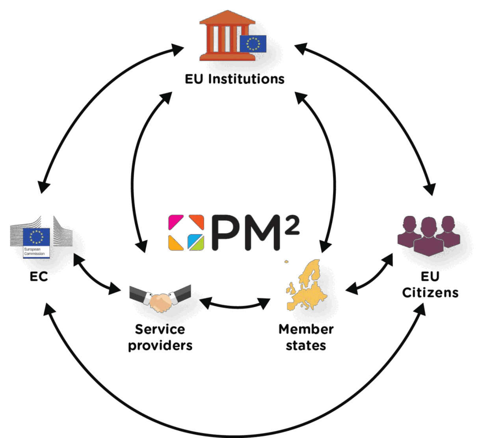

---
sidebar_navigation:
  title: 1 Introduction
  priority: 999
description: Explains the purpose and audience of the PM² methodology. It introduces PM² as a light, practical, and adaptable approach suitable for various project types, developed by the European Commission. It outlines the structure of the guide and how to use it.
keywords: user guide
---

# 1 An introduction to the PM² guide 

## 1.1 Objectives

This guide sets out to provide an introduction to the PM² Project Management Methodology. It has been kept as lean as possible, while still providing enough information to allow for an effective understanding of the PM² Methodology as practitioners start to use it.

## 1.2 Intended audience

- Entry-level Project Managers (PMs) and project teams wishing to learn more about project management and the PM² Methodology.
- Experienced Project Managers (PMs) and team members who wish to learn more about the PM² Methodology.
- Project teams that wish to start using the PM² Methodology in their projects.

**This guide provides:**

- a common vocabulary (glossary) which makes it easier for project teams to communicate and apply project management concepts
- best practices-it is up to the Project Managers (PMs) and project teams to choose the PM² practices that will bring most value to their projects
- links to PM² resources (online resources, Artefact templates and examples)
- an introduction to other PM² models, such as PM²-Agile, PM²-PgM (for Programme Management) and PM²-PfM (for Portfolio Management).

This guide can be read from beginning to end, to learn about the methodology, or it can be used as a reference, to help you as you practise PM².

## 1.3 About the PM² methodology

PM² is a Project Management Methodology developed by the European Commission. Its purpose is to enable Project Managers (PMs) to deliver solutions and benefits to their organisations by effectively managing the entire lifecycle of their project. PM² has been created with the needs of European Union Institutions and projects in mind, however, the best practices described in PM² are applicable to projects in any organisation.
PM² is a light and easy-to-implement methodology which project teams can tailor to their specific needs. PM² is fully supported by a comprehensive training programme (including workshops and coaching sessions), online documentation and an active Community of Practice (currently only available within the European Commission and to a number of affiliate European Institutions).
PM² incorporates elements from a wide range of globally accepted project management best practices, captured in standards and methodologies. Its development has also been influenced by operational experience on various projects both within European Union Institutions and external bodies.

**The PM² Methodology provides:**

- a project governance structure
- process guidelines
- artefact templates
- guidelines for using the artefacts
- a set of effective mindsets.

**PM² improves the effectiveness of project management by:**

- improving communication and the dissemination of information
- clarifying expectations as early as possible in the project lifecycle
- defining the project lifecycle (from Initiating to Closing)
- providing guidelines for project planning
- introducing monitor and control activities
- proposing management activities and outputs (plans, meetings, decisions)
- providing a link to agile practices.

## 1.4 The Centre of excellence in PM² (CoEPM²) 

The purpose of the Centre of Excellence in  PM² (CoEPM² is to provide the European Commission and European Union Institutions with high-quality project management infrastructure, support and consulting services. The CoEPM² supports the PM² Methodology internally, coordinates an inter-institutional Project Support Network, and promotes the wider adoption and use of PM² beyond the European Union Institutions through the Open PM² initiative and the Digital Europe Programme.

## 1.5 The Open PM² initiative

Open PM² is a European Commission initiative, which brings the PM² Methodology and its benefits closer to its broader stakeholders and user community.

The Open PM² Initiative provides European Union institutions, contractors and public administrations, as well as broader stakeholders, with open access to the PM² publications and associated resources. Its goal is to enable increased effectiveness in the management of projects, programmes, and portfolios and thus to serve the objectives of the European Union and the needs of member states and citizens.

One common PM Methodology open to all EU Institutions, Member States, Contractors, and EU Citizens.

The Initiative also seeks to rectify mistakes of the past, when efforts were duplicated and divergent project management approaches were sponsored rather than promoting convergent approaches based on similarities and the common interest of the broader European community.

By opening PM², the Initiative aims to enhance project management competency within Europe, leading to increased project efficiency and success.

Opening PM² does this by:

- rationalising project management approaches across European Union Institutions and beyond
- establishing a common language and processes, resulting in effective project communication
- providing a common set of productive mindsets
- enabling transparency and visibility for cross-organisational project collaborations
- enabling better project management, leading to improved cost/effort efficiency
- enabling the improved monitor and control of European Union-funded projects and grants
- applying the European Commission decision of 12 December 2011 (2011/833/EU) on the reuse of Commission documents to promote accessibility and reuse.

### 1.5.1 PM² publications 

The Centre of Excellence in PM² (CoEPM²) provides a central online location for all PM² information, and resources.

- PM² website https://pm2.europa.eu
- Contact [https://pm2.europa.eu/contact-us_en](https://pm2.europa.eu/contact-us_en)

You can also download directly all PM² Guides from the Publications Office of the European Union.

### 1.5.2 Project Support Network

The PM² Project Support Network is an EU Institutions wide network of Local Project Support Offices (LPSOs) which are coordinated and supported by the Centre of Excellence in PM² (CoEPM²). The PM² Project Support Network (PSN) aims to become a decentralised project management support network which provides guidance and support to PM² users on both the PM² Methodology and the effective use of project management tools \& techniques more broadly.

The Project Support Network:

- promotes the exchange and sharing of knowledge, experiences and best practices
- makes it possible to collect feedback to continuously improve and build on the PM² Methodology
- enables the Local Project Support Offices (LPSOs) to support each other as a community
- depends on the contributions of PM² champions (individuals and organisations).
