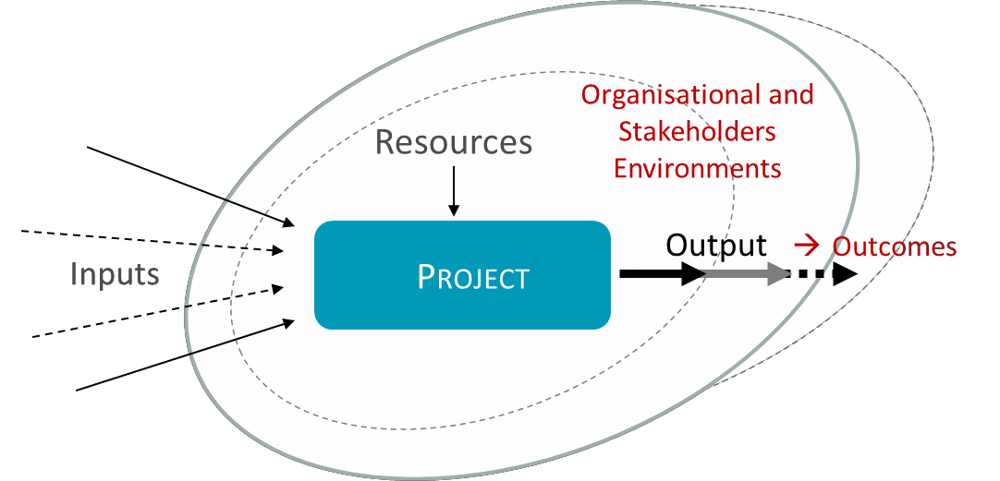
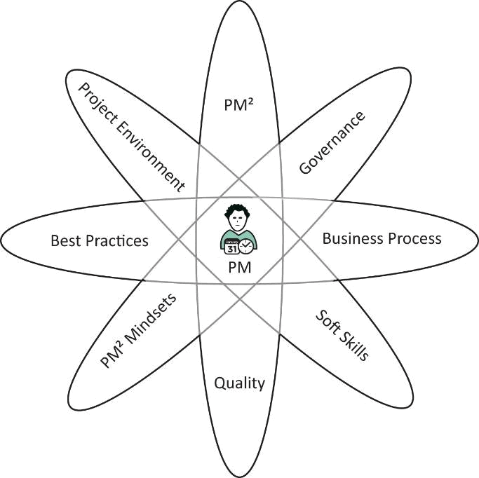

---
sidebar_navigation:
  title: 2 Project management
  priority: 950
description: Provides the general project management concepts on which PM² is built. It covers the definition of projects, their environment, key success factors, and essential project management competencies (knowledge, skills, and mindsets).
keywords: user guide
---

# 2 Project management 

This section introduces basic project management concepts and provides the context for a better understanding of the PM² Methodology.

## 2.1 About projects

### 2.1.1 What is a project?

A project is a temporary organisational structure set up to create a unique product or service (output) within certain constraints such as time, cost, and quality.

- Temporary means that the project has a well-defined start and end.
- Unique output means that the project's product or service has not been created before. It may be similar to another product, but there will always be a degree of uniqueness.
- A project's output may be a product (e.g. a new application) or a service (e.g. a consulting service, a conference or a training programme).
The project is defined, planned, and executed under certain external (or self-imposed) constraints. These can relate to scheduling, budgeting, quality, but also to the project's organisational environment (e.g. risk attitude, capabilities, available capacity, etc.).

A successful project ends when its scope objective has been achieved and all deliverables have been produced and accepted by the organisation or person that requested the project (the client). The deliverables are then handed over to the client and the project team is disbanded.

Projects are different from normal day-to-day work (operations) and are best managed with a special temporary organisational structure in order to:

- define the project scope and its deliverables (products or services)
- create a business justification for the investment (by defining the project's value for the organisation, outlining the business context, listing alternative solutions, etc.)
- identify project stakeholders and define a project core team
- create the project plans to help guide and manage the project
- assign and coordinate project work to teams
- monitor and control the project daily (progress, changes, risks, issues, quality, etc.)
- hand over the deliverables and administratively close the project.

### 2.1.2 Why we do projects 

Every project aims to introduce a new product/service or to improve an existing one. Achieving the goal is expected to bring about benefits to the organisation (e.g. a new organisation-wide document management system can increase productivity by introducing a new way of searching, reading and filing documents). A project can also be seen as a transformational process, which turns ideas into reality.

Projects may be carried out to maintain current business operations (e.g. sustain the current level of service), to transform business operations, or to improve the way of working so the organisation can be more efficient in the future.

Projects start for many different reasons:

- In response to a client request for a new product or service.
- In response to a market demand or opportunity for a new product or service.
- In response to a change in legislation or organisational needs.
- In response to an audit which outlines improvements that should be made.
- In response to a new product or service from a competitor.
- To make use of a new technology.
- To integrate processes in the light of the merger of two or more departments or organisations.
- To update an existing process.
- To relocate to new premises.
- To raise awareness on a topic.
- To provide a proof-of-concept.
- To migrate information to a new document management system.
- To improve an existing service.

### 2.1.3 Project outputs, outcomes, benefits

Although project teams tend to focus their efforts on producing deliverables, it should be remembered that project deliverables are merely a means to an end. The real purpose of a project is to achieve given outcomes that will yield measurable benefits.

Therefore, it is important for everyone involved in managing and executing a project (managers and team members) to understand the relationship between project outputs, outcomes and benefits. They must be able to identify the outputs, outcomes and benefits of their projects. Without this understanding, the project participants can lose sight of the project's original purpose and produce deliverables, which are of little (or no) value to the organisation. Thus:

- Project outputs (deliverables) are products/services, which introduce something new (a change).
- The change results in an outcome.
- The benefits are the measurable improvements resulting from this outcome.

Note that project outcomes and benefits are often realised only after the project has closed.
The table below illustrates this with a simple example:

| Example of outputs, outcomes and benefits. |  |
| :-- | :-- |
| Project Output | Adoption of the PM² Methodology within an organisation. |
| Project Outcomes | - Increased project quality.   - Improved visibility of project objectives, status and forecasts.   - Capability to have better control over contractor work and deliverables. |
| Project Benefits | - Project cost overruns decreased by 30\%   - Productivity increased by 30\%. |

## 2.2 About project management 

### 2.2.1 What is project management?

Project management can be described as the activities of planning, organising, securing, monitoring and managing the resources and work necessary to deliver specific project goals and objectives in an effective and efficient way.

The project management approach used should always be tailored to the needs of the project. When using PM², a Project Manager (PM) should use (and if needed after tailoring) only those parts that contribute to the effective management of their project.

### 2.2.2 Project documentation

Project documentation is a key activity in project management. It carries through from the start of a project to its completion. Project documentation:

- sharpens thinking by forcing people to put vague thoughts and plans into words
- crystallises planning
- defines the project scope for approval, ensuring that all project stakeholders and project team members share the same expectations on what is to be delivered and when
- provides all stakeholders with a clear picture of the project requirements
- facilitates communication with internal and external groups
- provides a baseline for monitoring and controlling a project's progress
- provides a record of important decisions
- provides the information required by official audits
- supports organisational memory and acts as a historical reference, which can be used to increase the chances of success of future projects.

Project documentation should of course, adhere to the quality standards of the organisation and the project regarding format, style, etc. However, above all, it should add value fulfilling its purpose and be clear and easy to understand.

### 2.2.3 The Project Support Office (PSO)

A Project Support Office (PSO) is an organisational body (or entity) that provides services, which support project management. These can range from providing simple support functions to helping link projects to strategic goals. Not all organisations have a Project Support Office (PSO).A Project Support Office (PSO) can:

- offer administrative support, assistance and training to Project Managers (PMs) and other staff
- collect, analyse and report on project progress data and information
- assist with project scheduling, resource planning, coordination and Project Management Information System (PMIS) use
- maintain a central project repository (of Project Documents, Risks, Lessons Learned)
- coordinate configuration management and quality assurance activities
- monitor adherence to methodology guidelines and other organisational standards
- tailor the project management methodology to new best practices and help project teams implement the updated methodology effectively.

### 2.2.4 Programme management

A programme is a set of related projects and activities managed in a coordinated way to achieve strategic objectives and benefits that could not be obtained if they were managed individually. The projects within a programme all contribute to the common programme goals and are interdependent. In addition to projects, a programme often includes elements of related work (programme-level activities) outside the scope of its projects.

Programme management is different from multi-project management (managing many projects in parallel). Thus, while a Programme Manager ( PgM ) coordinates efforts between projects, s/he does not directly manage the individual projects.

### 2.2.5 Project portfolio management

A project portfolio is a collection of projects, programmes and other activities, which are grouped together to allow better control over their financial and other resources and to facilitate their effective management

in terms of meeting strategic objectives. The projects or programmes in a portfolio are not necessarily inter-dependent on inter-related. From a strategic point of view, portfolios are higher-level components than programmes and projects. It is at the portfolio level that investment decisions are made, resources allocated, and priorities identified.

It is very important for people involved in project definition and management to understand the differences between-and specific management requirements of-projects, programmes and portfolios. They should also be able to define or position their work at the right level (i.e. know if their work would be better managed as a programme or a network of projects), while always being aware of the management and organisational context of their work (see Appendix D).

### 2.2.6 Projects vs operations 

Projects are temporary and should therefore have a definite start and end. A project should be considered complete when it is determined that its goals and objectives have been accomplished. Once this happens, the project team should be disbanded.

Operations, on the other hand, comprises the ongoing day-to-day activities undertaken by a permanent organisation to deliver services or products.

However, people often find themselves involved in so-called projects that have been going on for years, working with moving targets or a continuously expanded scope, which sometimes includes activities that should be classified as maintenance or operations. These are situations where the projects have been allowed to either become uncontrollable, or to move into operations (maintenance) mode.

In most projects, the operations period begins after the project's main products have been produced and accepted by the client.

How do you recognise that a project has slipped into operations mode?

- The main project deliverables have been produced and the client has accepted them.
- The main project output (deliverable) is in use.
- Support is provided to users.
- Maintenance activities are undertaken.
- Minor updates (improvements) are planned and implemented over time.

## 2.3 Project environment 

### 2.3.1 Project organisation

It would be convenient to assume that all PM² Project Managers (PMs) operate within their organisations in a homogenous environment and with consistent levels of authority and responsibility. This is generally not the case, however.

There are typically several ways of organising projects within an organisation, which utilise one of the following structures or a combination of them.

**The functional structure**

In a functional organisational structure, project work is integrated into the work performed by the permanent organisation. Project members and other resources are borrowed from multiple sections of the functional organisation. The Project Manager (PM) tends to have limited authority and needs to involve senior management in the management of important project issues. Project work is often viewed as having lower priority than everyday work.

**The projectized structure**

On the other end of the spectrum, in a projectized organisation, there is only a basic permanent (functional) hierarchy, and all work is organised and performed within temporary project organisations. Project resources are brought together specifically for the purpose of a project and work more or less exclusively for the project. At the end of the project, resources are either reassigned to another project or returned to a resource pool.

**The matrix structure**

A matrix organisation is a blended organisational structure. Additional temporary project organisations are created alongside the functional hierarchy to achieve specific project goals and work. The role of the Project Manager (PM) is recognised as central and key to the project's success, and the Project Steering Committee (PSC) typically delegates enough authority and responsibility to the Project Manager (PM) and the Business Manager (BM) for them to manage the project and its resources. Matrix organisations can be further categorised as weak, balanced and strong matrix organisations, the difference being the level of authority and autonomy given to the project organisation.

### 2.3.2 Developing project management competences

Project management involves much more than creating schedules and budgets, and Project Managers (PMs) must have a wide range of technical and behavioural skills at their disposal.

To develop the competences required to manage projects effectively. Project Managers (PMs) need to:

- understand how projects are handled within the organisation (talk to colleagues)
- review any project methodologies, standards and frameworks that exist in the organisation
- follow a project management course (e.g. a course offered by a recognised PM² training provider)
- reflect on their project management-what is successful, what could be improved?
- become an active member of the PM² Community-participate in forum discussions and learn from questions asked by other Project Managers (PMs)
- talk to more experienced Project Managers (PMs) about how they run their projects.

It is up to the Project Manager (PM) to acquire these skills and invest in their project management skills set. Project management knowledge comes from study and practice, from discussing, sharing experiences and reflecting on what went well and what can be improved.

### 2.3.3 Project management competences 

Project Managers (PMs) need to:

- understand the project management methodology used in their organisation (e.g. PM²)
- have the technical competences required to effectively manage the initiation, planning, execution, monitoring, controlling, and closing of a project.

On top of this, the role requires skills to work effectively with people and within the broader organisational context. These include the contextual and behavioural skills necessary to manage complex projects with diverse teams and stakeholder groups that have pluralistic and conflicting priorities.

Project Managers (PMs) thus also need to know/understand:

- how to communicate, lead, motivate, negotiate, solve problems and deal with issues, conduct meetings and workshops, report project status, etc.
- the business context and the general project environment (i.e. sociocultural, political, physical, etc.)
- organisational policies and standards (e.g. security, organisational architecture, audits, etc.)
- how the end-product or service will be maintained after it is delivered.

Additionally, subject-specific knowledge (e.g. IT, policy, etc.) is often relevant and useful to a Project Manager's (PM) role.

Most, if not all, of the above-mentioned points are also required of Business Managers (BM).
The table below lists the main competences for Projects Managers (PMs) and Business Managers (BMs):

| People Competences | Perspective Competences |
| :-- | :-- |
| - Self-reflection and self-management | - Strategy |
| - Personal integrity and reliability | - Governance, structures and processes |
| - Personal communication | - Compliance, standards and regulations |
| - Relationships and engagement | - Power and interest |
| - Leadership | - Change and transformation |
| - Teamwork | - Culture and values |
| - Conflict and crisis management |  |
| - Resourcefulness |  |
| - Negotiation |  |
| - Results orientation |  |

Source: IPMA-ICB (adapted)

The above competences may not necessarily be independent and each can have an impact on others. However, the filter that determines what is more important (e.g. self or common interest, time or quality, results or balance, etc.) lies in our values and ethics. Therefore, competences related to the appreciation of values and ethics have a prominent position compared to the rest because it is our ethical profile that guides us on how we should apply our competencies, and determines what we consider good or bad, right or wrong, in any given situation, decision and action.

Note that Project Managers (PMs) and Business Managers (BMs) should demonstrate these competencies effectively, consistently and appropriately to the given situation, while remaining aligned with organisational and professional values and ethics. The aim is to achieve the project goals by making (and acting on) the right decisions, at the right time, in the right way and for the right reasons. This can be a challenge for Project Managers (PMs), who often face tensions between making decisions based on goals and values, and meeting the needs of various stakeholders.

Such decisions and tensions become easier to manage when Project Managers (PMs) have developed an ethical disposition, which involves the balancing of goals and skills, personal integrity and moral virtue.

Although all virtues (logical and moral) affect all competences, the virtues of judgment, prudence and insightfulness are (comparatively) more related to demonstrating the perspective competencies, while the moral virtues of honesty, fairness, friendliness, generosity, temperance, courage, humour, and magnanimity and magnificence, are (comparatively) more related to demonstrating people competences (see Appendix F).

## Disclaimer

Reproduction and reuse is authorised provided the source is acknowledged.
Document licensed under CC BY 4.0 license (https://creativecommons.org/licenses/by/4.0/).
The Commission's reuse policy is implemented by Commission Decision 2011/833/EU of 12 December 2011 on the reuse of Commission documents (OJ L 330, 14.12.2011, p. 39 - https://eur-lex.europa.eu/eli/dec/2011/833/oj).

The PM² logo is the property of the European Union and may not be registered as a trademark or otherwise, nor used separately from these documents.

Neither the publication nor the logo can be used in a way which suggests endorsement of an external organisation by the European Union.
