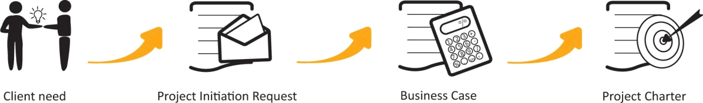
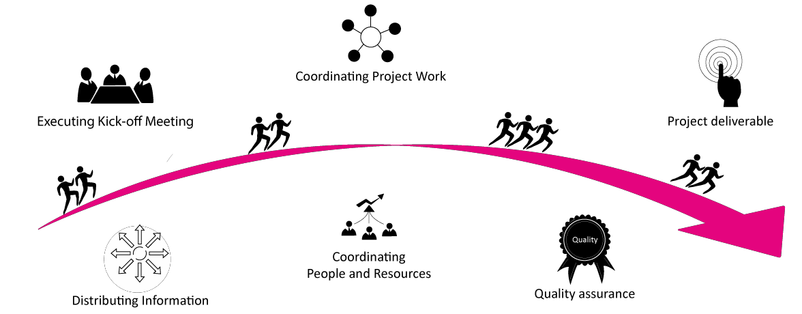
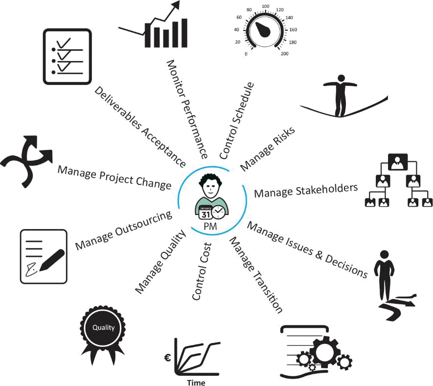

---
sidebar_navigation:
  title: 3 PM² methodology overview
  priority: 850
description: "Presents the House of PM² framework and explains its four pillars: Governance, Lifecycle, Processes, and Artefacts, all supported by PM² Mindsets. It introduces the four project lifecycle phases (Initiating, Planning, Executing, Closing) and explains tailoring to different project contexts."
---

# 3 Overview of the PM² methodology

## 3.1 The house of PM²

The PM² Methodology is built on Project Management best practices and is supported by four pillars:

1. a project governance model (i.e. Roles \& Responsibilities)
2. a project lifecycle (i.e. Project Phases)
3. a set of processes (i.e. project management activities)
4. a set of project Artefacts (i.e. documentation templates and guidelines).

The spirit of the PM² Methodology is further defined by the PM² Mindsets, which provide the glue that holds together the PM² practices and provide a common set of beliefs and values for PM² project teams.

## 3.2 The PM² lifecycle

The PM² project lifecycle has four sequential and non-overlapping phases with a different type of activity predominant in each phase (i.e. initiating activities are predominant in the Initiating Phase, etc.). However, while phase-related activities peak in terms of effort during a specific phase, activities of this type can also be executed during neighbouring phase(s) (e.g. planning activities are also repeated in the Executing Phase).

A project moves on to the next phase when the goals of its current phase have been deemed achieved as the results of a formal (or less formal) phase-exit review.

The focus of a project shifts from initiating and planning activities in the beginning to executing, monitoring and controlling activities in the middle and acceptance, transitioning and closing activities at the end.

Inexperienced project teams sometimes underestimate the importance of the work done in the initial project phases and start working on deliverables that are inadequately defined or planned. This results in the delivery of outputs, which are of poor quality and of little value to end-users. This is a common and costly mistake, which is often the root cause of overall project failure and the failure to realise the project's intended benefits. It is therefore important to invest adequate time during the Initiating Phase to define the desired outcomes by engaging a broad spectrum of stakeholders.

|  Project Phase | Description  |
| --- | --- |
|  1. Initiating | Define the desired outcomes. Create a Business Case. Define the project scope. Get the project off to a good start.  |
|  2. Planning | Assign the Project Core Team (PCT). Elaborate the project scope. Plan the work.  |
|  3. Executing | Coordinate the execution of project plans. Produce deliverables.  |
|  4. Closing | Coordinate formal acceptance of the project. Report on project performance. Capture Lessons Learned and post-project recommendations. Close the project administratively.  |
| Monitor & Control | Oversee all project work and management activities over the duration of the project: monitor project performance, measure progress, manage changes, address risks and issues, identify corrective actions etc. |

### 3.2.1 Initiating Phase

The first phase of a PM² project is the Initiating Phase. During this phase, the people involved formulate the project's objective(s), ensure the project's alignment to the organisation's strategic objectives, undertake some initial planning to get the project off to a good start, and put together the information required to gain approval to continue to the Planning Phase. The main input of this phase is a (client) request to address a need, problem or opportunity.

The following activities are part of the Initiating Phase:

- Creation of the Project Initiation Request which contains information about the requestor, business needs and the desired project outcomes.
- Creation of the Business Case, which provides a business justification, defines the project's budgetary requirements, and outlines the business context, problem and project descriptions, alternative solutions, and a high-level roadmap.
- Creation of the Project Charter, which provides more details on the project definition in terms of scope, cost, time and risk. It also defines milestones, deliverables, project organisation, etc.

The Business Case and Project Charter define the project's scope and direction. The Project Manager (PM) and the Project Core Team (PCT) reference and use both throughout the project.

At the end of the Initiating Phase, the Project Steering Committee (PSC) or other Appropriate Governance Body (AGB) reviews the above documents and decides whether to allow the project to move forward.

### 3.2.2 Planning Phase

The second phase of a PM² project is the Planning Phase. During the Planning Phase, the project's objective is developed into a specific and workable plan ready to be executed. The Project Work Plan specifies the project scope and appropriate approach, decides on a schedule for the tasks involved, estimates the necessary resources and develops the detail of the project plans. Several times during the Planning Phase, the Project Work Plan can be updated. Once agreed and finalised it is baselined and signed off.

The following activities are part of the Planning Phase:

- Running the Planning Kick-off Meeting to officially start the Planning Phase.
- Creating the Project Handbook, which defines the project's management approach.
- Developing the Project Work Plan (Work Breakdown, Effort and Costs, Schedule).
- Updating the Project Stakeholder Matrix, which identifies all project stakeholders.
- Creating other important plans such as the Communications Management Plan, the Transition Plan and the Business Implementation Plan.

The Project Manager (PM) uses the outputs of the Planning Phase to request approval to move on to the Executing Phase. This decision to move on is taken by the Project Steering Committee (PSC).

### 3.2.3 Executing Phase

The third phase of a PM² project is the Executing Phase. During the Executing Phase the project team produces the project deliverables (outputs) as outlined in the Project Work Plan. This is typically the stage of the project lifecycle that involves the most resources and requires the most monitoring.

The following activities are part of the Executing Phase:

- Running the Executing Kick-off Meeting.
- Distributing information based on the Communications Management Plan.
- Performing Quality Assurance (QA) activities as defined in the Quality Management Plan
- Coordinating project, work people and resources, and resolving conflicts and issues.
- Producing the project deliverables in accordance with the project plans.
- Handing over the deliverables as described in the Deliverables Acceptance Plan.

Once the project deliverables have been accepted by the Project Owner (PO), the Project Manager (PM) can request approval to move on to the Closing Phase. This decision to move on is taken by the Project Steering Committee (PSC).

### 3.2.4 Closing Phase

The final phase of a PM² project is the Closing Phase.
During a project's Closing Phase, the finished deliverables are officially transferred into the care, custody and control of the Project Owner (PO) and the project is administratively closed. Information on overall project performance and Lessons Learned is captured in the Project-End Report. The Project Manager (PM) ensures that the deliverables produced are accepted, all project documents are correctly filed and archived, and that all resources used by the project are formally released.

The following activities are part of the Closing Phase:

- Finalising all activities in order to formally close the project.
- Discussing the overall project experience and Lessons Learned with the project team.
- Documenting Lessons Learned and best practices for future projects.
- Closing the project administratively and archiving all project documents.

### 3.2.5 Monitor \& Control

Monitor \& Control activities run throughout the project's lifecycle. During Monitor \& Control, all work is observed from the point of view of the Project Manager (PM). Monitoring is about measuring ongoing activities and assessing project performance against project plans. Controlling is about identifying and taking corrective action to address deviations from plans and to address issues and risks.

### 3.2.6 Phase Gates and Approvals

At the end of each phase, the project passes through a review and approval gate. This ensures that the project is reviewed by the appropriate people (i.e. the Project Manager (PM), Project Owner (PO), the Project Steering Committee (PSC) or other delegated role) before it moves on to the next phase. These checkpoints contribute to the overall project management quality and allow the project to proceed in a more controlled way.

**The three PM² phase gates are:**

- RfP (Ready for Planning): at the end of the Initiating Phase
- RfE (Ready for Executing): at the end of the Planning Phase
- RfC (Ready for Closing): at the end of the Executing Phase.

## 3.3 PM² Phase Drivers and Key Artefacts

Projects depend on people to define, plan and execute them. These project drivers change from phase to phase in a PM² project.

During the Initiating Phase, the Project Owner (PO) is the main driver, initiating the project and being accountable for all documentation.

In the Planning Phase, the main driver is the Project Manager (PM), who is responsible for coordinating the delivery of all project plans.

The carrying out of the Project Work Plan and creation of the project deliverables in the Executing Phase is driven by the Project Core Team (PCT).

Finally, the Closing Phase is driven by the stakeholders who evaluate the project's overall performance.

| Key Phase Input/Output | Description |
| :-- | :-- |
| Project Initiation Request | Formalises the commitment to explore a problem, need or   opportunity further and captures the context. |
| Business Case | Captures the reasoning behind the project, provides justification and   establishes the budgetary constraints. |
| Project Charter | Builds on the Business Case and defines the project scope, high-level   requirements and deliverables. |
| Project Handbook | Presents the project management objectives and overall management   approach. Documents the roles \& responsibilities. |
| Project Work Plan | Includes a breakdown of the work to be carried out, estimates of the   effort and costs involved, and the project schedule. |
| Project Deliverables | Lists the complete set of project deliverables as defined in the Project   Charter and Project Work Plan. |
| Project-End Report | Summarises the project experience, project performance and Lessons   Learned (successful project practices and potential pitfalls). |

## 3.4 What is a PM² Project

Many PM² best practices can be applied to any type of project or work activity. However, to be able to apply the whole PM² Methodology, a project must have certain characteristics.

Thus, a PM² project:

- is (above all) a project (i.e. not operations, not a work activity, not a programme, etc.)
- has a duration of more than 4-5 weeks and involves more than 2-3 people
- runs within an organisation and can be subject to internal or external audits
- requires a clearly defined governance structure and clearly assigned roles and responsibilities
- requires approval of its budget and scope
- includes more than just construction/delivery activities
- includes transition and business implementation activities
- requires a certain level of documentation, transparency and reporting
- requires a certain level of control and traceability
- has a broad base of internal (and external) stakeholders
- may require the collaboration of several organisations or organisational units
- contributes to raising the organisation's project management maturity.

The number of the above characteristics, apparent in a project, drive the tailoring and customization that will have to be applied to the PM² methodology.

## 3.5 PM² Mindsets

The PM² processes, artefacts, tools and techniques help project teams make decisions on trade-offs between a project's time, cost, scope and quality dimensions.

The PM² Mindsets are the attitudes and behaviours that help project teams focus on what is crucial to achieving their project's goals. They help project teams navigate the complexities of managing projects in organisations and make the PM² Methodology both more effective and complete.

Thus, Project Managers (PMs) and project teams that practise PM² :

1. Apply PM² best practices to manage their projects.
2. Remain mindful that project management methodologies are there to serve projects and not the other way around.
3. Maintain an outcomes orientation in relation to all projects and project management activities.
4. Are committed to delivering project results with maximum value rather than just following plans.
5. Foster a project culture of collaboration, clear communication and accountability.
6. Assign project roles to the most appropriate people for the benefit of the project.
7. Balance in the most productive way the often-conflicting project management "Ps" of product, purpose, process, plan, planet, people, pleasure/pain, participation, perception and politics.
8. Invest in developing technical and behavioural competences to become better project contributors.
9. Involve project stakeholders in the organisational change needed to maximise project benefits.
10. Share knowledge, actively manage Lessons Learned, and contribute to the improvement of project management within their organisations.
11. Draw inspiration from the PM² Guidelines on Ethics and Professional Virtues (see Appendix F).

To remain mindful of the PM² Mindsets, Project Managers (PMs) and project teams that practise PM² should ask themselves the following important Infrequently Asked Questions (IAQs):

- Do we know what we are doing? Tip: Develop a clear and shared project vision. Manage the project using a holistic approach and optimise the whole project, not just parts of it. Follow a process but stay Agile and try to regularly remind yourself why you are doing something.
- Do we know why we are doing it? Does anyone really care? Tip: Make sure your project matters. Understand its goals, value and impact, and how it relates to the organisational strategy. Define upfront what project success is and deliver maximum value and real benefits, not just outputs.
- Are the right people involved? Tip: People make projects work. The primary criterion for involving people and assigning project roles should be to serve the needs and objectives of the project, and not politics, friendship, functional hierarchy, proximity or convenience.
- Do we know who is doing what? Tip: Know what you should be doing, and make sure others know what they should be doing. Is it clear to everyone? Clearly define and understand roles, responsibilities and accountabilities.
- Deliver at any cost or risk? Tip: Show respect for people's work and organisational funds and avoid high-risk behaviour and tactics. Always keep in mind that it is not just about the end result - how you get there also matters. Manage your projects based on positive values and principles.
- Is this important? Tip: Everything is NOT equally important. Identify, and agree on, the project's Critical Success Criteria (CSC), Minimum Viable Product (MVP), and Critical Success Factors (CSFs), and allocate effort and attention both tactically and strategically for the benefit of both the project and project management goals.
- Is this a task for "them" or for "us"? Tip: Make sure that client and provider groups work as one team towards a common goal. Real teamwork really works; so foster clear, effective and frequent communication.
- Should I be involved? Tip: Contribute from any position. Be proud of the skills, value and positive attitude you bring to the project. Help everyone who needs to be involved get involved. Promote and facilitate the contributions of all stakeholders.

- Have we improved? Tip: Commit to ongoing self- and organisational improvement by gathering and sharing knowledge. Project teams should reflect on how they can become more effective and adjust their behaviour accordingly.
- Is there life after the project? Tip: The product (or service) lifecycle has just begun! Make sure you have contributed to its success.

The PM² Mindsets are the glue that holds the PM² processes and practices together. They provide a common set of beliefs and values for all PM² practitioners.

The PM² Mindsets:

- help project teams navigate through the complexities of project realities.
- help project teams (re)position project management goals in a wider organisational context.
- remind project teams what is important for project success.
- are useful reminders of effective attitudes and behaviours.

## 3.6 Tailoring and Customisation

To ensure that the PM² Methodology effectively serves an organisation's and a project's needs, some level of tailoring or/and customisation may be required.

Tailoring refers to changing specific parts of the methodology, such as process steps, the content of artefacts, the distribution of responsibilities amongst the various roles, etc. Organisations do this to adapt the methodology to the specific needs of their structure and culture, and to align the methodology to organisational processes, policies, etc.

Tailoring makes more sense at the organisation/departmental level, but some tailoring can also take place at the project level, based, for instance, on the complexity, size or type of a project. In addition to any tailoring, further customisation may also be required at the project level to reflect the project's specific management needs. Examples of such customisations are the definition of decision thresholds for escalation, risk tolerances based on the risk appetite of the stakeholders, etc.

All tailoring and customisations should be documented in the Project Handbook.
The following guidelines should be considered when tailoring or customising the PM² Methodology:

- First, understand the purpose and value of the methodology element to be tailored, and then proceed with its tailoring.
- Avoid simplifying the methodology by eliminating whole chunks (e.g. a phase, a role, an activity or an artefact), but rather scale down (or up) the scope of that element.
- Balance the level of control a project needs against the extra effort such control requires.
- Eliminate waste (lean approach) but remain aligned with the spirit of the PM² Methodology as this is reflected by its four pillars and mindsets.
- Remember that the methodology was designed as an integrated whole, so avoid unnecessary deviations.

## 3.7 PM² and Agile Management

PM² recognises the complex and uncertain nature of many types of project and the positive contribution of the Agile way of thinking to their effective management.

Agile approaches meet various challenges, which often grow with the size of the organisations in which they are applied. These challenges may include coordination between Agile and non-Agile teams, compliance with various organisational governance and audit requirements, and organisational architecture and interoperability constraints.

**What is Agile?**

Agile is an approach to managing projects based on a specific set of principles and practices, which promote adaptive planning, evolutionary development, early incremental delivery and continuous improvement. It encourages rapid and flexible responses to change.

Agile takes into account the inherent uncertainty of the project environment and creates an organisation that is highly adaptive. It uses short feedback loops to allow for rapid responses to changes in product requirements and for ongoing improvements to processes.

Agile's key characteristics are:

- a focus on delivering value early on and frequently throughout a project
- decisions made based on what is known
- close cooperation among all parties involved
- continuous stakeholder involvement at all levels
- involving team members in planning
- incremental development with short cycles
- scope management through the continuous (re)prioritisation of tasks
- embracing change, continuous learning and improvement
- just enough documentation and control.

PM² provides a structure that helps Agile teams achieve the desired agility while still accommodating tight procurement and audit requirements, good coordination with programme and portfolio levels, and collaboration with other projects, contractors, other organisational units and external organisations (see Appendix D).
