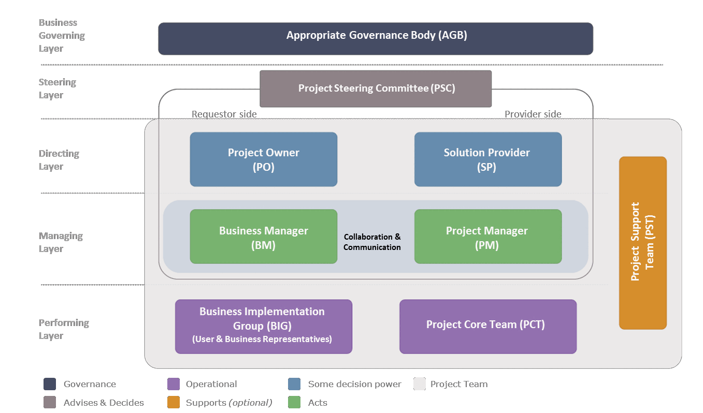

---
sidebar_navigation:
  title: 4 Project organisation and roles 
  priority: 800
description: Describes the PM² governance model in detail, including the main project roles and responsibilities for example the Project Steering Committee, Project Owner, Business Manager, Project Manager, and Project Core Team. It explains reporting lines, decision-making, and escalation mechanisms.
keywords: project stakeholders, project organisations, appropriate governance body, project steering committee, PSC, project owner, business manager, project manager, business implementation group, project core team, project support team, ram
---

# 4 Project Organisation and Roles 

## 4.1 Project Stakeholders

Project stakeholders are people (or groups) who can affect, be affected by, or believe to be affected by the activities carried out during a project's lifecycle and/or by its output(s) and outcome(s). Stakeholders can be directly involved in a project's work, members of other internal organisations or external to the organisation (e.g. contractors, suppliers, users or the general public).

The number of stakeholders depends on the complexity and scope of a project. However, the more people the project has an impact on, the more likely it is that it will affect people who have some power or influence over the project. Given that stakeholders can be useful supporters of the project or may choose to block it, the effective management and involvement of them is crucial for its success.

## 4.2 Project Organisation: Layers and Roles

The diagram below provides an overview of the layers and main roles in project organisation from a project management point of view.

Note that there is only one project team, which is composed of the people assuming the roles defined in the Performing, Managing and Directing layers. For the project to succeed, these people need to work together as a team.

**Business Governing Layer**

The Business Governing Layer determines the vision and strategy for the organisation as a whole. It consists of one or more management committees operating at a high or the highest management level. It is here that priorities are defined, investment decisions are made, and resources are allocated.

**Steering Layer**

The Steering Layer provides general project direction and guidance. It keeps the project focused on its objectives. It reports to the Appropriate Governance Body (AGB). The Steering Layer is composed of the roles defined in the Directing and Management Layers plus other optional roles.

**Directing Layer**

The Directing Layer champions the project and owns its Business Case. It mobilises the necessary resources and monitors the project's performance in order to realise the project's objectives. The Directing Layer comprises the roles of Project Owner (PO) and Solution Provider (SP).

**Managing Layer** 

The Managing Layer focuses on day-to-day project management. It organises, monitors and controls work to produce the intended deliverables and implement them in the business organisation. Members of the Managing Layer report to the Directing Layer. The Managing Layer comprises the roles of Business Manager (BM) and Project Manager (PM). It is of utmost importance for the success of the project that there is close collaboration and good communication between these two roles.

**Performing Layer**

The Performing Layer carries out the project work. It produces the deliverables and implements them in the business organisation. Members of the Performing Layer report to the Managing Layer. The Performing Layer comprises the roles of the Business Implementation Group (BIG) and the Project Core Team (PCT).

## 4.3 Appropriate Governance Body (AGB)

The Appropriate Governance Body (AGB) is the entity responsible for the strategic planning and portfolio management. In terms of projects, this is the body with the authority to approve a project, agree its stated objective and release the funding required to implement it. As a key decision-making body, this role comprises members from the requestor and provider side of the project.

**Responsibilities**:

- Defines the corporate and business domain strategy.
- Agrees to and implements a portfolio management framework to achieve the strategic objectives.
- Identifies, evaluates and authorises programmes and projects for implementation.
- Monitors and controls portfolio delivery performance.
- Optimises and manages portfolio resources and benefits.

## 4.4 Project Steering Committee (PSC)

The Project Steering Committee (PSC) comprises at least the four roles in the Managing and Directing Layers, providing a balanced mix of requestor- and provider-side representatives. Other roles can also participate as per the project's needs.

The Project Steering Committee (PSC) is chaired by the Project Owner (PO) and is the key decision-making and issue-resolution body for the project. Any significant decisions that may affect the project or the team's ability to deliver on the objectives will be escalated to the Project Steering Committee (PSC). Approval of key documents, resolution of important project issues or significant change requests will be discussed and decided upon here.

**Responsibilities:** 

- Champions the project and raises awareness of it at a senior level.
- Guides and promotes the successful execution of the project at a strategic level, keeping the project focused on its objectives.
- Ensures adherence to the organisation's policies and rules (e.g. IT governance, data protection, information security, document management, etc.).
- Provides high-level monitoring and control of the project.
- Authorises transition between Phases unless this is performed by the Appropriate Governance Body (AGB).
- Authorises deviations and scope changes with a high project impact and has the final say on decisions.
- Deals with escalated issues and conflicts.
- Approves key project artefacts (e.g. Project Charter, Project Work Plan).

**Optional Project Steering Committee (PSC) members:**

People with other roles can also participate in the Project Steering Committee (PSC) as per the project's needs. Some indicative roles are listed in the table below.

| Roles | Description |
| :-- | :-- |
| User Representative (UR) | Represents the interests of the project's users, ensuring that   project deliverables are fit-for-purpose. |
| Contractor's Project Manager (CPM) | Responsible for the outsourced parts of the project. |
| Architecture Office (AO) | Plays an advisory role on architectural aspects of IT projects. |
| Project Support Office (PSO) | Administers Project Steering Committee (PSC) meetings and   project documentation. Produces consolidated reports for   large projects. |
| Project Quality Assurance (PQA) | Responsible for quality assurance and auditing. |
| Document Management Officer (DMO) | Ensures the coherent implementation of document   management roles. |
| Data Protection Coordinator (DPC) | Consults and advises on data protection issues. |
| Local Information Security Officer (LISO) | Consults and advises on security issues. |

## 4.5 Project Owner (PO)

The Project Owner (PO) is the client of the project, and as such sets the business objectives and ensures that project outcomes are in line with business objectives and priorities. As the key Directing Layer role from the requestor side, the Project Owner (PO) is accountable for the overall project's success, and later becomes the owner of the project's outputs (product or service).

**Responsibilities:**

- Acts as the project champion, promoting the project's success.
- Chairs the Project Steering Committee (PSC).
- Provides leadership and strategic direction to the Business Manager (BM) and Project Manager (PM).
- Sets the business objectives and accepts the Business Case for the project.
- Owns the business risks and ensures that project outcomes are in line with business objectives and priorities.
- Mobilises the resources necessary for the project, in accordance with the agreed budget.
- Regularly monitors project progress.
- Coordinates the resolution of escalated issues and conflicts.
- Drives organisational change and monitors proper evolution and change implementation.
- Approves key project artefacts (Business Case, Project Charter, Project Handbook, Work Plan, Deliverables Acceptance Plan, Transition Plan, Business Implementation Plan).

4.6 Solution Provider (SP)

The Solution Provider (SP) assumes overall accountability for project deliverables and represents the interests of those who design, manage and implement (or outsource) the project's deliverables.

As the key Directing Layer role from the provider side, the Solution Provider (SP) usually has a management position in the functional hierarchy of the organisation undertaking the project, and therefore often works with the Project Owner (PO) in defining the project's business objectives.

**Responsibilities:** 

- Assumes overall accountability for the project deliverables and services requested by the Project Owner (PO).
- Mobilises the required resources from the provider side and appoints the Project Manager (PM).
- Approves the objectives of any outsourced activities and deliverables and becomes accountable for the contractor's performance.

## 4.7 Business Manager (BM)

The Business Manager (BM) represents the Project Owner (PO) on a daily basis within the project and helps in defining the project's business objectives via the Project Initiation Request, Business Case and Business Implementation Plan. The Business Manager (BM) collaborates closely with the Project Manager (PM) and coordinates client-side activities and roles (e.g. user and business representatives), ensuring that the project's deliverables fulfil the business and user needs.

**Responsibilities**:

- Guarantees cooperation and an efficient communication channel with the Project Manager (PM).
- Coordinates the Business Implementation Group (BIG) and acts as a liaison between the User Representatives (URs) and the provider organisation.
- Ensures that the products delivered by the project fulfil the user's needs.
- Manages the activities on the business side of the project and ensures that the required business resources are made available.
- Decides on the best way to introduce business change or re-engineering actions, when needed.
- Ensures that the business organisation is ready to accommodate the project's deliverables when they are made available by the Solution Provider (SP).
- Leads the implementation of the business changes within the user community.
- Coordinates the schedule and delivery of any user training (and production of related material).

## 4.8 Project Manager (PM)

The Project Manager (PM) oversees the project on a daily basis and is responsible for delivering highquality results within the identified objectives and constraints, ensuring the effective use of the allocated resources. More widely, the Project Manager's (PM) responsibility also includes risk and issue management, project communication and stakeholder management.

**Responsibilities**:

- Executes the project plans as approved by the Project Steering Committee (PSC).
- Coordinates the Project Core Team (PCT), ensuring the effective use of the allocated resources.
- Ensures that project objectives are achieved within the identified constraints, taking preventive or corrective measures where necessary.
- Manages stakeholder expectations.
- Oversees the creation of all management artefacts (except the Project Initiation Request, Business Case and Business Implementation Plan) and secures approval from the Project Owner (PO) or the Project Steering Committee (PSC).
- Ensures the controlled evolution, of products delivered, through proper change management.
- Performs risk management activities for project-related risks.
- Monitors project status and reports to the Project Steering Committee (PSC) on project progress at regular predefined intervals.
- Escalates unresolvable project issues to the Project Steering Committee (PSC).
- Liaises between the Directing and Performing Layers of the project.

## 4.9 Business Implementation Group (BIG) 

The Business Implementation Group (BIG) sits on the requestor side and consists of representatives of business and user groups. Coordinated by the Business Manager (BM), it is responsible for planning and implementing the business changes that need to be made for the organisation to effectively integrate the project deliverables into its everyday work.

**Responsibilities**:

- Analyses the impact of the project's implementation on ongoing operations, existing business processes, staff and organisational culture.
- Participates in the design and updating of affected business processes.
- Prepares the affected business area for the upcoming change.
- Advises the Business Manager (BM) on the organisation's readiness for change.
- Embeds the project deliverables into business operations and implements the organisational change activities that fall within the project's scope.

**User Representatives (URs)**

User Representatives (URs) represent the interests of the project's end-users and are part of the Business Implementation Group (BIG). It is important to designate User Representatives (URs) and involve them throughout the project, keep them up to date with developments and provide them with a sense of ownership. User Representatives (URs) help define project requirements and validate them at regular intervals, ensuring that the final deliverables are fit for the business purpose.

**Responsibilities**:

- Help define the business needs and requirements.
- Ensure that the project specifications and deliverables meet the needs of all users.
- Review the project specification and acceptance criteria on behalf of the users.
- Communicate and prioritise user opinions in the Project Steering Committee (PSC) and ensure that these opinions are taken into consideration when decisions are made whether or not to implement a proposed change.
- Participate in demonstrations and pilot phases as needed.
- Perform user acceptance tests.
- Sign off on user-related documents (requirements document, deliverable acceptance testing, etc.).
- Guarantee business stability during the transition towards the new operational state.

## 4.10 Project Core Team (PCT)

The Project Core Team (PCT) comprises the specialist roles responsible for creating the project deliverables. Its composition and structure depend on the project size and type (e.g. IT project, policy development project, etc.) and is defined by the Project Manager (PM) based on the project's needs.

Coordinated by the Project Manager (PM), the Project Core Team (PCT):

- Participates in developing the project scope and planning project activities.
- Carries out project activities based on the Project Work Plan and schedule.
- Produces project deliverables.
- Provides the Project Manager (PM) with information on the progress of activities.
- Participates in project meetings as needed and helps resolve issues.
- Participates in the Project-End Review Meeting during the collection of Lessons Learned.

Aside from the specialist roles that create the project deliverables, there are two specific Project Core Team (PCT) roles that deserve to be discussed in more detail from a project management point of view: the Contractor's Project Manager (CPM) and the Project Manager Assistant (PMA).

**Contractor's Project Manager (CPM)**

The Contractor's Project Manager (CPM) leads the contractor's staff working on the project, planning controlling and reporting on the production of outsourced deliverables. Working closely with the Project Manager (PM), the Contractor's Project Manager (CPM) ensures that all work is carried out on time and to the agreed standards, guaranteeing the successful completion and delivery of subcontracted activities.

**Project Management Assistant (PMA)** 

For large projects, the Project Manager (PM) might find it useful to delegate some management tasks to an assistant. This Project Management Assistant (PMA) can work on a range of coordination and supportive tasks as assigned by the Project Manager (PM), and acts as the Project Manager's (PM) backup in meetings, etc. However, the Project Manager (PM) remains the person responsible for all project management tasks and deliverables.

The Project Management Assistant (PMA) may also be part of a Project Support Team (PST) and assigned to the project.

## 4.11 Project Support Team (PST)

The Project Support Team (PST) is an optional role that consists of the people responsible for providing support to the project. Its composition and structure depend on the needs of the project. The Project Support Team (PST) is often composed of representatives from various horizontal services or units.

**Responsibilities**:

- Provides administrative support to the project.
- Defines requirements for reporting and communication.
- Administers Project Steering Committee (PSC) meetings and drafts related reports.
- Supports the Project Manager (PM) in planning, monitoring and controlling the project.
- Advises on project management tools and administrative services.
- Manages the project documentation (versioning, archiving, etc.).

**Project Support Office (PSO)**

The Project Support Office (PSO), also called Project Management Office or Project Office, is an optional structure that can provide services to project teams such as the application of the methodology and use of the artefacts, information systems, governance, logistics and various support.

**Project Quality Assurance (PQA)**

Assigned by the Project Steering Committee (PSC) and working independently of the Project Manager (PM), the Project Quality Assurance (PQA) ensures the high quality of the project and its deliverables, by reviewing processes and artefacts, identifying non-conformities with the set quality standards and recommending corrective actions. This is an optional role in an organisation, reporting directly to the Project Steering Committee (PSC), and may take the form of either a group or individual staff member.

**Other**

Depending on the project's nature and characteristics, the Project Support Team (PST) can be further extended and include representatives from other departments/units, e.g. Legal, Procurement, Data Protection, etc.

## 4.12 RAM (RASCI) - Documenting Responsibility Assignments 

The Responsibility Assignment Matrix (RAM) is a way of representing and clarifying the roles and responsibilities for a given activity. The RAM is also known as a RASCI table (pronounced rasky), which stands for:

| RASCI | Description |  |
| :-- | :-- | :-- |
| **R** | Responsible | Does the work. Others can be asked to assist in a supporting role. There is just   one responsible person for any given task. |
| **A** | Accountable | Ultimately answerable for the correct and thorough completion of the work.   There is just one accountable person for any given task. |
| **S** | Supports | As part of a team, roles with a support function work with the person   responsible. The support role helps complete the task. |
| **C** | Consulted | Those whose opinions are requested and with whom there is two-way   communication. The consulted role does not help complete the task. |
| **I** | Informed | Those who are kept informed of progress. |

Stakeholders should be reminded of their roles and responsibilities during the project. This Open PM² guide includes a RAM (RASCI) table for each artefact in the Initiating, Planning and Closing Phases and for each of the activities in the Executing Phase and in Monitor \& Control (see Appendix E).

Example: The RAM for the Standard PM² roles involved in creating the Business Case document.

| RAM (RASCI) | AGB | PSC | PO | BM | BIG | SP | PM | PCT |
| :-- | :--: | :--: | :--: | :--: | :--: | :--: | :--: | :--: |
| Business Case | I | C | A | R | C | S | S | n.a. |

**Notes:**

- Accountable: The Project Owner (PO) is accountable (S/he provide adequate resources).
- Responsible: The Business Manager (BM) is responsible for creating the Business Case.
- Supports: The Solution Provider (SP) and the Project Manager (PM) work with the Business Manager (BM) to develop the Business Case. The final responsibility, however, lies with the Business Manager (BM).
- Consulted: The Project Steering Committee (PSC) and User Representatives (URs) are consulted.
- Informed: The Appropriate Governance Body (AGB) will be informed about the outputs or status of the task (it will be provided with information).

