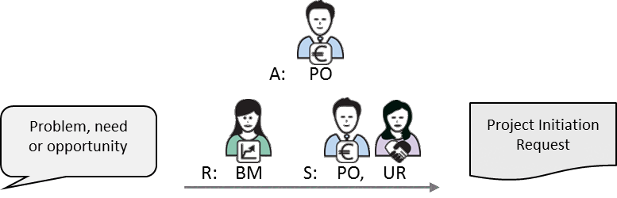
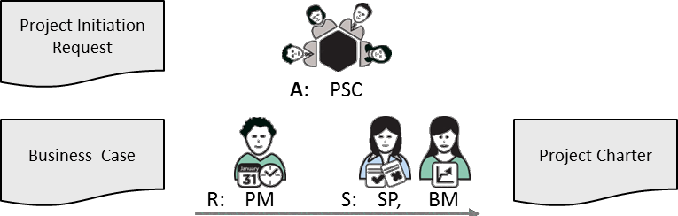

---
sidebar_navigation:
  title: 5 Initiating phase
  priority: 750
description: Defines the activities needed to start a project. This includes preparing the Project Initiation Request (PIR), developing the Business Case, drafting the Project Charter, and obtaining formal approval through the Request for Planning (RfP) phase gate.
keywords: initiating meeting, project initiation request, business case, project charter, ready for planning
---

# 5 Initiating Phase 

The first phase of a PM² project is the Initiating Phase. It begins with the identification of a need, problem or opportunity, and ends with the establishment of the plans and processes needed to take the project forward. Proper project initiation is critical for successful project planning and execution. It involves defining project objectives and constraints, and receiving formal organisational sponsorship for the project.

Three key project artefacts are created during the Initiating Phase: the Project Initiation Request, the Business Case and the Project Charter. Some of the Project Logs are also set up (i.e. Risk Log, Issue Log, Decision Log) while the Change Log is typically set up during the Planning Phase.

## 5.1 Initiating Meeting

This is an informal meeting, usually between the project initiator and the Project Owner (PO), and others who could potentially contribute to the creation of the Initiating Phase documents. The goal of this meeting is to introduce any pre-project information and discuss the next steps.

The result of this meeting is a better understanding of the context of the (future) project, as well as a decision to move forward with the creation of the Project Initiation Request. Documentation and lessons learned from previous similar projects can also be used as input to this meeting.

## 5.2 Project Initiation Request

The Project Initiation Request is a project's starting point and formalises its initiation. By creating a Project Initiation Request, the project initiator ensures that the current context/situation (i.e. problem, need or opportunity) and the project's desired outcomes are formally captured and can be used as a basis for further exploration and elaboration.

The Project Initiation Request contains basic information about the estimated effort and cost of undertaking the project as well as the timeframe for its completion and the type of delivery. Specifically, the document describes the impact the project is expected to bring and summarises the success criteria against which it will be evaluated. Additionally, the Project Initiation Request outlines the project's relevance to the organisation's strategic direction and highlights the key assumptions, constraints and risks as assessed at this stage.

|  Key Participants | Description  |
| --- | --- |
|  Initiator | Anyone can introduce a Project Initiation Request.  |
|  Project Owner (PO) | The main beneficiary of the project's outputs usually nominates a Project
Owner (PO).  |
|  Solution Provider (SP) | The organisational unit that will carry out the project work nominates a
Solution Provider (SP).  |
|  Approver | Depending on the project, the Project Owner (PO) or a higher-level
Appropriate Governance Body (AGB) can accept the Project Initiation
Request and authorise work on a more elaborate Business Case.  |

**Input**

- A problem, a need or an opportunity expressed by the initiator.

**Guidelines**

- Note that though anyone can initiate a Project Initiation Request, in many cases the Project Owner (PO) delegates its creation to the Business Manager (BM).
- Know your audience: Depending on the project size and the organisation's approval process, approval can be informal (i.e. the Project Owner (PO) accepts it), or formal (i.e. an Appropriate Governance Body (AGB) reviews and approves it).
- Ensure all the relevant information is included, but at this point limit details to high-level information-finer points will be added in the form of the Business Case and other Project artefacts.

**Steps (for a project's initiation)**

1. The Project Initiation Request is drafted.
2. The Project Initiation Request is submitted for approval to the relevant Governing or Steering Level role.
3. Once the Project Initiation Request is approved, the project is defined in more detail with a preliminary project scope description in the Business Case and further elaborated in the Project Charter.
4. The Solution Provider (SP) assigns the Project Manager (PM) and the Project Core Team (PCT). The Project Manager (PM) is typically assigned after the Business Case is approved (or at the latest before the completion of the Project Charter), while the Project Core Team (PCT) is typically assigned before the Planning Kick-off Meeting.

The lifecycle of the Project Initiating Request ends with the creation of the Business Case and Project Charter. All the information included in the Project Initiation Request is copied over, updated and further elaborated in these two documents, which remain "live" until the end of the project.

| RAM (RASCI) | AGB | PSC | PO | BM | BIG | SP | PM | PCT |
| :-- | :--: | :--: | :--: | :--: | :--: | :--: | :--: | :--: |
| Project Initiation Request | I | n.a. | A/S | R | S/C | I | n.a. | n.a. |

**Outputs** 

- Project Initiation Request

## 5.3 Business Case 

> [!TIP]
>
> Currently we recommend to have a task to create the Business Case. It is currently modelled as a work package. This will then be replaced by the new documents module which allow to automatically create the artefact based on the single source of truth.
> [Example](https://pm2.openproject.com/wp/450)

The purpose of the Business Case is to capture the reasoning behind the project, to describe the project's alignment with the organisation's strategic objectives, to provide a justification for the investment in time and effort, and to set out the budgetary needs. For larger strategic projects, the Business Case may also include an assessment of impact and risks along with a more detailed cost-benefit analysis.

The Business Case provides decision-makers with the information they need to determine whether the project is worth doing. The Business Case is a living document and therefore should be re-examined at critical project milestones to check that the expected benefits are still achievable, the costs/schedule fall within the budget/timeline, and the project is still relevant to the organisation and should be continued.

| Key Participants | Description |
| :-- | :-- |
| Project Owner (PO) | Accountable for the Business Case. |
| Business Manager (BM) | Creates the Business Case, supported by the Solution Provider (SP) and   the Project Manager (PM) (if known). |
| Other project stakeholders | Consulted in defining the project's Business Case |
| Approver | A preliminary Project Steering Committee (PSC) or a higher-level   Appropriate Governance Body (AGB) |

**Inputs**

- Project Initiation Request

**Guidelines**

- Note that the form and depth of analysis required for this artefact depends on the level of investment required for the project.
- Consider several solutions that fulfil this business need and recommend one of these.
- Describe the overall approach to how the project will be executed (project strategy).
- Identify measurable criteria that will be used to determine the success of the project.
- For projects carried out under contract (e.g. as a result of a bid award), create the Business Case based on the Request for Proposal, the response to this request, and the contract itself.

**Steps**

1. The Business Manager (BM) drafts the Business Case based on the information captured in the Project Initiation Request. The main project aspects to be analysed and presented are:

- the project's justification and impact
- the project's positioning in the overall organisational strategy
- an assessment of Strengths, Weaknesses, Opportunities and Threats (SWOT Analysis) of several solutions, one of which is proposed for implementation
- a cost benefit analysis, per identified solution, detailed to the extend required
- synergies and interdependencies with other projects and initiatives
- high-level project roadmap, including major milestones.

2. The Project Owner (PO) evaluates the Business Case and decides to approve or reject it.
3. The Project Owner (PO) sends the Business Case to the Appropriate Governance Body (AGB) if needed for corporate approval.

| RAM (RASCI) | AGB | PSC | PO | BM | BIG | SP | PM | PCT |
| :-- | :--: | :--: | :--: | :--: | :--: | :--: | :--: | :--: |
| Business Case | I | C | A | R | C | S | S | n.a. |

| Related Artefacts | Initiating | Planning | Executing | Monitor \& Control | Closing |
| :-- | :--: | :--: | :--: | :--: | :--: |
| Benefits Management | Business Case | Business Implementation Plan | Project Reports | Business Implementation Checklist | Project-End Report |

**Outputs** 

- Business Case

## 5.4 Project Charter 

The Project Charter provides a basis for the more detailed project planning. It defines the project's objectives (i.e. scope, time, cost, quality), high-level requirements, risks and constraints, as well as the project milestones and deliverable(s).

The charter is a key element of the project approval process (along with the Business Case). It includes the what, how and when fundamentals of the project and provides a baseline against which progress can be measured. Although the Project Charter can be initiated by the Business Manager (BM), it is ultimately the responsibility of the Project Manager (PM) to complete it and submit it for approval.

| Key Participants | Description |
| :-- | :-- |
| Project Manager (PM) | Develops the Project Charter. Should be assisted by the Business Manager   (BM) and the Solution Provider (SP). |
| Project Owner (PO) | Reviews and approves the Project Charter. |
| Decision-making Body | The Appropriate Governance Body (AGB) provides the corporate-level   approval of the Project Charter. |

**Inputs**

- Project Initiation Request
- Business Case

**Guidelines**

- The Project Charter should be brief so that it can be sent to project stakeholders as soon as possible, and so that it is easy for them to review and understand.
- Avoid presenting detailed requirements. Instead present high-level needs and features.
- Detailed requirements may be captured in other artefacts (e.g. in a Requirements Document), or in an appendix to the Project Charter to be elaborated during the planning phase.
- Ensure that input from all concerned project stakeholders is considered.
- Ensure that once created, the Project Charter is updated and distributed as required.

**Steps**

1. The Business Manager (BM) will first consult the main project stakeholders and takes part in drafting the Project Charter.
2. The Project Manager (PM) is responsible for delivering the document.
3. The main project stakeholders review the Project Charter and the Project Steering Committee (PSC) accepts it.
4. The Project Owner (PO) sends the Business Case and Project Charter to the appropriate decision-making body for additional approval, if needed.
5. The appropriate decision-making body evaluates and accepts or rejects the Project Charter.

| RAM (RASCI) | AGB | PSC | PO | BM | BIG | SP | PM | PCT |
| :-- | :--: | :--: | :--: | :--: | :--: | :--: | :--: | :--: |
| Project Charter | I | A | C | S | C | S | R | C |

| Related Artefacts | Initiating | Planning | Executing | Monitor \& Control | Closing |
| :-- | :--: | :--: | :--: | :--: | :--: |
| Scope Management | Business Case | Project Work Plan | Change Requests Project Reports | Project Logs | Project-End Report |

**Outputs**

- Project Charter

## 5.5 Phase Gate RfP (Ready for Planning) 

This is the first phase gate. A review and approval are recommended before the project can formally move to the next phase. The Project Manager (PM) assesses whether the project is ready to commence the Planning Phase and seeks approval of the Business Case and Project Charter from the Project Steering Committee (PSC). If the Business Case or Project Charter is not approved, the project proceeds directly to the Closing Phase for Lessons Learned and archiving.
PM² provides a template Phase Exit Review Checklist for each phase that can be used by the Project Manager (PM) to guide the assessment, alongside a review of the phase's specific goals.
