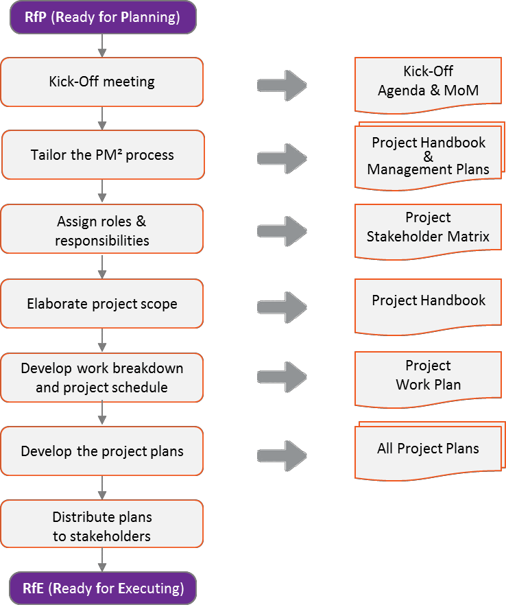
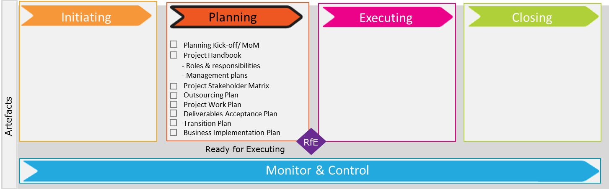
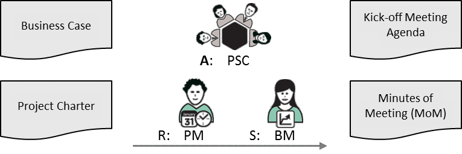
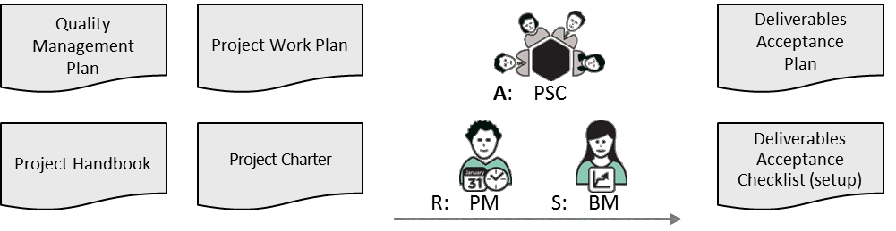
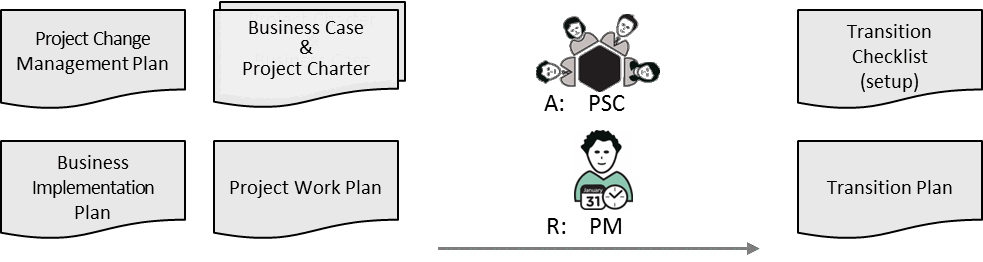
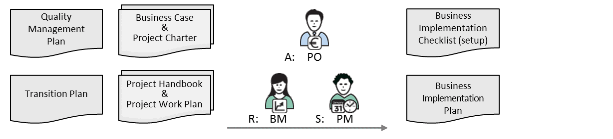

---
sidebar_navigation:
  title: 6 Planning phase
  priority: 700
description: Focuses on defining how the project will be executed and controlled. It covers developing the Project Handbook and detailed management plans (scope, schedule, cost, risk, stakeholder, etc.), creating the Work Breakdown Structure (WBS), scheduling, resource planning, and getting approval through the Request for Execution (RfE) gate.
keywords: project handbook, project stakeholder matrix, project work plan, outsourcing plan, deliverables acceptance plan, transition plan, business implementation plan, ready for executing
---

# 6 Planning Phase 

The second phase of a PM² project is the Planning Phase. It begins with the Planning Kick-off Meeting and ends once all project plans have been developed and baselined, and an appropriate management and implementation approach has been established. Most of a project's artefacts are created during the Planning Phase.

| Artefact Type | Description |
| :--: | :--: |
| Management Plans (standard) | These plans define the various processes to be used (e.g. for Risk Management). PM² provides Management Plan templates along with guidelines on how to tailor and customise them to the project's context and needs. |
| Project Plans (specific) | These plans are specific to the project (e.g. the Project Work Plan) and are built according to the project needs and the team's analysis and experience. PM² provides templates and guidelines for these plans. |
| Other   (domain specific) | These artefacts are specific to the project domain (e.g. system models for IT projects). PM² does not provide templates for these artefacts. |

## 6.1 Planning Kick-off Meeting 

The Planning Phase starts with an official Planning Kick-off Meeting, the aim of which is to:

- ensure that everyone understands the project scope
- clarify the expectations of all key project stakeholders
- identify project risks
- discuss the project plans.

At this early stage, past experiences, and especially Lessons Learned from previous similar projects, will significantly help the project team.

This Planning Kick-off Meeting should be planned and run effectively as it is critical that the project goals are well understood. PM² provides templates for the Meeting Agenda and the Minutes of Meeting (MoM).

| Key Participants | Description |
| :-- | :-- |
| Project Manager (PM) | Organises the meeting. |
| Project Core Team (PCT)   Business Implementation Group (BIG)   User Representatives (URs)   Solution Provider (SP)   Project Owner (PO)   Business Manager (BM) | Required participants. |
| Project Manager Assistant (PMA)   Project Support Office (PSO) | Required to attend (if part of the project). |
| Other project roles or stakeholders | Optional participation (as per the project's needs). |

**Inputs**

- Business Case
- Project Charter

**Steps**

Before the Planning Kick-off Meeting:

1. Plan the meeting.
2. Draft the Meeting Agenda clearly indicating the points to be discussed.
3. Send out the Meeting Agenda in advance.
4. Ensure the attendance of required participants.
5. Address any logistical needs and prepare documentation or hand-outs for the meeting.

During the Planning Kick-off Meeting:

1. Introduce the meeting participants.
2. Ensure a minute-taker is identified to make notes identifying action items. These will be compiled and sent to participants after the meeting.
3. Walk the participants through the Project Charter so they understand the project scope.
4. Outline the goals, expectations and activities of the Planning Phase and discuss the planning timeline.
5. Describe and discuss the project roles and responsibilities.
6. Discuss the project timeline.
7. Discuss the overall approach to the project. This discussion can be a brainstorming session within the limits set by the Project Charter.
8. Discuss the project plans needed for the project. The final set of required project plans will be documented in the Project Handbook.
9. Discuss risks, constraints and assumptions.
10. Discuss or present any project supporting tools (with input from the Project Support Office, PSO).
11. Allow time for any other business (questions \& answers).
12. Summarise the discussion (decisions, actions and risks).
13. Communicate the next steps.

After the Planning Kick-off Meeting:

1. Distribute the Minutes of Meeting (MoM) to the appropriate stakeholders (as identified in the Project Charter).
2. The Minutes of Meeting (MoM) should include a summary of project issues raised, risks identified, decisions taken and changes proposed. note that the issues, risks, decisions and project changes should also be recorded in the relevant logs.

| RAM (RASCI) | AGB | PSC | PO | BM | BIG | SP | PM | PCT |
| :-- | :--: | :--: | :--: | :--: | :--: | :--: | :--: | :--: |
| Planning Kick-off Meeting | I | A | C | S | C | C | R | C |

**Outputs** 

- Kick-off Meeting Agenda
- Minutes of Meeting (MoM)

## 6.2 Project Handbook

The Project Handbook summarises the project objectives and documents the selected approach for achieving the project goals. It documents the Critical Success Factors (CSFs), defines the key controlling processes, the conflict resolution and escalation procedure, policies and rules, and the project mindsets.

The Project Handbook also documents the project governance roles and their responsibilities, and defines the plans necessary for managing the project as well as any methodology-tailoring decisions. The project goals and scope (found in the Initiating Phase documents) are key inputs to this artefact.

The Project Handbook is an important reference document for all project members and stakeholders, and along with the Project Work Plan, is the basis on which the project is managed and executed.

|  Key Participants | Description  |
| --- | --- |
|  Project Manager (PM) | Prepares the Project Handbook.  |
|  Business Manager (BM) | Involved in defining the document's key elements.  |
|  Other project stakeholders | Review the Project Handbook.  |
|  Project Core Team (PCT) | Consulted in developing the document.  |

**Inputs**

- Business Case and Project Charter
- Planning Kick-off Minutes of Meeting (MoM)

**Guidelines**

- Use the minutes from the Planning Kick-off Meeting as a basis for defining the Project Handbook.
- The Project Handbook should be kept up-to-date throughout the life of the project.
- All Project Management Plans should be considered part of the Project Handbook.
- During the Closing Phase, the Project Handbook is an important point of reference for the ProjectEnd Review Meeting and should be properly archived.

**Steps**

1. Find documentation from similar projects and identify possible reusable components-this could reduce the effort, cost and time required.
2. Summarise the project objectives, dependencies, constraints, assumptions and list stakeholders.
3. Identify Critical Success Factors (CSFs) and define important project management objectives.
4. Discuss possible/necessary customisations and/or tailoring of the PM² Methodology.
5. Outline the selected delivery approach and its lifecycle (including project-specific stages).
6. Define the specific project management rules that will be applied to the project (agree on the rules of conduct that will facilitate the better management and execution of the project).
7. Define a conflict resolution and escalation procedure for the project.
8. Highlight the main project controlling processes, such as change/risk/quality management.
9. Define the selected progress tracking and reporting approach.
10. Determine which artefacts (i.e. plans, reports or other documents) are necessary for the project.
11. Document the roles involved in the project along with their respective responsibilities.

| RAM (RASCI) | AGB | PSC | PO | BM | BIG | SP | PM | PCT |
| :-- | :--: | :--: | :--: | :--: | :--: | :--: | :--: | :--: |
| Project Handbook | I | I | A | S | C | I | R | C |

**Outputs** 

- Project Handbook

### 6.2.1 Project Roles \& Responsibilities

The main purpose of the Project Roles \& Responsibilities section of the Project Handbook is to document the roles and responsibilities for the project. Any deviations from the standard PM² Roles \& Responsibilities should be justified and documented, and any new roles defined with their responsibilities clearly described. Based on this, the Project Stakeholder Matrix can be tailored to the project and named people assigned to all project roles (preliminary information is taken from the Project Charter).

### 6.2.2 Project Management Plans

PM² suggests several Project Management Plans (artefacts) which outline the various project management processes. These plans identify how an organisation manages relatively standard processes. These plans are the:

1. Requirements Management Plan
2. Project Change Management Plan
3. Risk Management Plan
4. Quality Management Plan
5. Issue Management Plan
6. Communications Management Plan

Depending on the organisation and the project, different levels of documentation detail may be required. When sufficient, a brief definition of each management process or plan can be provided in the Project Handbook. When a more extensive and detailed description is needed, separate management plans can be instituted based on the PM² templates and guidelines provided.

### 6.2.3 Project-Specific Plans

PM² defines a set of recommended project plans, which can be used for any type of project and provides templates and guidelines for each. However, in contrast to the standard Management Plans, which only require light customisation and tailoring, the Project-Specific Plans usually require more effort because their content is specific to the project.

The optimal level of detail included in Project-Specific Plans depends on the type, size and complexity of the project, the project management context and environment, and the experience and competences of the project team.

All Project-Specific Plans to be used in a project should be listed in the Project Handbook.

### 6.2.4 Domain-Specific Artefacts 

These plans are specific to the project domain (i.e. the project type) and are very often an integral part of the project planning and the overall project documentation. No templates are provided by PM².

However, the artefacts should still be identified and listed in the Project Handbook, as they are part of the project's planning-phase outputs. Examples of domain-specific artefacts include system designs (for IT projects), architectural layouts (for renovation/moving projects) and laws/policies (for policy projects).

6.2.5 Other

Escalation Procedure: An escalation procedure and tolerances should be defined (and tailored) in the Project Handbook. This should be referenced by the Management Plans to ensure that a consistent approach is applied.

The purpose of the escalation procedure is to provide an agreed and effective way for escalating issues and decisions when this is required. For example, it documents how important issues can be raised to a higher level of management for resolution. This ensures that the appropriate level of management is involved (or at least informed) if an issue cannot be resolved at a lower level.

Resource Needs: The Project Handbook must also define how the resources (people and equipment) allocated to the project will be used to serve the project's best interests.

As the work to be done becomes clearer, the skills needed to perform the work will also have to be recorded in the Project Handbook. A Training Plan can be annexed to the Project Handbook if personnel need to be trained in missing skills. If more people with these skills need to be hired, the hiring process must be described in the same section of the Handbook. Finally, the way resources will be released at the end of the project (or when their work is complete) must also be formalised here.

## 6.3 Project Stakeholder Matrix

The Project Stakeholder Matrix lists all (key) project stakeholders and their contact details and clearly states their role(s) in the project. It may also include a classification or categorisation of each stakeholder. The information captured in the Project Stakeholder Matrix should be tailored to the project's needs.

| Key Participants | Description |
| :-- | :-- |
| Project Manager (PM) | Prepares the Project Stakeholder Matrix. |
| Business Manager (BM) | Assists the Project Manager (PM), particularly with the identification of   stakeholders on the client side. |
| Other project stakeholders | Consulted on the identification of stakeholders. |

**Inputs**

- Business Case and Project Charter
- Planning Kick-off Minutes of Meeting (MoM)

**Guidelines**

PM² provides a Project Stakeholder Matrix template. The template includes the standard project roles organised into the following groups:

- Teams-e.g. Project Steering Committee (PSC).
- Roles-e.g. Project Owner (PO), Solution Provider (SP), User Representatives (URs).
- Support-e.g. Project Support Office (PSO), Project Manager Assistant (PMA).
- Operational roles-e.g. user, business analyst.
- Other domain-specific-e.g. architect.

Note: Be careful to respect all applicable regulations on privacy and personal data rights when establishing and handling the Project Stakeholder Matrix.

**Steps** 

1. Using the project's organisational structure, identify everyone who will have a role in the project.
2. Assign each person a specific role for the duration of the project, based on the PM² standard Roles \& Responsibilities.

| RAM (RASCI) | AGB | PSC | PO | BM | BIG | SP | PM | PCT |
| :-- | :--: | :--: | :--: | :--: | :--: | :--: | :--: | :--: |
| Matrix | I | I | A | S | C | I | R | C |

| Related Artefacts | Initiating | Planning | Executing | Monitor \& Control | Closing |
| :--: | :--: | :--: | :--: | :--: | :--: |
| Stakeholder   Management | Business Case   Project Charter | Project Handbook   Outsourcing Plan   Communications   Management Plan | Project   Reports | Project Logs   Stakeholders   Checklist | Project-End   Report |

**Outputs**

- Project Stakeholder Matrix

## 6.4 Project Work Plan 

The Project Work Plan further elaborates the project scope and identifies and organises the project work and deliverables needed to achieve the project goals. It establishes a basis on which to estimate the project's duration, calculate the required resources, and schedule the work. Once the tasks are scheduled, the Project Work Plan is used as a basis for monitoring progress and controlling the project. The Project Work Plan should be baselined but also kept up-to-date during the life of the project and capture all project related work as identified during planning phase or emerged during the executing phase (e.g. risks, issues, corrective actions etc.)

| Key Participants | Description |
| :-- | :-- |
| Project Manager (PM) | Coordinates all activities in the development of the Project Work Plan. |
| Project Core Team (PCT) | Assists the Project Manager (PM). |
| Project Support Office (PSO) | May provide technical advice (e.g. for scheduling). |

**Inputs**

- Business Case and Project Charter

**Steps**

The Project Work Plan is composed of three parts:

1. Develop the Work Breakdown: This provides a hierarchical breakdown (subdivision) of all the work that must be done to meet the needs of the customer. Outlining the tasks enables an estimation of their effort and cost requirements.
2. Develop the Effort \& Cost Estimates: These outline expectations of the resources needed and the time required to complete each project task, within the constraints of resource availability and capabilities. The effort and duration estimates are used to create the project schedule and budget.
3. Develop the Project Schedule: This identifies dependencies between tasks, pinpointing their start and end dates, which is then used to establish the overall project duration.

| RAM (RASCI) | AGB | PSC | PO | BM | BIG | SP | PM | PCT |
| :--: | :--: | :--: | :--: | :--: | :--: | :--: | :--: | :--: |
| Project Work Plan | I | A | C | S/C | C | C | R | S/C |

| Related Artefacts | Initiating | Planning | Executing | Monitor \& Control | Closing |
| :--: | :--: | :--: | :--: | :--: | :--: |
| Schedule and Cost   Management | Business Case \&   Project Charter | Project Work Plan.   (Work Breakdown, Effor   \& Costs, Schedule) | Project   Reports | Project Work Plan   Project Logs | Project-End   Report |

**Outputs**

- Project Work Plan

### 6.4.1 Work Breakdown 

The objective of this section of the Project Work Plan is to break the project down into smaller and more manageable components such as deliverables, work packages, activities and tasks. The breakdown has multiple levels, each with progressively more detailed deliverables and work. Taken together, these define the project output(s) and the work involved in producing them (see Appendix C).

**Inputs**

- Business Case and Project Charter
- Project Requirements

**Outputs**

- Work Breakdown (part of the Project Work Plan)

### 6.4.2 Effort \& Cost Estimates

The objective of this section of the Project Work Plan is to estimate the effort needed for each project task identified in the Work Breakdown based on resource availability and capabilities. After a task is assigned to a resource (or to a resource profile) it also becomes possible to calculate its cost. The estimates will be an input for the creation of the schedule (see Appendix C).

**Inputs**

- Project Work Plan (Work Breakdown)

**Outputs**

- Effort \& Cost Estimates (part of the Project Work Plan)

6.4.3 Project Schedule

The objective of this section of the Project Work Plan is to document the dependencies between tasks, pinpoint their start and end dates, and work out the overall project duration. Detailed scheduling can be done for the entire project upfront, or alternatively, worked out (in adequate detail) only for some early parts of the Executing Phase, and then progressively developed in full detail. The Project Manager (PM) uses the schedule to authorise, coordinate and accept project work, and to monitor overall progress (see Appendix C).

**Inputs**

- Project Charter
- Project Work Plan (Work Breakdown, Effort \& Cost Estimates)

**Outputs**

- Project Schedule (part of the Project Work Plan)

## 6.5 Outsourcing Plan 

The Outsourcing Plan defines the what and how for any outsourced products or services. It outlines the scope of products and/or services to be purchased or contracted, identifies the outsourcing strategies that will be used, and defines the relevant responsibilities for the full outsourcing lifecycle. Note that the present plan should be compliant with the relevant organisational rules and procedures.

| Participants | Description |
| :-- | :-- |
| Project Manager (PM) | Prepares the Outsourcing Plan. |
| Solution Provider (SP) | Reviews the plan. |

**Inputs**

- Business Case and Project Charter
- Project Work Plan
- Project Handbook
- Relevant organisational procurement rules and procedures

**Steps**

1. Identify the deliverables and activities that need to be outsourced, along with the timeframe within which the outsourcing should take place.
2. Decide who can interface with the contractors and who is responsible for signing the contract. Note that there might be organisation-level rules on contracting to be followed.
3. List the evaluation criteria for contractors. This ensures that a contractor is selected on the basis of pre-set criteria and that no single person or group influences the decision. The criteria could include the following: capability, previous experience in similar projects, anything else of relevance.
4. Identify any constraints that may affect the outsourcing process (an organisation's pre-existing agreements or preferred suppliers may require the project team to work with specific suppliers or contractors).
5. Identify the method(s) by which new products may be obtained (i.e. lease/purchase, tendering process). Factors like time/capacity constraints may also influence the choice of method.
6. Identify the people within the organisation who must approve purchases.
7. Provide a timeline for all the contracted activities and deliverables. This will ensure that the contractor is committed to having resources available to meet the pre-agreed timeline.
8. Identify any documentation deliverables expected from the contractors (e.g. manuals, etc.).

| RAM (RASCI) | AGB | PSC | PO | BM | BIG | SP | PM | PCT |
| :-- | :--: | :--: | :--: | :--: | :--: | :--: | :--: | :--: |
| Outsourcing Plan | A | C | C | C | I | S | R | I |

| Related Artefacts | Initiating | Planning | Executing | Monitor \& Control | Closing |
| :--: | :--: | :--: | :--: | :--: | :--: |
| Outsourcing Management | Project   Charter | Project Handbook   Outsourcing Plan | Project Reports | Project Logs | Project-End   Report |

**Outputs**

- Outsourcing Plan

## 6.6 Deliverables Acceptance Plan 

Deliverables acceptance planning aims to increase the likelihood that deliverables will be accepted by the client side and that the resources involved in the acceptance will be used in an efficient way.

The Deliverables Acceptance Plan documents the agreed criteria and approach for deliverables acceptance. It also documents the relevant responsibilities, including all activities and effort required, as well as the timing and capability requirements for this so that the project's deliverable(s) can be formally accepted by the client based on objective criteria and predefined timelines.

| Key Participants | Description |
| :-- | :-- |
| Project Steering Committee (PSC) | Approves the Deliverables Acceptance Plan. |
| Project Manager (PM) | Prepares the Deliverables Acceptance Plan. May be supported by   other roles such as the Project Quality Assurance (PQA), the Project   Support Office (PSO), and other project stakeholders. |
| Business Manager (BM) | Reviews and validates the deliverables acceptance requirements,   activities and associated metrics. |

**Inputs**

- Project Charter and Requirements Documents
- Project Handbook
- Project Work Plan
- Requirements Management Plan
- Quality Management Plan

**Guidelines**

- Ensure that there is no duplication of information contained in other plans (the Requirements Management Plan, Quality Management Plan, etc.). Align the deliverables acceptance process with the requirements validation activities as well as with other testing and quality control activities.
- Ensure that all project deliverables are accounted for including any support material (user manuals, etc.).
- Note that deliverables acceptance activities may not happen (only) at the end of the Executing Phase, but can follow the project's delivery schedule.
- Include the deliverables acceptance activities (and resources required) in the Project Work Plan.
- The guidelines set out in the Deliverables Acceptance Plan template can be used to help tailor a deliverables acceptance process for any given project.

**Steps**

1. Define the overall acceptance approach and schedule, as well as the tools to be used.
2. Define the acceptance criteria and tolerances for the project deliverables and define the activities needed to achieve their validation.
3. Define the process and timeline for dealing with non-acceptance (or partial acceptance).
4. Define the level of formality of the acceptance process (e.g. whether a signed Deliverables Acceptance Note is required, etc.).
5. Define clear roles and responsibilities for the acceptance of each deliverable:

- Determine who is responsible for the activities leading up to the acceptance of the deliverable.
- Determine who is responsible for providing the necessary resources.
- Identify the stakeholders who will validate the deliverable and define the specific knowledge and skills they require.
- Identify the person/group responsible for the final acceptance of the deliverable.

6. Tailor the Deliverables Acceptance Checklist based on the acceptance activities defined.
7. In the case of outsourced work, the Deliverable Acceptance Process should be documented in the contract.
8. Ensure that the Deliverables Acceptance Plan is communicated to the relevant project stakeholders

| RAM/RASCI | AGB | PSC | PO | BM | BIG | SP | PM | PCT |
| :-- | :--: | :--: | :--: | :--: | :--: | :--: | :--: | :--: |
| Deliverables Acceptance Plan | I | A | C | S | I | C | R | C |

| Related Artefacts | Initiating | Planning | Executing | Monitor \& Control | Closing |
| :--: | :--: | :--: | :--: | :--: | :--: |
| Acceptance Management | Project   Charter | Deliverables   Acceptance Plan | Deliverables   Acceptance   Note | Deliverables   Acceptance Checklist   Decision Log | Project-   End   Report |

**Outputs** 

- Deliverables Acceptance Plan
- Deliverables Acceptance Checklist (setup

## 6.7 Transition Plan 

The Transition Plan defines the goals, prerequisites, activities and responsibilities associated with transitioning from the old (pre-project) to the new (post-project) state. It seeks to minimise the impact of any disruptions on the business during the transition period, and to facilitate the roll-out of project outputs in a smooth and timely fashion, allowing them to be used efficiently and with no serious transition issues.

A successful transition is an important prerequisite for achieving the planned project benefits. All transition activities become part of the Project Work Plan and are scheduled and controlled as part of the overall project.

| Key Participants | Description |
| :-- | :-- |
| Project Manager (PM) | Prepares the Transition Plan. |
| Project Core Team (PCT) | Consulted in the plan's preparation. |
| Other project stakeholders | Review and approve the Transition Plan. |

**Inputs**

- Business Case and Project Charter
- Project Work Plan
- Project Change Management Plan
- Business Implementation Plan

**Steps**

1. Identify the roles and responsibilities linked to all aspects of the transition process.
2. Document what must be completed before the transition can start and finish.
3. Determine whether any changes need to be made to the physical (or virtual) environments within which the project outputs will be released.
4. Identify possible business interruptions and ensure that they are communicated to all affected stakeholders in a timely fashion.
5. Determine the coordination.
6. Determine the needs between various stakeholders (e.g. clients, users, etc.).
7. Ensure that operational support and maintenance needs are defined.
8. Define and schedule the transfer of responsibility for the deliverables from the Solution Provider (SP) to the Project Owner (PO)
9. Ensure that a formal announcement of the start and end of the transition is planned.
10. Include all transition activities in the Project Work Plan.
11. Ensure that the Transition Plan is communicated to the relevant project stakeholders.

| RAM/RASCI | AGB | PSC | PO | BM | BIG | SP | PM | PCT |
| :-- | :--: | :--: | :--: | :--: | :--: | :--: | :--: | :--: |
| Transition Plan | I | A | C | C | C | C | R | C |

| Related Artefacts | Initiating | Planning | Executing | Monitor \& Control | Closing |
| :--: | :--: | :--: | :--: | :--: | :--: |
| Implementation   Management | Project   Charter | Business Implementation Plan   Transition Plan Project Work Plan | Project   Reports | Transition Checklist   Business Implementation Checklist | Project-End Report |

**Outputs**

- Transition Plan
- Transition Checklist (setup)

## 6.8 Business Implementation Plan 

The Business Implementation Plan aims to increase the likelihood of achieving the project's desired outcomes and benefits. It documents an assessment of the project's impact on the organisation's processes, culture and people and outlines the change-management and communications activities that need to take place to ensure that the project outputs are effectively integrated into the organisation's environment.

Depending on the organisation, the business implementation activities can be performed as part of the same project or as a separate one. These activities become part of the Project Work Plan and are scheduled and controlled as part of the overall project.

| Key Participants | Description |
| :-- | :-- |
| Business Manager (BM) | Prepares the Business Implementation Plan. |
| Project Manager (PM) | Assists the Business Manager (BM). Updates the Project Work   Plan to include all business implementation activities that fall   within the scope and timeframe of the project. |
| Business Implementation Group   (BIG) and other project stakeholders | Consulted during the impact analysis and involved in the business   implementation activities. |
| Project Owner (PO) | Reviews and approves the Business Implementation Plan. |

**Inputs**

- Business Case and Project Charter
- Project Handbook and Project Work Plan
- Transition Plan
- Quality Management Plan

**Steps**

1. Understand the pre- and post-project states and analyse the project's impact on the organisation's processes, people and culture.
2. Plan any redesigning or updating of affected business processes.
3. Develop a communication strategy and define the necessary change-management activities.
4. Identify possible sources of resistance to the desired change(s), analyse the attitude of key stakeholders and plan their involvement in change-management activities.
5. Determine the training needs of the people in the organisation.
6. Include all project-related business implementation activities in the overall Project Work Plan
7. Identify the change implementation (and change sustaining) activities to be carried out by the organisation after the project ends, possibly as future/follow-up projects.

| RAM (RASCI) | AGB | PSC | PO | BM | BIG | SP | PM | PCT |
| :--: | :--: | :--: | :--: | :--: | :--: | :--: | :--: | :--: |
| Business Implementation Plan | I | I | A | R | C | I | S | I |

| Related Artefacts | Initiating | Planning | Executing | Monitor \& Control | Closing |
| :--: | :--: | :--: | :--: | :--: | :--: |
| Implementation   Management | Project   Charter | Business   Implementation Plan   Transition Plan   Project Work Plan | Project   Reports | Transition Checklist   Business Implementation   Checklist | Project-End Report   (Post-Project   Recommendations) |

**Outputs** 

- Business Implementation Plan
- Business Implementation Checklist (setup)

## 6.9 Phase Gate: RfE (Ready for Executing)

This is the second phase gate. A review and approval are recommended before the project can formally move to the next phase. The Project Manager (PM) uses the outputs of the Planning Phase to assess whether the goals of this phase have been achieved, and then requests approval from the Project Steering Committee (PSC) to move on to the Executing Phase.

If major deviations from the approved Business Case and/or Project Charter are identified, then the Project Steering Committee (PSC) must receive an additional approval from the Appropriate Governance Body (AGB) before the project can move on to the Executing Phase.

PM² provides a template Phase Exit Review Checklist for each phase that can be used by the Project Manager (PM) to guide the assessment, alongside a review of the phase's specific goals.

following table shows the strongest relations of moral virtues to key professional competencies.
