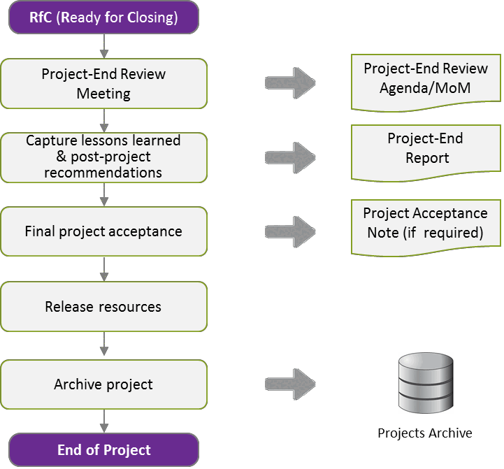

---
sidebar_navigation:
  title: 8 Closing phase
  priority: 600
description: Describes how to formally close the project. Activities include performing final reviews, accepting deliverables, capturing lessons learned, preparing the Project-End Report, completing administrative closure, and archiving documentation.
keywords: project-end review meeting, lessons learned and post-project recommendations, project-end report, administration closure
---

# 8 Closing Phase

The final phase of a PM² project is the Closing Phase. The Closing Phase starts with the Project-End Review Meeting and ends with the Project Owner's (PO) final approval, which marks the project's administrative closure. During the Closing Phase, the project's activities are completed, the project's final state is documented, and the finished deliverables are officially transferred to the Project Owner (PO).

**Project-End Review Meeting**

- The Closing Phase starts with an official Project-End Review Meeting.
- Project performance is discussed, team and contractor performance are evaluated, and Lessons Learned are captured.

**Project-End Report**

- The Project-End Report is created after the Project-End Review Meeting.
- The report documents Best Practices, pitfalls and solutions to problems encountered for use as a knowledge base for future projects.

**Administrative Closure**

- The Project Manager (PM) ensures that the project is approved and accepted by the relevant stakeholders. The finished deliverables are transferred into the care, custody and control of the Project Owner (PO) and the requestor/client organisation.
- All documentation and records are reviewed, organised and securely archived with the help of the Project Support Office (PSO). Resources are released and the project is closed.

## 8.1 Project-End Review Meeting

The Project-End Review Meeting launches the Closing Phase of the project after the Executing Phase is deemed complete. The goal of this meeting is to ensure that project members discuss their experience of the project so that Lessons Learned and best practices can be captured. Also in this meeting team and contractor performance are evaluated, and ideas and recommendations for post-project work are discussed.

| Key Participants | Description |
| :-- | :-- |
| Project Manager (PM) | Organises the meeting. |
| Project Core Team (PCT) | Attendance is required. |
| Project Owner (PO) | Attendance is required. |
| Project Quality Assurance (PQA) | Should attend. |
| Business Manager (BM) | Represents the business side and the stakeholders. |
| Other stakeholders | Contributions from other supporting or optional roles may   also be valuable. |

**Inputs**

- Business Case and Project Charter
- Project Handbook and Project Work Plan
- All Project Plans (particularly the Transition \& Business Implementation Plans)
- Relevant Project Reports and Logs

**Steps**

Before the Project-End Review Meeting:

1. Plan the meeting and set the Meeting Agenda with the points to be discussed.
2. Send out the Meeting Agenda in advance.
3. Address logistical needs and prepare documentation or hand-outs for the meeting.
4. Make sure participants will be present and fully prepared.

During the Project-End Review Meeting:

1. The Project Owner (PO) will normally express the organisation's appreciation to the whole project team and key project stakeholders.
2. Ensure someone is designated to take the Minutes of Meeting (MoM).
3. Present project statistics and data on performance and achievements.
4. Discuss the overall project experience.
5. Discuss problems and challenges faced during project and the way in which they were addressed.
6. Discuss Lessons Learned and Best Practices that may be useful for future projects.

After the Project-End Review Meeting:

1. Compile Lessons Learned and Post-Project Recommendations.
2. Produce the Project-End Report.
3. Communicate the results of the meeting to the relevant stakeholders.

| RAM (RASCI) | AGB | PSC | PO | BM | BIG | SP | PM | PCT |
| :--: | :--: | :--: | :--: | :--: | :--: | :--: | :--: | :--: |
| Project-End Review Meeting | I | A | C | S | C | C | R | C |

**Outputs**

- Project-End Review Meeting Minutes

## 8.2 Lessons Learned and Post-Project Recommendations

The purpose of formal Lessons Learned and Post-Project Recommendations is to make it possible for project teams and the permanent organisation at large to benefit from the experience acquired during the project. It is also important to capture ideas and recommendations for post-project work relating to the operation of the product/service delivered, such as extensions, maintenance and ideas for follow-up projects.

Note: Improvement opportunities and Post-Project Recommendations should be captured in some form as they come up during the project. Otherwise, particularly in longer projects, the ideas might get lost by the time the project reaches the Closing Phase.

There are many benefits to formalising Lessons Learned and Post-Project Recommendations. When project team members share their perspectives and provide feedback it provides useful insights that, the requestor/client side can use to manage post-project activities more effectively.

| Key Participants | Description |
| :-- | :-- |
| Project Manager (PM) | Organises the gathering of Lessons Learned. |
| Project Core Team (PCT) | Contributes experiences and perspectives. |
| Business Manager (BM) | Represents the requestor's point of view. |
| Other project stakeholders | As required. |

Because all projects are different, the Lessons Learned process cannot be generic. However, projects have common aspects, which can be discussed: project definition and planning (scope, deliverables, resources, etc.), project communication, project documentation, change control, risk/issue management, decisionmaking, successes, mistakes and failures, team dynamics, and overall project performance.

**Guidelines**:

- The Lessons Learned session should be a part of the Project-End Review Meeting (though separate sessions could be organised at the end of project phases or major milestones).
- It may be preferable to have the Lessons Learned session facilitated by someone who has not been intimately involved in the project, allowing the Project Manager (PM) to contribute as a participant.
- The discussion should be structured (using project phases, categories of activities, etc. as the organisational principle) to cover every aspect of the project.
- Use a structured approach to collecting lessons learned from a broader group of stakeholders via questionnaires, or structured interviews.
- Improvement ideas should be organised into groups to help the team better visualise the appropriate next steps required to implement them.
- In some cases, it could make sense to address the Lessons Learned over multiple sessions, each devoted to a different topic (technical issues, business implementation, etc.).
- The Project Steering Committee (PSC) should be invited to the Lessons Learned session(s) as this will allow its members to transfer the Lessons Learned to other projects.

| RAM (RASCI) | AGB | PSC | PO | BM | BIG | SP | PM | PCT |
| :-- | :--: | :--: | :--: | :--: | :--: | :--: | :--: | :--: |
| Lessons Learned and   Post-project Recommendations | I | A | C | S | C | C | R | C |

**Outputs**

- Project-End Report

## 8.3 Project-End Report

Following the Project-End Review Meeting, the overall experience of the project is summarised in a report that documents best practices, Lessons Learned, pitfalls and solutions to problems. The report should be used as a knowledge base for future projects.

| Key Participants | Description |
| :-- | :-- |
| Project Manager (PM) | Writes the report. |
| Project Quality Assurance (PQA) | Provides input and assistance. |
| Project Core Team (PCT) | Provides input and assistance. |

**Inputs**

- Project-End Review Meeting Minutes (MoM)
- Other useful information can be found in:
- Minutes of Meetings (MoMs) of various project meetings
- Project Reports
- Quality Assurance and Quality Control outputs

**Guidelines**

- Though written by the Project Manager (PM), the help of relevant stakeholders should be sought to produce a well-rounded and comprehensive assessment of the project.
- The report should address each of the following subjects:
- Project effectiveness.
- Cost, Schedule, Scope and Quality Management.
- Risk Management.
- Issue Management.
- Project Change Management.
- Communications Management.
- Human resources and stakeholder management.
- Deliverables Acceptance.
- Business Implementation and Project Transition.
- The performance of the Project Core Team (PCT) and participating organisation.
- Best Practices and Lessons Learned.
- Post-Project Recommendations.
- This document should be part of a central project repository or knowledge database describing project experiences, best practices and common pitfalls.

| RAM (RASCI) | AGB | PSC | PO | BM | BIG | SP | PM | PCT |
| :-- | :--: | :--: | :--: | :--: | :--: | :--: | :--: | :--: |
| Project-End Report | I | A | C | S | C | C | R | C |

| Related Artefacts | Initiating | Planning | Executing | Monitor \& Control | Closing |
| :--: | :--: | :--: | :--: | :--: | :--: |
| Communications   Management |  | Communications \& Quality Management Plan | Project   Reports | Project Checklists   Project Logs | Project-End Report |

**Outputs**

- Project-End Report

## 8.4 Administrative Closure

The Project Manager (PM) ensures that all project deliverables have been accepted by the relevant stakeholders and, with the help of the Project Support Office (PSO), that all project documentation and records are up-to-date, reviewed, organised and securely archived. The Project Team is now officially dissolved and all resources are released.

The project is officially closed once all Closing Phase activities are completed and the Project Owner (PO) has approved the project. Formal project closure brings project mode to an end and allows operations mode to commence.

| Key Participants | Description |
| :-- | :-- |
| Project Manager (PM) | Oversees all closure activities and the release of project resources. |
| Other project stakeholders | Approve and accept the project. |
| Project Support Office (PSO) | Assists in reviewing, organising and archiving all project   documentation. |
| Project Owner (PO) | Has final approval of the project. |

**Inputs**

- Project Handbook
- Project Work Plan
- Quality Management Plan
- All other project plans and documents

**Steps**

1. Ensure that all documentation and records are reviewed, organised and archived.
2. Release all resources.
3. Ensure that the project is approved and accepted by the project stakeholders.
4. Ensure that the Project Owner (PO) gives final project approval and closes the project.
5. Verify that all contractual obligations have been fulfilled.

| RAM (RASCI) | AGB | PSC | PO | BM | BIG | SP | PM | PCT |
| :--: | :--: | :--: | :--: | :--: | :--: | :--: | :--: | :--: |
| Administrative Closure | I | C | A | C | I | C | R | I |

**Outputs**

- Projects Archive (updated)
- Project Acceptance Note (if required)
