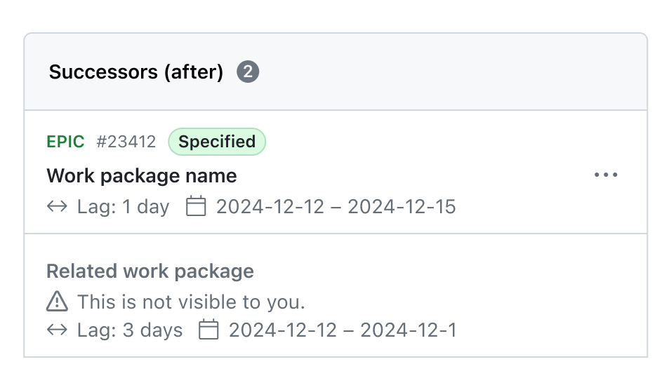

# OpenProject 15.3.0

Release date: 2025-02-19

We released [OpenProject 15.3.0](https://community.openproject.org/versions/2163). This release includes several bug fixes, and we recommend updating to the latest version. It introduces over 40 new features, including a major update to the Meetings module. 

In these Release Notes, we will give an overview of important feature changes. At the end, you will find a complete list of all changes and bug fixes.

## Important feature changes

Take a look at the release video showing most important features introduced in 15.3.0.

### Schedule recurring meetings to streamline your weekly, biweekly, or custom appointments

Organizing meetings just became much easier with **Recurring Meetings** in OpenProject 15.3. Instead of manually setting up repeated meetings, you can now create a Recurring Meeting series with flexible scheduling options.

- **Set up meeting series**: Schedule meetings to recur on a weekly, biweekly, or custom basis.
- **Manage occurrences**: Each meeting in a series is an individual occurrence, allowing adjustments without affecting the entire series.
- **Flexible modifications**: Adjust single occurrences within a recurring meeting series without disrupting the entire schedule.
- **Improved meeting index page**: Recurring meetings are clearly displayed in the meetings index, helping users track their schedules efficiently.
- **ICS file support**: Download and integrate recurring meetings into external calendar applications.
- **Custom meeting templates**: Define standard templates for recurring meetings to ensure consistency.
- **Invitation emails for meeting series**: Participants receive automated notifications for scheduled recurring meetings.

> [!NOTE]
> **Consistent terminology**: To improve clarity, OpenProject now categorizes meetings as **Classic**, **Recurring**, and **One-time**, replacing the previous Dynamic vs. Classic terminology.

This major feature introduces multiple improvements, with several underlying enhancements that refine scheduling, management, and handling of meeting series. All individual changes related to Recurring Meetings are listed in the full changelog at the end of these release notes.

The following screenshot shows an example Meetings overview page, highlighting some of the changes for version 15.3:

Please particularly note that filtering between upcoming and past meetings now happens on top of the page instead of the sidebar on the left. The sidebar now distinguishes between **My meetings**, **Recurring meetings** and **All meetings**, with separate sections for Meeting series and Involvement.

[Learn more about the updated Meetings module and how to use it](../../user-guide/meetings/).

### Create child work packages directly from the Relations tab

With OpenProject 15.3, you can now again create child work packages directly from the Relations tab, making it faster and more intuitive to build structured work breakdowns.

A new option, **New child**, has been added to the **+ Relation** dropdown. Selecting it opens a dialog where you can immediately enter essential details like type, subject, description, and other mandatory fields. Once created, the child work package is added to the list, and a confirmation message appears.

Additionally, if child work packages already exist, a **+ Child** button appears in the header of the child work packages section and allows you to quickly add another child to the active work package:

[Learn more about work package relations and hierarchies in OpenProject](../../user-guide/work-packages/work-package-relations-hierarchies/).

### Include total sums in timesheet PDF exports for better insights

Tracking logged time is now more transparent with total sum calculations in timesheet PDF exports. Previously, users had to manually sum up hours across multiple users. With OpenProject 15.3, the PDF export now includes:

- A summary table on a separate page when exporting timesheets for multiple users, showing total hours per user and a final sum.
- A sum row under each user's timesheet table, ensuring quick insights into individual and team-wide logged hours.

This enhancement simplifies reporting, making it easier to review and analyze tracked time across teams.

[Learn more about time and cost reporting with OpenProject](../../user-guide/time-and-costs/reporting/).

### Include child work packages in cost reports for more accurate tracking

Cost reports in OpenProject now allow to easier include child work packages, ensuring more comprehensive cost tracking. Previously, users managing hierarchical work packages (such as epics, features, or sub-tasks) had to manually select each work package to ensure full cost visibility.

OpenProject 15.3 introduces a new filter option for cost reports: **is (includes descendants)**, in addition to **is**. This allows users to automatically include all related child work packages (grandchildren, great-grandchildren, etc.) in their cost reports, improving accuracy and efficiency. This eliminates the need for cumbersome manual selection and ensures that all relevant costs are accounted for in reports.

[Learn more about tracking progress with OpenProject](../../user-guide/time-and-costs/progress-tracking/).

### See dates of previously hidden, permission-restricted relations to make informed scheduling decisions

OpenProject now provides better visibility into dependencies by displaying relation dates for work packages that users do not have permission to view. Previously, restricted relations were completely invisible, making it difficult to understand scheduling dependencies.

OpenProject 15.3 improves transparency by displaying all relations in the Relations tab. While restricted work packages remain inaccessible, their **start and finish dates will now be visible**, along with lag time for applicable relations. This way, users still cannot interact with restricted work packages but will now understand why a task is scheduled at a specific time.

Please note that currently, **only the following relations are displayed with a date** – not dependent on permissions:

- Successors (after)
- Predecessors (before)
- Children

> [!NOTE]
> If a related work package has the same start and finish date, a single date is displayed instead of a range. This is [another feature of OpenProject 15.3 and applies to all Relations on the Relations tab](https://community.openproject.org/wp/61044), independent of the user's permissions.

These improvements help teams make informed scheduling decisions while maintaining appropriate permission controls. Here is an example, showing two relations – one with full visibility and one with restricted visibility.

[See our user guide to learn more about work package hierarchies in OpenProject](../../user-guide/work-packages/work-package-relations-hierarchies/#display-work-package-hierarchies).

### Display a deletion dialog with danger zone for deleting items in a hierarchy

Accidentally deleting hierarchical work packages can lead to irreversible data loss. To prevent this, OpenProject 15.3 introduces a danger dialog that requires user consent before proceeding with deletion.

If a user attempts to delete a hierarchy item, a confirmation dialog appears, styled according to the Primer design system. Users must explicitly confirm their intent before deletion can proceed, ensuring greater safety for critical data.

This confirmation dialog is also now available in the Meetings module for deleting meetings. Over the next releases, OpenProject will expand this feature to additional critical areas, such as project deletions, ensuring safer data management.

### Show user popover everywhere and also when hovering on the name

User popovers now appear when hovering over both names and avatars, ensuring a more consistent experience across OpenProject. This improvement enhances usability and makes user details more accessible in different areas of the application.

Additionally, OpenProject 15.3 improves how popovers are displayed within modals, including the work package share dialog, global search, and global invitation modal.

### Enable autocomplete for user custom field filter values on the project list

Filtering user custom fields is now faster with autocompleters in the project list. Users can quickly search and select values from a dropdown, improving usability and performance.

## Important technical updates and breaking changes

### Centos 8 package support removed

Centos 8 is EOL for quite some time and packages will no longer be built for it, starting with OpenProject 15.3.0. For more information on CentOS installation, please see [our installations and operations guide](../../installation-and-operations/installation/packaged/#centos-installation).

### Seeding of design variables allowed (Enterprise add-on)

It is now possible to set up custom design variables and logos as environment variables. This is useful in automated deployments such as with Kubernetes. For more information, please see [our installations and operations guide](../../installation-and-operations/configuration/#seeding-custom-theme-and-design-enterprise-add-on).

<!-- Remove this section if empty, add to it in pull requests linking to tickets and provide information -->

<!--more-->

## Bug fixes and changes

<!-- Warning: Anything within the below lines will be automatically removed by the release script -->
<!-- BEGIN AUTOMATED SECTION -->

- Feature: Cost reports should include work package children \[[#32813](https://community.openproject.org/wp/32813)\]
- Feature: Create recurring meetings with flexible schedules \[[#54188](https://community.openproject.org/wp/54188)\]
- Feature: Meeting templates for recurring meetings \[[#54752](https://community.openproject.org/wp/54752)\]
- Feature: Add an &quot;all meetings&quot; to the default Meetings list \[[#56789](https://community.openproject.org/wp/56789)\]
- Feature: Iterations of recurring meetings \[[#58225](https://community.openproject.org/wp/58225)\]
- Feature: Overview page for a recurring meeting \[[#58226](https://community.openproject.org/wp/58226)\]
- Feature: Show recurring meetings in the meeting index page \[[#58227](https://community.openproject.org/wp/58227)\]
- Feature: Indicate that there are work package relations which the user has no permission to see \[[#58427](https://community.openproject.org/wp/58427)\]
- Feature: Deletion dialog with danger zone for deleting items in a hierarchy \[[#58637](https://community.openproject.org/wp/58637)\]
- Feature: Allow entering meeting duration in hours and minutes \[[#59404](https://community.openproject.org/wp/59404)\]
- Feature: Allow changing dates of a meeting series occurrence \[[#59773](https://community.openproject.org/wp/59773)\]
- Feature: Automatic instantiation of the next occurrence of a meeting series \[[#59775](https://community.openproject.org/wp/59775)\]
- Feature: Copying of recurring meetings occurrences \[[#59777](https://community.openproject.org/wp/59777)\]
- Feature: Cancelling recurring meetings occurrences \[[#59829](https://community.openproject.org/wp/59829)\]
- Feature: Add trailing unit for input fields in datepicker and lag field \[[#59860](https://community.openproject.org/wp/59860)\]
- Feature: Update meeting series template blank slate to include information \[[#59867](https://community.openproject.org/wp/59867)\]
- Feature: Pagination for recurring meetings \[[#59883](https://community.openproject.org/wp/59883)\]
- Feature: Cancellation dialogs for for one-time and recurring meetings \[[#59885](https://community.openproject.org/wp/59885)\]
- Feature: Recurring meetings ICS schedule \[[#59886](https://community.openproject.org/wp/59886)\]
- Feature: Show user popover on the name, not only avatar \[[#59925](https://community.openproject.org/wp/59925)\]
- Feature: End recurring meeting series \[[#59951](https://community.openproject.org/wp/59951)\]
- Feature: Recurring meetings: Improved display of form dialog \[[#59974](https://community.openproject.org/wp/59974)\]
- Feature: Update seed data to make &quot;Weekly&quot; a recurring meeting \[[#60135](https://community.openproject.org/wp/60135)\]
- Feature: Rename Dynamic meeting to &quot;one-time&quot; again \[[#60141](https://community.openproject.org/wp/60141)\]
- Feature: Invitation email for meeting series \[[#60200](https://community.openproject.org/wp/60200)\]
- Feature: Allow children creation from the new Relations Tab \[[#60273](https://community.openproject.org/wp/60273)\]
- Feature: Prevent autocomplete on date picker input fields \[[#60286](https://community.openproject.org/wp/60286)\]
- Feature: Allow seeding design variables \[[#60598](https://community.openproject.org/wp/60598)\]
- Feature: Remove ability to set default time tracking activity \[[#60718](https://community.openproject.org/wp/60718)\]
- Feature: Recurring meetings: Allow end date to be optional \[[#60880](https://community.openproject.org/wp/60880)\]
- Feature: Display sums in Timesheet PDF \[[#60923](https://community.openproject.org/wp/60923)\]
- Feature: Separate meeting series show page into two tables \[[#60959](https://community.openproject.org/wp/60959)\]
- Feature: Autocompleters for user cf filter values on the project list   \[[#60972](https://community.openproject.org/wp/60972)\]
- Feature: Better structure upcoming meetings by organizing them into named date sections \[[#61030](https://community.openproject.org/wp/61030)\]
- Feature: Relations tab: Show a single date when start and finish dates are the same \[[#61044](https://community.openproject.org/wp/61044)\]
- Feature: Remove smooth animation when loading the Activity tab with sort order &#39;Newest at the bottom&#39; \[[#61074](https://community.openproject.org/wp/61074)\]
- Feature: Make user popover information visible everywhere \[[#61126](https://community.openproject.org/wp/61126)\]
- Feature: Better indicate when a recurring meeting has ended (or is ended manually) with changes in phrasing and a more helpful blank slate \[[#61161](https://community.openproject.org/wp/61161)\]
- Feature: Primerize the log time modal \[[#61322](https://community.openproject.org/wp/61322)\]
- Bugfix: Cost query for work package does not show children / value differs from spentTime \[[#33790](https://community.openproject.org/wp/33790)\]
- Bugfix: When logging time with comma in English language settings everything after the comma is cut off \[[#36307](https://community.openproject.org/wp/36307)\]
- Bugfix: Logging time and removing time activity sets the default one \[[#51751](https://community.openproject.org/wp/51751)\]
- Bugfix: Adding a new required project attribute blocks other project-level modifications \[[#55813](https://community.openproject.org/wp/55813)\]
- Bugfix: Opening the meetings details creates additional buttons at the bottom \[[#57912](https://community.openproject.org/wp/57912)\]
- Bugfix: Disable hover card on mobile \[[#58260](https://community.openproject.org/wp/58260)\]
- Bugfix: Notification center: Activity tab goes into mobile layout even when the browser window is smaller desktop wide \[[#59235](https://community.openproject.org/wp/59235)\]
- Bugfix: Network error about notifications showing up on Community \[[#59328](https://community.openproject.org/wp/59328)\]
- Bugfix: \[Regression\] Missing &quot;Commit Message&quot; Comments in Work Packages after upgrade to 15.0.1 \[[#59374](https://community.openproject.org/wp/59374)\]
- Bugfix: Changing an image size is not reflected in the export \[[#59533](https://community.openproject.org/wp/59533)\]
- Bugfix: Table formatting is not reflected in the PDF export \[[#59534](https://community.openproject.org/wp/59534)\]
- Bugfix: Quote comment action does not work if the Activity comment box already has text in it \[[#59543](https://community.openproject.org/wp/59543)\]
- Bugfix: Some translation bugs \[[#59913](https://community.openproject.org/wp/59913)\]
- Bugfix: On narrow screens (including mobile) the view always scrolls to the end of the Activity tab \[[#59916](https://community.openproject.org/wp/59916)\]
- Bugfix: Project membership in group administration lists global roles \[[#59934](https://community.openproject.org/wp/59934)\]
- Bugfix: Editing the date of an upcoming recurring meeting to a past date doesn&#39;t move it to the &#39;Past&#39; tab \[[#59944](https://community.openproject.org/wp/59944)\]
- Bugfix: Clicking on recurring meetings, &quot;My meetings&quot; stays selected \[[#59947](https://community.openproject.org/wp/59947)\]
- Bugfix: Meeting template details panel name should be &#39;Meeting series details&#39; \[[#59953](https://community.openproject.org/wp/59953)\]
- Bugfix: Meeting interval can be empty, leading to an error \[[#59955](https://community.openproject.org/wp/59955)\]
- Bugfix: Recurring meeting template header is missing the author name \[[#59958](https://community.openproject.org/wp/59958)\]
- Bugfix: Recurring meeting template info pane is missing some text \[[#59959](https://community.openproject.org/wp/59959)\]
- Bugfix: Internal server error on Azure OIDC login with expired client secret \[[#59960](https://community.openproject.org/wp/59960)\]
- Bugfix: Main recurring meeting index doesn&#39;t show updated empty state \[[#59966](https://community.openproject.org/wp/59966)\]
- Bugfix: Meeting name is not in a lighter shade on the recurring meeting overview page \[[#59976](https://community.openproject.org/wp/59976)\]
- Bugfix: Breadcrumb name should be &#39;My meetings&#39; \[[#59994](https://community.openproject.org/wp/59994)\]
- Bugfix: User is taken back to the top of the page after loading more occurrences of recurring meeting \[[#60007](https://community.openproject.org/wp/60007)\]
- Bugfix: Left side menu doesn&#39;t highlight Meeting series name \[[#60019](https://community.openproject.org/wp/60019)\]
- Bugfix: As anonymized user, meetings side menus should be reduced \[[#60117](https://community.openproject.org/wp/60117)\]
- Bugfix: Missing \* to show fields are required + wrong primary button name on the Recurring meeting form \[[#60118](https://community.openproject.org/wp/60118)\]
- Bugfix: Meeting template shows weird/wrong schedule \[[#60138](https://community.openproject.org/wp/60138)\]
- Bugfix: PDF report: list style of work package description incorrect \[[#60331](https://community.openproject.org/wp/60331)\]
- Bugfix: PDF export: List in table not formatted as in work package description \[[#60333](https://community.openproject.org/wp/60333)\]
- Bugfix: Error message in case of duplicate folder name is not accurate \[[#60423](https://community.openproject.org/wp/60423)\]
- Bugfix: Hyphenation feature in generated pdf files removes space before italic text \[[#60431](https://community.openproject.org/wp/60431)\]
- Bugfix: Custom user action broken \[[#60439](https://community.openproject.org/wp/60439)\]
- Bugfix: Misplaced cursor in comments text editor on iOS  \[[#60538](https://community.openproject.org/wp/60538)\]
- Bugfix: LDAP sync not locking users if no values returned \[[#60566](https://community.openproject.org/wp/60566)\]
- Bugfix: Role permissions concerning comments are named &quot;Notes&quot; and are unclear \[[#60602](https://community.openproject.org/wp/60602)\]
- Bugfix: Adding a WP with long name as agenda item on Meetings creates a visual overlap \[[#60608](https://community.openproject.org/wp/60608)\]
- Bugfix: Add relation dialog is overflowing when the ticket name is rather long \[[#60619](https://community.openproject.org/wp/60619)\]
- Bugfix: Opening a work package (full view) on mobile auto-scrolls to the tab row when not desired \[[#60638](https://community.openproject.org/wp/60638)\]
- Bugfix: Mandatory fields not visible during project creation \[[#60652](https://community.openproject.org/wp/60652)\]
- Bugfix: Click on hamburger icon does not always open the sidebar on iOS \[[#60680](https://community.openproject.org/wp/60680)\]
- Bugfix: Applying a change in a cost report query saves it \[[#60681](https://community.openproject.org/wp/60681)\]
- Bugfix: Ending series via number of occurrences does not work if the ending condition was originally after a specific date \[[#60700](https://community.openproject.org/wp/60700)\]
- Bugfix: Regression: If WP title is long without spaces, it overflows outside of the split screen \[[#60705](https://community.openproject.org/wp/60705)\]
- Bugfix: Ends after &#39;a specific date&#39; dates are not inclusive \[[#60713](https://community.openproject.org/wp/60713)\]
- Bugfix: Duplicate work package comments when clicking submit multiple times \[[#60719](https://community.openproject.org/wp/60719)\]
- Bugfix: Show dates of Children of a work package in relations tab \[[#60957](https://community.openproject.org/wp/60957)\]
- Bugfix: Icon beside dates of a relation is wrong in relation row \[[#60958](https://community.openproject.org/wp/60958)\]
- Bugfix: Upcoming meetings: Meeting durations under the &#39;Duration&#39; column are not displayed in hours and minutes \[[#61034](https://community.openproject.org/wp/61034)\]
- Bugfix: UI Flickering when clicking on the activity anchor point \[[#61042](https://community.openproject.org/wp/61042)\]
- Bugfix: Activity tab does not scroll to the bottom for work packages with long history \[[#61049](https://community.openproject.org/wp/61049)\]
- Bugfix: Poor performance of GET /api/v3/work\_packages/:id and PATCH /api/v3/work\_packages/:id \[[#61058](https://community.openproject.org/wp/61058)\]
- Bugfix: When allowed to log time entries for others, time entries can be logged for any user regardless of visibility \[[#61084](https://community.openproject.org/wp/61084)\]
- Bugfix: Search produces 500 error response on certain attachment constellation \[[#61110](https://community.openproject.org/wp/61110)\]
- Bugfix: Refreshing exchanged token does not work with Keycloak \[[#61140](https://community.openproject.org/wp/61140)\]
- Bugfix: When adding a new meeting globally, leaving the project unselected results in strange error \[[#61176](https://community.openproject.org/wp/61176)\]
- Bugfix: Deleting a meeting occurrence does not send out a cancelled event \[[#61310](https://community.openproject.org/wp/61310)\]
- Bugfix: Meeting attachments are not reliably picked up by groupware \[[#61311](https://community.openproject.org/wp/61311)\]
- Bugfix: Poor performance of mentioning feature in larger datasets \[[#61365](https://community.openproject.org/wp/61365)\]
- Bugfix: Empty meeting series templates don&#39;t show the blue &#39;this is a template&#39; info box \[[#61387](https://community.openproject.org/wp/61387)\]
- Bugfix: Meeting series don&#39;t send out updated invitation emails when changing schedule \[[#61388](https://community.openproject.org/wp/61388)\]
- Bugfix: Meeting global or project-scope lost on performing various actions \[[#61422](https://community.openproject.org/wp/61422)\]
- Bugfix: Meeting series occurrence should allow to schedule earlier \[[#61424](https://community.openproject.org/wp/61424)\]
- Bugfix: Popover missing on author of the forum \[[#61453](https://community.openproject.org/wp/61453)\]
- Bugfix: &quot;Download ICS&quot; menu action is broken on recurring show page \[[#61462](https://community.openproject.org/wp/61462)\]
- Bugfix: Failing to copy queries in a project copy job results in internal errors \[[#61483](https://community.openproject.org/wp/61483)\]
- Feature: Activity tab bug fixes and enhancements \[[#61524](https://community.openproject.org/wp/61524)\]

<!-- END AUTOMATED SECTION -->
<!-- Warning: Anything above this line will be automatically removed by the release script -->

## Contributions

A very special thank you goes to City of Cologne, Deutsche Bahn and ZenDiS for sponsoring released or upcoming features. Your support, alongside the efforts of our amazing Community, helps drive these innovations.

Also, a big thanks to our Community members for reporting bugs and helping us identify and provide fixes. Special thanks for reporting and finding bugs go to Luka Bradesko, Max Mutzge, Lars Geiger, Rudi B., Alexander Aleschenko, Alex Fantini, Peter Wafzig.

Last but not least, we are very grateful for our very engaged translation contributors on Crowdin, who translated quite a few OpenProject strings! This release we would like to highlight

- [greench](https://crowdin.com/profile/greench), for an outstanding number of translations into Turkish.
- [Kuma Yamashita](https://crowdin.com/profile/dredgk), for a great number of translations into Japanese.
- [Willers-ICT](https://crowdin.com/profile/willers-ict), for a great number of translations into Dutch.
- [Vlastislav Dockal](https://crowdin.com/profile/vdockal), for a great number of translations into Czech.

Would you like to help out with translations yourself? Then take a look at our [translation guide](../../contributions-guide/translate-openproject/) and find out exactly how you can contribute. It is very much appreciated!
