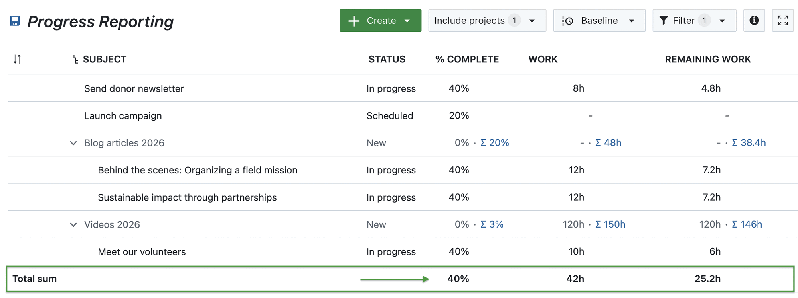
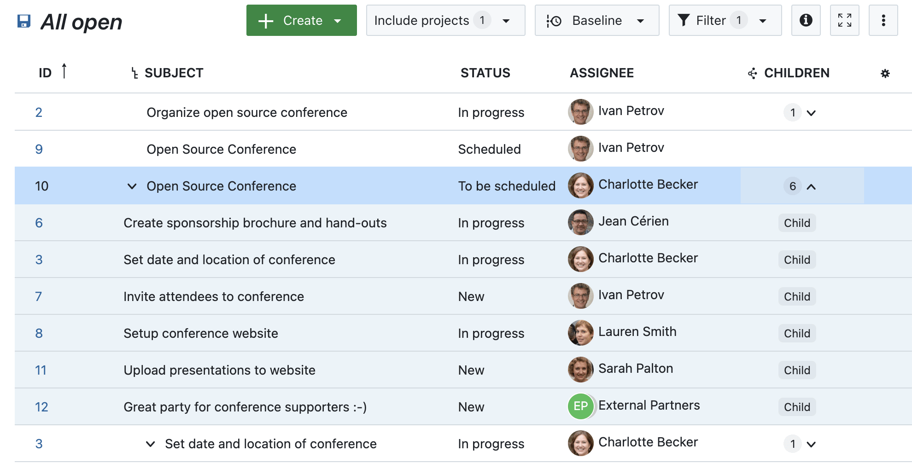
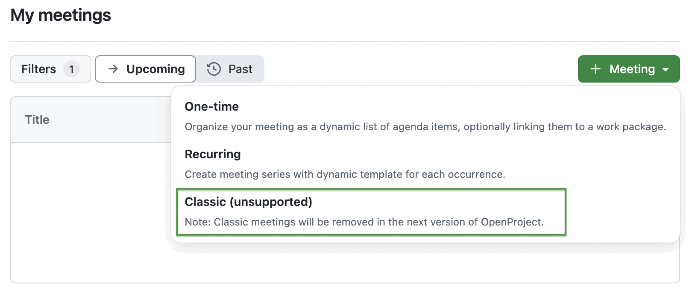

# OpenProject 15.5.0

Release date: 2025-04-16

We released [OpenProject 15.5.0](https://community.openproject.org/versions/2171). The release contains several bug fixes, and we recommend updating to the newest version. In these Release Notes, we will give an overview of important feature changes. At the end, you will find a complete list of all changes and bug fixes.

## Important feature changes

Take a look at our release video showing the most important features introduced in OpenProject 15.5.0:
  

### Filter for descendants (children and grandchildren) of work packages

In OpenProject 15.5, you can now filter for all descendants of a work package — including children, grandchildren, and deeper levels. This is especially helpful when focusing on a specific part of a project that includes multiple levels of work packages.

The new filter option **Descendants of** allows you to select one or more parent work packages by ID and display all their subordinate items. It is available wherever filters are supported — such as work package tables or agile boards.

Previously, it was only possible to filter for parent work packages, not their lower-level hierarchy.

### % Complete included in work package table sums

The **% Complete** value is now included in the sum row of work package tables. This complements the existing Work and Remaining work columns and gives a quick, consistent overview of project progress.

All three values — Work, Remaining work, and % Complete — are calculated in alignment with the selected progress reporting mode.

### Column for children in work package tables (Enterprise add-on)

OpenProject 15.5 introduces a new **Children** column in work package tables. Similar to other relation columns, this column provides an expandable view showing related child work packages directly in the table — without needing to filter for them separately.

This makes it easier to get a quick overview of a parent work package and its structure, especially when working with large datasets or filtered views.

The column displays the number of children next to each parent, along with a clickable dropdown symbol. 

Clicking on the dropdown symbol expands the view to show all related child work packages, each marked with a **Child** label:

> [!NOTE]
> All relationship columns are [Enterprise add-ons](https://www.openproject.org/enterprise-edition/).

### Advanced accessibility in the date picker

Accessibility remains a key focus in OpenProject, and with version 15.5, we’ve enhanced support for screen readers. These improvements ensure that users relying on assistive technologies receive meaningful feedback during manual date input.

- Informative announcements are now triggered when switching between manual and automatic scheduling.
- Changes in one date field (e.g., Start date or Duration) are announced as they update related fields.
- The “Today” shortcuts include ARIA labels to give clear context, such as “Select today as start date.”

This update is part of our ongoing ARIA implementation strategy, with [further accessibility enhancements planned in upcoming versions](https://community.openproject.org/wp/62708).

### Improved date picker rendering in mobile screens

The date picker now uses the native mobile date input and **opens in a full-screen modal on small screens**. This improves accessibility and interaction. The mini calendar has been removed to reduce clutter and improve usability on mobile devices.

### PDF exports matching configured form layout

Single work package PDF exports now **follow the configured form layout**, including attribute groups, field order, and long text fields. For example, if the Date field is grouped with other scheduling fields in your form configuration, it will appear the same way in the PDF — not split into separate start and end dates.

You can also **export in portrait or landscape orientation**, and **query group tables are included if configured**. If a table doesn’t fit on the page, a note is displayed instead.

### Chronological ordering of relations

Relations in the Relations tab and date picker are now consistently ordered by their creation date, regardless of whether the related work packages are fully visible or permission-restricted.

This change improves clarity by showing relations in the exact order they were added — with the oldest first — and removes the previous grouping by visibility status.

### Work package related project settings grouped in a new entry

To improve navigation, related project settings have been grouped under a new **Work packages** section in the project settings. This section includes three tabs:

- [Types](../../user-guide/projects/project-settings/work-packages/#work-package-types)
- [Categories](../../user-guide/projects/project-settings/work-packages/#work-package-categories)
- [Custom fields](../../user-guide/projects/project-settings/work-packages/#work-package-custom-fields)

The previous individual entries have been moved into this grouped view. Existing URLs now redirect to their new locations, ensuring a smooth transition. This is a structural improvement only — no changes were made to permissions or underlying functionality.

### Classic meetings marked as unsupported — removal planned for the next release

With the recent improvements to One-time and Recurring meetings, the older Classic meetings are now considered outdated and will be removed in the next OpenProject release (16.0). This change has been planned and communicated since the introduction of what were then called Dynamic meetings (now One-time and Recurring).

To prepare for this transition, the **Classic option in the + Meeting dropdown is now marked as unsupported**, accompanied by the following notice: “Classic meetings will be removed in the next version of OpenProject.”

> [!NOTE]
> We recommend switching to the newer Meeting types to benefit from the latest features and ensure a smooth transition. [Read this article to learn more about the reasons and what will happen to your existing Classic meetings](https://www.openproject.org/blog/end-classic-meetings-may-2025/).

## Important updates and breaking changes

<!-- Remove this section if empty, add to it in pull requests linking to tickets and provide information -->

<!--more-->

## Bug fixes and changes

<!-- Warning: Anything within the below lines will be automatically removed by the release script -->
<!-- BEGIN AUTOMATED SECTION -->

- Bugfix: Custom fields on global work package list can be added as column even when user has no access to it \[[#36559](https://community.openproject.org/wp/36559)\]
- Bugfix: &quot;During the last days&quot; filter input in cost reports shows a calendar popup \[[#42811](https://community.openproject.org/wp/42811)\]
- Bugfix: Autocompleter missing when using double or triple hash notation for work package IDs \[[#47084](https://community.openproject.org/wp/47084)\]
- Bugfix: Project attributes side panel is hidden on mobile \[[#58229](https://community.openproject.org/wp/58229)\]
- Bugfix: The right-handle column content goes to the top of the page on mobile \[[#58241](https://community.openproject.org/wp/58241)\]
- Bugfix: Misleading caption shown on project list table header \[[#59081](https://community.openproject.org/wp/59081)\]
- Bugfix: Required custom fields prevent a WorkPackage from being added as a child \[[#60122](https://community.openproject.org/wp/60122)\]
- Bugfix: Not enough spacing on Files Categories page (and other pages) \[[#61790](https://community.openproject.org/wp/61790)\]
- Bugfix: Gantt chart and relations tab are not synchronized \[[#61807](https://community.openproject.org/wp/61807)\]
- Bugfix: Custom actions list sometimes empty and status change value not displayed \[[#61888](https://community.openproject.org/wp/61888)\]
- Bugfix: Caption text for automatically generated subject pattern is unclear \[[#62015](https://community.openproject.org/wp/62015)\]
- Bugfix: Fix flickering time\_entry\_activity\_spec \[[#62032](https://community.openproject.org/wp/62032)\]
- Bugfix: I18n::ArgumentError in RecurringMeetings::ScheduleController#humanize\_schedule \[[#62073](https://community.openproject.org/wp/62073)\]
- Bugfix: Meeting creation uses UTC offset, not timezone \[[#62108](https://community.openproject.org/wp/62108)\]
- Bugfix: GitHub and GitLab extensions branch name generation might generate problematic branch names \[[#62164](https://community.openproject.org/wp/62164)\]
- Bugfix: WP can&#39;t be transformed to a Milestone if it is automatically scheduled \[[#62190](https://community.openproject.org/wp/62190)\]
- Bugfix: CkEditor is cut off on &quot;add child&quot; dialog \[[#62195](https://community.openproject.org/wp/62195)\]
- Bugfix: UX/UI: Calendar Navigation Shifts Position, Causing Misclicks \[[#62212](https://community.openproject.org/wp/62212)\]
- Bugfix: Meetings tab: Add work package to meeting modal has no toolbar in the notes editor \[[#62264](https://community.openproject.org/wp/62264)\]
- Bugfix: Use correct scope for restricting custom field visibility in column selection \[[#62317](https://community.openproject.org/wp/62317)\]
- Bugfix: The text color of the &quot;Closed&quot; meeting status label in light mode is black instead of white \[[#62373](https://community.openproject.org/wp/62373)\]
- Bugfix: Webhook embedded resource custom fields are null \[[#62444](https://community.openproject.org/wp/62444)\]
- Bugfix: Option to add &quot;Existing child&quot; does not make sense (the work package is only a child once added) \[[#62510](https://community.openproject.org/wp/62510)\]
- Bugfix: Autocomplete not possible in project list filters in instances with many users \[[#62541](https://community.openproject.org/wp/62541)\]
- Bugfix: Untranslated string for &#39;Outcome&#39; \[[#62559](https://community.openproject.org/wp/62559)\]
- Bugfix: Excess padding in the Activity tab comment box \[[#62581](https://community.openproject.org/wp/62581)\]
- Bugfix: GitHub documentation shows wrong setting in screenshot \[[#62617](https://community.openproject.org/wp/62617)\]
- Bugfix: Mobile OTP generation does not cover all decimal digits \[[#62636](https://community.openproject.org/wp/62636)\]
- Bugfix: Toggling non-working days resets the start date in some cases \[[#62641](https://community.openproject.org/wp/62641)\]
- Bugfix: PDF Export of a single work package in query view does not open dialog \[[#62657](https://community.openproject.org/wp/62657)\]
- Bugfix: Bulk edit: Remove &quot;Open details view&quot; and &quot;Open fullscreen view&quot; \[[#62716](https://community.openproject.org/wp/62716)\]
- Bugfix: Custom actions load slowly with a lot of users \[[#62741](https://community.openproject.org/wp/62741)\]
- Bugfix: The add relations drop down list doesn&#39;t indicate that there are other options hidden behind a scroll \[[#62743](https://community.openproject.org/wp/62743)\]
- Bugfix: Show single-date work packages in the calendar \[[#62992](https://community.openproject.org/wp/62992)\]
- Bugfix: Past meetings tab for a meeting series does not show all past occurrences \[[#63013](https://community.openproject.org/wp/63013)\]
- Feature: Filter Work Packages by an Ancestor | show grandparents and grandchildren \[[#36743](https://community.openproject.org/wp/36743)\]
- Feature: Link to application schemes \[[#45052](https://community.openproject.org/wp/45052)\]
- Feature: Relationship column for child \[[#49419](https://community.openproject.org/wp/49419)\]
- Feature: Add % Complete to work package table sums \[[#55802](https://community.openproject.org/wp/55802)\]
- Feature: Automatic scheduling mode: make it possible to enter Finish date by direct input or by clicking on the mini calendar \[[#60667](https://community.openproject.org/wp/60667)\]
- Feature: Advanced accessibility for the datepicker \[[#60904](https://community.openproject.org/wp/60904)\]
- Feature: Improve date picker rendering in mobile screens \[[#61051](https://community.openproject.org/wp/61051)\]
- Feature: PDF export of a single work package follows work package form configuration including related wp tables \[[#61446](https://community.openproject.org/wp/61446)\]
- Feature: Group work package-related project settings in a new entry called &#39;Work packages&#39; \[[#61861](https://community.openproject.org/wp/61861)\]
- Feature: Change ordering of relations in relations tab/datepicker to always order chronologically \[[#61885](https://community.openproject.org/wp/61885)\]
- Feature: Autofocus on text fields \[[#61916](https://community.openproject.org/wp/61916)\]
- Feature: Display relations not visible to the user (ghost relations) in the same order as all the other relations \[[#61950](https://community.openproject.org/wp/61950)\]
- Feature: Provide all the versions the user has access to on the Project and Global Work package list pages \[[#61967](https://community.openproject.org/wp/61967)\]
- Feature: Project settings: Harmonize &quot;enabled in project&quot; for Types and Custom fields \[[#62291](https://community.openproject.org/wp/62291)\]
- Feature: Always display relations in the relations tab in a fixed order \[[#62607](https://community.openproject.org/wp/62607)\]
- Feature: Add note about imminent sunsetting of Classic meetings in create meeting dropdown \[[#62649](https://community.openproject.org/wp/62649)\]

<!-- END AUTOMATED SECTION -->
<!-- Warning: Anything above this line will be automatically removed by the release script -->

## Contributions

A very special thank you goes to City of Cologne, Deutsche Bahn and ZenDiS for sponsoring released or upcoming features. Your support, alongside the efforts of our amazing Community, helps drive these innovations.

Special thanks for reporting and finding bugs go to Abhiyan Paudyal, Andreas H., Paul Kernstock, Patrick Stapf, and Stefan Weiberg.

Last but not least, we are very grateful for our very engaged translation contributors on Crowdin, who translated quite a few OpenProject strings! This release we would like to particularly thank the following users:

- [Yuliia Pavliuk](https://crowdin.com/profile/pav.yulia), for a great number of translations into Ukrainian.
- [Adam Siemienski](https://crowdin.com/profile/siemienas), for a great number of translations into Polish.
- [NCAA](https://crowdin.com/profile/ncaa), for a great number of translations into Danish.
- [greench](https://crowdin.com/profile/greench), for a great number of translations into Turkish.

Would you like to help out with translations yourself? Then take a look at our [translation guide](../../contributions-guide/translate-openproject/) and find out exactly how you can contribute. It is very much appreciated!
