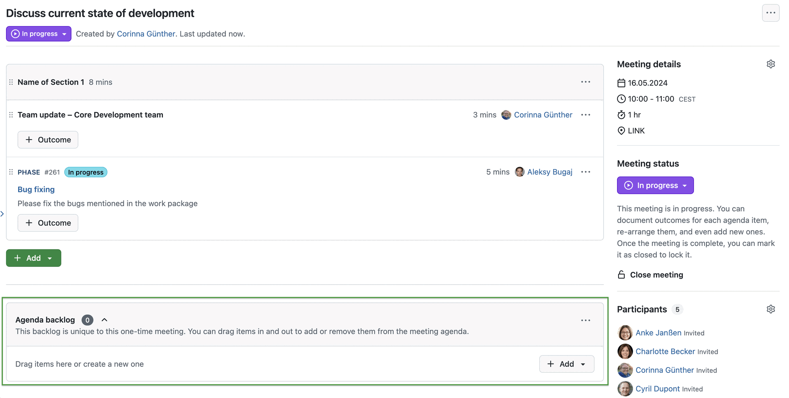
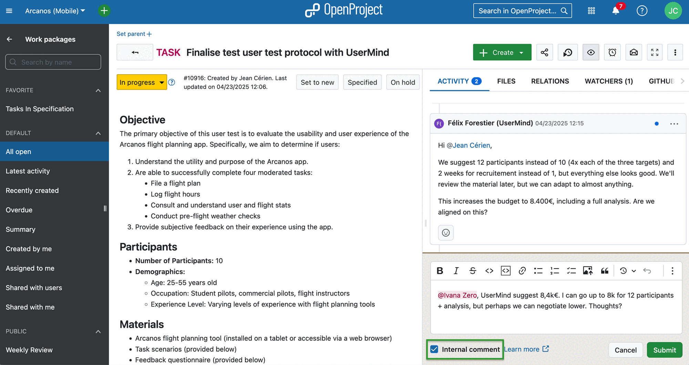
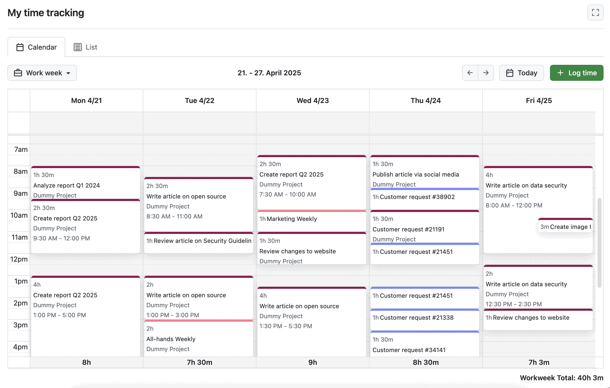
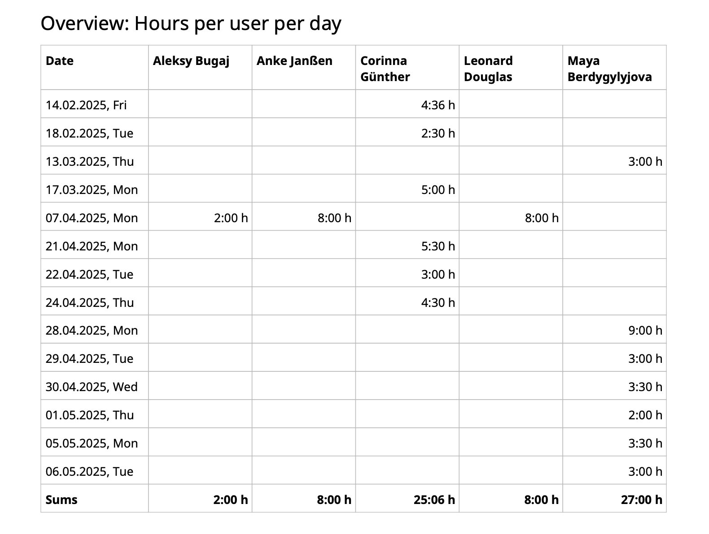
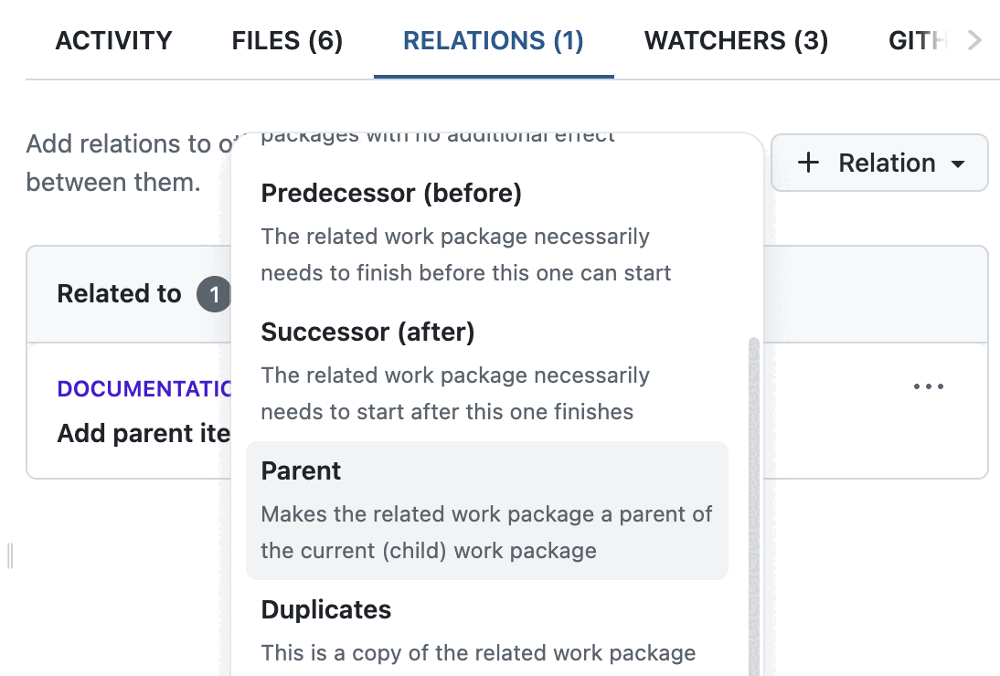
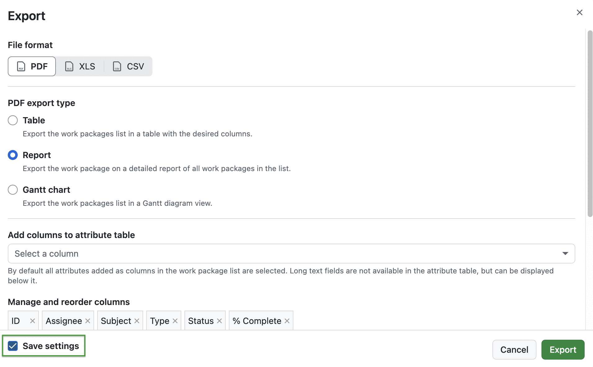

# OpenProject 16.0.0

Release date: 2025-05-21

We released [OpenProject 16.0.0](https://community.openproject.org/versions/1412). This major release contains many features and bug fixes and we recommend updating to the newest version. In these Release Notes, we will give an overview of important updates, important feature changes and important technical updates. At the end, you will find a complete list of all changes and bug fixes for 16.0.0.

## Important updates

The Enterprise plans (Basic, Professional, Premium, and Corporate) have been updated. Each plan now includes a specific set of Enterprise add-ons. Support levels and pricing remain unchanged with version 16.0.

Current Enterprise customers retain their existing plans with access to all Enterprise add-ons available at that time. No features are removed. From this version onward, new Enterprise add-ons may be included only in higher-tier plans. For example, the new [Internal comments feature](#internal-comments-in-work-packages-enterprise-add-on) is part of the Professional plan.

Customers on lower Enterprise plans who want to try out new add-ons from higher plans can do so by [requesting a new Enterprise trial token (on-premises)](https://www.openproject.org/contact/) or by [starting a new Cloud trial instance](https://start.openproject.com/).

More details are available in our updated [Pricing page](https://www.openproject.org/pricing).

## Important feature changes

Take a look at our release video showing the most important features introduced in OpenProject 16.0.0:

## Meeting backlogs

Meeting organization becomes even easier with OpenProject 16.0: Meeting backlogs allow users to collect, manage, and prepare agenda items more flexibly — both for one-time meetings and for recurring meeting series.

In one-time meetings, the new [**Agenda backlog**](../../user-guide/meetings/one-time-meetings/#agenda-backlogs) stores topics that are not yet assigned to the current meeting but may be added later.

In recurring meetings, the shared [**Series backlog**](../../user-guide/meetings/recurring-meetings/#meeting-backlogs-for-recurring-meetings) helps track open points across all meeting occurrences and move items between them as priorities change.

Agenda items can easily be moved from the backlog to a meeting — or back to the backlog if an agenda item needs to be postponed. Work packages can also be added directly to the backlog. Even meetings without current agenda items can maintain a backlog of important topics.

Meeting backlogs support better preparation, more flexibility, and a clearer structure for meeting management in OpenProject.

### End of classic meetings

With version 16.0, the 'classic’ option will no longer be offered when creating a new meeting in OpenProject. With the release of meeting outcomes and now also meeting backlogs, classic meetings are considered outdated.

No data will get lost with the update, apart from the Meeting history of your classic meetings. If you used classic meetings in the past, see [this blog article](https://www.openproject.org/blog/end-classic-meetings-may-2025/) to learn more about the change and the reasons behind it.

## Internal comments in work packages (Enterprise add-on)

Users of the Enterprise Professional version are now able to communicate internally in the work package Activity tab. To use this feature, a project admin has to enable internal comments. By default, these are only visible to the project admin role, but administrators can grant a new set of permissions to any number of roles.

All users with these permissions then see an "Internal comment" checkbox when adding a new comment. If they check this box, the comment will only be visible to other people with these permissions. The different background color indicates that a comment is internal.

> [!TIP]
> To check who is able to see your internal comment, type '@' and you will see a list of all users that have the permission to see internal comments. If a user is not in that list, you will not be able to @mention them.

> [!NOTE]
> Starting with 16.0, **files uploaded in the Activity tab will not be included in the Files tab**. Even though internal comments are the technical trigger for this change, it applies to both regular and internal comments.

Find out more about [internal comments in this user guide](../../user-guide/activity/#internal-comments-enterprise-add-on) and [this blog article](https://www.openproject.org/blog/internal-comments/).

## Automatically generated work package subjects (Enterprise add-on)

OpenProject now supports automatically generated subjects for work packages. This new Enterprise add-on, available in the Professional plan, allows administrators to define subject patterns for each work package type. When enabled, the subject field is **filled automatically and becomes non-editable during work package creation and updates**.

This is especially useful for structured processes such as vacation requests, IT tickets, or maintenance reports, where consistent naming is required. Subject patterns can include static text as well as dynamic placeholders like project name, work package type, or custom field values.

Get an [introduction in the user guide](../../user-guide/work-packages/automatic-subjects/), learn more about [configuring automatically generated work package subjects in OpenProject system administration guide](../../system-admin-guide/manage-work-packages/work-package-types/automatic-subjects/), or consult this [blog article](https://www.openproject.org/blog/automatically-generated-work-package-subjects/) for more use case examples. 

## Separate time tracking module with calendar view

OpenProject 16.0 offers a separate time tracking module with a calendar view. It is accessible from the global view and listed in the left side bar navigation called [My time tracking](../../user-guide/time-and-costs/my-time-tracking/). There, users can view and edit their logged time with start and end times. Users can switch between daily, weekly, work week and monthly views and also log new time entries directly by clicking in the calendar.

Each day shows the sum of the tracked time, and in the weekly and monthly views, the total tracked time is displayed in the lower right corner.

Please note that this module has to be activated by an administrator first. Navigate to *Administration → Time and costs → Defaults* and check the box next to 'Allow exact time tracking' to enable tracking start and finish dates. If 'Allow exact time tracking' is enabled, the calendar becomes the default view for the My time tracking module. If 'Require exact times' is checked, users must provide both start and end times when logging time. Otherwise, the list view remains the default. In the calendar view, all entries are then displayed at the top of the respective day column.

Learn more about My time tracking module in [this user guide](../../user-guide/time-and-costs/my-time-tracking/) and [this blog article](https://www.openproject.org/blog/time-tracking-module/).

### Time entries with legally required mandatory fields: start time and finish time

Time reports now include explicit start and end times, addressing common legal requirements. Before 16.0, time reports showed only the total duration of logged time. Now, they also include start and end times for greater accuracy. This applies to all features where time tracking is possible, e.g. the new time tracking module, PDF timesheets, or the My spent time widget.

### Overview of time logged per day per user in PDF timesheet

Exported PDF timesheets now include an overview of logged time per day and user. It is displayed in a table view at the beginning of the report. If the list contains more than five users, the view is split into several tables.

## Release to Community: Graphs on project overview page

From time to time an Enterprise add-on is released for the free Community version. We are happy to announce that with OpenProject 16.0, the **graphs on the project overview page are now available in all editions**. This means that Community users can now display graphs directly on the project overview page to visualize important project information and communicate project status to the team and management.

The work package graph widgets display information about the work packages within a project and can be shown in different views, such as bar graphs or pie charts.

[Learn more about this feature in our user guide](../../user-guide/project-overview/#work-package-graph-widgets).

## Parent relation displayed in work package relations tab

As requested by our users, you can now add a parent work package relation by choosing it directly from the dropdown menu in the Relations tab. This is also still possible by clicking on **Set parent** on the top left corner of a work package. Both will make the related work package a parent of the current (child) work package.

## Save work package export configuration

When [exporting a (public or private) work package table](../../user-guide/work-packages/exporting/), users can now save their configuration settings, e.g. a specific order and display of columns or long text fields. This saves time and allows users to share the export settings with their team (e.g. for a defects and approval report). Please note that this setting is not individual and will **change the default configuration for this specific format and type for everyone**.

## Storage Health status: Multiple visible checks and download option

The Health check for file storages has been extended in OpenProject 16.0. Administrators can now view **multiple visible results**, grouped into base configuration, authentication, and automatically-managed folders. Each group displays a short summary indicating whether all checks passed, warnings occurred, or failures were detected. If issues are found, a link to detailed documentation is provided.

The summary of the most recent health check remains visible in the sidebar. In addition, a new option allows administrators to open a **full detailed report** to review all individual checks directly.

To make troubleshooting even easier, administrators can now also **download** the complete health check report as a text file, for example to include in a support request.

## Option to select favorite project tab as default in project quick search

When selecting the **Favorites** tab in the Projects dropdown, OpenProject now remembers this preference and shows it by default the next time the dropdown is opened. It is a personal setting that remains active until the user switches back to **All**. This small usability improvement saves time for users who frequently work with favorite projects.

## Important technical changes

## Seamless integration of user sessions of Nextcloud and OpenProject using OIDC & JWTs (Enterprise add-on)

OpenProject 16.0 introduces a major improvement for customers of the Enterprise Corporate plan that are using Nextcloud alongside OpenProject. Through a new configuration based on OpenID Connect (OIDC) and JSON Web Tokens (JWTs), OpenProject and Nextcloud can now integrate user sessions seamlessly without showing separate consent screens in each application.

Instead of mutually acting as OAuth servers and clients, both OpenProject and Nextcloud can now authenticate against a common Identity Provider (IDP). This allows OpenProject to reuse the user session to call Nextcloud APIs directly — improving the user experience and reducing complexity in daily workflows.

Please see [our system admin guide](../../system-admin-guide/integrations/nextcloud/oidc-sso/) to learn how to set up this integration.

This is the first version of OpenProject to support this new integration method with Nextcloud. Since this feature was not yet
exposed to large installations, we still consider it experimental. Please share your feedback regarding this new feature with us and stay tuned
for further enhancements around it.

## Breaking: API requests with JWT issued by OpenID Connect provider require scope

In [OpenProject 14.4.0](../../release-notes/14/14-0-0/) we introduced the possibility to access the OpenProject API through a JSON Web Token created by an OpenID Connect
provider. Back then we only intended them to be used in the context of our APIv3. However, as OpenProject evolves further, we want to
be able to use them in additional contexts. Starting with OpenProject 16.0.0, we will therefore require all tokens to carry a scope called
`api_v3` for API requests to our APIv3. This is consistent with other tokens issued by OpenProject itself.

<!--more-->

## Bug fixes and changes

<!-- Warning: Anything within the below lines will be automatically removed by the release script -->
<!-- BEGIN AUTOMATED SECTION -->

- Feature: Internal comments in the work package activity tab \[[#31163](https://community.openproject.org/wp/31163)\]
- Feature: Seamless integration of user sessions of Nextcloud and OpenProject using OIDC &amp; JWTs \[[#52828](https://community.openproject.org/wp/52828)\]
- Feature: Automatically generated work package subjects \[[#53653](https://community.openproject.org/wp/53653)\]
- Feature: Meeting backlogs \[[#54751](https://community.openproject.org/wp/54751)\]
- Feature: Apply standardized component for PageHeaders &amp; SubHeaders in the missing rails based pages \[[#58155](https://community.openproject.org/wp/58155)\]
- Feature: Manage personal time entries in list and calendar views \[[#61540](https://community.openproject.org/wp/61540)\]
- Feature: Introduce enterprise plans \[[#62469](https://community.openproject.org/wp/62469)\]
- Feature: Add parent item to relations \[[#38030](https://community.openproject.org/wp/38030)\]
- Feature: File storages settings for type Nextcloud: Allow OIDC based connection instead of OAuth2 \[[#55284](https://community.openproject.org/wp/55284)\]
- Feature: Option to select favorite project tab as default in project quick search \[[#55792](https://community.openproject.org/wp/55792)\]
- Feature: Extend Nextcloud files storage to use SSO access tokens  \[[#57056](https://community.openproject.org/wp/57056)\]
- Feature: Save work package table export configuration for next export of a view  \[[#57388](https://community.openproject.org/wp/57388)\]
- Feature: Store token exchange capability on OIDC providers \[[#58862](https://community.openproject.org/wp/58862)\]
- Feature: Track start time, finish time, and duration in Log time dialog \[[#59038](https://community.openproject.org/wp/59038)\]
- Feature: Separate time tracking module with calendar view for logged time with start and finish time \[[#59376](https://community.openproject.org/wp/59376)\]
- Feature: Define subject patterns in work package type settings \[[#59909](https://community.openproject.org/wp/59909)\]
- Feature: Prevent editing of subject on work package creation and update \[[#59910](https://community.openproject.org/wp/59910)\]
- Feature: Block users from editing managed subjects of work packages in table views \[[#59911](https://community.openproject.org/wp/59911)\]
- Feature: Add times for labor costs to the cost report and export \[[#59914](https://community.openproject.org/wp/59914)\]
- Feature: Update PageHeaders &amp; SubHeaders in the (rails) project pages (Part 2) \[[#59915](https://community.openproject.org/wp/59915)\]
- Feature: Add enterprise banner to subject configuration \[[#59929](https://community.openproject.org/wp/59929)\]
- Feature: Support OIDC in storage health status \[[#60161](https://community.openproject.org/wp/60161)\]
- Feature: Export metrics in prometheus format \[[#60181](https://community.openproject.org/wp/60181)\]
- Feature: Enterprise banner (Corporate Plan) for Nextcloud SSO authentication \[[#60612](https://community.openproject.org/wp/60612)\]
- Feature: Add start and end times to the API \[[#60633](https://community.openproject.org/wp/60633)\]
- Feature: Amend work package comment href from \`#activity-&lt;journal-sequence&gt;\` to \`#comment-&lt;journal-id&gt;\` with backwards compatibility for old links \[[#60875](https://community.openproject.org/wp/60875)\]
- Feature: Introduce internal comments \[[#60977](https://community.openproject.org/wp/60977)\]
- Feature: Enterprise/Professional upsale banners for internal comments \[[#61061](https://community.openproject.org/wp/61061)\]
- Feature: Trigger browser confirmation dialog when clicking on &#39;Mark all as read&#39; \[[#61309](https://community.openproject.org/wp/61309)\]
- Feature: Cosmetic UI optimizations to the emoji reactions \[[#61402](https://community.openproject.org/wp/61402)\]
- Feature: Allow to configure SSO authentication + two-way OAuth 2 \[[#61532](https://community.openproject.org/wp/61532)\]
- Feature: Storage Health status: Multiple visible checks \[[#61556](https://community.openproject.org/wp/61556)\]
- Feature: Audience selection for Nextcloud Hub scenario \[[#61623](https://community.openproject.org/wp/61623)\]
- Feature: Validate subject pattern \[[#61692](https://community.openproject.org/wp/61692)\]
- Feature: Form input: introduce a smaller input size for date/time \[[#61779](https://community.openproject.org/wp/61779)\]
- Feature: Link to new OIDC docs from storages setup \[[#61839](https://community.openproject.org/wp/61839)\]
- Feature: Primerize Project Settings &gt; Information form \[[#61889](https://community.openproject.org/wp/61889)\]
- Feature: Overview of time logged per day per user in PDF timesheet \[[#61896](https://community.openproject.org/wp/61896)\]
- Feature: Add leading character to pattern input to initiate search \[[#62150](https://community.openproject.org/wp/62150)\]
- Feature: Consistent permissions for meetings modules \[[#62175](https://community.openproject.org/wp/62175)\]
- Feature: Allow to set authentication method and storage audience via API \[[#62191](https://community.openproject.org/wp/62191)\]
- Feature: Hide authentication method for &quot;SSO with Fallback&quot; \[[#62192](https://community.openproject.org/wp/62192)\]
- Feature: Don&#39;t show work package comment inline attachments in Files tab \[[#62356](https://community.openproject.org/wp/62356)\]
- Feature: Validate scope of JWTs \[[#62360](https://community.openproject.org/wp/62360)\]
- Feature: Add information about current restrictions of &quot;Automatic subjects&quot; \[[#62368](https://community.openproject.org/wp/62368)\]
- Feature: Implement cross-plan upsale \[[#62471](https://community.openproject.org/wp/62471)\]
- Feature: Allow generation of Enterprise plan tokens in enterprise-tokens repo \[[#62548](https://community.openproject.org/wp/62548)\]
- Feature: Allow booking &quot;Premium&quot; plan in SaaS \[[#62573](https://community.openproject.org/wp/62573)\]
- Feature: Create a \`BorderBox::CollapsibleHeader\` component \[[#62577](https://community.openproject.org/wp/62577)\]
- Feature: Migrate classic meeting functionality into dynamic meetings \[[#62621](https://community.openproject.org/wp/62621)\]
- Feature: Introduce enterprise banner for enforced start &amp; end time tracking \[[#62624](https://community.openproject.org/wp/62624)\]
- Feature: Create a CollapsibleSectionComponent  \[[#62754](https://community.openproject.org/wp/62754)\]
- Feature: Storage sidebar button in projects should behave correctly in all scenarios \[[#62758](https://community.openproject.org/wp/62758)\]
- Feature: Show warning if a user tries to uncheck the &#39;Internal comment&#39; checkbox when there&#39;s already text in the comment box \[[#62785](https://community.openproject.org/wp/62785)\]
- Feature: Additional protections for internal comments in places where comments are accessed \[[#62988](https://community.openproject.org/wp/62988)\]
- Feature: Check the accessibility on CollapsibleSectionComponent &amp; CollapsibleHeaderComponent \[[#63275](https://community.openproject.org/wp/63275)\]
- Feature: Time tracking list view \[[#63336](https://community.openproject.org/wp/63336)\]
- Feature: Communicate dangers of automatic self registration \[[#63379](https://community.openproject.org/wp/63379)\]
- Feature: Download Storage Health status report \[[#63467](https://community.openproject.org/wp/63467)\]
- Feature: Create Project Status Component \[[#63482](https://community.openproject.org/wp/63482)\]
- Feature: Add error codes to health check results \[[#63518](https://community.openproject.org/wp/63518)\]
- Feature: Implement medium banner component \[[#63525](https://community.openproject.org/wp/63525)\]
- Feature: PDF Timesheet: Restore previous overview table and add headlines \[[#63526](https://community.openproject.org/wp/63526)\]
- Feature: Make the SaaS Trial Plan Premium \[[#63532](https://community.openproject.org/wp/63532)\]
- Feature: Add meeting backlogs \[[#63543](https://community.openproject.org/wp/63543)\]
- Feature: Primerize Administration &gt; Authentication settings \[[#63567](https://community.openproject.org/wp/63567)\]
- Feature: Release Enterprise add-on &quot;Graphs on project overview page&quot; to the Community version \[[#63619](https://community.openproject.org/wp/63619)\]
- Feature: Work week available in the view selector of time tracking calendar and list \[[#63621](https://community.openproject.org/wp/63621)\]
- Feature: Remove internal comments feature flag \[[#63635](https://community.openproject.org/wp/63635)\]
- Feature: Remove work package comment ID URL feature flag \[[#63646](https://community.openproject.org/wp/63646)\]
- Feature: Show attribute name instead of N/A if attribute is just empty \[[#63660](https://community.openproject.org/wp/63660)\]
- Feature: Implement new homescreen enterprise banner style \[[#63727](https://community.openproject.org/wp/63727)\]
- Feature: Use Chargebee custom field (Domain) for generation of new version 5 Enterprise token \[[#63845](https://community.openproject.org/wp/63845)\]
- Feature: Combine legacy\_enterprise custom field with plan name \[[#63905](https://community.openproject.org/wp/63905)\]
- Bugfix: Search shows browser autofill \[[#57836](https://community.openproject.org/wp/57836)\]
- Bugfix: User is able to edit someone else&#39;s comment \[[#58511](https://community.openproject.org/wp/58511)\]
- Bugfix: Boards search for WorkPackages is too small \[[#58702](https://community.openproject.org/wp/58702)\]
- Bugfix: Quick wins for top bar search \[[#58704](https://community.openproject.org/wp/58704)\]
- Bugfix: String &quot;All&quot; within search cannot be translated \[[#59247](https://community.openproject.org/wp/59247)\]
- Bugfix: Inconsistently used red color for notification bell and ongoing time tracking \[[#59379](https://community.openproject.org/wp/59379)\]
- Bugfix: Error 500 when bulk editing work packages \[[#60580](https://community.openproject.org/wp/60580)\]
- Bugfix: Primer Dialog close button ARIA label is not localized \[[#61631](https://community.openproject.org/wp/61631)\]
- Bugfix: Token Refresh and Exchange does not work when Client ID contains special characters \[[#61694](https://community.openproject.org/wp/61694)\]
- Bugfix: Empty audience translation is missing \[[#61855](https://community.openproject.org/wp/61855)\]
- Bugfix: SSO users storage connection does not work on project storage members page  \[[#61880](https://community.openproject.org/wp/61880)\]
- Bugfix: Autocompleter dropdown in pattern input is missing default entry \[[#61935](https://community.openproject.org/wp/61935)\]
- Bugfix: Can&#39;t associate storage to project via storage admin view \[[#61936](https://community.openproject.org/wp/61936)\]
- Bugfix: Input with angle brackets disappears on save but is saved \[[#62040](https://community.openproject.org/wp/62040)\]
- Bugfix: Linking to project storage via SSO fails when user can&#39;t authenticate \[[#62166](https://community.openproject.org/wp/62166)\]
- Bugfix: Updating a work package with generated subject fails, if project is missing custom field \[[#62217](https://community.openproject.org/wp/62217)\]
- Bugfix: Storage shows as healthy even if audience is misconfigured \[[#62237](https://community.openproject.org/wp/62237)\]
- Bugfix: PDF export does not export all embedded screenshots \[[#62293](https://community.openproject.org/wp/62293)\]
- Bugfix: Cannot inline create a WP with auto generated subject when no other attribute is a required field \[[#62318](https://community.openproject.org/wp/62318)\]
- Bugfix: Project attribute list entries not displayed when applied as filter in project list \[[#62386](https://community.openproject.org/wp/62386)\]
- Bugfix: Add missing attributes in subject patterns \[[#62429](https://community.openproject.org/wp/62429)\]
- Bugfix: Wrong meeting date displayed in side panel \[[#62441](https://community.openproject.org/wp/62441)\]
- Bugfix: OpenProject enterprise key domain check is case-sensitive \[[#62520](https://community.openproject.org/wp/62520)\]
- Bugfix: Work package info line opens in a new tab \[[#62545](https://community.openproject.org/wp/62545)\]
- Bugfix: Marking a notification as read automatically selects the first notification \[[#62604](https://community.openproject.org/wp/62604)\]
- Bugfix: Long code block breaks meeting outcome \[[#62689](https://community.openproject.org/wp/62689)\]
- Bugfix: Sum queries (∑) do not display children that are not in the current project in view \[[#62847](https://community.openproject.org/wp/62847)\]
- Bugfix: Exposing restricted comments when polling \[[#62978](https://community.openproject.org/wp/62978)\]
- Bugfix: Insufficient spacing between meeting agenda notes and outcome \[[#63108](https://community.openproject.org/wp/63108)\]
- Bugfix: The auto time-tracking timer button keeps changing width when the timer is running \[[#63345](https://community.openproject.org/wp/63345)\]
- Bugfix: Gantt module work package list still uses old term &quot;follower&quot; \[[#63351](https://community.openproject.org/wp/63351)\]
- Bugfix: Inconsistent bottom-margin on agenda items \[[#63353](https://community.openproject.org/wp/63353)\]
- Bugfix: User with a particular set of permissions sees error when updating WP dates \[[#63434](https://community.openproject.org/wp/63434)\]
- Bugfix: Missing attributes of generated work package subjects are displayed wrongly \[[#63441](https://community.openproject.org/wp/63441)\]
- Bugfix: Missing space when putting multiple CollapsibleSections below each other \[[#63442](https://community.openproject.org/wp/63442)\]
- Bugfix: Collapsed preview not working \[[#63443](https://community.openproject.org/wp/63443)\]
- Bugfix: Sort projects in Favorite Projects widget on My page alphabetically  \[[#63444](https://community.openproject.org/wp/63444)\]
- Bugfix: Moving single date work packages in the Calendar adds the second date without user intent \[[#63475](https://community.openproject.org/wp/63475)\]
- Bugfix: Missing parent attributes in subject patterns \[[#63483](https://community.openproject.org/wp/63483)\]
- Bugfix: Users without the manage meeting minutes permission still see the &quot;Add outcome&quot; option \[[#63535](https://community.openproject.org/wp/63535)\]
- Bugfix: My Time tracking calendar view, does not look properly in dark mode \[[#63548](https://community.openproject.org/wp/63548)\]
- Bugfix: Bad translations of &quot;All checks passed&quot; for Arabic and Latvian languages \[[#63568](https://community.openproject.org/wp/63568)\]
- Bugfix: Work package meetings tab has discrepancy when work packages are added to a template \[[#63571](https://community.openproject.org/wp/63571)\]
- Bugfix: My sessions page takes forever to load \[[#63587](https://community.openproject.org/wp/63587)\]
- Bugfix: SAML Setup with metadata URL does not fill IdP Cert \[[#63610](https://community.openproject.org/wp/63610)\]
- Bugfix: SAML auth: Obsolete fingerprint is used despite presence of IdP certificate \[[#63612](https://community.openproject.org/wp/63612)\]
- Bugfix: Boolean custom fields in subject patterns are not supported \[[#63641](https://community.openproject.org/wp/63641)\]
- Bugfix: &#39;Add work package to meeting&#39; dialog has incorrect meeting field label \[[#63692](https://community.openproject.org/wp/63692)\]
- Bugfix: xls export of time fields work in wrong format (should be 10 h instead of 1 d 2h) \[[#63739](https://community.openproject.org/wp/63739)\]
- Bugfix: Focus is not set on Agenda item title when adding to Backlog/meeting sections \[[#63784](https://community.openproject.org/wp/63784)\]
- Bugfix: Error 500 when bulk delete related work packages \[[#63831](https://community.openproject.org/wp/63831)\]
- Bugfix: Antivirus settings should be hidden on SaaS \[[#64034](https://community.openproject.org/wp/64034)\]

<!-- END AUTOMATED SECTION -->
<!-- Warning: Anything above this line will be automatically removed by the release script -->

## Contributions

A very special thank you goes to City of Cologne, Deutsche Bahn and ZenDiS for sponsoring released or upcoming features. Your support, alongside the efforts of our amazing Community, helps drive these innovations. Also a big thanks to our Community members for reporting bugs and helping us identify and provide fixes. Special thanks for reporting and finding bugs go to alex e, Klaas vT, Daniel Elkeles, Marcel Carvalho, Regina Schikora, Çağlar Yeşilyurt, and Александр Татаринцев.

Last but not least, we are very grateful for our very engaged translation contributors on Crowdin, who translated quite a few OpenProject strings! This release we would like to particularly thank the following users:

- [Сергей Баранов](https://crowdin.com/profile/postbse), for a great number of translations into Russian.
- [Gzyyy](https://crowdin.com/profile/gzyyy), for a great number of translations into Chinese simplified.
- [rlmpereira](https://crowdin.com/profile/rlmpereira), for a great number of translations into Portuguese.

Would you like to help out with translations yourself? Then take a look at our [translation guide](../../contributions-guide/translate-openproject/) and find out exactly how you can contribute. It is very much appreciated!
