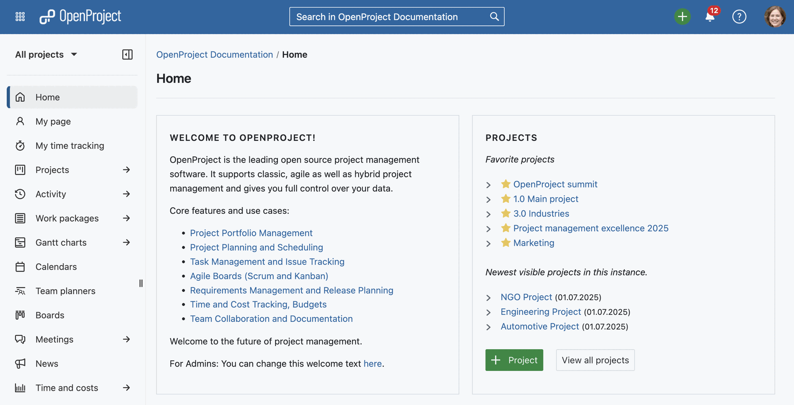
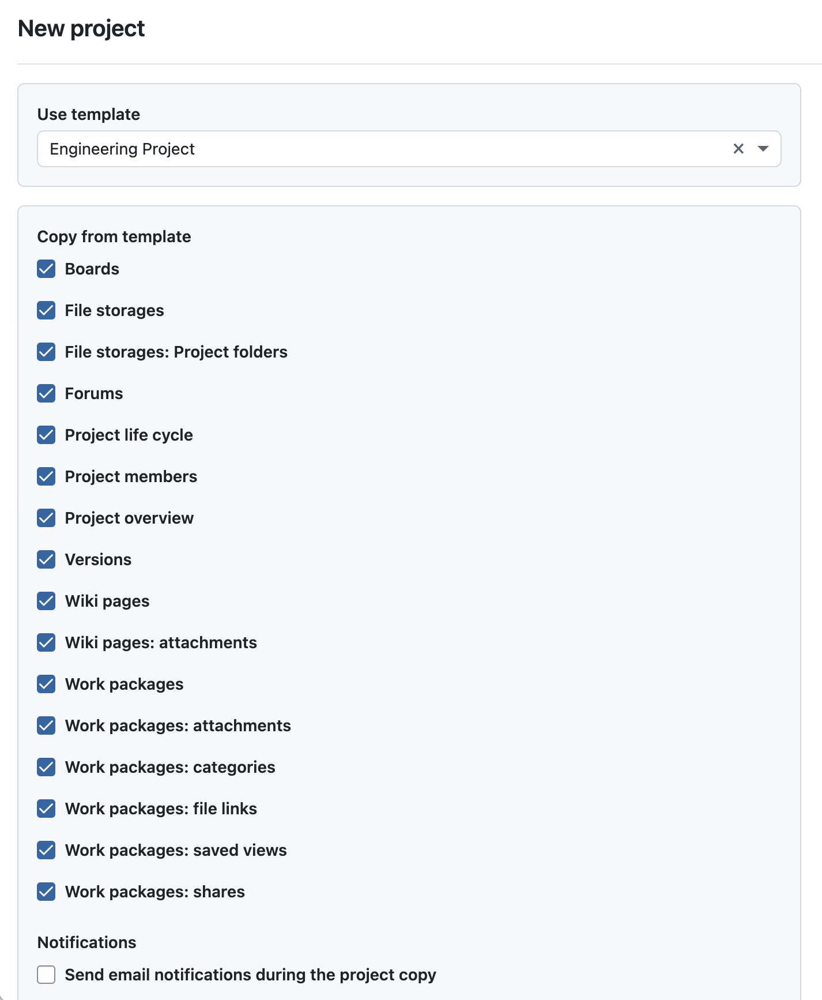
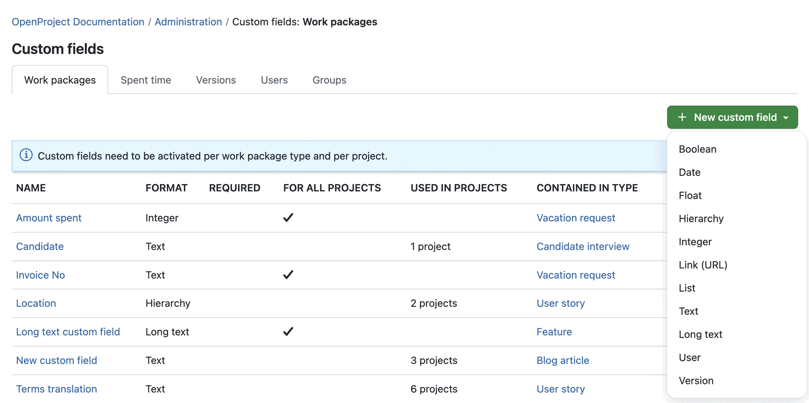
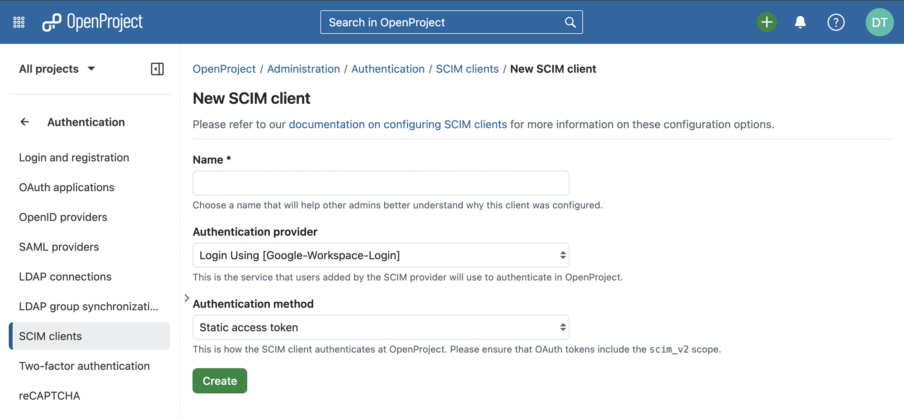

# OpenProject 16.2.0

Release date: 2025-07-16

We released [OpenProject 16.2.0](https://community.openproject.org/versions/2196). The release contains several bug fixes and we recommend updating to the newest version. In these Release Notes, we will give an overview of important feature changes and important technical changes. At the end, you will find a complete list of all changes and bug fixes. 

## Important feature changes

Take a look at our release video showing the most important features introduced in OpenProject 16.2.0:
  

### New header and sidebar with improved navigation and design

OpenProject 16.2 introduces a redesigned header and sidebar that make navigating your projects noticeably easier. The sidebar toggle (hamburger icon) has moved inside the sidebar itself, the default sidebar color in light mode is now lighter and more modern, and the search and create buttons have been repositioned in the top bar for a more intuitive workflow. Together, these changes create a cleaner, more focused interface that helps you find what you need faster and align with the user interface used in [openDesk](https://www.openproject.org/opendesk/).

Please note that if you have customized the sidebar colors, your individual settings will remain unchanged.

### Primer design system added to project create and project copy forms

The forms for [creating and copying projects](../../getting-started/projects/#create-a-new-project) now use the [Primer design system](https://www.openproject.org/blog/primer-design-system/), providing a cleaner and more consistent interface. This improves accessibility and ensures the process remains just as familiar.

If you **copy** a project or create a project **based on a template**, you will immediately be able to choose which modules and parts you want to copy and which to skip. Also, the option to activate sending email notifications during the project copy is much more visible. Before 16.2, you had to click on Copy Options to unfold.

### Non-Latin languages and emojis supported in PDF exports for work packages

PDF work package exports in OpenProject now support **non-Latin characters and emojis**. This means that project information written in scripts such as Chinese, Arabic, Cyrillic, or accented characters — as well as any emojis you use in work packages, meetings, or descriptions — will display correctly in exported PDF files. This ensures that documents generated from OpenProject reflect your content accurately, no matter which language or symbols you use.

[Read more about work package PDF exports with OpenProject](../../user-guide/work-packages/exporting/)

Please note that the screenshot only displays some of the now supported characters.

### Second level navigation for Relations create menu

The + Relation menu has been reorganized with a new two-level structure, making it clearer and easier to navigate. The most common relations like **Related to**, **Predecessor**, **Successor**, **(New) Child**, and **Parent** are now shown directly, while less frequently used options such as Duplicates, Blocks, or Requires are grouped under Other relations. This helps you see the primary choices at a glance and keep your work package relations more structured.

[Read more about relations in OpenProject](../../user-guide/work-packages/work-package-relations-hierarchies/).

### Select formats for custom fields and project attributes earlier in creation process

When creating a new custom field, you can now select the format — such as text, list, or date — right at the beginning, on the index page of custom fields and project attributes. The same applies to project attributes. This streamlines the creation process and avoids unnecessary steps, since each type opens directly in the appropriate form. This improvement is especially helpful for administrators who frequently set up new custom fields or project attributes.

Read more about how to manage [custom fields](../../system-admin-guide/custom-fields/) and [project attributes](../../user-guide/projects/project-settings/project-attributes/) in OpenProject.

### My time tracking: Collapse future days for week and work week views

In the **My time tracking** module, the week and work week views now automatically collapse future and past days while keeping today expanded. This helps you focus on logging time for the current and past days without being distracted by empty future slots. If you view a past week, all days are expanded as before.

> [!TIP]
> Don't know the My time tracking module yet? We released it with [OpenProject 16.0.0](../../release-notes/16-0-0/). This module shows individual time entries in a calendar or list view, and is very helpful if you use start and end times for your time tracking. 

[Learn more about the My time tracking module in our documentation](../../user-guide/time-and-costs/my-time-tracking/).

### Option to disable keyboard shortcuts for better accessibility

OpenProject 16.2 makes the application more accessible by allowing users to **disable keyboard shortcuts**. This is especially helpful for people using assistive technologies, where keyboard shortcuts might interfere with screen readers or other tools. The option can be found under *Account settings → Interface*.

### Work package reminders presented in relative humanized time format

When you set a reminder for a work package, OpenProject now confirms this with a **relative, human-friendly time**. Instead of just showing a fixed date and time, the success message will say, for example, *“Reminder set successfully. You will receive a notification for this work package tomorrow.”* This small improvement makes it easier to quickly understand when your reminder will appear.

[Learn more about work package reminders in OpenProject](../../user-guide/work-packages/edit-work-package/#work-package-reminders).

## Important technical changes

### SCIM server functionality added to OpenProject via SCIM API (Enterprise add-on)

OpenProject 16.2 adds a **SCIM server API**, available as an Enterprise add-on in the Corporate plan. This allows Identity Providers (IdPs) such as Keycloak to keep user data in OpenProject synchronized automatically. Administrators can manage SCIM clients directly in OpenProject, configure authentication methods, and revoke tokens when needed. This makes it much easier to maintain consistent user records across your systems.

[Learn more about authentication methods with OpenProject](../../system-admin-guide/authentication/).

### API support for internal comments

The API has been extended to fully support **internal comments on work packages**. You can now check via the Capabilities API whether a user can create, view, or edit internal comments. This helps external apps and integrations, such as mobile clients, support internal team discussions securely.

### Commenting on work packages fires a webhook

When a comment is added to a work package, it now triggers a webhook. This enables external systems to react in real time to comments in OpenProject, for example by updating dashboards or notifying integrated tools. [See our system admin guide to learn more about webhooks for OpenProject](../../system-admin-guide/api-and-webhooks/#webhooks).

<!--more-->

## Bug fixes and changes

<!-- Warning: Anything within the below lines will be automatically removed by the release script -->
<!-- BEGIN AUTOMATED SECTION -->

- Bugfix: Clicking on &quot;Notification settings&quot; in Notification Center opens a new tab \[[#44867](https://community.openproject.org/wp/44867)\]
- Bugfix: Hide the &quot;Add project attribute&quot; button on the settings admin when sections are empty \[[#53722](https://community.openproject.org/wp/53722)\]
- Bugfix: Docker all in one: Inbound mail not working \[[#57979](https://community.openproject.org/wp/57979)\]
- Bugfix: Sharing project lists does not work \[[#60355](https://community.openproject.org/wp/60355)\]
- Bugfix: Hierarchy custom field - PDF export output display only last item without hierarchy \[[#60404](https://community.openproject.org/wp/60404)\]
- Bugfix: Autocompleter should not get autofocus by default \[[#61534](https://community.openproject.org/wp/61534)\]
- Bugfix: Work package description images scaling issue when exported to PDF \[[#61732](https://community.openproject.org/wp/61732)\]
- Bugfix: Centered text in cells in work package description fields appear left justified when exported to a PDF report. \[[#61734](https://community.openproject.org/wp/61734)\]
- Bugfix: The &quot;bulk copy&quot; label in the multi-select contextual menu is not consistent with the &quot;Duplicate&quot; action in the single-select one \[[#62178](https://community.openproject.org/wp/62178)\]
- Bugfix: Wrong upcoming meeting times when a user in a different time zone edits meeting series start date \[[#62375](https://community.openproject.org/wp/62375)\]
- Bugfix: User custom field: hovering over group name renders error message \[[#62480](https://community.openproject.org/wp/62480)\]
- Bugfix: \[Work-Package\] Mixing checkboxes and Bullet Point destroys checkboxes \[[#63309](https://community.openproject.org/wp/63309)\]
- Bugfix: When editing a comment in an activity, the window automatically closes \[[#63545](https://community.openproject.org/wp/63545)\]
- Bugfix: Summer time (CEST) is not handled correctly by Meetings when the original meeting time was in a different time zone \[[#63549](https://community.openproject.org/wp/63549)\]
- Bugfix: Duplicate work package comments when submitting via ctlr/cmd + enter \[[#63556](https://community.openproject.org/wp/63556)\]
- Bugfix: Breadcrumb index creates unnecessary navigation buttons on mobile web \[[#63777](https://community.openproject.org/wp/63777)\]
- Bugfix: Mobile: Visual quirks when opening a storage report with error codes \[[#63790](https://community.openproject.org/wp/63790)\]
- Bugfix: NameError in CostReportsController#index \[[#63823](https://community.openproject.org/wp/63823)\]
- Bugfix: NoMethodError in OmniAuthLoginController#callback \[[#63829](https://community.openproject.org/wp/63829)\]
- Bugfix: Broken pages in Primer lookbook \[[#63871](https://community.openproject.org/wp/63871)\]
- Bugfix: Notification image does not have a high enough contrast \[[#63914](https://community.openproject.org/wp/63914)\]
- Bugfix: Provide default id for Primer text field clear button \[[#64008](https://community.openproject.org/wp/64008)\]
- Bugfix: PDF export shows empty table of associated work packages \[[#64049](https://community.openproject.org/wp/64049)\]
- Bugfix: Next SSO Enterprise Banner has no image \[[#64087](https://community.openproject.org/wp/64087)\]
- Bugfix: First section has &quot;Move to top&quot; and &quot;Move up&quot; actions \[[#64101](https://community.openproject.org/wp/64101)\]
- Bugfix: \[Accessibility\] Search is missing a screen reader label \[[#64229](https://community.openproject.org/wp/64229)\]
- Bugfix: \[Accessibility\] Provide alternative link texts for pagination links \[[#64235](https://community.openproject.org/wp/64235)\]
- Bugfix: Flickering Life Cycle Definition specs \[[#64253](https://community.openproject.org/wp/64253)\]
- Bugfix: \[Accessibility\] Focus is not on back arrow when navigating through main menu \[[#64294](https://community.openproject.org/wp/64294)\]
- Bugfix: &quot;Dynamic&quot; meeting mention in permissions \[[#64303](https://community.openproject.org/wp/64303)\]
- Bugfix: Markdown broken with lists greater than 9 \[[#64414](https://community.openproject.org/wp/64414)\]
- Bugfix: Focus should return to trigger element on closing attribute help text dialog \[[#64472](https://community.openproject.org/wp/64472)\]
- Bugfix: BCF module: viewer and table setting does not display table correctly \[[#64541](https://community.openproject.org/wp/64541)\]
- Bugfix: Time and costs page is broken \[[#64590](https://community.openproject.org/wp/64590)\]
- Bugfix: Link CF in PDF report only partially clickable when in multiple lines \[[#64591](https://community.openproject.org/wp/64591)\]
- Bugfix: Global search loading spinner is misplaced, as it overlaps with the X icon \[[#64653](https://community.openproject.org/wp/64653)\]
- Bugfix: Enterprise banner buttons on homescreen are not bottom-aligned \[[#64799](https://community.openproject.org/wp/64799)\]
- Bugfix: Administration project life cycle page using wrong Primer components \[[#64802](https://community.openproject.org/wp/64802)\]
- Bugfix: &quot;Move to top&quot; for sections is broken \[[#64843](https://community.openproject.org/wp/64843)\]
- Bugfix: Console error when loading any meeting \[[#64850](https://community.openproject.org/wp/64850)\]
- Bugfix: Project gate hovercard opens at the same time as date picker \[[#64851](https://community.openproject.org/wp/64851)\]
- Bugfix: Value for &quot;Tester&quot; is not shown in custom action button \[[#64875](https://community.openproject.org/wp/64875)\]
- Bugfix: Missing/wrong error handling for asynchronous dialogs \[[#64974](https://community.openproject.org/wp/64974)\]
- Bugfix: PDF export: workPackageValue macro for float values formats the number without a thousand delimiter \[[#64999](https://community.openproject.org/wp/64999)\]
- Bugfix: TreeView container should be full height in the Custom Fields \[[#65022](https://community.openproject.org/wp/65022)\]
- Bugfix: Date::Error app/models/custom\_value/date\_strategy.rb:34 in Date.iso8601 \[[#65055](https://community.openproject.org/wp/65055)\]
- Bugfix: Editing multiple agenda items breaks the content \[[#65082](https://community.openproject.org/wp/65082)\]
- Bugfix: URI::InvalidURIError from SlackNotificationJob#perform \[[#65083](https://community.openproject.org/wp/65083)\]
- Bugfix: NoMethodError (undefined method &#39;hierarchy&#39; for class Relation) \[[#65085](https://community.openproject.org/wp/65085)\]
- Bugfix: Addressable::URI::InvalidURIError from CustomValue::LinkStrategy#parsed\_url \[[#65089](https://community.openproject.org/wp/65089)\]
- Bugfix: Socket::ResolutionError from SlackNotificationJob#perform \[[#65107](https://community.openproject.org/wp/65107)\]
- Bugfix: WP title is squeezed on mobile \[[#65114](https://community.openproject.org/wp/65114)\]
- Bugfix: Custom action with multi-select cf doesn&#39;t work correctly for non-admin users \[[#65131](https://community.openproject.org/wp/65131)\]
- Bugfix: ArgumentError during seeding after 16.1.1 deployment \[[#65138](https://community.openproject.org/wp/65138)\]
- Bugfix: Links in descriptive text not distinguishable enough \[[#65252](https://community.openproject.org/wp/65252)\]
- Bugfix: Project attributes modal has no divider \[[#65254](https://community.openproject.org/wp/65254)\]
- Bugfix: Performance: Add modal routes to robots.txt \[[#65261](https://community.openproject.org/wp/65261)\]
- Bugfix: Error on updating work package progress tracking \[[#65303](https://community.openproject.org/wp/65303)\]
- Bugfix: Missing breadcrumb in some of the pages related to work packages \[[#65336](https://community.openproject.org/wp/65336)\]
- Bugfix: Meetings in In progress status don&#39;t appear on Meetings tab of WP \[[#65502](https://community.openproject.org/wp/65502)\]
- Bugfix: ScimClient access token and client credentials dialogs render wrong value \[[#65505](https://community.openproject.org/wp/65505)\]
- Bugfix: &quot;Invite user&quot; does not work \[[#65514](https://community.openproject.org/wp/65514)\]
- Bugfix: ActionController::UrlGenerationError in AccountController#consent \[[#65535](https://community.openproject.org/wp/65535)\]
- Bugfix: Hide time tracking module when user has no permission to log time \[[#65562](https://community.openproject.org/wp/65562)\]
- Bugfix: Empty code block breaks CKEditor \[[#65596](https://community.openproject.org/wp/65596)\]
- Bugfix: \[Accessibility\] Provide alternative link texts for pagination links - Rails implementation \[[#65625](https://community.openproject.org/wp/65625)\]
- Bugfix: Progress tracking admin page has some flickering banner \[[#65671](https://community.openproject.org/wp/65671)\]
- Bugfix: Adding an image to an existing comment on Activity causes editing to crash \[[#65680](https://community.openproject.org/wp/65680)\]
- Bugfix: PDF export fails if linked wp ID contains invalid letters \[[#65709](https://community.openproject.org/wp/65709)\]
- Bugfix: SCIM API /Schemas endpoint should have some fields marked as required \[[#65747](https://community.openproject.org/wp/65747)\]
- Bugfix: Misc A11y issues, inconsistencies between `PaginationHelper` (Rails) and `TablePaginationComponent` (ng) implementations \[[#65824](https://community.openproject.org/wp/65824)\]
- Bugfix: Managing group membership does not work in Keycloak plugin setup. \[[#65855](https://community.openproject.org/wp/65855)\]
- Bugfix: IFC conversion failing in helm installation (regression from 16.0) \[[#65872](https://community.openproject.org/wp/65872)\]
- Feature: PDF Export: Support non-latin languages and emojis \[[#52082](https://community.openproject.org/wp/52082)\]
- Feature: Add SCIM server API  \[[#62107](https://community.openproject.org/wp/62107)\]
- Feature: Accept client credentials token issued by OIDC IDP \[[#62301](https://community.openproject.org/wp/62301)\]
- Feature: Allow multiple enterprise tokens to be present \[[#62493](https://community.openproject.org/wp/62493)\]
- Feature: Allow managing SCIM clients \[[#62516](https://community.openproject.org/wp/62516)\]
- Feature: Add authentication to SCIM server API \[[#62592](https://community.openproject.org/wp/62592)\]
- Feature: Multi-level Action Menu Primer View Component \[[#62976](https://community.openproject.org/wp/62976)\]
- Feature: Primerize Project create form \[[#63593](https://community.openproject.org/wp/63593)\]
- Feature: Primerise project copy form \[[#63594](https://community.openproject.org/wp/63594)\]
- Feature: PDF Export: Minor design changes in contract template \[[#63609](https://community.openproject.org/wp/63609)\]
- Feature: Move hamburger sidebar toggle from main navigation to sidebar \[[#63811](https://community.openproject.org/wp/63811)\]
- Feature: Updated enterprise banner for automatic subject configuration \[[#63873](https://community.openproject.org/wp/63873)\]
- Feature: Preserve user external accounts data \[[#63912](https://community.openproject.org/wp/63912)\]
- Feature: Add notification / banner to Enterprise features during trial to communicate which plan they are included in \[[#64005](https://community.openproject.org/wp/64005)\]
- Feature: Commenting on work packages fires a webhook \[[#64129](https://community.openproject.org/wp/64129)\]
- Feature: Allow partial updates on work package type \[[#64220](https://community.openproject.org/wp/64220)\]
- Feature: Introduce account setting to disable keyboard shortcuts (for accessibility) \[[#64234](https://community.openproject.org/wp/64234)\]
- Feature: Use second level navigation for Relations create menu \[[#64377](https://community.openproject.org/wp/64377)\]
- Feature: Moving spike for replacing CKEditor 5 with BlockNoteJS into dev branch and behind a feature flag \[[#64507](https://community.openproject.org/wp/64507)\]
- Feature: My time tracking: Collapse future days for week and work week views \[[#64549](https://community.openproject.org/wp/64549)\]
- Feature: Add internal comments to capabilities API \[[#64694](https://community.openproject.org/wp/64694)\]
- Feature: Reminders: Upon setting a work package reminder, present the reminder time in relative humanized format \[[#64695](https://community.openproject.org/wp/64695)\]
- Feature: Select custom field format at the index page of custom fields &amp; project attributes \[[#64800](https://community.openproject.org/wp/64800)\]
- Feature: Make OpenProject the organizer of the meeting \[[#64849](https://community.openproject.org/wp/64849)\]
- Feature: Reorganize Primerized project copy, create forms; Improve copy options display \[[#65026](https://community.openproject.org/wp/65026)\]
- Feature: Change default color of sidebar in light mode \[[#65091](https://community.openproject.org/wp/65091)\]
- Feature: Change position of search and create button in top bar \[[#65324](https://community.openproject.org/wp/65324)\]
- Feature: Limit access to SCIM clients UI to enterprise customers \[[#65339](https://community.openproject.org/wp/65339)\]
- Feature: Add SCIM server functionality to OpenProject via SCIM API \[[#55941](https://community.openproject.org/wp/55941)\]

<!-- END AUTOMATED SECTION -->
<!-- Warning: Anything above this line will be automatically removed by the release script -->

## Contributions

A very special thank you goes to City of Cologne, Deutsche Bahn and ZenDiS for sponsoring released or upcoming features. Your support, alongside the efforts of our amazing Community, helps drive these innovations. Also a big thanks to our Community members for reporting bugs and helping us identify and provide fixes. Special thanks for reporting and finding bugs go to Michael Lathion, Jason Culligan, Sven Kunze, and Gábor Alexovics.

Last but not least, we are very grateful for our very engaged translation contributors on Crowdin, who translated quite a few OpenProject strings! This release we would like to particularly thank the following users:

- [William](https://crowdin.com/profile/williamfromtw), for a great number of translations into Chinese Traditional.
- [rmiyata](https://crowdin.com/profile/rmiyata), for a great number of translations into Japanese.
- [rubenpedrolopez](https://crowdin.com/profile/rubenpedrolopez), for a great number of translations into Spanish.

Would you like to help out with translations yourself? Then take a look at our [translation guide](../../contributions-guide/translate-openproject/) and find out exactly how you can contribute. It is very much appreciated!
