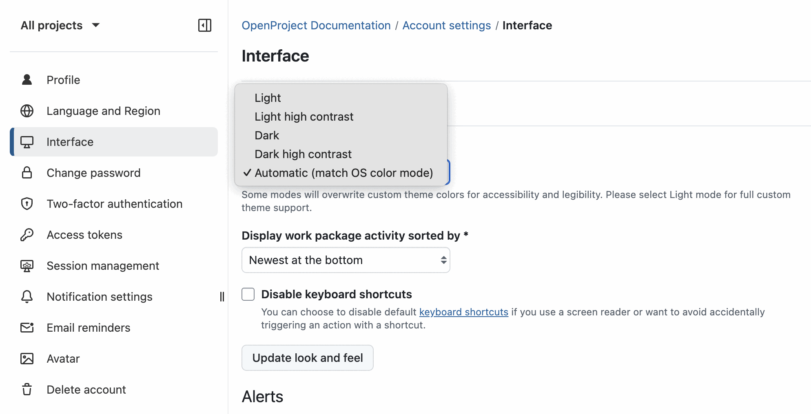
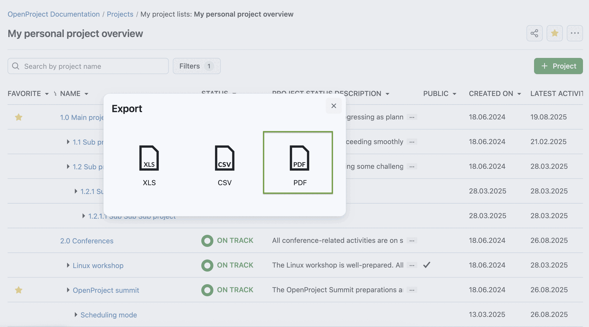
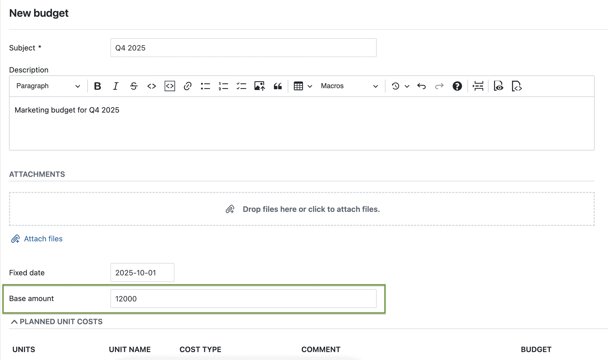
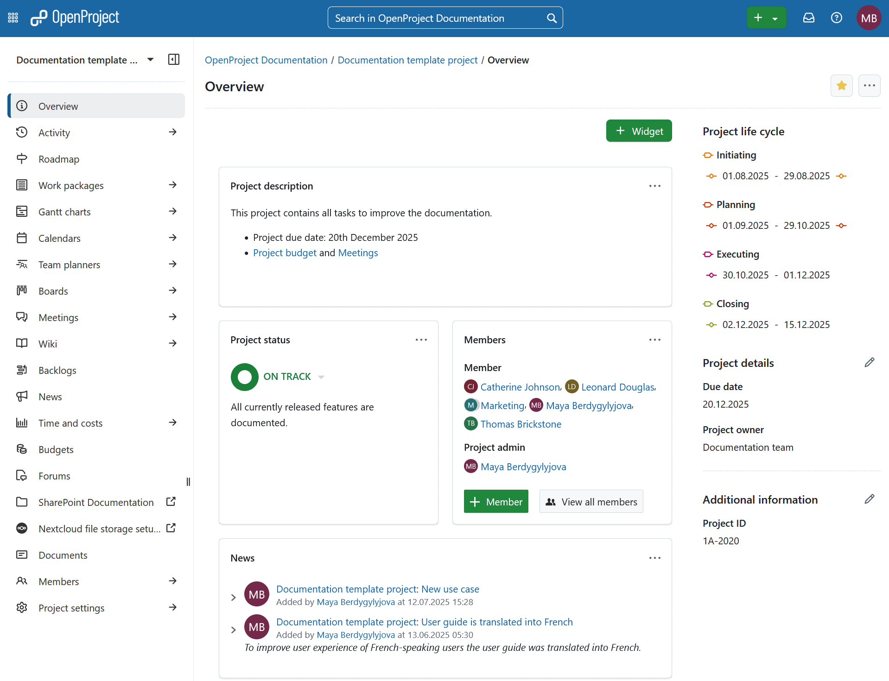

# OpenProject 16.4.0

Release date: 2025-09-10

We released [OpenProject 16.4.0](https://community.openproject.org/versions/2211). The release contains several bug fixes and we recommend updating to the newest version. In these Release Notes, we will give an overview of important feature changes and important technical changes. At the end, you will find a complete list of all changes and bug fixes. 

## Important feature changes

Take a look at our release video showing the most important features introduced in OpenProject 16.4.0:

### Option to automatically sync the color mode with operating system preference

Users can now enable **automatic color mode** under *Account settings → Interface* to match OpenProject’s color mode with their operating system (OS) preference. When enabled, OpenProject automatically switches between light and dark modes based on the OS setting. Please note that your operating system must also be set to automatic switching.

> [!NOTE]
> If a user has enabled dark mode — either by default or through automatic switching — this overrides the instance’s design settings for that user.

[Learn more about the *Look and feel* options in OpenProject](../../user-guide/account-settings/#look-and-feel). 

#### Dark high contrast mode for improved accessibility

Together with the automatic color mode, we have introduced a dark high contrast mode, in addition to the already existing light high contrast mode. This improves readability for users who need stronger visual contrast and enhances accessibility.

> [!NOTE]
> If your OS is set to use high contrast and you enable the new **automatic color mode**, OpenProject will automatically switch to **light high contrast or dark high contrast** accordingly.

### PDF export of project lists

Project managers can now export project lists as PDFs. This makes it easy to create structured reports of all projects without duplicating information.

The exported PDF includes:

- A table of contents with the hierarchy of all exported projects (if more than one project is included).
- A cover page for clear presentation.
- Projects indexed according to their hierarchy (e.g. 1, 1.1, 1.2).
- All selected attributes from the project list, shown in the same order as in the table.
- Section titles linked to the respective project in OpenProject.

To export a project list, open the **More (three dots)** menu in the top right corner of the list and select Export. In the export modal, you can choose between XLS, CSV, or PDF. [Read more about project lists in our documentation](../../user-guide/projects/project-lists/#export-project-lists).

### Custom fonts for all PDF exports (Enterprise add-on)

Administrators for the Enterprise Basic plan and higher can now upload a custom font to be used in all PDF exports. This makes it possible to comply with organization-specific requirements, such as corporate design guidelines.

A new section has been added under *Administration → Design → PDF export font* where administrators can:

- Upload one font family in TTF format (regular required; bold, italic, and bold italic optional).
- Remove previously uploaded fonts.
- Generate a preview PDF to test the uploaded font.

Once uploaded, the font is applied to **all future PDF exports across the instance**.

### Improved meeting participants dialog

The meeting participants dialog has been redesigned to make managing participants easier and more efficient. Two major improvements have been added:

#### 1. Autocomplete and multi-select for inviting users

When preparing a meeting agenda, you can now search and select participants using an **autocomplete** field. This is especially helpful in projects with many members.

#### 2. Simplified attendance tracking

If the meeting is set to *In progress*, a **toggle switch next to each participant lets you mark attendance directly**. You can also use a header action to 'Mark all as attended'.

Other meetings improvements include:

- Consistent design with the sharing dialog for work packages.
- Ability to remove participants directly from the dialog.
- Cleaner display in the meeting right side and PDF export: only Attended is shown (no more 'Invited' label).

[Learn more about meeting management with OpenProject](../../user-guide/meetings/#meeting-management).

### Synchronize group information / OIDC (Enterprise add-on)

OpenProject 16.4 introduces the ability to synchronize group memberships from your OpenID Connect (OIDC) provider. This makes it easier to manage user groups and permissions centrally in your identity provider. It ensures that group memberships in OpenProject reflect those settings whenever users log in.

Key capabilities include:

- Enable or disable group synchronization per OIDC provider.
- Filter which groups are imported, or extract specific substrings from group names.
- Automatically create groups in OpenProject if they do not yet exist.
- Distinguish between locally managed and synchronized memberships.
- Retain full administrative control to rename or delete synced groups and memberships.

This provides flexibility for organizations, especially when self-registration is enabled. Unlike LDAP synchronization, group updates are applied on login, giving admins full control over membership changes. [Read more about OIDC in our documentation](../../system-admin-guide/authentication/openid-providers/).

This feature was developed with the support of Helmholtz-Zentrum Berlin.

### Improved budget handling in project queries and budget planning

With OpenProject 16.4, it is now easier to set up and track budgets. When creating a budget, you can now define a **Base amount** — a fixed sum of money — without having to plan material or labor costs in detail (though you still can if needed, of course). This makes it much faster to allocate lump sums, especially for high-level budgets.

In addition, **project lists** now include columns for planned budget, spent budget, spent percentage, and available budget, giving you a clearer overview across projects.

These updates make budgeting more practical for everyday use, and we will continue to expand budgets and cost management in future releases. [Read more about budgets in our user guide](../../user-guide/budgets/).

### Updated Home and Project overview page

OpenProject 16.4 introduces **UI improvements** to the existing widgets on the application home page and the Project overview page.

Changes include:

- Refreshed styling with white backgrounds in Light mode, rounded corners, and improved dark mode support.
- The **More (three dots) menu** is now always visible.
- The **add widgets** placeholder is easier to spot and clickable.
- A new **+ Widget button** in the subheader opens the widget selection modal, with new widgets placed at the top of the page.

These updates make widgets clearer and faster to use, while work continues on the upcoming Overview dashboard.

## Important technical updates

### SCIM improvements (Enterprise add-on)

The SCIM server functionality (Enterprise add-on) introduced in OpenProject 16.2 has been further improved in 16.4:

- **Deleted user status**: When a user is deleted via SCIM, their status is now set to deleted instead of locked. Deleted users no longer appear in queries, API v3, or the SCIM API, but remain visible in the admin user list until the deletion is complete.

- **ServiceProviderConfig endpoint**: The /scim_v2/ServiceProviderConfig endpoint now responds with limited output even without authorization, showing available authentication schemes. Full information is still only returned with valid authorization.

- **Clear error for insufficient plan**: If the Enterprise subscription level does not include SCIM, the server now returns a 403 Forbidden with a clear message instead of a generic 401 error.

These changes make SCIM integrations more robust and transparent, improving interoperability with identity providers. [Read more about SCIM provisioning in our documentation](../../system-admin-guide/authentication/scim/).

<!--more-->

## Bug fixes and changes

<!-- Warning: Anything within the below lines will be automatically removed by the release script -->
<!-- BEGIN AUTOMATED SECTION -->

- Feature: Improve meeting participants dialog with an autocompleter for users \[[#37009](https://community.openproject.org/wp/37009)\]
- Feature: Create a FilterableTreeView component \[[#63717](https://community.openproject.org/wp/63717)\]
- Feature: Include storage configuration in health check download \[[#64477](https://community.openproject.org/wp/64477)\]
- Feature: Replace existing Project deletion confirmation page with Danger Dialog \[[#64885](https://community.openproject.org/wp/64885)\]
- Feature: Add deleted status to user. \[[#65068](https://community.openproject.org/wp/65068)\]
- Feature: Redesign the &quot;My Account / Settings&quot; page using Primer \[[#65403](https://community.openproject.org/wp/65403)\]
- Feature: Improve budget handling in project queries and budget planning \[[#65783](https://community.openproject.org/wp/65783)\]
- Feature: PDF export of project list \[[#65994](https://community.openproject.org/wp/65994)\]
- Feature: Create &#39;Email Updates Mode Selector&#39; component and use it in the Meetings and File storages modules \[[#66058](https://community.openproject.org/wp/66058)\]
- Feature: UI improvements for existing project overview and application home page widgets \[[#66121](https://community.openproject.org/wp/66121)\]
- Feature: Send out email updates for meeting location changes \[[#66304](https://community.openproject.org/wp/66304)\]
- Feature: Swap position of search and create button in main navigation on mobile \[[#66339](https://community.openproject.org/wp/66339)\]
- Feature: Custom font for all PDF Exports \[[#66384](https://community.openproject.org/wp/66384)\]
- Feature: Support Dark High Contrast color mode \[[#66395](https://community.openproject.org/wp/66395)\]
- Feature: Automatically sync the color mode with the OS preference \[[#66397](https://community.openproject.org/wp/66397)\]
- Feature: Project overview: Add a &#39;+ Widget&#39; primary button to subheader \[[#66426](https://community.openproject.org/wp/66426)\]
- Feature: /ServiceProviderConfig endpoint responds with limited output without authorization. \[[#66434](https://community.openproject.org/wp/66434)\]
- Feature: Automatically sync the contrast mode with the OS preference \[[#66460](https://community.openproject.org/wp/66460)\]
- Feature: Responds with 403 and proper message when enterprise plan is not enough. \[[#66706](https://community.openproject.org/wp/66706)\]
- Feature: Use ChronicDuration for meeting time input \[[#66712](https://community.openproject.org/wp/66712)\]
- Feature: Allow multi-select for managing meeting participants \[[#66735](https://community.openproject.org/wp/66735)\]
- Feature: Show different placeholder texts for project select list \[[#66747](https://community.openproject.org/wp/66747)\]
- Feature: Update text related to meeting states (after updates to the participant dialog) \[[#66750](https://community.openproject.org/wp/66750)\]
- Feature: Provide &quot;open&quot;, &quot;closed&quot;, and &quot;locked&quot; operators to version work package filter \[[#66928](https://community.openproject.org/wp/66928)\]
- Feature: Primerise Account Settings (Language and Time Zone) pages \[[#66949](https://community.openproject.org/wp/66949)\]
- Feature: Synchronize group information based on claims in the OIDC userinfo \[[#67046](https://community.openproject.org/wp/67046)\]
- Feature: PDF/XLS export of new budget columns in project list export \[[#67064](https://community.openproject.org/wp/67064)\]
- Bugfix: No date formatting in XLS export of Cost Report \[[#42761](https://community.openproject.org/wp/42761)\]
- Bugfix: API documentation on &quot;self link&quot; confusing \[[#43878](https://community.openproject.org/wp/43878)\]
- Bugfix: Progress % completion not manually editable in Bulk Edit Mode   \[[#59187](https://community.openproject.org/wp/59187)\]
- Bugfix: Useless Activity menu item in top menu \[[#59817](https://community.openproject.org/wp/59817)\]
- Bugfix: Some common duration formatting are not interpreted accurately \[[#60334](https://community.openproject.org/wp/60334)\]
- Bugfix: API: project/{id}/work\_packages?select=total fails when there are no work packages \[[#60672](https://community.openproject.org/wp/60672)\]
- Bugfix: Work package exports also show subprojects despite being excluded \[[#61940](https://community.openproject.org/wp/61940)\]
- Bugfix: Link to meeting missing in ical entry for many clients \[[#62725](https://community.openproject.org/wp/62725)\]
- Bugfix: ActiveRecord::RecordNotFound in WorkPackages::DatePickerController#show \[[#62834](https://community.openproject.org/wp/62834)\]
- Bugfix: Logging time form wrongfully suggests being able to log time for a group \[[#63517](https://community.openproject.org/wp/63517)\]
- Bugfix: Manage outcomes permission lacks dependency to view meetings permission \[[#64018](https://community.openproject.org/wp/64018)\]
- Bugfix: CKEditor auto-save history (local) transfers between different text fields \[[#64252](https://community.openproject.org/wp/64252)\]
- Bugfix: Status tag is positioned too close to the title in pdf report with long words in title \[[#64697](https://community.openproject.org/wp/64697)\]
- Bugfix: Can&#39;t access attachments after classic meetings are getting converted to dynamic meetings \[[#65269](https://community.openproject.org/wp/65269)\]
- Bugfix: Meeting series menu header is not reflected in the breadcrumb \[[#65355](https://community.openproject.org/wp/65355)\]
- Bugfix: Unnecessary macro option on meeting page \[[#65525](https://community.openproject.org/wp/65525)\]
- Bugfix: CFs that were added to an auto subject and are now inactive do not show the CF name \[[#65632](https://community.openproject.org/wp/65632)\]
- Bugfix: Time in &quot;my time tracking&quot; should be displayed using configured time format \[[#65726](https://community.openproject.org/wp/65726)\]
- Bugfix: Missing UI for oauth\_allow\_remapping\_of\_existing\_users setting \[[#65908](https://community.openproject.org/wp/65908)\]
- Bugfix: openproject run bundle exec rake redmine:email:receive\_imap delivers warnings to email every 5 minutes \[[#65993](https://community.openproject.org/wp/65993)\]
- Bugfix: Side menu &#39;My time tracking&#39; doesn&#39;t take user to current day \[[#66425](https://community.openproject.org/wp/66425)\]
- Bugfix: ProtoPlugin not working with OpenProject 16 \[[#66430](https://community.openproject.org/wp/66430)\]
- Bugfix: A broken page in tree view look book page \[[#66441](https://community.openproject.org/wp/66441)\]
- Bugfix: Enable calculation of admin only calculated values on change of non admin only field values by non admins \[[#66471](https://community.openproject.org/wp/66471)\]
- Bugfix: It is not possible to submit calculated value field form by pressing Enter/Return inside formula \[[#66472](https://community.openproject.org/wp/66472)\]
- Bugfix: User cannot end a meeting series that has open occurrences \[[#66483](https://community.openproject.org/wp/66483)\]
- Bugfix: One time meeting organizer doesn&#39;t receive the meeting invite \[[#66497](https://community.openproject.org/wp/66497)\]
- Bugfix: WP number is visually truncated on time log entries table \[[#66504](https://community.openproject.org/wp/66504)\]
- Bugfix: File links from other project folders are not copied when user copies a project \[[#66513](https://community.openproject.org/wp/66513)\]
- Bugfix: API: Server error when passing invalid links \[[#66528](https://community.openproject.org/wp/66528)\]
- Bugfix: Color is misspelled on Interface page \[[#66551](https://community.openproject.org/wp/66551)\]
- Bugfix: API: timeEntries Link is not working \[[#66553](https://community.openproject.org/wp/66553)\]
- Bugfix: Sharepoint Storage Edit mentions Nextcloud Oauth \[[#66554](https://community.openproject.org/wp/66554)\]
- Bugfix: Sharepoint  Health Host check is missing translation key \[[#66556](https://community.openproject.org/wp/66556)\]
- Bugfix: Blank slate of project dropdown favorites tab is broken \[[#66567](https://community.openproject.org/wp/66567)\]
- Bugfix: LDAP-Group-Sync: groups are not sorted in drop down \[[#66582](https://community.openproject.org/wp/66582)\]
- Bugfix: Projects list with URL project attribute cannot be exported \[[#66613](https://community.openproject.org/wp/66613)\]
- Bugfix: Trailing Slash on Storage Host leads to 500 \[[#66615](https://community.openproject.org/wp/66615)\]
- Bugfix: Last changes in formula when submitting by pressing Enter/Return inside formula are not saved \[[#66688](https://community.openproject.org/wp/66688)\]
- Bugfix: Admin only static and non affected calculated values are missing from calculations \[[#66738](https://community.openproject.org/wp/66738)\]
- Bugfix:  500 error when trying to save or delete a meeting \[[#66744](https://community.openproject.org/wp/66744)\]
- Bugfix: time\_entries endpoint no longer supports work\_package filter \[[#66917](https://community.openproject.org/wp/66917)\]
- Bugfix: Updating custom field items for hierarchies with invalid data fails \[[#66939](https://community.openproject.org/wp/66939)\]
- Bugfix: Updating Language in User Account Settings does not update the user&#39;s language on many pages \[[#66951](https://community.openproject.org/wp/66951)\]
- Bugfix: Custom fields are not suggested in the formula editor \[[#66967](https://community.openproject.org/wp/66967)\]
- Bugfix: +Member button should not be visible for users without permission to add members (\[Error 403\] You are not authorized to access this page.) \[[#66988](https://community.openproject.org/wp/66988)\]
- Bugfix: Menu item is not correctly highlighted in Meeting &quot;Attended&quot; \[[#66995](https://community.openproject.org/wp/66995)\]
- Bugfix: Hide deleted users from everywhere. \[[#66996](https://community.openproject.org/wp/66996)\]
- Bugfix: Error message from stimulus when creating SharePoint file storages \[[#66997](https://community.openproject.org/wp/66997)\]
- Bugfix: Inaccessible recent work packages can trigger long running requests \[[#67020](https://community.openproject.org/wp/67020)\]
- Bugfix: Missing padding left on widget header when user doesn&#39;t have permission to edit widget title \[[#67048](https://community.openproject.org/wp/67048)\]
- Bugfix: Creation of SharePoint file storage fails on stage after enabling feature flag \[[#67053](https://community.openproject.org/wp/67053)\]
- Bugfix: Project Selector menu navigates to projects via URL with numeric id, not friendly identifier \[[#67157](https://community.openproject.org/wp/67157)\]
- Bugfix: Configured sharepoint file storage is considered incomplete \[[#67161](https://community.openproject.org/wp/67161)\]
- Bugfix: API: List time entries work\_package filter not work anymore \[[#67293](https://community.openproject.org/wp/67293)\]

<!-- END AUTOMATED SECTION -->
<!-- Warning: Anything above this line will be automatically removed by the release script -->

## Contributions

A very special thank you goes to Helmholtz-Zentrum Berlin, City of Cologne, Deutsche Bahn and ZenDiS for sponsoring released or upcoming features. Your support, alongside the efforts of our amazing Community, helps drive these innovations. Also a big thanks to our Community members for reporting bugs and helping us identify and provide fixes. Special thanks for reporting and finding bugs go to Björn Schümann, Harald Herz, James Neale, Rince wind, Alexander Aleschenko, Sam Yelman, Stefan Weiberg, Tom Gugel, Johannes Baumgarten, and Christoph Nodes.

Last but not least, we are very grateful for our very engaged translation contributors on Crowdin, who translated quite a few OpenProject strings! This release we would like to particularly thank the following users:

- [Alin Marcu](https://crowdin.com/profile/deconfcom), for a great number of translations into Romanian.
- [William](https://crowdin.com/profile/williamfromtw), for a great number of translations into Chinese Traditional.
- [OlhaTrotska](https://crowdin.com/profile/OlhaTrotska), for a great number of translations into Ukrainian.

Would you like to help out with translations yourself? Then take a look at our [translation guide](../../contributions-guide/translate-openproject/) and find out exactly how you can contribute. It is very much appreciated!
