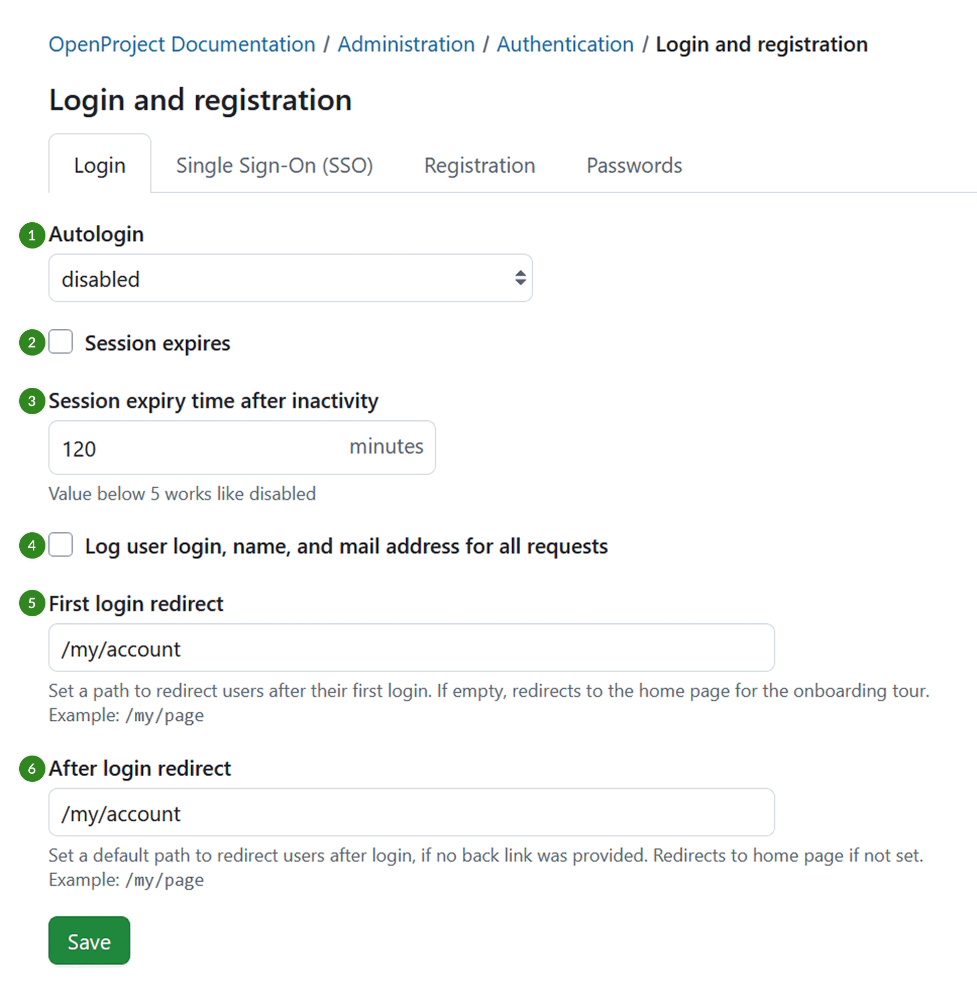
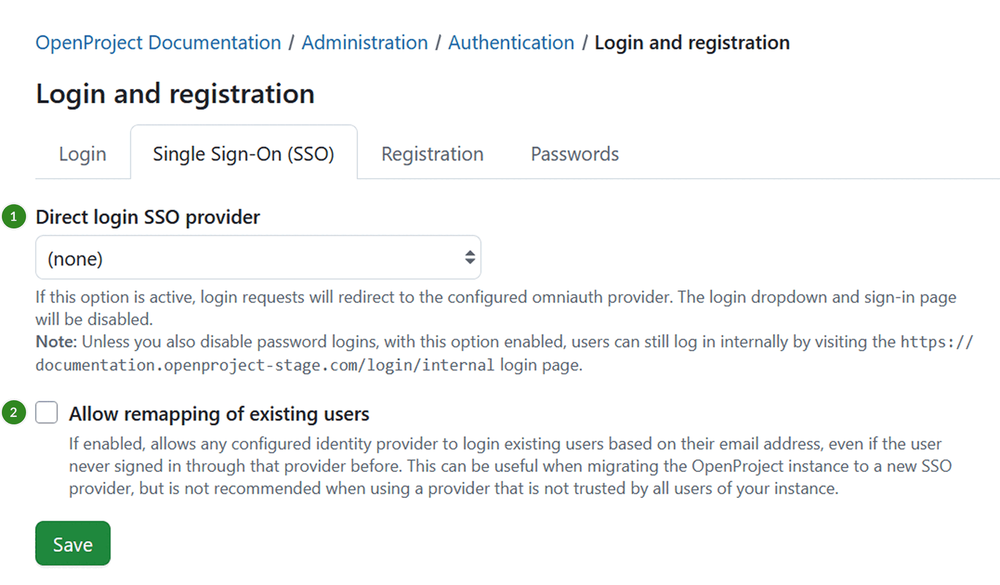
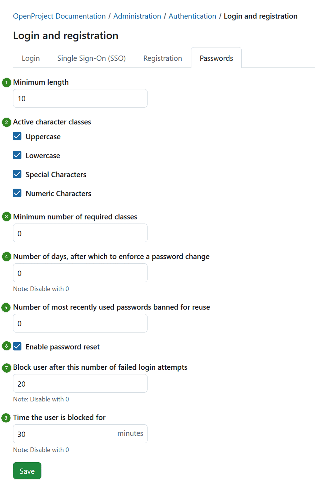

---
sidebar_navigation:
  title: Settings
  priority: 990
description: Login and registration settings in OpenProject.
keywords: authentication settings, login settings, registration settings, OpenProject login, login, registration
---
# Login and registration

To adapt general system **login and registration settings** in OpenProject, navigate to *Administration -> Authentication* and choose -> *Login and registration*.

Here you can adapt various settings related to login and registration in OpenProject, grouped under four tabs: 

- Login 

- Single Sign-On (SSO)

- Registration 

- Passwords

## Login settings

Under the *Login* tab you can adjust following settings: 

1. Enable or disable the **autologin option**. This allows a user to remain logged in, even if they leave the site. If this option is activated, the “Stay signed in” option will appear on the login screen to be selected.

2. Activate the **session expiration option**. 

3. Set the **duration for inactivity time**, after which a session will expire. Note that any value below 5 will be treated as disabling the session expiration setting.

4. Define whether **user login, name, and mail address** should be logged for all requests.

5. Define a path to **redirect users to after their first login**. If left empty, users are redirected to the homepage to see the onboarding tour.

6. Set a **default path to redirect users to after login** (only if the login link is not a back link, i.e. `www.example.openproject.com/login`). If left empty, users are redirected to the homepage.

   Do not forget to **save** your changes.

## Single Sign-On (SSO) settings

Under the *Single Sign-On (SSO)* tab you can adjust following settings: 

1. Select a **direct login SSO provider**. If this option is active, login requests will be redirected to the configured Omniauth provider. This will disable the login dropdown and sign-in page. 

> [!NOTE]
> Unless you also disable password logins, with this option enabled, users can still log in internally by visiting internal login page, for example `https://yourinstancename.openproject.com/login/internal` login page.

2. Allow **remapping of existing users**. If enabled, this option allows any configured identity provider to authenticate existing users based on their email address, even if those users have never previously signed in with that provider. This feature is particularly useful when migrating your OpenProject instance to a new SSO provider. 

> [!IMPORTANT]
> It is **not recommended** when using an identity provider that is not trusted by all users in your instance, as this may introduce security risks.

## Registration settings

Under the *Registration* tab you can adjust following settings: 

1. Select if the **authentication is required** to access OpenProject. For versions 13.1 and higher of OpenProject, this setting will be checked by default

> [!IMPORTANT]
> If you uncheck this box, your OpenProject instance will be visible to the general public without logging in. The visibility of individual projects depends on [this setting](../../../user-guide/projects/project-settings/project-information/#make-a-project-public).

2. Select an option for **self-registration**. Self-registration can either be **disabled**, or it can be allowed with the following criteria:

   a) **Account activation by email** - users can register on their own. They will receive an activation email and will need to activate their account after confirming  their email address. 

> [!WARNING]
> Administrators have no moderation control over this  activation process if this method is selected.

   b) **Manual account activation** - users can register on their own. However, an administrator (or a user with the global permission to create or manage  users) needs to activate them.

   c) **Automatic account activation** - users can register on their own. Their accounts are immediately active  without further action. 

> [!WARNING]
> Administrators have no moderation control over this  activation process if this method is selected.

> [!NOTE]
> By default, self-registration is only applied to internal users (logging in with username and password). If you have an identity provider such as LDAP, SAML or OpenID Connect, use the respective settings in their configuration to control which users are applicable for automatic user creation.

3. Define after how many days the **activation email sent to new users will expire**. Afterwards, you will have the possibility to [re-send the activation email](../../users-permissions/users/#resend-user-invitation-via-email) via the user settings.

4. Choose for which **language** you want to define **the footer displayed at the bottom of the registration page** and formulate that footer text.

## Password settings

Under the *Password* tab you can adjust following settings: 

1. Define the **minimum password length**.
2. Select what **character classes are a mandatory part of the password**.
3. Define the **minimum number of required character classes**.
4. Define the number of days, after which a **password change should be enforced**. Value of 0 disables this option, i.e. no password change will be enforced.
5. Define the **number of the most recently used passwords that a user should not be allowed to reuse**.
6. Activate the **password reset** (Forgot your password option). This way users will be able to reset their own passwords via email.
7. Define the number of failed **login attempts, after which a user will be temporarily blocked**. Value of 0 disables this option, i.e. users will not be blocked after any amount of failed login attempts.
8. Define the **duration of the time, for which the user will be blocked after failed login attempts**. Value of 0 disables this option.

