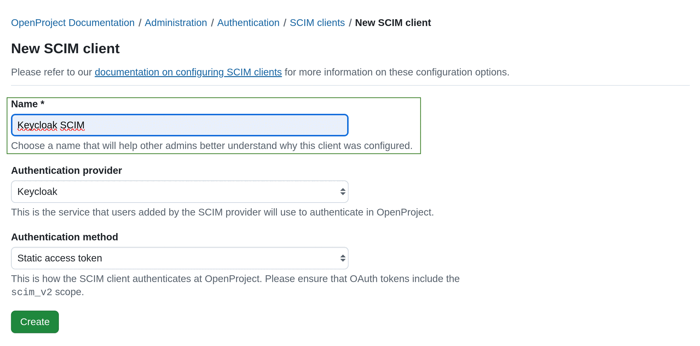
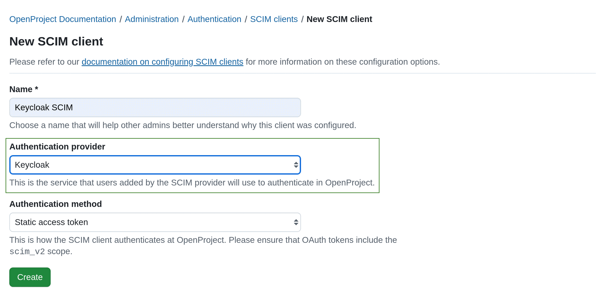
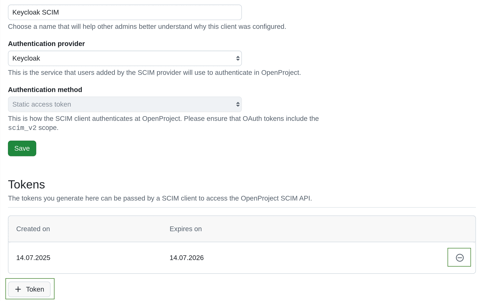

---
sidebar_navigation:
  title: SCIM
  priority: 500
description: How to set up SCIM clients in OpenProject
keywords: SCIM, SCIM API, user management, app integration
---
# SCIM provisioning (Enterprise add-on)

OpenProject supports automated user synchronization via SCIM API, enabling  seamless integration with your identity provider. Simplify and secure  user provisioning and de-provisioning while ensuring accurate user data  across systems.

[feature: scim_api ]

> [!NOTE]
> For users deletion to work please make sure the box **User accounts deletable by admins** in **Administration** -> **Users and permissions** -> **User settings** is checked.

To activate and configure SCIM user and group provisioning in OpenProject, navigate to *Administration* -> *Authentication* and select *SCIM clients* from the left-hand menu.

## Configure a new SCIM client.

SCIM client is a system (e.g. Keycloak with [SCIM plugin](https://github.com/mitodl/keycloak-scim)) that uses SCIM protocol to provision user and group identities in an automated and standardized way.

A SCIM client sends requests to a SCIM server (in this case OpenProject), asking it to create, update, retrieve, or delete users and groups.

To add a new SCIM client, click the **+ SCIM client** button in the upper right corner.

 

A configuration form for your SCIM client will open, in which you can adjust the SCIM client details. 

### Step 1. Enter the **Name** of your SCIM client.

 

### Step 2. Choose an **Authentication provider**. 
   This is the service that users added by the SCIM provider will use to authenticate in OpenProject.
   It must have been configured before creating the SCIM client. It can be an [OIDC provider](../openid-providers/) or a [SAML provider](../saml/).

    

### Step 3. Choose an **Authentication method**. 

There are three *Authentication method* options you can choose from:

####  a. **Static access token**

> [!IMPORTANT] 
> Static access tokens are valid for period of 1 year. After that, they expire and must be replaced.

This is the most commonly used authentication method for SCIM clients. In this case after clicking **Create** you get an access token that should be put to the SCIM client configuration on the other end.

Once you click the **Create** button, an access token will be generated. The generated token will be displayed in a pop-up dialogue form. Make sure you copy and save it. After closing the dialog, you will not see the client secret again.

    

Once created, a SCIM client will appear on the SCIM clients index page. 

Click on the client name to open the detailed view, edit the information, add revoke or add tokens. You will be able to edit the client information and tokens. 

SCIM client tokens can be revoked. To revoke a token click the **Revoke** icon at the far right end of the token listing. To add a new token click the **+ Token** button at the bottom of *Tokens* section.

    
Here is an example of a configuration form in Keycloak, if you use it with [SCIM plugin](https://github.com/mitodl/keycloak-scim).
       

       
1. Fill in the **UI Display name**.
2. Fill in the **SCIM 2.0 endpoint**. It must be in the following format: `https://<your_openproject_hostname>/scim_v2/`
3. Set **Endpoint content type** to `application/scim+json`
4. Set **Auth mode** to **Bearer**
5. Paste the generated static access token to **Auth password/token** 
6. Enable user and group propagation. Enable import during sync.
7. **Save** the configuration.

#### b. **OAuth 2.0 client credentials**

If in [Step 3](#step-3-choose-an-authentication-method) you selected **OAuth 2.0 client credentials**, after clicking **Create** you will get client credentials of newly created [OpenProject OAuth Application](../oauth-applications/#oauth-applications). These credentials should be entered into the SCIM client configuration on the other end. The SCIM client is supposed to use the provided client credentials to obtain an access token with the `scim_v2` scope from OpenProject and then use the access token in SCIM API requests.

 

Once you click **Create**, client credentials (client ID and secret) will be generated.  Make sure you copy and save these values. After closing the dialog, you will not see the client credentials again.  

 

#### c. **JWT from identity provider**

If in [Step 3](#step-3-choose-an-authentication-method) you selected **JWT from identity provider**, you will have to specify **Subject claim** contained in the authentication JWT.

 

This authentication method is intended exclusively for use with OpenID Connect setups.
The SCIM client must be able to obtain a JWT from the OpenID Connect provider (e.g., Keycloak) that meets all of the following conditions:

1. The `sub`  claim contains the value specified in the Subject Claim configuration.
2. The `aud`  claim includes OpenProject's Client ID from your OpenID Connect provider configuration.
3. The `scope` claim includes `scim_v2`.

This could for example be achieved by performing a client credentials token request towards the identity provider. In the case of Keycloak as an IDP, the sub claim would then equal to the UUID of the service account that's associated to the client obtaining the token.
