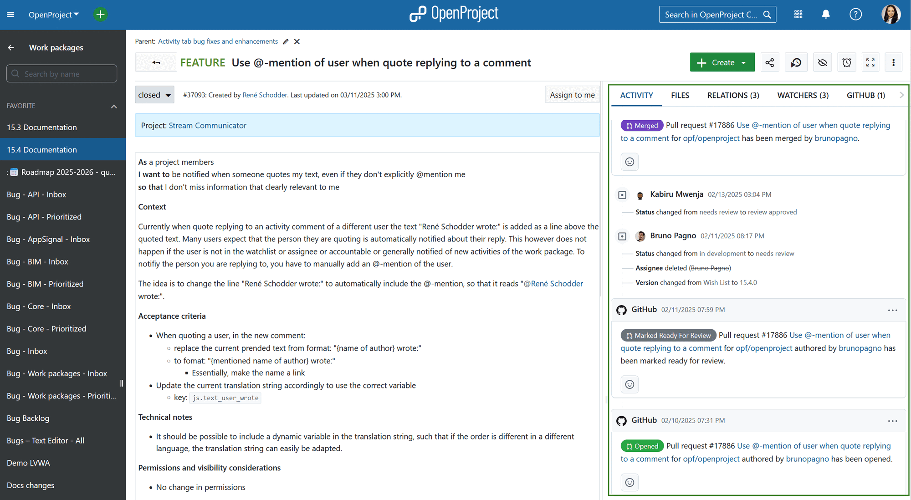
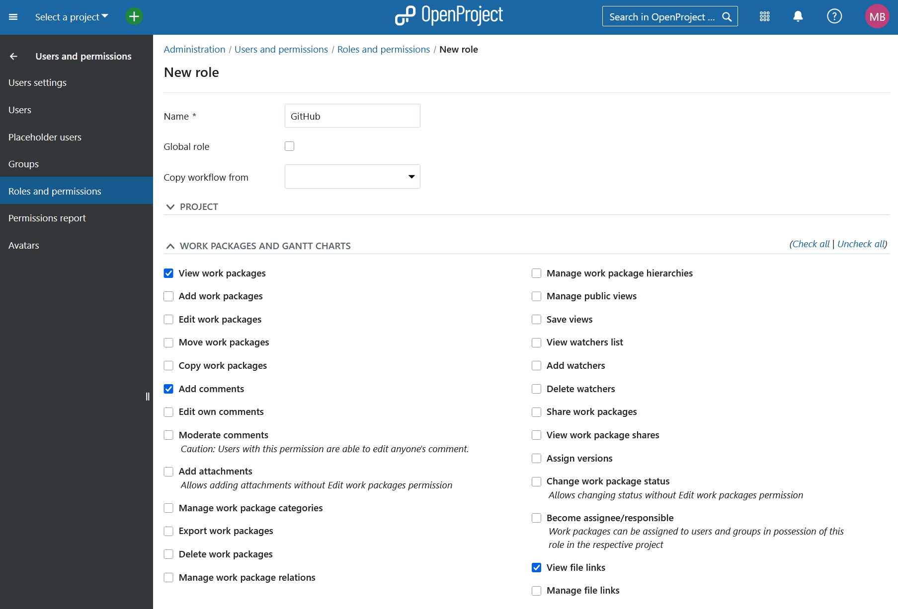
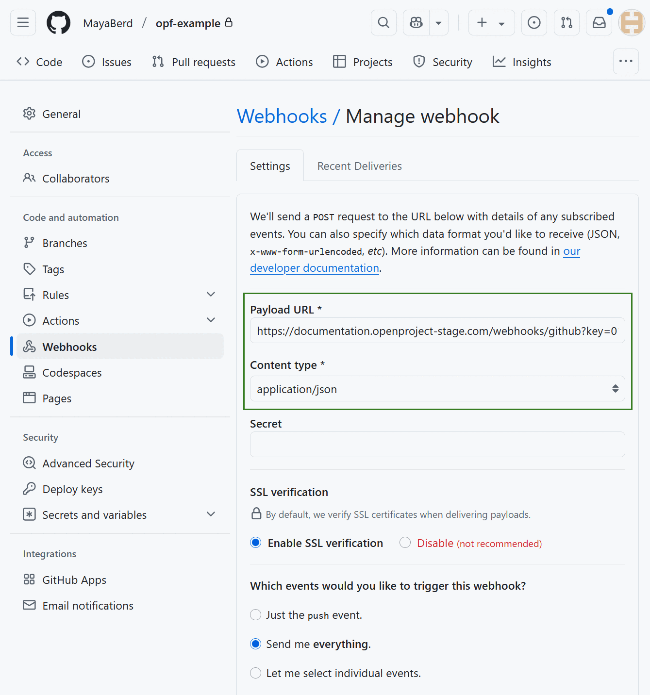
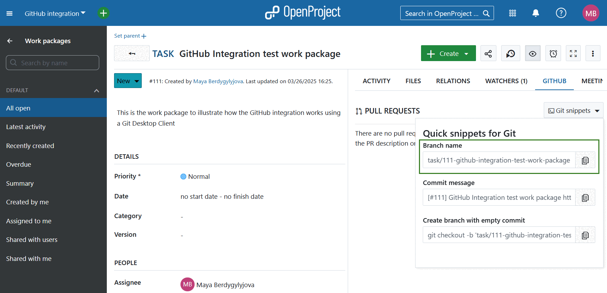
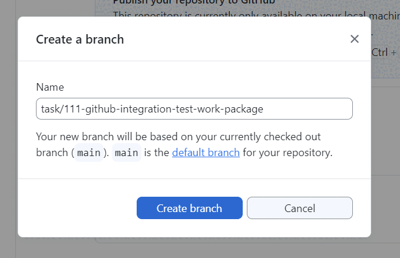
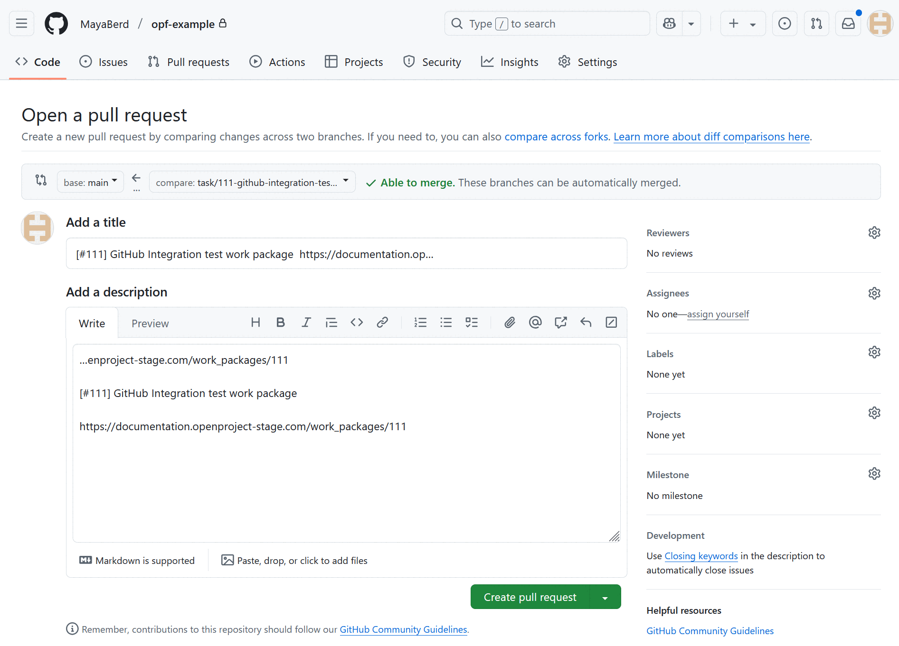
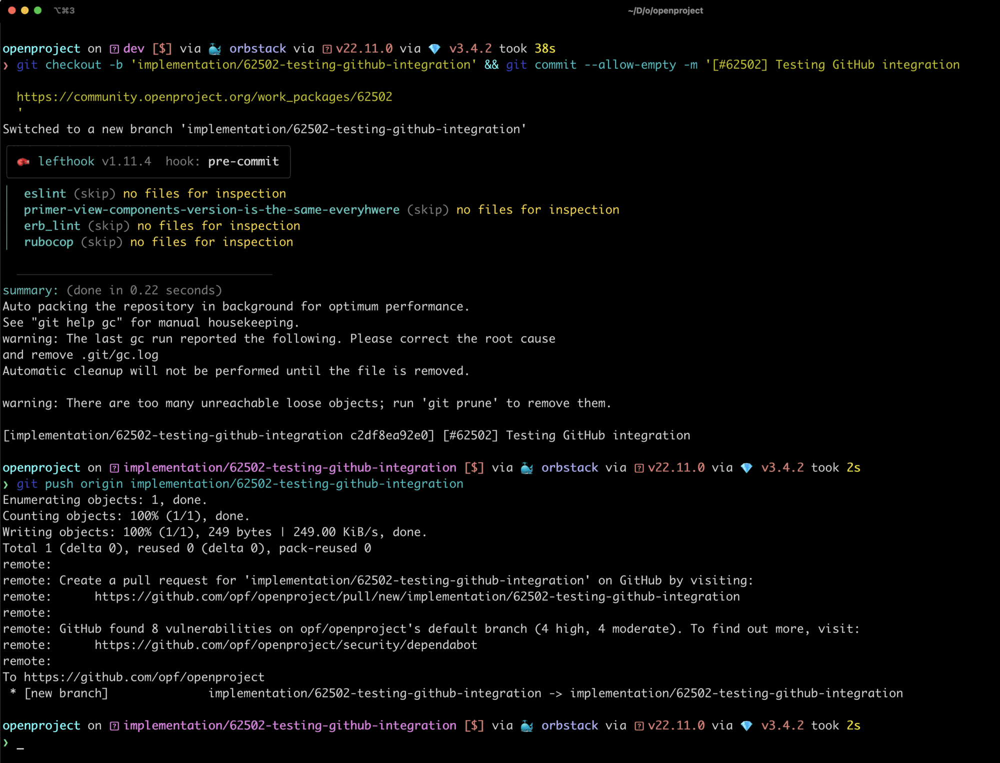
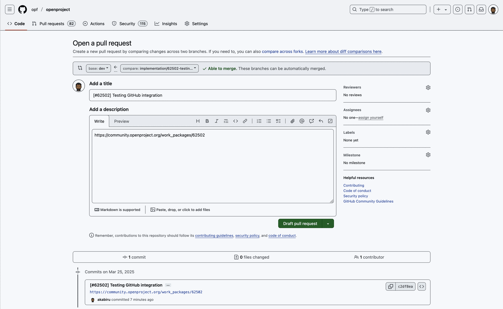
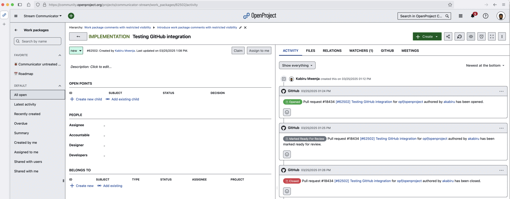

---
sidebar_navigation:
  title: GitHub integration - Documentation
  priority: 900
description: Integrate the GitHub pull request workflow into OpenProject.
keywords: github integration
---
# GitHub integration

OpenProject offers an integration with GitHub pull requests (PRs) to link software development closely to planning and specification. You can create pull requests in GitHub and link them directly to OpenProject work packages.

## Overview

OpenProject work packages will directly display information from GitHub in a separate tab.

The GitHub tab shows all PRs linked to a work package with their corresponding statuses (e.g. 'Open' or 'Merged') as well as the state (e.g. 'success' or 'queued') of the GitHub actions configured to run for a PR. PRs and work packages are in an n:m relationship, so a work package can be linked to multiple PRs and a PR can be linked to multiple work packages.

Additionally, in your OpenProject work package, the GitHub integration supports you in creating a branch straight from the work package and the corresponding pull request.

Pull request activities will also appear in the Activity tab when the pull request is:

* first referenced (usually when opened)
* marked ready for review
* merged
* closed

## Configuration

To enable the integration, you must configure both OpenProject and GitHub.

### OpenProject

First, create a user in OpenProject to make the comments. Add this user to each project with a role that grants permission to view and comment on work packages. 

First you will need to create a user in OpenProject that has the permission to make comments. We recommend creating a dedicated role and assigning this role to the user. This role only requires two permissions, *View work packages* and *Add notes*, which you will find in the Work packages and Gantt charts section under [Roles and Permissions](../../users-permissions/roles-permissions/).

Once the user is created you need to generate an OpenProject API token for this user (you will need it on the GitHub side). For this you have to:

1. Login as the newly created user
2. Go to [Account settings](../../../user-guide/account-settings/) (click on the Avatar in the top right corner and select *Account settings*)
3. Go to [*Access Tokens*](../../../user-guide/account-settings/#access-tokens)
4. Click on **+ API token**

> [!IMPORTANT]
> Make sure you copy the generated key and securely save it, as you will not be able to retrieve it later.

You can then configure the necessary webhook in GitHub. 

Finally you will need to activate the GitHub module under [Project settings](../../../user-guide/projects/project-settings/modules/) so that all information pulling through from GitHub will be shown in the work packages.

To see the 'GitHub' tab, users need the **Show GitHub content** permission. Ensure this is granted to all roles that require access

### GitHub

In GitHub you have to set up a webhook in each repository to be integrated with OpenProject.

Only two settings need to be configured in the webhook.
The **Content Type** has to be `application/json`.
The **Payload URL** must point to your OpenProject server's GitHub webhook endpoint (`/webhooks/github`).

> [!NOTE]
> For the events that should be triggered by the webhook, please select "Send me everything".

> [!IMPORTANT]
> OpenProject only supports the following GitHub events:
>
> - check_run
> - issue_comment
> - ping
> - pull_request
> If the GitHub webhook sends an event that OpenProject does not support, a 404 error is returned by OpenProject.

You will need the API key you copied earlier in OpenProject. Append it to the *Payload URL* as a simple GET parameter named `key`. In the end the URL should look something like this:

`https://myopenproject.com/webhooks/github?key=42`

_Earlier version may have used the `api_key` parameter. In OpenProject 10.4, it is `key`._

Now the integration is set up on both sides and you can use it.

## Using GitHub integration

### Using a Git Desktop Client

As pull requests are based on branches, a new branch needs to be created first. For that, open the GitHub tab in your OpenProject work package detail view. Click on 'Git snippets' to extend the menu. First, copy the branch name by clicking the corresponding button.

Then, open your GitHub desktop client. There, you create your branch with the name you copied from your OpenProject work package. That way, all the branches will follow a common pattern and as the OpenProject ID is included in the branch name, it will be easy to see the connection between a PR and a work package when taking a look at a list of PRs on GitHub.

Once you click the *Create branch* button, you can directly publish that branch in the next step.

With the branch opened, you can start the actual development work using whatever tool you prefer, to alter your codebase.

Once your changes are complete, create a commit. To do that, copy the suggested *Commit message* from the *Git snippets* dropdown menu. It is based on the title and the URL of the work package.

A URL pointing to a work package within a pull request description or a comment will lead to the two entities becoming linked. Using the value in the 'Commit message' input thus helps you to establish that link. The link needs to be in the PR and not in a commit but GitHub will use the first commit message as the proposed branch description (as long as there is only one commit).

You can now create your pull request by clicking the *Commit* button. Title and comment with the link to the respective OpenProject work package will be prefilled, at least if there is only one commit to the branch. Because of this one commit limitation and if the policy is to create a branch as early as possible, there is a third option in the 'Git snippets' menu ('Create branch with empty commit') that will open a branch and add an empty commit to it in one command. Using this option, one can first create the branch quickly and have it linked to the work package right from the beginning. Commits can of course be added to the branch (and PR) after that.

The branch description can be amended before a PR is created giving the opportunity to further describe the changes. To help with that, it is also possible to copy parts of the work package description since the description can be displayed in the markdown format. Links to additional work packages can also be included in the PR description.

Instead of inserting a full link to the work package, you can reference it by adding 'OP#87' (where 87 is the work package ID) to the pull request description.

Click on **Create pull request** and your pull request will be opened. You can then assign it for a review or further modify your PR by adding a new commit. Once the PR is finalized, you can merge it by clicking the respective button.

In OpenProject you will see the changes of the PR status under Activity tab. Under GitHub tab you will also see the status change of all the configured GitHub Actions.

### Using the Command Line Interface

If you prefer to work with Git via the Command Line Interface (CLI), you can follow a similar process to create and manage pull requests, by following same steps as you would if using a Git Desktop Client. 

You can copy the branch name from the OpenProject work package as described in the Git snippets section above. Then, create and switch to a new branch in your local repository. Modify the necessary files in your repository. Once you are satisfied with the changes, stage and commit them, using the suggested commit message from OpenProject.

When using a CLI you can also use the **Create branch with empty commit** Git snippet. 

The advantage of using this snippet is that there is no need to first create a branch and then copy a separate Git snippet for the commit. A new branch will be created from your current branch along with an empty commit, which when pushed to GitHub will link back to the work package. 

Continue your work as you normally would, push the branch to GitHub and create a pull request.

Changes to the pull request will be tracked under GitHub tab of OpenProject work package, from which git snippets were copied. 

